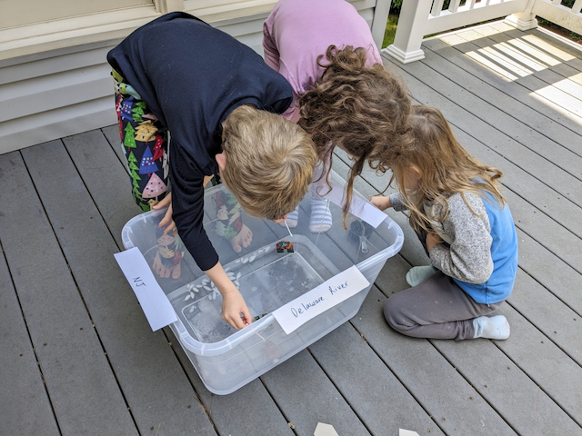
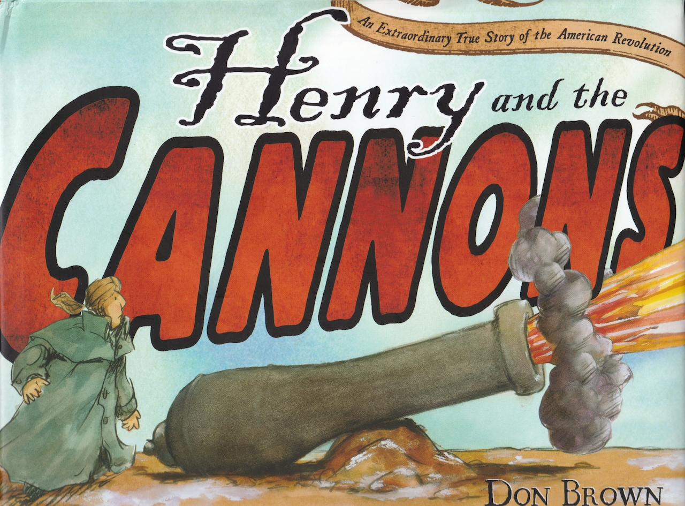

```links
3/12/2025
https://www.supercoloring.com/sites/default/files/styles/coloring_medium/public/cif/2014/04/george-washington-crossing-the-delaware-by-emanuel-leutze-coloring-page.jpg
```

# A Pivotal Battle

## Introduction

This tale describes the iconic moment in America’s War of Independence – the moment when we realized we could prevail over one of the greatest military powers on earth, reclaim the rights we’d lost, and begin the long, hard work of building a new nation. “Life, Liberty, and the Pursuit of Happiness” and the hopes of the revolution all hinged on these battles. Though not of tactical importance as military victories they were enormously important politically, coming at a time early in the war when not only Washington’s troops but all Americans were deeply discouraged after losing the critical battles in New York.
 
The fabled American work ethic is a prominent part of the story. It’s Christmas Day when most people are home with their families. Instead, Washington’s army is ferrying two thousand men, horses, and cannon(!) across a river so swollen with ice that two other regiments, crossing at other locations,  fail to make it across. After working all night, Washington’s army then marched nine miles. All before the fighting even starts. 
 
The aftermath of the battle highlights another important theme. Washington’s troops are all volunteers, most of them enlisted for very short service stints of 2-6 months.  Washington must continually appeal to their patriotism to get them to voluntarily re-enlist. When he issued a call for additional volunteers for the Princeton battle, they came from all around to risk their lives – an extraordinary example of the power of voluntary associations and of the devotion they felt for the cause they were fighting for: liberty. Liberty was worth the effort, the risk, and all the hardship.

This story is a little “text heavy” for younger kids. To help keep them engaged, consider adding the “Find Washington” and “Focal Point” activities (described below) to your readings. You might also add the coloring activity from Arts & Crafts below and the Stuffed Animal Attack.

---

## Book

Title: "When Washington Crossed the Delaware"
Author: Lynne Cheney
Illustrator: Peter M. Fiore
Year published: 2004
Length: 40 pages

---

## Calendar

Monday:
 - "Songbook: _Yankee Doodle_ [songbook]"
 - "Famous Texts: _The American Crisis_ [crisis]"
 
Tuesday:
 - geography
 - crafts

Wednesday:
 - vocab
 - soap

Thursday:
 - "Art: Find Washington (during reading) [find washington]"
 - "Re-enactment: Surprise Attack! [surprise attack]"

Friday:
 - fonts 
 - volunteer
 

---

## American Heritage Songbook: Yankee Doodle {#songbook}

```metadata
toc: "Songbook: _Yankee Doodle_"
time: 5 minutes
freq: daily
```
> Yankee Doodle went to town
> A-riding on a pony,
> Stuck a feather in his cap
> And called it macaroni.
>
> Yankee Doodle keep it up,
> Yankee Doodle dandy,
> Mind the music and the step,
> And with the girls be handy.
{.nowrap}

This patriotic song was originally written by a British soldier to mock colonial American troops. However, by the time of the American Revolution it had become a source of pride to the Americans. Almost two and a half centuries later, it requires a bit of work to understand the original meaning.

Yankee refers to Americans, though its origin is unclear. Doodle meant a fool or simpleton, while a “dandy” means someone who dresses in an overly stylish manner. And while we tend to think of macaroni as a variety of noodle (which coincidentally rhymes with doodle), back in the 18th century macaroni was a type of fashionable wig. The British were mocking the Americans by suggesting that they were simpletons who thought they could appear stylish by sticking a feather in their caps.

Yankee Doodle’s simple tune and structure encouraged people to write additional verses for it — which the British did. However, in 1776, Edward Bangs, a Minuteman, wrote 15 new verses for it. Other verses were added and changed over time; more than 100 were known by 1830. Over the course of the Revolution, Yankee Doodle became the unofficial anthem of the army; there are reports that it was played when the British surrendered at both Saratoga and at Yorktown.

[This version][S1] on YouTube combines four verses with some fun visuals. [This version][S2] has some different verses, with lyrics. [This version][S3] is sung by the Cedarmont Kids in period costumes. Finally, in the tradition of Yankee Doodle, we made up our own verses to help kids remember the timeline of American History. You can find it in our Review Module.

[S1]: https://www.youtube.com/watch?v=AwHvyqNDUvE
[S2]: https://www.youtube.com/watch?v=KUIVS2eg5Uc
[S3]: https://www.youtube.com/watch?v=PfwwQevyTVM

---

## Arts & Crafts: Coloring and Mixed-Media Art Project {#crafts}

```metadata
time: 30-40 minutes
prep: 10 minutes
supplies: popsicle sticks, cotton balls, glue, construction paper,
          crayons, scissors
```

> On Christmas night, 1776, General Washington led twenty-four hundred
> men, the main body of his army, to a crossing point about nine miles
> upstream from Trenton.

One of the most iconic images in American history is that of Washington crossing the Delaware. You can expose younger children to this image by downloading and printing a sheet that they can color with their crayons. You can find a couple of examples on the internet [here][1] or [here][2]. Older kids might enjoy this mixed-media art project:

[1]: https://www.supercoloring.com/sites/default/files/styles/coloring_medium/public/cif/2014/04/george-washington-crossing-the-delaware-by-emanuel-leutze-coloring-page.jpg
[2]: https://i.pinimg.com/originals/0a/b0/61/0ab061362550471bf05dc4d8484cc4df.gif

### Supplies
* Popsicle (craft) sticks
* Construction paper (black, dark blue, white)
* Cotton balls
* Glue stick or Elmer’s Glue
* Crayons (or markers)
* Scissors
* Cardboard (optional)
* Washington coloring sheet (optional; see links above)
* Free hand outline of flag (for kids to color in)

### Instructions
1. Glue a sheet of black construction paper to a piece of cardboard.
   This is optional but will provide more stability as the craft
   sticks will be heavy if it is only paper.
1. Cut a strip of dark blue construction paper and glue it to the
   bottom of the black construction paper.  This is the Delaware
   river.
1. Design a boat out of craft sticks.  Optionally, color the craft
   sticks with crayons or markers.  Glue craft sticks in the form of a
   boat to the construction.  Leave one craft stick for a flag pole
   and glue it so it is sticking out of the top of the boat.
1. Color in the flag and glue it to the flagpole.
1. Add cotton balls to represent the chunks of ice.
1. Optionally, cut out Washington and/or soldiers from coloring sheets
   and add them to the boat.

Depending on the age of the child they may need help with cutting
and/or gluing.  My three year old loved coloring craft sticks and
sticking cotton balls onto the sheet.  Both the five-year-old and
three-year-old liked adding the coloring sheet of Washington to the
picture (which made it more exciting).


{.center}

---

## Geography: Maps and Distances {#geography}

```metadata
toc: "Geography: Maps & Distances"
time: 15 minutes
supplies: U.S. map puzzle
```

> In early December the Americans made it across the Delaware River
> into Pennsylvania.  Under General Washington’s orders they had taken
> every boat they could find with them, so they knew they were safe
> from the British for a while.

Examine a map of the Delaware River (use the one on the inside of the cover). How wide was the river where Washington and his army crossed? Use fingers or string to measure the distance using the scale bar. Why did they choose to cross where they did? How far did they have to hike to Trenton once they crossed the river? Use the string to measure the distance. Now, measure the distance from Trenton to Princeton. Use a map program (e.g., Google Map, Apple Map) to show how long it would take to travel the distance by car. How long did it take Washington’s army to march to Princeton?

---
 
## Famous American Texts: _The American Crisis_ {#famous}

```metadata
time: 5-10 minutes
freq: daily
```
>These are the times that try men's souls.

Thomas Paine is most famous for his book _Common Sense_ that helped spark the revolution. However, his work _The American Crisis_ contains one of the most memorable lines in American history: “These are the times that try men’s souls.” Ask your child(ren) to memorize this line and repeat it each day of the week before or after each reading. Be sure to place the line in context, explaining why Americans were so discouraged at this point in the War of Independence. Older children may want to add the second, longer line: “The summer soldier and the sunshine patriot will, in this crisis, shrink from the service of their country; but he that stands it now, deserves the love and thanks of man and woman.”

---

## Cooking: Fire Cakes {#cooking}

```metadata
time: 20-30 minutes
prep: 10 minutes
```
> The Americans retreated through cold and rain. Many had no jackets to keep them warm.
> Many had no shoes and marched with rags wrapped around their feet.
> Everyone was hungry.
{.nowrap}

Fire cakes were cooked by the fire or in the ashes during the Revolutionary War.  Once made, the fire cakes could keep for a month which was convenient for soldiers who may not easily be able to cook every day. The recipe below will make 8-15 biscuits depending on their size.

### Ingredients 
* 1 and 3/4 cups flour
* approximately 3/4 cup water
* 1 teaspoon salt

### Directions
1. Preheat oven to 400 degrees Fahrenheit.
1. Mix salt and flour together in a bowl.
1. Slowly pour in water while mixing.  Add water and mix until a (somewhat sticky) dough forms. 
1. Take small spoonfuls of dough in your hands (can add additional flour if too sticky) and press them into flat biscuits.
1. Set them on a baking sheet that is covered in parchment paper.
1. Optionally stick them with a fork a few times to make holes in the top.
1. Bake for 10-15 minutes until the edges are hard.
1. Let cool.  They will continue to harden over time.
1. Eat plain or add honey or jam (recommended).


{.center}


---

## Science: Crossing the Delaware In a Soap-Powered Boat {#science}

```metadata
time: 20-30 minutes
prep: 10 minutes
supplies: foam paper plate, cake pan, liquid soap, ice cubes
```

> The night was cold, and the men faced a difficult crossing. They had to break through ice to get the boats into the river. They had to fend off large chunks of floating ice once they were underway.

There are several videos on the internet that show you how to build a miniature boat powered by a bit of soap ([here’s one][3] and [here’s another][4]). For this activity you will want to work with your child(ren) on the following steps:

[3]: https://www.youtube.com/watch?v=qz9hkWhZfRM
[4]: https://www.youtube.com/watch?v=miWlDVOhrSE

### Supplies
* Cardboard, foam paper plate, or other similar materials.
* Scissors
* Optional: markers
* Large rectangular baking dish, medium size bin, or other similar container
* Optional: pepper or oregano and regular plate
* Q-tips
* Dish soap
* Water and (optional) ice


### Directions
1.  Cut out your boat from a likely material (in the videos above, one
    uses cardboard the other uses a foam paper plate -- we favor the
    foam). Don’t forget the notch!. Decorate it with an American flag
    (only 13 stars!) using markers.
2.  Set up your Delaware River using something like a rectangular baking dish or bin. Label one end Pennsylvania and the other end New Jersey (you can also label the water the Delaware River).
3. Put enough ice cubes into the middle of the cake pan to block your boat to simulate the conditions Washington and his army encountered. 
4.  Launch your boat near the Pennsylvania “shore” and apply the soap
    (or liquid detergent) to the notch in the stern to see it jet
    across to New Jersey. Did your boat successfully cross the Delaware?
5.  Pour some water in a regular plate and sprinkle some pepper or oregano all over the water.  Apply some dish soap to a Q-tip and then place the Q-tip in the water to see the pepper scatter away from the Q-tip.  This uses the same principle as the boats, but may be a simpler, helpful visual.
6. Repeat with fresh water to “cross” again as needed.  Once the surface tension is broken by the soap, you will need to get fresh water to propel your boat again.


### Discuss with your young scientist(s)
*   Does everything float in water? Why do you think the ice floats?
    (It’s less dense)
*   Besides getting in the way, is there any other danger associated
    with ice? Could it damage the boats?
*   What powered the soap boat? (The soap reduced the surface tension,
    pushing the boat forward). Illustrate surface tension by filling a
    glass with water just past the lip.
*   If water turns to solid ice when it gets cold, what happens to it
    when it gets hot? Describe the three states of water: solid (ice),
    liquid (water), gas (steam).
*   What type of boat worked best (cardboard, foam, etc.)?


{.center}

Crossing the “Delaware”
{.center .caption}

---

## Historical Re-enactment: Create Your Own Surprise Attack {#surprise}

```metadata
toc: "Re-enactment: Surprise Attack!"
time: 20 minutes
prep: 10 minutes
supplies: Nerf guns or other harmless projectiles
```

> When the Americans encountered the first Hessians, it was clear the
> surprise had worked.  The startled Hessians retreated.

There are many creative ways to simulate Washington’s surprise attack
on the Hessians. Ours was a multi-generational affair. Parents told
the kids that the grandparents were planning a surprise attack. They
barricaded the front door and kept a lookout through the front
window. Text messages apprised them of progress (“Washington is
crossing the Delaware.” “Washington’s army is on the march.”) while
the parents kept anticipation high. Grandparents entered through the
back door, approached from the rear, and surprised the kids by
shouting “The Hessians!” and “Attack! Attack!” Nerf weaponry was
involved (but rubber bands can also be fun). Stocking (or bare) feet
and blue cloaks/coats were worn to remind us of Washington’s army.

Surprise was total. After the shock wore off (and they had
surrendered), everyone retired to the living room for target practice
with the nerf guns (and their first lesson in range safety). At the
end of the evening, the five-year-old, with a big smile, said “You
really surprised us!” The three-year-old? “I liked the attack.”

Don’t be surprised when your kids ask for another Surprise Attack or
reverse the Surprise Attack a little later...

---

## Historical Re-enactment: Stuffed Animal Attack {#stuffed}

```metadata
toc: "Re-enactment: Stuffed Animal Attack!"
time: 15 minutes
```

> On Christmas night American troops would cross the Delaware River in several different places. 
Before dawn on December 26 they would attack the Hessians at Trenton, New Jersey.

Have your child(ren) use stuffed animals, figurines, or other small toys to act out the crossing of the Delaware, the march, and the surprise attack. A small tray, cake pan, pillow, book, or piece of cardboard can be the boats that the stuffed animals are loaded onto and a blanket can represent the river. Then the stuffed animals (or figurines)  march from the boats in a line to where other stuffed animals (or figurines), representing the Hessians are sleeping  and mount an attack. Don’t forget to have stuffed animal guards posted for the Hessians! Your child(ren) can perform the story on their own after a reading or act it out as you read the story.  

---

## Supplemental Reading: _Henry and the Cannons_ {#supplemental}

```metadata
time: 10 minutes
```

> But 300 miles of lakes and rivers, hills and glades, and mountain forests separated Boston from Fort Ticonderoga.
> Dragging the cannons the whole, hard way in winter was impossible. Wasn’t it?
> Henry Knox said he could do it.
{.nowrap}


{.center}

**Title:** _Henry and the Cannons_

**Author & Illustrator:** Don Brown

**Year Published:** 2013

**Length:** 32 pages

Washington’s victory at Trenton was a turning point in our fight for independence. His stunning victory at Yorktown marked the end of the British invasion. But what happened in the beginning? _Henry and the Cannons_ tells the story of Washington’s first command as Commander-in-Chief of the Continental Army.

The British had complete control of Boston and its harbor when the Continental Congress appointed Washington general over the Continental Army in July of 1775. Washington first had to recruit an army and then figure out how to dislodge the British without destroying Boston.

Washington met this challenge by sending Colonel Henry Knox to Fort Ticonderoga, hundreds of miles away, to bring back the cannons that forced the British to withdraw. Knox accomplished this feat in the middle of winter — a logistics miracle demonstrating the work ethic of the American soldier. Knox would be promoted to Brigadier General after he succeeded at another wintry logistics test: getting Washington’s men, horses, and cannon across the icy Delaware River for the Battle of Trenton.

This story echoes many of the themes present in _When Washington Crossed the Delaware_.  Despite the seemingly impassable winter obstacles, Henry Knox volunteered to retrieve the cannons, and then he and his men persisted in overcoming multiple setbacks to finally  bring them safely to Boston. What drove them? They were fighting for liberty.

---

## Scripture: Washington’s Favorite {#scripture}

```metadata
time: 10 minutes
```

> Every man will sit under his own vine and under his own fig tree;
> and no one will make them afraid: for the Lord Almighty has
> spoken. (Micah 4:4)

The Bible was so universally known in Washington’s time that many
times it would be quoted without attribution. People assumed you knew
they were quoting the Bible.

Washington’s writings contain hundreds of biblical references,
quotations, proverbs and allusions. His favorite scripture, based on
the number of times he referenced it in his writings, was Micah
4:4. Washington referenced this verse almost 50 times in his
writings. Ask your child(ren) why this might be the favorite verse of
the Commander-in-Chief of the Continental Army for seven long years?

---

## Vocabulary {#vocabulary}

```metadata
time: 10 minutes
```

> But Washington had seafarers with him that night who knew how to
> navigate treacherous waters.

The author uses some words associated with armies and battles that may be unfamiliar to
your child(ren): rebels, patriots,
treacherous, ammunition, artillery, regiment, musket, rally. Try
introducing a couple of the new words each day. Before you start
reading, introduce the words you’ve selected for the day, define them,
and then point them out during the reading.

Rebels
: men and women fighting against a government

Patriots
: men and women who love their country

Treacherous
: untrustworthy, unreliable

Ammunition
: objects that can be shot from a weapon, like bullets or cannon balls

Artillery
: very large guns moved on wheels, like cannons

Regiment
: a large group of soldiers

Musket
: gun with a long barrel, like a rifle

Rally
: join together in a shared effort

---

## Writing: Idioms {#idioms}

```metadata
time: 10 minutes
```

> The summer soldier and the sunshine patriot will, in this crisis, shrink from the service of their country.

The author also includes idioms that may be worth pointing out to
older children who wonder what the author means by “summer soldier”
and “sunshine patriot.” Idioms are words, or a group of words, that
have a figurative meaning that is not obvious from its literal
definition. Authors use these figures of speech because their
descriptive imagery conveys a more vivid meaning to the reader. Idioms
are metaphorical and because the metaphors are often localized, people
from different regions may not immediately grasp their
meaning. Foreigners learning a new language are often baffled by
idioms. What did Thomas Paine mean when he referred to some people as
“summer soldiers” and “sunshine patriots”?

---

## Writing: Quotations and Fonts {#fonts}

```metadata
time: 5 minutes
```

> “The force of the current, the sharpness of the frost …, the ice
> which made during the operation … rendered the passage of the river
> extremely difficult.”
> JAMES WILKINSON
> MAJOR, CONTINENTAL ARMY
{.nowrap}

As you read through the story, notice that each page has a sentence in
“quotation marks.” The words between the quotation marks are the
actual words that historical people spoke or wrote. Notice how each
quotation is attributed to a specific person, and some include
additional information about the speaker, in case the reader is
unfamiliar with the person being quoted. Notice also the use of fonts:
_italics_ for the quotation, **small capitals** for the speaker (and
even a smaller size font for the description of the person).

---

## History: Family Connections {#family}

```metadata
time: 10 minutes
```

> Most of Washington’s men had the right to go home at the end of the
> year, but Washington needed them to stay.

History comes alive when you can make a personal connection to
historical events. Did any of your ancestors serve in the Continental
Army during the War of Independence? Or were they Loyalists,
supporting the British? It’s not unusual to have ancestors on both
sides of a conflict. If your family immigrated to America after the
War of Independence, where were they living during this time period?
When and why did they decide to come to America? Share their stories
with your children.

---

## Art: Find Washington {#washington}

```metadata
time: 5 minutes
```

> Even when the struggle seemed hopeless,
> George Washington did not give up.

This activity can be fun for younger kids. Ask them if they can find
George Washington in each picture (he is not in every one of them).

---

## Art: Focal Point {#focal}

```metadata
time: 10 minutes
```

> He called a meeting of his generals and worked out a plan.

The [focal point][5] of a painting is the area that the artist wants
the viewer to pay the most attention. [A variety of techniques][6] are
used by artists to draw the viewer’s eye naturally to the area the
artist considers most important or most interesting. These techniques
include composition, converging lines, detail focus vs. blurring,
color contrast. Select some of your or your child(ren)’s favorite
paintings in the story and ask them to find the main focal point. Then
see if you can tell what technique the artist used to draw your eye to
the focal point.

[5]: https://www.liveabout.com/all-about-focal-points-in-painting-4092634
[6]: https://www.artistsnetwork.com/art-techniques/lets-talk-about-the-focal-point-in-art-part-1/

Younger children may just enjoy comparing the red professional coats
of the British army to the blue ragtags of Washington’s Continental
army as they page through the story.

---

## Civic Culture: Encouragement {#encouragement}

```metadata
time: 10 minutes
freq: daily
```

> George Washington was discouraged. How could the Americans, who were
> mostly new to fighting, ever hope to defeat the well-trained
> redcoats?

As above, discuss with your child(ren) why Washington’s troops and all
Americans were discouraged. What raised the spirits of the soldiers
(and the country)? Where did they find encouragement? You might ask
your child(ren) if they remember a time when they were cold, tired,
and hungry.

As an activity, ask your child(ren) to encourage a family member or
friend at least once a day for the rest of the week (perhaps set up a
checklist or star chart to mark each occasion). Work on developing the
habit of encouraging one another, especially within your family. You
might want to share with them the Bible verse “Encourage one another and build one another up” (1
Thessalonians 5:11).

---

## Civic Culture: Volunteer Associations {#volunteer}

```metadata
time: 10 minutes
```

> Drums rolled. A few of the men stepped forward, then more, and then
> more.  Many of Washington’s battle-tested soldiers resolved to stay
> at his side.

Washington’s army consisted of men who had voluntarily enlisted to
fight for their country’s freedom. Most of the enlistments were for
very short terms, two to six months. Ask your child(ren) what they
would like to do to help the family. Have a list of tasks around the
house they could help with that are age appropriate (e.g., pick up
their room, set the table, put their toys away, fold their clean
clothes). Perhaps make it a “short-term enlistment” for just a
week. Construct a checklist or star chart so they can check off each
day they perform their volunteer activity. Perhaps ask them to extend
their voluntary enlistment at the end of the period, now that they are
a “battle-tested veteran,” to help the family just as Washington asked his volunteer army
to extend their commitments to help their country.

