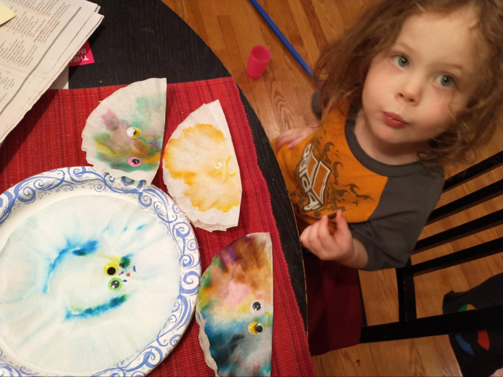
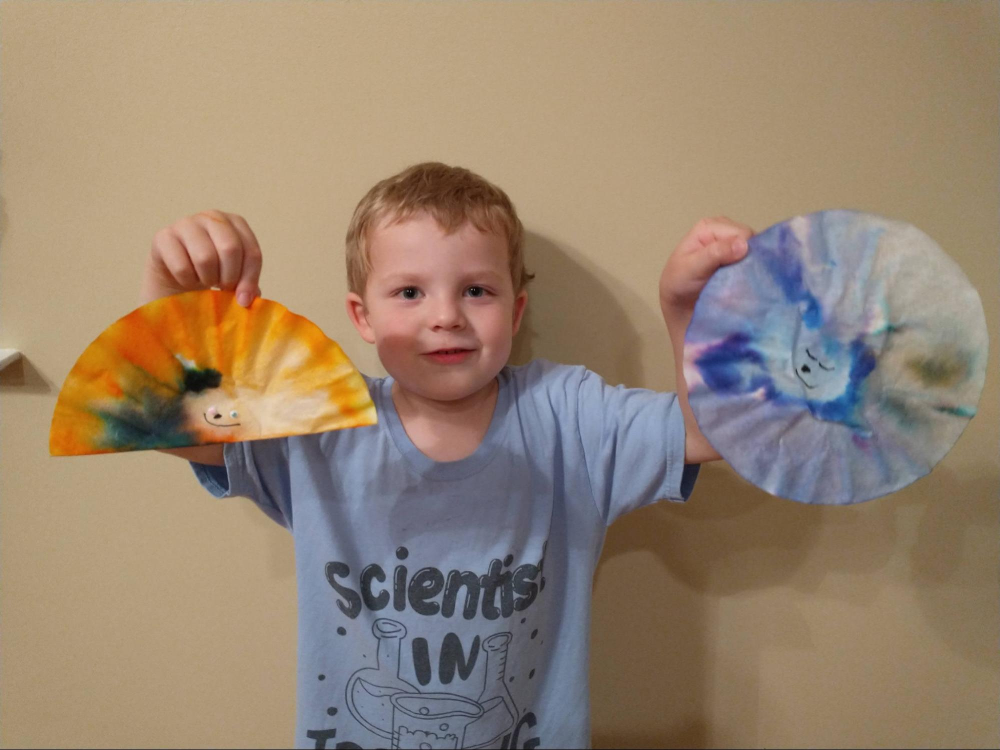

# We the People

## Introduction

The Constitution of the United States of America defines our system of
government. This remarkable document reflects the political genius of
James Madison, regarded as the Father of the Constitution.  First, it
defines a government of limited powers, powers which are delegated to
it by the people. By limiting the power of the federal government, the
founding fathers hoped to maximize the freedoms of the citizens.

Much of the genius of our Constitution resides in how the powers of
the government are separated into three distinct areas: legislative,
executive, and judicial. To keep each of these power centers from
growing too large, checks and balances are built into the Constitution
so that each power center can exert influence over the other.

In addition to the separation of powers within the federal government
there is also the sharing of power between the state governments and
the national government, which is called federalism. Finally, the
founding fathers established a republic, not a democracy, as one more
constraint upon the unchecked power of a national government.

Getting the states to agree to give up any of their power to a
national government was an herculean task. Over the long, hot summer
of 1787 many compromises were needed, including the Great Compromise
of equal representation in the Senate for large and small states as
well as the Three-Fifths Compromise which counted slaves as ⅗ of a
person for the purpose of representation in the House.  Book

---

## Book

Title: "A More Perfect Union"
Author: Betsy Maestro
Illustrator: Giulio Maestro
Year Published: 2008
Length: 48 pages

---

## Calendar

Monday:
 - vocab
 - songbook

Tuesday:
 - text
 - rising-sun

Wednesday:
 - art-find
 - supplemental

Thursday:
 - re-enactment
 - geography

Friday:
 - science
 - culture

---

## American Heritage Songbook: The Preamble {#songbook}

```metadata
toc: "Songbook: _The Preamble_"
time: 3 minutes
freq: daily
```

Schoolhouse Rock! has a great video and song about the preamble to the
Constitution. Excerpted lyrics are below:

> In 1787 I'm told
> Our founding fathers did agree
> To write a list of principles
> For keeping people free.
>
> The U.S.A. was just starting out
> A whole brand-new country
> And so our people spelled it out
> They wanted a land of liberty
{.nowrap}

You can find The Preamble [on YouTube][shr] or Disney+.

[shr]: https://www.youtube.com/watch?v=OqvLi7qZ_yU

---

## Arts & Crafts: Make Your Own Rising Sun {#craft-rising-sun}

```metadata
time: 30-60 minutes
prep: 10 minutes
supplies: Coffee filters, markers, water, googly eyes (optional)
```

> Ben Franklin commented that at last he knew for sure what kind of
> sun was on Washington’s chair – it was a rising sun!

This is a fairly simple craft for making your own Rising Sun.

### Supplies
* Coffee filters
* Colored markers
* Water
* Optional: googly eyes

### Directions
1. Fold the coffee filter in half.
2. Color with markers.
3. Use a pipet or dropper to moisten the entire coffee filter. Enjoy watching
   the colors bleed along the filter. A little water goes a long way.
4. Let the coffee filter dry.
5. Use markers and/or googly eyes to make a face on your rising sun
6. Hang up (they are pretty as sun catchers in a window) or pin to the
   back of your chair and pretend you are George Washington presiding
   over the Constitutional Convention.



{.center}

---

## Geography: Before & After {#geography}

```metadata
time: 10 minutes
supplies: U.S. puzzle
```

> The government was not working well. Many people were poor.
> The thirteen states were not cooperating with one another.
{.nowrap}

Remove the thirteen original states from the puzzle and ask your
child(ren) to fit them together outside the frame of the puzzle. Once
they’ve done that, separate each state slightly from the others. Now,
tell your children that after the Revolutionary War the states were
not working together. They each acted independently, separately from
each other. The Constitutional Convention was convened to get the
states to work together. Ask your child(ren) to push the states
together to indicate how states worked together once they ratified the
Constitution.

---

```metadata
time: 5 minutes
freq: daily
```

## Famous American Texts: _The Preamble_ {#text}

```metadata
time: 5 minutes
freq: daily
```

> We the People of the United States, in Order to form a more perfect
> Union, establish Justice, insure domestic Tranquility, provide for the
> common defense, promote the general Welfare, and secure the Blessings
> of Liberty to ourselves and our Posterity, do ordain and establish
> this Constitution for the United States of America.

Depending on the age of your child(ren), ask them to memorize a
portion of The Preamble to the Constitution of the United States of
America.

An excellent aid to this activity is Peter Spier’s book, We the
People: The Constitution of the United States. See the Supplemental
Reading activity below.

---

## Science: Make Your Own Balance Scale {#science}

```metadata
time: 20-40 minutes
prep: 15 minutes
supplies: Paper cups, string, hanger, tape, hole punch or scissors, jelly beans
```

> Right away the delegates began to argue. The members from the small
> states thought the Virginia Plan was unfair. Other delegates were
> afraid to let the people choose the President.

This activity was inspired by a preschool activity that we
participated in. First, you will build a balance scale. Then, you will
balance political power.

### Supplies
* String
* Plastic cups
* Hanger
* Hole punch
* Small objects
* Tape (optional)

### Directions
1. Hole punch two holes in each paper cup on opposite sides near the top.
2. Put the string through the holes and tie (or tape) the string to the
   hanger. Note that the string should form a handle for the cup as a bucket.

Now that you have your own balance scale you can use it to compare how
political power was allocated between the Virginia and New Jersey
Plans. Jelly beans will represent political power.

Start with the Virginia Plan, which allocated more power to the larger
states. To keep things simple, select three jelly beans for each large
state (Virginia, New York, Pennsylvania, Maryland, Massachusetts,
North Carolina). All three jelly beans should be the same color for
each state. Put all the jelly beans representing the large states into
one cup. Then, select one jelly bean for each small state* (New
Jersey, Delaware, Connecticut, Georgia, New Hampshire, South Carolina)
and put them in the small cup. Which cup is heavier? Do your kids see
how the Virginia Plan would have given more political power to the
large states? And do they see why the smaller states would think this
was unfair?

Now, let’s look at the New Jersey Plan. For this plan, allocate two
jelly beans (of the same color) for each state. Put the jelly beans
for the large states in one cup and the jelly beans for the small
states in the other cup. Ask your kids if they see how this more
evenly divides power between the states? And if they see why the
larger states would think this was unfair?

To finish this exercise, ask your kids if they are ready to eat the
jelly beans. This represents the fact that government power is derived
from the people :-)

\* The very smallest state, Rhode Island, did not send a delegate to
the Constitutional Convention.

---

## Historical Re-enactment: Chore Convention {#reenactment}

```metadata
time: 30-45 minutes
prep: 15-20 minutes
toc: "Re-enactment: Chore Convention"
```

> The signing of the Constitution was a formal ceremony.
> George Washington was the first to sign his name.
{.nowrap}

* Convene a family meeting to discuss family rules/chores
    - Who presides as George Washington?
    - Who takes notes as James Madison?
* Sign the Constitution

---

## Supplemental Reading: We the People {#supplemental-we-the-people}

```metadata
time: 10 minutes
```

> In his room at a Philadelphia boardinghouse, Madison, a small man of
> great learning, labored over a plan to present to the convention.
> His boldest idea was that the nation’s government start with the people.

There are two more excellent picture books to supplement this
module. The first, _We the People: The Constitution of the United
States_ is by Caldecott Medal winner Peter Stier. Each double page
spread illustrates a single phrase of the Preamble to the
Constitution. With 8-15 detailed drawings on every page, Spier
contrasts colonial times with modern times – similar to the
_Schoolhouse Rock!_ video _The Preamble_, referenced above in the American
Heritage Songbook. His rich illustrations can be savored by both
younger and older children (and parents!).

Lynne Cheney’s _We the People: The Story of the Constitution_ is aimed
at slightly older children. It has more text telling a more detailed
story of the struggles at the Constitutional Convention in 1787. Greg
Harlin’s paintings are superb but less engaging for younger readers
than Peter Spier’s numerous activityfilled illustrations.

---

## Language Arts: Vocabulary {#vocabulary}

```metadata
time: 10 minutes
```

> The Constitution had to be ratified, or approved, in each state
> before it could become law.

The preamble to the Constitution includes several words that a young
reader may not be familiar with.  Because the preamble was not written
with the young reader in mind, it is very difficult to get a feeling
for the meaning of the words from the context. We recommend reviewing
the vocabulary words during the first reading and reinforcing them on
every reading.

Preamble
: an introductory statement

Constitution
: basic rules for making and enforcing laws

Domestic
: within one’s own country

Justice
: deciding what is fair

Tranquility
: peacefulness

Posterity
: future generations; descendants, children and grandchildren

Ordain
: to order or command

Ratified
: approved

---

## Civic Culture: Compromise {#civic-culture-compromise}

```metadata
time: 10 minutes
```

Each side had given up something it wanted to create a plan that both
sides could accept.  The plan was called the Great Compromise or the
Connecticut Compromise.  This is a practical exercise to incorporate
compromise in daily life. The idea is to ask the children to come up
with a “Connecticut” compromise when they get in a disagreement. As
situations come up, frame potential conflicts/disagreements as
alternative plans (Virginia/New Jersey) and ask what the Connecticut
Compromise could be in the situation.

My oldest two children were arguing about something, and each wanted
something impossible if the other were to get what they wanted. I
asked them what the Connecticut Compromise was in this
situation. Although asking for a compromise was not generally well
received in these situations, with the book fresh in their minds they
seemed to think that this was the approach to take. They proposed and
agreed upon a compromise.

---

## Art: Find the Horses, People, Flags! {#art-find}

```metadata
time: 15 minutes
```

> James Madison offered to write down everything that happened during the meetings…
> His work was so important he is called the Father of the Constitution.

It’s always fun to find the hidden and not-so-hidden
objects. Especially during later readings, this is a good way to keep
younger children engaged in the reading. For this story we have
several challenges:

1. The easiest challenge is our first one: find the horses! Including
   the title page, there are horses on 14 pages.
2. George Washington presides over the Constitutional Convention in
   his chair with the rising sun.  Can you find him? He is in six
   pictures but the last one is not part of the Constitutional
   Convention.
3. Benjamin Franklin is the oldest member of the Constitutional
   Convention and plays an important role. Can you find him with his
   long, gray hair and glasses? [4 pages]
4. James Madison, the Father of our Constitution, can usually be found
   sitting or standing next to George Washington. Can you find him? [3
   or 4 pages]
5. The most difficult challenge is this last one. On pages 34 and 35
   the people are celebrating the ratification of our
   Constitution. How many flags (not banners) can you find? [7 on page
   34, 10 on page 35; one of the smallest is hidden in the gutter]
