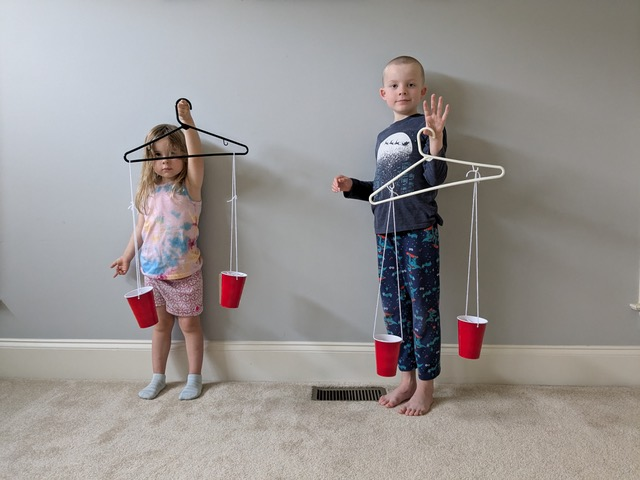
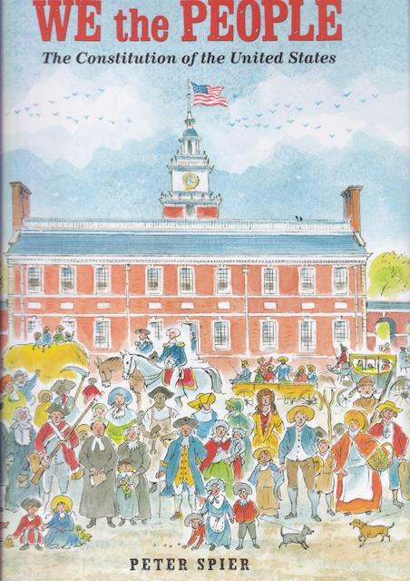
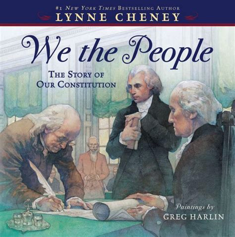

# We the People

## Introduction

The Constitution of the United States of America defines our system of
government. This remarkable document reflects the political genius of
James Madison, regarded as the Father of the Constitution.  First, it
specifies a government of limited powers, powers which are delegated to
it by the people. By limiting the power of the federal government, the
founding fathers hoped to maximize the freedoms of the citizens.

Much of the brilliance of our Constitution resides in how the powers of
the government are separated into three distinct areas: legislative,
executive, and judicial. To keep each of these power centers from
growing too large, checks and balances are built into the Constitution
so that each power center can exert influence over the other.

In addition to the separation of powers within the federal government
there is also the sharing of power between the state governments and
the national government, which is called federalism. Finally, the
founding fathers established a republic, not a democracy, as one more
constraint upon the unchecked power of a national government.

Getting the states to agree to give up any of their power to a
national government was a herculean task. Over the long, hot summer
of 1787 many compromises were needed, including the Great Compromise
of equal representation in the Senate for large and small states as
well as the Three-Fifths Compromise which counted slaves as ⅗ of a
person for the purpose of representation in the House.

---

## Book

Title: "A More Perfect Union: The Story of Our Constitution"
Author: Betsy Maestro
Illustrator: Giulio Maestro
Year Published: 2008
Length: 48 pages

---

## Calendar

Monday:
 - vocab
 - songbook

Tuesday:
 - text
 - rising-sun

Wednesday:
 - art-find
 - supplemental

Thursday:
 - re-enactment
 - geography

Friday:
 - science
 - culture

---

## American Heritage Songbook: The Preamble {#songbook}

```metadata
toc: "American Heritage Songbook: _The Preamble_"
time: 5 minutes
freq: daily
```

Schoolhouse Rock! has a great video and song about the preamble to the
Constitution. Excerpted lyrics are below:

> In 1787 I'm told
> Our founding fathers did agree
> To write a list of principles
> For keeping people free.
>
> The U.S.A. was just starting out
> A whole brand-new country
> And so our people spelled it out
> They wanted a land of liberty
{.nowrap}

You can find The Preamble [on YouTube][shr] or Disney+.

[shr]: https://www.youtube.com/watch?v=OqvLi7qZ_yU

---

## Arts & Crafts: Make Your Own Rising Sun {#craft-rising-sun}

```metadata
time: 30-60 minutes
prep: 10 minutes
supplies: Coffee filters, markers, water, googly eyes (optional)
```

> Ben Franklin commented that at last he knew for sure what kind of
> sun was on Washington’s chair – it was a rising sun!

This is a fairly simple craft for making your own Rising Sun.

### Supplies
* Coffee filters
* Colored markers
* Water
* Optional: googly eyes
* Optional: pipette/dropper

### Directions
1. Fold the coffee filter in half.
2. Color with markers.
3. Use a pipette or dropper to moisten the entire coffee filter. Enjoy watching
   the colors bleed along the filter. A little water goes a long way. Make sure you have the coffee filter on a surface that can get wet or dyed (we used coated paper plates).
4. Let the coffee filter dry.
5. Use markers and/or googly eyes to make a face on your rising sun
6. Hang up (they are pretty as sun catchers in a window) or pin to the
   back of your chair and pretend you are George Washington presiding
   over the Constitutional Convention.


{.center}

---

## Geography: Before & After {#geography}

```metadata
time: 10 minutes
supplies: U.S. puzzle
```

> The government was not working well. Many people were poor.
> The thirteen states were not cooperating with one another.
{.nowrap}

Remove the thirteen original states from the puzzle and ask your
child(ren) to fit them together outside the frame of the puzzle. Once
they’ve done that, separate each state slightly from the others. Now,
tell your children that after the Revolutionary War the states were
not working together. They each acted independently, separately from
each other. The Constitutional Convention was convened in Philadelphia, Pennsylvania to get the states to work together (the map on page 4 of the book shows where Philadelphia is located).

Our constitutional republic was established once nine of the thirteen colonies ratified the Constitution. Have your children push together the puzzle pieces of the first nine states to ratify the Constitution (Delaware, Pennsylvania, New Jersey, Georgia, Connecticut, Massachusetts, Maryland, South Carolina, New Hampshire). Remove the four states that had not ratified the constitution yet. How important do you think it was to get those last four ratified? How much of a country would the United States be without them? 

Virginia and then New York were the next to ratify the Constitution. North Carolina and Rhode Island ratified it after George Washington had been elected our first president and the new government had started operating. Ask your child(ren) to push the states together to indicate how we became the United States, “forming a more perfect union” and finally started working together after ratifying the Constitution.


---

## Famous American Texts: _The Preamble_ {#text}

```metadata
time: 5 minutes
freq: daily
```

> We the People of the United States, in Order to form a more perfect
> Union, establish Justice, insure domestic Tranquility, provide for the
> common defense, promote the general Welfare, and secure the Blessings
> of Liberty to ourselves and our Posterity, do ordain and establish
> this Constitution for the United States of America.

Depending on the age of your child(ren), ask them to memorize a
portion of The Preamble to the Constitution of the United States of
America.

An excellent aid to this activity is Peter Spier’s book, _We the
People: The Constitution of the United States_. See the Supplemental
Reading activity below.

---

## Cooking: Philadelphia Cheesecake {#cooking}

```metadata
time: 20-40 minutes
prep: 15 minutes
```

> A few leaders from each state were invited to come to Philadelphia in May 1787…
> Some of those who had arrived in Philadelphia early, including George Washington and James Madison, had come up with a plan to form a new government.

The creation of the Constitution by the Constitutional Convention has been referred to as the "Miracle at Philadelphia." George Washington wrote to the Marquis de Lafayette in 1788 that: "It appears to me, then, little short of a miracle, that the Delegates from so many different States (which States you know are also different from each other in their manners, circumstances and prejudices) should unite in forming a system of national Government, so little liable to well founded objections."  

Similarly, James Madison wrote Thomas Jefferson in 1787 that: "Adding to these considerations the natural diversity of human opinions on all new and complicated subjects, it is impossible to consider the degree of concord which ultimately prevailed as less than a miracle."

Philadelphia has a number of foods associated with it such as cheesesteaks, hoagies, soft pretzels, etc. Pick one of these or the Philadelphia Cheesecake recipe below to emphasize the “Miracle at Philadelphia” with your family in a delicious way.

[Philadelphia Cheesecake][recipe] (based on Philadelphia Cream Cheese)

[recipe]: https://www.kraftheinz.com/philadelphia/recipes/501761-philadelphia-classic-cheesecake?&cm_mmc=Search-_-philadelphia-_-GOOGLE-_-MK~US_BR~Philadelphia_PR~cream+cheese_YR~24_CN~Equity_OB~Consideration_BN~Brand_PK~CPC_CP~Search_FF~e-recipe_philadelphia+cream+cheese+cake+recipe&gad_source=1&gclid=Cj0KCQjwkdO0BhDxARIsANkNcrcK205zCc-Fvo_vLDjD-N_N2t4nvrZTFy9yb2xDIz-7TAyBl1eVtr8aAq_hEALw_wcB&gclsrc=aw.ds

### Ingredients
* 1 and 1/2 cups graham cracker crumbs (or graham crackers that can be made into graham cracker crumbs)
* 3 tablespoons sugar
* 1/3 cup butter or margarine, melted
* 4 packages of 8 oz Philadelphia Cream Cheese softened (yes, that's 32 oz total of cream cheese)
* 1 cup sugar
* 1 teaspoon vanilla
* 4 eggs

### Directions
1. Heat oven to 325 degrees Fahrenheit.  (It was a hot Philadelphia summer when the Constitution was written.)
2. If using graham crackers, put them into a plastic bag and seal.  Use spoons to smash them up into tiny crumbs.  (Delegates may have been frustrated by opposing ideas.  Let's release some of that frustration!)
3. Mix together graham cracker crumbs, 3 tablespoons of sugar, and melted butter.  Press into bottom of 9-inch springform pan.  (Think of this as the New Jersey plan.)
4. Beat cream cheese, 1 cup sugar, and vanilla with mixer until blended together. Add eggs one at a time beating on low until all the eggs are incorporated.  (Think of this as the Virginia plan.)
5. Pour cream cheese mixture on top of graham cracker mixture in the pan.  (Think of this as the Connecticut Compromise mixing together ideas from the Virginia and New Jersey plan.)
6. Bake 55 minutes or until center is almost set. (Think of this as the final additions, edits, and ideas worked out throughout that hot Philadelphia summer.)
7. Run a knife around the rim to loosen the cake.  Cool before removing.  Refrigerate for 4 hours before serving.  (Think about this as the many months of discussion throughout the states before they ratified the Constitution.)
8. Slice and enjoy!  (Think about this as enjoying living in a Constitutional Republic.) 

---

## Science: Make Your Own Balance Scale {#science}

```metadata
time: 20-40 minutes
prep: 15 minutes
supplies: Paper cups, string, hanger, tape, hole punch or scissors, jelly beans
```

> Right away the delegates began to argue. The members from the small
> states thought the Virginia Plan was unfair. Other delegates were
> afraid to let the people choose the President.

This activity was inspired by a preschool activity in which we
participated. First, you will build a balance scale. Then, you will
balance political power.

### Supplies
* String
* Plastic cups
* Hanger
* Hole punch
* Small objects
* Tape (optional)

### Directions
1. Punch two holes in each paper cup on opposite sides near the top.
2. Put the string through the holes and tie them together to form a handle for each paper cup.  This forms a bucket. Note that ideally the strings should be the same length for each cup.
3. Hang, tie or tape the string of each bucket to either side of the hanger.  
4. Hold the hanger at the top. There should be a paper cup bucket dangling from each side of the hanger. This is your balance.

Now that you have your own balance scale you can use it to compare how
political power was allocated between the Virginia and New Jersey
Plans. Jelly beans will represent political power. Pennies will also work (but don't eat them at the end).

Start with the Virginia Plan, which allocated more power to the larger
states. To keep things simple, select three jelly beans for each large
state (Virginia, New York, Pennsylvania, Maryland, Massachusetts,
North Carolina). All three jelly beans should be the same color for
each state. Put all the jelly beans representing the large states into
one cup. Then, select one jelly bean for each small state* (New
Jersey, Delaware, Connecticut, Georgia, New Hampshire, South Carolina)
and put them in the small cup. Which cup is heavier? Do your kids see
how the Virginia Plan would have given more political power to the
large states? And do they see why the smaller states would think this
was unfair?

Now, let’s look at the New Jersey Plan. For this plan, allocate two
jelly beans (of the same color) for each state. Put the jelly beans
for the large states in one cup and the jelly beans for the small
states in the other cup. Ask your kids if they see how this more
evenly divides power between the states? And if they see why the
larger states would think this was unfair?

To finish this exercise, ask your kids if they are ready to eat the
jelly beans. This represents the fact that government power is derived
from the people :-)

If interested, your child(ren) can weigh other small items to determine which is heavier or see how much these items weigh in jelly beans (or pennies).  They could also try to guess which item is heavier.  This is a fun "weigh" to teach them a little bit about scales!

\* The very smallest state, Rhode Island, did not send a delegate to
the Constitutional Convention.


{.center}

---

## Historical Re-enactment: Chore Convention {#reenactment}

```metadata
time: 30-45 minutes
prep: 15-20 minutes
toc: "Re-enactment: Chore Convention"
```

> The signing of the Constitution was a formal ceremony.
> George Washington was the first to sign his name.
{.nowrap}

* Convene a family meeting to discuss family rules/chores
    - Who presides as George Washington?
    - Who takes notes as James Madison?
* Brainstorm and then negotiate rights (e.g., allowance amounts) and responsibilities (e.g., chores)
* Once the family reaches agreement, print out a final copy of the Family Constitution
* Sign the Constitution

Here is [a link to a template for a Chore Constitution]. You can edit this one or create your own to fit your family's needs.

[a link to a template for a Chore Constitution]: https://docs.google.com/document/d/1dq6aLBKWmz26_vbsFAZolNUzu0bRWw3WLhx9QhqqCgw/edit

Below are excerpts from the notes taken by "James Madison" for one of our family's chore conventions:

_Notes taken by the representative of the state of motherhood (M)._

_Virginia/Parent plan: Children unload dishwasher in the morning five days a week. After completing a meal, each person takes their dishes over to the sink. Ten minute clean up before dinner each day._

_Toddler representative (T): “EEEEEE ooooh.”_

_Preschool representative (P): “I’d like to change that plan.”_

_Elementary representative (E): “I like it.”_

_P: “And I also like it.”_

_Fatherhood representative (F): “I like the plan as written.”_

_New Jersey/Children plan: After chores we watch a video or do something in a fun work book. Have a reward of doing crafts and Lego stuff. Playing video games._

_T: “A bum bum bum. A ba ba ba ba ba ba.”_

_Discussion about difference between rights and privileges. Discuss privileges and rewards._

_Connecticut Compromise: As members of our United Family, we all must respect and listen to each other. Children should practice immediate obedience to their parents. Parents should provide the privilege of an allowance. After successful completion of chores (or a set of chores) a small reward (such as a fun worksheet or short video) may be offered (but may be deferred depending on circumstances). After completion of a week (or month) of chores, a larger reward may be offered (chore/star chart)._

Note that subsequent chore conventions included significantly more discussion as representatives increased in age/awareness. We discussed what we liked or didn't like about the previous Constitution (should we stay under the Articles of Confederacy?) and amended as needed. My children looked forward to our Second Constitutional Convention. After signing, they have reminded me of my responsibilities under our family Constitution and held me to it.

Another alternative would be to determine a family mission statement (rather than chores). This is probably best with slightly older children. A mission statement would cover the values of the family, the core tenets of the family, and the overarching goals of the family.

---

## Supplemental Reading: _We the People_ {#supplemental-we-the-people}

```metadata
time: 10 minutes
```

> In his room at a Philadelphia boardinghouse, Madison, a small man of
> great learning, labored over a plan to present to the convention.
> His boldest idea was that the nation’s government start with the people.


{.center}

**Title:** _We the People: The Constitution of the United States_

**Author & Illustrator:** Peter Spier

**Year Published:** 2020 (Original edition 1987)

**Length:** 48 pages

There are two more excellent picture books to supplement this
module. The first, _We the People: The Constitution of the United
States_ is by Caldecott Medal winner Peter Spier. Each double page
spread illustrates a single phrase of the Preamble to the
Constitution. With 8-15 detailed drawings on every page, Spier
contrasts colonial times with modern times – similar to the
_Schoolhouse Rock!_ video _The Preamble_, referenced above in the American
Heritage Songbook. His rich illustrations can be savored by both
younger and older children (and parents!).


{.center}

**Title:** _We the People: The Story of the Constitution_

**Author:** Lynne Cheney

**Illustrator:** Greg Harlin

**Year Published:** 2012

**Length:** 40 pages

Lynne Cheney’s _We the People: The Story of the Constitution_ is aimed
at slightly older children. It has more text telling a more detailed
story of the struggles at the Constitutional Convention in 1787. Greg
Harlin’s paintings are superb but less engaging for younger readers
than Peter Spier’s numerous activity filled illustrations.

---

## Scripture: Psalm 127:1 {#scripture}

```metadata
time: 10 minutes
```

> Unless the LORD builds the house, its builders build in vain.
> Unless the LORD watches over the city, the watchmen stand guard in vain.


A popular history of the  Constitutional Convention of 1787 describes it as the Miracle at Philadelphia. Arguments between the delegates raged back and forth through the long, hot summer as they struggled to draft a constitution to govern the American people. At the end of one contentious session, Benjamin Franklin proposed they enlist the Lord’s help:

> I have lived, Sir, a long time and the longer I live, the more convincing proofs I see of this truth -- that God governs in the affairs of men. And if a sparrow cannot fall to the ground without His notice, is it probable that an empire can rise without His aid? We have been assured, Sir, in the sacred writings that "except the Lord build they labor in vain that build it." I firmly believe this; and I also believe that without His concurring aid we shall succeed in this political building no better than the Builders of Babel: We shall be divided by our little partial local interests; our projects will be confounded, and we ourselves shall become a reproach and a bye word down to future age… I  therefore beg leave to move -- that henceforth prayers imploring the assistance of Heaven, and its blessings on our deliberations, be held in this Assembly every morning before we proceed to business.

Franklin’s motion was debated but not adopted; delegates instead observed a counter-proposal, attending a Fourth of July sermon on establishing a new government. However, Franklin’s proposal was adopted by the first Congress, nine days after it first convened on April 9, 1789. Chaplains were appointed to both the House and the Senate and they have opened the day’s proceedings with prayer for more than 225 years – the Miracle at Philadelphia still operating today.

---

## Vocabulary {#vocabulary}

```metadata
time: 10 minutes
```

> The Constitution had to be ratified, or approved, in each state
> before it could become law.

The preamble to the Constitution includes several words with which a young
reader may not be familiar.  Because the preamble was not written
with the young reader in mind, it is very difficult to get a feeling
for the meaning of the words from the context. We recommend reviewing
the vocabulary words during the first reading and reinforcing them on
every reading.

Constitution
: basic rules for making and enforcing laws

Preamble
: an introductory statement

Union
: joining one or more things together as a single thing

Justice
: deciding what is fair

Domestic
: within one’s own country

Tranquility
: peacefulness

Welfare
: well-being, prosperity, health

Posterity
: future generations; descendants, children and grandchildren

Ordain
: to order or command

Ratified
: approved

---

## Art: Find the Horses, People, Flags! {#art-find}

```metadata
time: 15 minutes
```

> James Madison offered to write down everything that happened during the meetings…
> His work was so important he is called the Father of the Constitution.

It’s always fun to find the hidden and not-so-hidden
objects. Especially during later readings, this is a good way to keep
younger children engaged in the reading. For this story we have
several challenges:

1. The easiest challenge is our first one: find the horses! Including
   the title page, there are horses on 14 pages.
2. George Washington presides over the Constitutional Convention in
   his chair with the rising sun.  Can you find him? He is in six
   pictures but the last one is not part of the Constitutional
   Convention.
3. Benjamin Franklin is the oldest member of the Constitutional
   Convention and plays an important role. Can you find him with his
   long, gray hair and glasses? [4 pages]
4. James Madison, the Father of our Constitution, can usually be found
   sitting or standing next to George Washington. Can you find him? [3
   or 4 pages]
5. The most difficult challenge is this last one. On pages 34 and 35
   the people are celebrating the ratification of our
   Constitution. How many flags (not banners) can you find? [7 on page
   34, 10 on page 35; one of the smallest is hidden in the gutter]

---

## Civic Culture: Compromise {#civic-culture-compromise}

```metadata
time: 10 minutes
```

> Each side had given up something it wanted to create a plan that both
sides could accept.  The plan was called the Great Compromise or the
Connecticut Compromise.  

This is a practical exercise to incorporate
compromise in daily life. The idea is to ask the children to come up
with a “Connecticut” compromise when they get in a disagreement. As
situations come up, frame potential conflicts/disagreements as
alternative plans (Virginia/New Jersey) and ask what the Connecticut
Compromise could be in the situation.

My oldest two children were arguing about something, and each wanted
something impossible if the other were to get what they wanted. I
asked them what the Connecticut Compromise was in this
situation. Although asking for a compromise was not generally well
received in these situations, with the book fresh in their minds they
seemed to think that this was the approach to take. They proposed and
agreed upon a compromise.

---

## Civics: Separation of Powers {#civics-separation}

```metadata
time: 10 minutes
```

> The plan called for a government elected, or chosen, by the people. It would have three parts: a president, a congress or group of people to make laws, and a law court to make decisions about those laws.  

Our Constitution describes three branches of government: the legislative (makes our laws), the executive (enforces the laws), and the judicial (interprets our laws). Checks and balances on the powers of each branch are designed to ensure the stability of our government by limiting any one branch from becoming too strong and overpowering the others.

You can illustrate this stability to your children with the aid of an adjustable tripod. Extend a single leg to show how a monopod will not stand by itself. Then extend a second leg to show how even two legs won't stand by themselves. It requires all three legs to provide a stable platform (a three-legged stool can also serve as a demonstration). Ask the kids to apply labels to the tripod legs representing each branch of government.

Adjust one leg of the tripod so that it is much longer than the other two. Explain that if one branch of our government becomes too powerful, the entire structure becomes unstable. Next, shorten one leg to demonstrate that if one branch becomes too weak the structure of our government also becomes unstable.

---

## Civics: Federalism {#civic-federalism}

```metadata
time: 10 minutes
```

> The delegates had to convince the people in their home states to vote for the new Constitution.  

Each state has its own laws, its own government. In some cases they are similar and in others they are different. The federal government also passes laws. These laws sometimes conflict with laws passed in the states. The city you live in also has its own local government which passes its own laws, which can conflict with state or federal laws. This is another example of separation of powers, where the power is divided between local and national interests.

To illustrate this, ask your children if there are different rules at home compared to when they visit their grandparents? What are some rules that are different at Grandma and Grandpa's house compared to their own house? 

You can also illustrate the two branches of Congress, the Senate and the House, with a family example. Do Mom and Dad have different rules for the family? Or do they both have to agree on a rule, like the Senate and the House, before it becomes a rule for the whole family?

