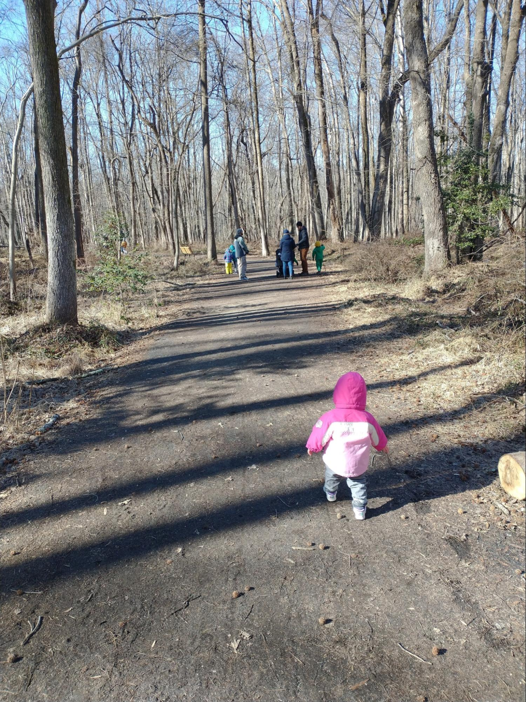

# The Louisiana Purchase

## Introduction

The Louisiana Purchase, one of the biggest real estate deals in
history, more than doubled the size of the United States for what
turned out to be a bargain price of $15,000,000. Not only did the
United States acquire a vast territory that would be turned into 13
new states, the deal secured for America the right to travel on the
Mississippi River all the way to the Gulf of Mexico, a vital
right-of-way that opened up enormous commercial opportunities for
farmers throughout the interior of our country. While other nations
fought wars over territory, the United States grew with a relatively
simple financial transaction.

The men who negotiated the purchase from France, Robert Livingston and
James Monroe, exceeded the authority they had been given by President
Jefferson – they only had the authority to negotiate for the port of
New Orleans. President Jefferson himself doubted whether the
Constitution gave him the authority to purchase more land for the
United States. In October of 1803, the United States Senate confirmed the
purchase by an overwhelming vote of 24 to 7.

President Jefferson sent Meriweather Lewis and William Clark to explore the enormous territory the U.S. had just acquired. These men, with their Corps of Discovery, led the most astonishing expedition in the history of America. They represent the epitome of America’s self-reliance, rugged individualism, hard work and pioneering spirit in overcoming numerous obstacles in their two-year round-trip to the Pacific Ocean and back. They were true entrepreneurs as well, befriending and bartering with many Indian tribes for information and the supplies they needed to succeed in their over 8,000 mile expedition. In addition to the hundreds of new plant and animal species they recorded, they mapped the Louisiana Territory, found a route all the way across the continent, and helped establish America’s claim to the Oregon Territory.

---

## Book

Title: "Seaman’s Journal: On the Trail with Lewis and Clark"
Author: Patricia Reeder Eubank
Illustrator: Patricia Reeder Eubank
Year published: 2010
Length: 40 pages

---

## Calendar

Monday:
  - songbook
  - cooking

Tuesday:
  - new-states
  - watercolor

Wednesday:
  - Vocabulary (before reading) [vocab]
  - naturalists

Thursday:
  - reenactment-fort
  - art-find

Friday:
  - economics
  - pov

---

## American Heritage Songbook: Schoolhouse Rock!: Elbow Room {#songbook}

```metadata
toc: "American Heritage Songbook: _Elbow Room_"
time: 5-10 minutes
freq: daily
```

_Schoolhouse Rock!_ has another great song and animated short. _Elbow
Room_ is all about the United States opening up and settling the
West. The story starts with the Louisiana Purchase and Lewis & Clark,
as you can see in the lyrics below. But it moves from there to the
California Gold Rush, Manifest Destiny, and then links to our current
frontier, outer space.

> The president was Thomas Jefferson
> He made a deal with Napoleon
> How'd you like to sell a mile or two, (Or three, or a hundred, or a thousand?)
> 
> And so, in 1803 the Louisiana Territory was sold to us
> Without a fuss
> And gave us lots of elbow room
> 
> Oh, elbow room, elbow room
> Got to, got to get us some elbow room
> It's the west or bust
> In God we trust
> There's a new land out there…
> 
> Lewis and Clark volunteered to go
> Goodbye, good luck, wear your overcoat!
> They prepared for good times and for bad (and for bad)
> They hired Sacagawea to be their guide
> She led them all across the countryside
> Reached the coast
> And found the most
> Elbow room we've ever had
{.nowrap}

You can find _Elbow Room_ on Disney+, [YouTube][shr-yt], or order it
from [Amazon as part of a Schoolhouse Rock package][shr-amz].

[shr-yt]: https://www.youtube.com/watch?v=aHVx4nqgMPQ
[shr-amz]: https://www.amazon.com/Schoolhouse-Rock-Special-30th-Anniversary/dp/B00005JKTY

---

## Arts & Crafts: Watercolors {#craft-watercolor}

```metadata
time: 30-40 minutes
prep: 10 minutes
supplies: Watercolor paints, (thick) paper to paint on, paint brushes
```

> Often, huge flocks of passenger pigeons block out the sun.  Lewis
> sketches them in his journal while I look out for rattlesnakes.

The beautiful drawings by Patricia Reeder Eubanks are rendered in a
combination of watercolors and acrylics. She does a beautiful job
illustrating many of the animals Lewis & Clark encountered along the
way and sketched in their journals. For this activity, just ask your
kids to paint their favorite animal from the story (including Seaman!)
using watercolors.

### Supplies
* Watercolor paints
* Brushes
* Thick paper
* Optional: pencils for sketching 

<br>
Grizzly Bear
{.center .caption}

---

## Arts & Crafts: Make Your Own Journal {#craft-journal}

```metadata
time: 20-30 minutes
supplies: Paper, hole-punch, string/yarn/brads
```

> Often Lewis and I visit the Mandans and Hidatsas who live close by.
> They tell him about the route over the mountains, and Lewis writes
> it all down in his journal.

Lewis & Clark recorded an incredible amount of information in their
journals. They sketched plants and animals, recorded their
interactions with all of the Indian tribes they encountered, described
the land and all their adventures crossing the continent. For this
activity, you will make your own journal that you can use to collect
your watercolor drawings (above), your maps (below), and recording the
plants and animals you discover on your hike (below). Or you might write your journal from the point-of-view of your family pet, just like _Seaman's Journal_.

Making the journal is relatively simple: collect some paper, punch two
holes in the sheets with a hole-punch, and then bind them with string,
yarn, or brads. The simple binding makes it easy to add new drawings,
maps, or additional pages.  Alternatively, journals can be stapled together or even taped along the edge (as my daughter industriously did for her journal).

The journal can include drawn pictures of plants and animals or short write-ups of what occurred each day.  For young children you can ask them to tell you what they would include in a journal entry each day.

---

## Geography: Thirteen New States {#new-states}

```metadata
time: 15 minutes
```

> Clark works to complete his maps while Lewis studies the animals,
> especially the sea otter.  Clark said we have come 4,142 miles from
> Missouri to the Pacific!

The Louisiana Purchase doubled the size of the United States in a
single transaction. For the price of $15,000,000, France sold the
United States all of the territory from the Mississippi River to the
Rocky Mountains: 800,000 square miles. To help your child(ren) grasp
the size, have them remove all the states from the puzzle. Then ask
them to assemble just the states that were carved out of the Louisiana
Purchase. For this activity, you should only include the states that were wholly or largely part of the Louisiana Purchase:

* Louisiana
* Arkansas
* Missouri
* Iowa
* Minnesota
* Oklahoma
* Kansas
* Nebraska
* South Dakota
* North Dakota
* Colorado
* Wyoming
* Montana

(Small parts of Texas and New Mexico were also part of the purchase
but including those states gives the wrong impression of the size of
the purchase.)

Next, ask your child(ren) to complete the puzzle east of the Mississippi River – the fourth longest river in the world. Keep the states east of the Mississippi River separate from the states comprising the Louisiana Purchase so they can see how the Louisiana Purchase approximately doubled the size of the United States (you may want to leave Florida out, as we did not acquire it from Spain until 1821).  Point out how important the Mississippi River is to the United States. Before roads were built, the Mississippi River was like a giant superhighway, right in the middle of the country, that farmers could use to float their goods down to New Orleans. From there they could be put on a ship and reach ports on the East Coast or even other countries.

---

## Geography: Make Your Own Map {#map}

```metadata
time: 20-30 minutes
supplies: Graph paper, colored pencils
```

> Clark has mapped the lands we crossed.

Lewis & Clark were co-leaders of the Corps of Discovery. However, each
had distinct responsibilities.  One of the main goals was to find and
map a route to the Pacific Ocean. Clark was the expert in mapmaking
and it fell to him to map the rivers, mountains, and geography they
traveled, plotting their longitude and latitude using a sextant and a chronometer. Between the two of them they produced about 140 maps. In
1814 a complete map of their journey was produced.  Astonishingly,
Clark was only off by 40 miles in measuring the distance across the
continent they traveled.

For this activity, your young explorers get to be William Clark. Their
assignment is to map their local neighborhood – the streets,
sidewalks, cul-de-sacs. Alternatively, they could map a local park –
the playground equipment, the paths, the ball fields. Younger children
may want to map something even simpler, like their own room (that’s
what our four-year-old did). Use graph paper if available and colored
pencils to help indicate landmarks.

This is a good opportunity to talk about the different scales on maps.  If you are mapping your neighborhood or room, the child(ren) can count how many of their steps it takes to cover the length of the room (or a portion of the street). They can then decide how many of their footsteps a grid square should represent and attempt to get a scale mapping.

Maps cannot include the full detail of everything in the real world. Depending on the scale, more or less detail can be included. Depending on the purpose of the map, certain details might be more or less important (terrain, elevation, etc.).  Discuss which details the map you are making should include (and which should be left off).  Discuss how this might change depending on the purpose of the map (for example: giving directions to someone driving in a car versus traveling by bike).

---

## Famous American Texts: The Louisiana Purchase {#text}

```metadata
time: 5 minutes
freq: daily
```

> Let the Land rejoice, for you have bought Louisiana for a Song!

So wrote General Horatio Gates to Thomas Jefferson in July of 1803, suggesting that America paid very little for Louisiana ("a song"). Napoleon Bonaparte led France during the Napoleonic Wars stretching from 1796 to 1815. He needed money to finance those European wars and had little interest in the additional cost of defending an overseas territory that was easily blockaded by the British Navy. Moreover, Napoleon saw that defending Louisiana could become even more expensive if an expansionist United States continued growing into the western lands. 

From Napoleon’s perspective, he unloaded a piece of property that would have been costly to defend and that he was likely to lose eventually. And he got paid handsomely for it - $15,000,000 (equivalent to $340,000,000 today). However, in his farewell letter to the Louisianans, Napoleon foresaw the potential advantages to America: “The day may come when the cession of Louisiana to the United States shall render the Americans too powerful for the continent of Europe. Let the Louisianans know that we separate ourselves from them with regret.”

While it is true that the Louisiana Purchase  was instrumental in making America a great power, it is also worth remembering that we used that power to rescue France and Europe during World Wars I and II. The Louisiana Purchase was truly a win-win transaction for both France and the United States.

---

## Cooking: Make Your Own Pemmican {#cooking}

```metadata
time: 60 minutes
prep: 30 minutes
supplies: Nuts, seeds, dried fruit, honey, salt, coconut oil
```

> I help Sacajawea dig roots to eat. She also gathers plants for
> medicine. One day she made pemmican and gave me a piece. I ate the
> dried meat in it but spit out the nuts and berries. Phooey!

You will find a recipe for pemmican in the back of the book. However,
there are many varieties of pemmican that you can try. We used this one and it was a huge hit with (most) of our kids
(one refused to try it). We decided it was more of a “dessert
pemmican.”

### Ingredients
* 2 cups mixed raw nuts and seeds (walnuts, almonds, pecans, pumpkin seeds, etc. are all possibilities)
* 1/2 tablespoon coconut oil (we used olive oil)
* 1 and 1/2 cups dried fruit (cherries, crasins, raisins, apricots, etc.)
* 1 tablespoon flax seeds
* pinch of salt
* 1/2 cup honey
* 1/4 water

### Directions
1. Preheat oven to 375 degrees Fahrenheit
2. Lightly toast nuts/seeds in a skillet on the stovetop.  Approximately 3-5 minutes stirring frequently. 
3. Once warmed/toasted, turn off the heat and mix in the coconut oil (to coat the nuts).
4. Move to a food processor and pulse several times to chop the nuts.
5. Add the dried fruit, flax seed and salt and pulse again until mixed/chopped.
6. Drizzle in honey and water (either on low speed or mix again once they have been added).
7. Spray or butter some parchment paper and put in a glass container (we used an 8x8).  8. Pour mixture into parchment paper and spread/press evenly over the container.
9. Bake for 25-30 minutes until the edges turn brown.
10. Cool completely.  Pull out using the parchment paper.  Cut into bars.  Store in the refrigerator.  Take with you to keep your strength up on your next expedition!

<br>
Make Your Own Pemmican!
{.center .caption}

---

## Science: Junior Naturalists {#naturalist}

```metadata
time: 30 minutes
prep: 10 minutes
supplies: _Seek_ app by iNaturalist, sketching paper, pencils
```

> We have been on the greatest adventure ever.  Lewis will send a long
> report to President Jefferson about the Indian tribes, plants, and
> animals we discovered.

The Lewis and Clark Expedition was also known as the Corps of
Discovery Expedition. President Thomas Jefferson had charged the
expedition to document the plants and animals (“especially those not
known in the U.S.”) they saw along the way. What did they discover?
They returned with more than 200 plant specimens of which 178 were unknown, as well as 122 new animals. Their journals record 134 bird species, including
new species named after the explorers: Clark’s Nutcracker and Lewis’s
Woodpecker.

This is a great activity to do with a larger group so consider
inviting extended family or another homeschooling family to join
you. For this re-enactment you will need to find a local hike with
interesting plants, birds, and animals. Provide each of your children
with a journal/sketchpad (see “Make Your Own Journal” above) so they
can record some of the plants and animals they encounter along the
hike, just like Lewis and Clark. You may want to bring some pemmican
(see “Make Your Own Pemmican” above) along as a snack. You can also connect this activity with the Arts & Crafts activity of making a watercolor picture of your children's favorite animal.

The kids can try counting how many different kinds of birds they see;
you can also turn it into a contest by breaking up into teams or
individuals to see who can find the most birds or the most
species. You can help them identify the plants or birds they encounter
by using an app; we used Seek by iNaturalist for the plants because
they were easier to record (works on both iOS and Android).

<br>
Hiking!
{.center .caption}

---

## Historical Re-enactment: Build Your Own Fort {#reenactment-fort}

```metadata
time: 40 minutes
```

> Fort Clatsop, December 1805: The men have built a fort from the pine
> and fir trees. It rains constantly now, and many of the men wear the
> Clatsops’ basket hats to keep their heads dry.

The Corps of Discovery halted their expedition twice because of
winter. The first time they built Fort Mandan on the eastern side of
the Rocky Mountains near the Mandan Indians. The second time they
built Fort Clatsop near the shore of the Pacific Ocean and the Clatsop
tribe.

You’ll need blankets, pillows, and chairs to help your explorers build
a traditional blanket fort inside the house. Let them decide if they
are building Fort Mandan near the Rocky Mountains or Fort Clatsop near
the Pacific Ocean. Lewis & Clark built their forts for shelter and
protection from the winter storms. If your kids are up for it, they
may want to sleep overnight in their forts before heading “home” in
the morning after a nice breakfast of pemmican.

Alternatively, you could erect a real tent in the backyard for an overnight sleepover or even combine this activity with the Junior Naturalist activity for a hiking and camping trip to a local state park. 

---

## Historical Re-enactment: Grizzlies & Buffalos {#reenactment-grizzlies}

```metadata
time: 15 minutes
```

> Suddenly a gigantic buffalo charged into camp, straight for Lewis's tent!  I barked out, 'Woof!'  
> That buffalo turned around and headed back to where he came from.  Lewis called me his brave dog!

Play-acting Seaman and the buffalo can be a lot of fun. Let your child be Seaman. Pretend to be a buffalo and charge, but turn away scared when "Seaman" lets out a big bark! You can also switch roles or with multiple children you can have someone be Lewis and congratulate the "brave dog."

Another activity is to pretend to be a grizzly bear or get some stuffed teddy bears to pretend to be grizzly bears. Let "Lewis" fight off the bears to protect the camp.

Another fun extension is to act out part (or all) of the expedition, possibly with a cardboard box serving as a boat and pillow forts for the forts, either as you read the story or afterwards.

---

## Supplemental Reading: Thomas Jefferson Builds a Library {#supplemental-libary}

```metadata
time: 15 minutes
```

> While president, Tom doubled the size of the country and more than tripled the number of books in its library.


{.center}

**Title:** _Thomas Jefferson Builds a Library_

**Author:** Barb Rosenstock

**Illustrator:** John O’Brien

**Year Published:** 2023

**Length:** 32 pages

This is a delightful story about Thomas Jefferson. It touches lightly on what we usually think of as his major accomplishments: authoring the Declaration of Independence, Ambassador to France, our third President and the Louisiana Purchase. Instead, it focuses on his love of books and reading and, most famously, his contributions to the Library of Congress, today the largest library in the world and featured prominently on many lists of the most beautiful libraries in America.

John O’Brien uses pen-and-ink drawings on watercolors with an overlay of pointillist dots for his whimsical drawings which will fascinate both parents and kids. O’Brien’s drawings are just plain fun: Thomas Jefferson reading while dancing the minuet, while sitting in a bookshelf as a boy, and my favorite, while riding a horse with a book for a saddle, while playing the fiddle, and reading a book from a bookstand mounted on the horse’s head. “Tom gobbled books the way a starving man eats.” Or, as Jefferson himself wrote, “I can not live without books.”


<br>
Library of Congress
Thomas Jefferson Building
{.center .caption}

---

## Scripture: Psalm 111:2 {#scripture}

```metadata
time: 10 minutes
```

> Great are the works of the LORD;
> They are pondered by all who delight in them.


As noted above, an important part of  Lewis & Clark’s Corps of Discovery was documenting any new plant and animal species they encountered. Ask your children which are their favorites of the Lord’s “works” in the plant and animal kingdoms. Do they take delight in them? How? Can you increase your delight in the Lord’s work by pondering and studying it? That is what Lewis & Clark did and, hopefully, what your own Junior Naturalists will do in the Science activity.

---

## Vocabulary {#vocabulary}

```metadata
time: 10 minutes
```

> In a pouring rain, we pushed the fifty-five-foot keelboat and two
> pirogues (flat-bottomed dugout canoes) into the Missouri River. We
> travel upriver and the men must push against its strong current.

We tried something new with this module and asked the kids what words
they thought should be in the vocabulary section. The words below are
a combination of their suggestions and some that we thought might be
new to young readers:

Loyal
: firm, unchanging support for a person, organization, or cause

Corps
: a group of people acting together (the “p” and the "s" are silent)

Keelboat
: a shallow, covered riverboat with a long piece of wood on the bottom
  (the keel) to provide stability

Fossils
: the shape of a plant or animal that has been preserved in rock for a
  long time

Trinkets
: a small ornament or piece of jewelry of little value

Prairie
: a large area of flat land with grasses but no trees

Journal
: a daily record of experiences and observations

Portage
: carrying a boat over land to avoid an obstacle in the water

---

## Writing: A Dog’s Eye View {#writing-pov}

```metadata
time: 10 minutes
```

> Here is my story of the greatest adventure a dog ever had, when I
> followed Lewis and Clark all the way to the Pacific Ocean and back
> again.

This story is told using the “first person” point-of-view of
Meriweather Lewis’s Newfoundland dog, Seaman. What do your kids think
about a dog telling them the story of the most famous expedition in
our nation’s history? The technique the author uses creates an
interesting blend of fact and fiction. Of course it’s fictional that a
dog can tell a story and keep a journal. But the facts he relates are
all taken from the journals of Lewis & Clark.

Ask your kids to write an adventure story from an animal’s point of view. It could be from one of your pets or even a favorite stuffed animal. For younger kids, you could tell them a story and ask them to draw a scene from the story.

---

## Art: Find the Animals {#art-find}

```metadata
time: 10 minutes
```

> We’ve seen bobcat, elk, buffalo, and antelope. I chased the antelope
> and took one to Cook.  One day we counted thirty-six bald eagles
> soaring above our heads.

The author/illustrator, Patricia Reeder Eubanks, imitates the journals
of Lewis & Clark by including drawings of animals they discovered
during the expedition. Once Lewis & Clark start the expedition, your
child(ren) will discover multiple pictures of animals on every
page. Ask them to see if they can find all the animals. Which one is
their favorite?

---

## Economics: Barter & Exchange {#economics}

```metadata
time: 10 minutes
```

> We’ve packed shiny bracelets, scissors, medals, mirrors, army uniforms, hats, and flags to trade with the Indians.
> A party of Kickapoos came into our camp. We gave them trinkets. They gave us deer meat.


Lewis and Clark bartered with many Indian tribes during more than two years, exchanging the “trinkets” they brought with them for food, horses, and other supplies. While the book uses the term “trinkets” to indicate they were items of small value, they were often items that the Indians had never seen before and had no way of producing for themselves. This made the trinkets rare and valuable to the Indians. In return, the Corps received food and supplies they needed to continue their expedition – items that were valuable to them. 

Barter, voluntarily exchanging goods (or services) for items (or services) that each party values more highly than what they are exchanging, is an example of how individuals and groups benefit through trade. You can set up a barter situation with your kids in many ways. One way is to distribute toys to them randomly and tell them they can only play with the toys they have; after a few minutes, allow them to trade toys. The trades should make them more satisfied with what they now have. Legos work well for this exercise but you can do it with stuffed animals or any random distribution of toys. Barter also crops up naturally in the home when a toddler latches on to an item that they should not have and the best way to get it back is to trade them a shiny toy.
