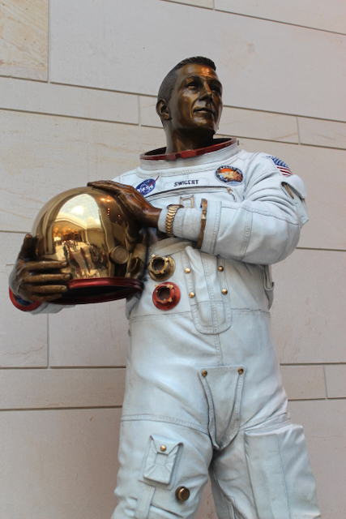

# The Star-Spangled Banner

## Introduction

The American flag is the most important symbol of our country. When
children see the flag it should remind them not only of how
exceptional our country is but also of the men and women who fought
for our freedoms. This story is about the most famous flag in our
history and how it inspired our national anthem, whose soaring lyrics
serve to remind us and connect us to our heritage: “the land of the
free and the home of the brave.”

Underlying the patriotic story of our flag is the empowering story of
Caroline and her mother, Mary. At a time when it was rare for women to
operate a business, these entrepreneurs successfully launched their
Flags and Ensigns enterprise, sewing and selling flags to military and
civilian customers. Teaching other young women how to support
themselves as seamstresses, these women exemplified our free
enterprise traditions, our work ethic, our encouragement of one
another, and the self-reliance at the foundation of our country.

The War of 1812 is also called the Second War for Independence. Once
again, we are fighting the British, this time because British warships
were capturing American sailors and forcing them to fight in the
Napoleonic Wars against the French. Once again, we are fighting for
“Life, Liberty, and the Pursuit of Happiness.”

---

## Book

Title: "Long May She Wave: The True Story of Caroline Pickersgill and Her Star-Spangled Creation"
Author: Kristen Fulton
Illustrator: Holly Berry
Year published: 2017
Length: 40 pages

---

## Calendar

Monday:
  - songbook
  - text

Tuesday:
  - geography
  - collage

Wednesday:
  - Vocabulary (before reading) [vocab]
  - craft-star

Thursday:
  - reenactment
  - find

Friday:
  - exhibit
  - family-history

---

## American Heritage Songbook: The Star-Spangled Banner {#songbook}

```metadata
time: 3 minutes
freq: daily
```

This is a great opportunity to teach your child(ren) our National
Anthem, _The Star-Spangled Banner_.  You might want to find a YouTube
video of the song so they can sing along with it ([here][ssb-yt1] are
a [couple][ssb-yt2] of different versions - mixing it up each day will
keep them interested). If you are musically inclined, you can play it
for them on your preferred instrument. By the end of the week, the
older children should be able to [sing the first verse all the way
through][ssb-yt3].

Lawyer and amateur poet Francis Scott Key wrote the lyrics to _The
Star-Spangled Banner_ after witnessing the defence of Fort
McHenry. His brother-in-law adapted the melody from an old British
drinking song. It wasn’t until 1931 that Congress approved it as our
National Anthem in a somewhat controversial vote. Other strong
contenders for our national anthem included, _My Country ‘Tis of Thee_
and _America the Beautiful_.

[ssb-yt1]: https://www.youtube.com/watch?v=vPKp29Luryc
[ssb-yt2]: https://www.youtube.com/watch?v=N_lCmBvYMRs
[ssb-yt3]: https://www.youtube.com/watch?v=TkeIRoRBqyE

---

## Arts & Crafts: Make Your Own Flag {#craft-collage}

```metadata
time: 30-60 minutes
prep: 10-15 minutes
supplies: Construction paper, magazines, glue, ruler, pen
```

Many women worked together as a team over an extended period of time
to create the enormous flag that flew over Fort McHenry. In this
activity you can replicate that teamwork and time by creating a
collage flag with multiple members of the family over a period of 2-3
days. This activity is adapted from the [meaningful mama website].

[meaningful mama website]: https://meaningfulmama.com/american-flag-collage.html

### Supplies
* Magazines that can be ripped
* Poster board or other thicker, larger paper
* Pencil/Pen
* Ruler
* Glue Stick

### Directions
1. Trace out a rectangle on the poster board/cardstock/newsprint as
   large as you’d like your flag to be. Use the ruler (or have your
   child use the ruler) to make lines for the stripes and rectangle
   for the blue and stars. You can make this a “Fort McHenry” flag by
   including 15 stripes and 15 stars or you can make the more standard
   13 stripes.
2. Go through the magazines and rip out pieces that are red, white,
   and blue. Also rip out stars (or things that can serve as
   stars). Rip the pieces into suitable strips and shapes to fit in
   the outline of the flag you have traced out.
3. Use the glue stick to glue the pieces of paper onto the flag. Work
   together as a team - perhaps have different people be responsible
   for different stripes. Take a break and come back to it if it is
   too much in one day (Caroline worked on her flag over multiple
   days).
4. Finally glue the “stars” on. Alternatively, you could use star
   stickers or a star hole punch if you want more uniform stars.
5. Hang up your flag to show it off!

### Notes
Our flag was large enough that my kids and I worked as a team to
complete it. We made it over the course of three days (taking breaks
as the kids lost interest). My three-year-old daughter enjoys ripping
paper and glue sticks so this seemed like her kind of activity. She
also seemed to enjoy pretending to be Caroline and “designing” the
flag by shaping the scraps of paper. We snuck in some practice
counting as the kids counted the stripes and then counted the
completed stripes to get a sense of our progress.


{.center}

---

## Arts & Crafts: Make Your Own Star {#craft-star}

```metadata
time: 20-30 minutes
prep: 5-10 minutes
supplies: Construction paper, scissors, string
```

Make a five-pointed star two-feet wide to get an idea of the size of
the flag (if you want to get the angles right, you can use a string to
draw a circle with radius 12-5/8 inches, then use a slightly longer
string to mark off the five points around the circle, each 14-7/8
inches apart). If you are ambitious, work with your child(ren) to make
five of them. Then, set them on the ground to give them some idea of
the size of Fort McHenry’s flag and why the Pickersgill family needed
so many people and so much room to make it.

For even more fun, we measured out the flag in our backyard, and that
is worth doing if you have the space! It is a good chance to practice
using a measuring tape and rope. We put stakes in the corners and
wrapped rope around them to see the full picture. We were all
astonished at how big it was! We put our two-foot star in it too.

You can also try making a six-pointed star and see which “fits”
better.

---

## Geography: New States & Stars {#geography}

```metadata
time: 10 minutes
supplies: U.S. Puzzle
```

By the time of the War of 1812 our country had grown and we had added
a handful of new states. The original flag of the United States of
America had 13 stars and 13 stripes representing the thirteen original
states. How many stars are on the Flag during the War of 1812? (15)
What new states were added after the War of Independence? **Vermont**,
**Kentucky**, Tennessee, Ohio, Louisiana. Why were there only 15 stars
if there were 18 states? (Congress authorizes new flags. They
authorized the 15 star version of the flag in 1794, after Vermont and
Kentucky were admitted to the Union). How many stripes did the flag
have at that time? (15) How many do we have today? (13) What do they
symbolize? (The original 13 colonies). The 1794 version of our flag
was the only one where additional stripes were added to match the
number of states. In 1818, Congress authorized a new version of the
flag with 20 stars and 13 stripes.

Show how our country grew from the founding in 1776 to the time of the
story in 1814. Use a puzzle of the United States and start with having
your child(ren) place the pieces representing the original 13 colonies
(or use a map where they can color in the states with crayons or
markers). Then, fit the pieces of the five new states into the puzzle
(or color them in, using a different color).

---

## Famous American Texts: The Pledge of Allegiance {#text-pledge}

```metadata
time: 5 minutes
freq: daily
```

What better module to introduce your child(ren) to _The Pledge of
Allegiance_? According to the United States Flag Code, the pledge
should be recited by standing and facing the flag while placing your
right hand over your heart:

> I pledge allegiance to the Flag of the United States of America,
> and to the Republic for which it stands,
> one Nation, under God, indivisible,
> with liberty and justice for all.
{.nowrap}

The original Pledge of Allegiance was written in 1892 by Francis
Bellamy to celebrate the 400th anniversary of Christopher Columbus’
arrival in America. Bellamy, a Baptist minister, published it in
_Youth’s Companion_, a popular national magazine. The publisher and
editors of _Youth’s Companion_ believed that part of their mission was
to promote national pride and the egalitarian ideals at the heart of
American exceptionalism. They were also responsible for an earlier
campaign that made flying the American flag part of every public
school.

Bellamy’s original version was tweaked over the years, first by
Bellamy, then the National Flag Conference (in 1923 and 1924) and
finally by Congress. Congress officially adopted the Pledge in 1942;
in 1954, Congress made the fourth and (so far) final change, adding
the words “under God.”

The pledge includes some words that are probably new to
youngsters. See the [Vocabulary](#vocabulary) section below for some
definitions. The Pledge of Allegiance is a standard part of our
naturalization ceremony, where people born in other countries declare
their intention to become American citizens. Have your child(ren)
practice reciting the pledge after each reading of _Long May She Wave_.

---

## Historical Re-enactment: Build Your Own Fort {#reenactment}

```metadata
time: 30-45 minutes
prep: 15-20 minutes
supplies: Pillows, blankets, bean bags, Nerf guns, flashlights
```

This activity starts by building your own Fort McHenry. You and your
kids can make the traditional indoor fort, using blankets, chairs,
pillows, and other furniture. Or strive for something more elaborate
with empty boxes. Don’t forget your flag! You can use one you’ve made
in one of the other exercises or something less elaborate like
patriotic pajama bottoms on a pole.

Once your Fort McHenry is built, it’s time for the British
assault. Place 3-6 “ships” in the “harbor” (carpet for indoors, lawn
for outdoors). Arm your Fort McHenry defenders with appropriate
pretend firearms (we used Nerf weapons, but rubber bands are also fun)
and begin the assault (we used bean bags for bombs bursting in air and
popped bubble wrap to simulate explosions; other families used dryer
balls and glow sticks for bombs). For additional fun, try this at
night with the lights out, using flashlights as strobes to illuminate
the action. For best results, include grandparents -- the more
attackers/defenders, the more fun will be had by all!

---

## Vocabulary {#vocabulary}

```metadata
time: 10 minutes
```

Kristen Fulton borrows phrases from Francis Scott Key’s _Star-Spangled
Banner_ in several places. His lyrics include several words that may be
unfamiliar to younger children:

Spangled
: decorated with small, bright objects

Perilous
: dangerous, hazardous

Gleaming
: momentary bright shining

Ramparts
: a wall of dirt for protection, defense

Gallantly
: bravely or courageously

Twilight
: the time between sunset and nightfall

The _Pledge of Allegiance_ also includes some words that may be
challenging or new:

Allegiance
: loyalty, devotion

Republic
: a government where decisions are made by representatives selected by the citizens

Indivisible
: not capable of being divided

---

## Game: Find the American Flags {#find-the-flags}

```metadata
time: 10 minutes
```

This is a fun activity for younger children; both our three-year-old
and our five-year-old loved it. We gathered a variety of digital
photos that contained one or more American flags. Then we displayed
the photos on the screen and asked the kids to find and count the
flags. You can make this exercise more interesting and challenging by
selecting photos where all the flags in the photo are not immediately
obvious. Kids enjoyed the hunt! A few samples:





{.center}

1. There are seven flags, six obvious ones and one tiny one way down
   the mall (look underneath the fifth flag)
2. There are two flags, one painted on the side of Discovery and the
   big one behind her.
3. This one’s tricky. One big flag to the left, four big ones to the
   right, and a little one above the last flag on the right. Total: 6.
4. Just one, the arm patch on Jack Swigert’s left shoulder.
5. Another tricky one. There are at least seven big flags and there is
   one tiny one flying in front of the Capitol. Total: 8.
6. Just one flag - the background.

---

## American History: Interactive Flag Exhibit {#history-exhibit}

```metadata
time: 10 minutes
```

The original Fort McHenry flag is on permanent exhibit at the
Smithsonian’s National Museum of American History. But it wasn’t
always there - in fact, the Smithsonian didn’t acquire it until 1912,
almost 100 years after the Battle of Baltimore. The history behind the
flag’s ownership and preservation is fascinating. You can explore it
online with this [NMAH interactive flag exhibit][nmah1]. The full online
_Star-Spangled Banner_ exhibit from the NMAH (including the story of the
Pickersgill family) [can be found here][nmah2].

[nmah1]: https://amhistory.si.edu/starspangledbanner/interactive-flag-html5/
[nmah2]: https://amhistory.si.edu/starspangledbanner/default.aspx

---

## Free Enterprise: Family History {#family-history}

```metadata
time: 10 minutes
```

The Pickersgill family supported themselves by using their talents as
seamstresses to create a variety of “flags and ensigns” that they
could sell to both military and civilian customers. Tell your children
stories about entrepreneurs in your family. Did you ever operate a
lemonade stand when you were growing up?  Mow lawns for your
neighbors? What was your very first job? Share these examples with
your child(ren) to connect them to the story, your family history, and
the free enterprise traditions woven into our national DNA.
