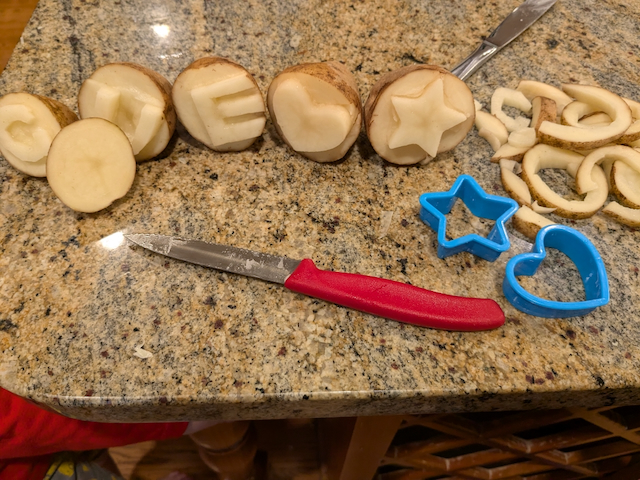
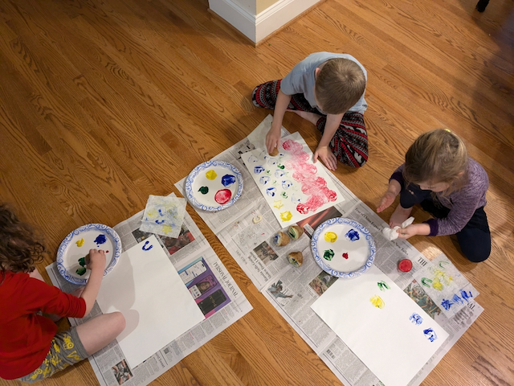
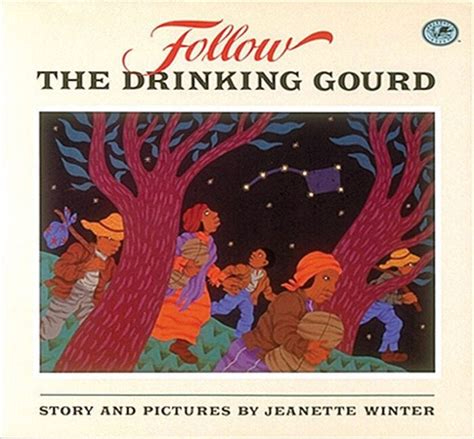

# Escaping Slavery

## Introduction

The long arc of America’s story is all about striving to live up to
the ideals set forth in the Declaration of Independence, that “all men
are created equal” and “they are endowed with certain unalienable
rights and that among these are life, liberty, and the pursuit of
happiness.” The story of Harriet Tubman’s struggle to escape from slavery contrasts the passion for freedom that people yearn for
with the failure to live up to that central component of American exceptionalism.

Harriet’s personal relationship with the Lord highlights another
critical aspect of American exceptionalism: In God We Trust. With the
Lord’s help, Harriet throws off the chains of slavery. And with Him
guiding her, she returns to the Slave States again and again to lead
others to the Free States and their first taste of the promises set
forth in the Declaration.

While Harriet gives all glory to the Lord, her hard (and dangerous)
work also illustrates the American exceptionalism themes of
self-reliance and, as part of the Underground Railroad, voluntary
associations and community life -- independence and interdependence.

Historically, her story sets the stage for the Civil War. When she
escapes slavery in 1849, the Free States and the Slave States are
exactly even, 15 states apiece. Tensions between the North and South
will rise over the next ten years as Harriet leads more of her people
to freedom and Congressional battles erupt over new states entering
the Union which might tip the balance towards freedom or slavery.

---

## Book

Title: "Moses: When Harriet Tubman Led Her People to Freedom"
Author: Carole Boston Weatherford
Illustrator: Kadir Nelson
Year published: 2006
Length: 48 pages

---

## Calendar

Monday:
 - "Songbook: _Amazing Grace_ [songbook]"
 - text

Tuesday:
 - geography
 - craft-stamp

Wednesday:
 - "Vocabulary (before reading) [vocab]"
 - science

Thursday:
 - scripture
 - "Re-enactment: Underground Railroad [re-enactment]"

Friday:
 - mashed
 - family

---

## American Heritage Songbook: _Amazing Grace_ {#songbook}

```metadata
toc: "American Heritage Songbook: _Amazing Grace_"
time: 5 minutes
freq: daily
```

>Amazing Grace! How sweet the sound
>That saved a wretch like me.
>I once was lost, but now am found
>Was blind but now I see.
{.nowrap}

_Amazing Grace_ is one of the most popular Christian hymns ever written, telling a story of forgiveness, redemption and grace through God’s infinite mercy.  John Newton wrote the words in 1772 but it wasn’t until 1835 that the melody we know today was joined with the words. More than 250 years later, it is sung millions of times every year.

The hymn is autobiographical in nature. John Newton was heavily involved in the Atlantic slave trade until his spiritual awakening. He was ordained in the Church of England and became a prominent abolitionist, living to see the slave trade abolished in England a few months before his death in 1807.

_Amazing Grace_ became newly popular, crossing over to secular music during the 1960s folk music revival, popularized by recording artists like [Judy Collins in this version][song1], and Joan Baez, who leads her audience in [singing it, in this version][song2]. It has been recorded thousands of times since then; [here’s a version by Celtic Woman][song3] (with bagpipes!) and [this one by Celine Dion][song4] has the lyrics on the screen.

[song1]:https://www.youtube.com/watch?v=NG0vH4WYChQ
[song2]:https://www.youtube.com/watch?v=AP7h1BAeTOo
[song3]:https://www.youtube.com/watch?v=HsCp5LG_zNE
[song4]:https://www.youtube.com/watch?v=vP95V-688hc

---

## Arts & Crafts: Potato Stamps {#craft-stamp}

```metadata
toc: "Arts & Crafts: Potato Stamps"
time: 30 minutes
prep: 20-30 minutes
supplies: potatoes, paring knife, paint, paper, optional small cookie cutters
```

>Up ahead, she hears word that patrollers are nabbing runaways, and crouches for days in a potato hole, dreams she is buried alive.

### Supplies
* Potatoes (one potato makes two stamps)
* Paring knife
* Paint
* Paper
* Optional: Small cookie cutters


### Directions
1. Have a grown-up slice the potatoes in half. Then make a stamp out of the flat (cut) side of the potato. There are two ways to do this:

1. Insert a small cookie cutter into the flat side of the half potato and then use the paring knife to cut about a 1/4 to 1/2 inch off of the flat side of the potato around the cookie cutter.  Remove the cookie cutter. The cookie cutter shape should be higher than the rest of the potato.  

2. Or use the paring knife to free-hand a design into the potato.  I like to do letters (for my children's initials), but keep in mind potential mirror image issues with the stamp.

4. After the potato stamps are made, dip the potato into paint and then stamp it onto paper.  Children can make designs with the stamps or paint scenes around the stamps.



{.center}

---

## Geography: Slave States vs. Free States {#geography}

```metadata
toc: "Geography: Slave & Free States"
time: 15 minutes
supplies: U.S. puzzle
```

> I am Your child, Lord; yet Master owns me, drives me like a mule.
> Now he means to sell me south in chains to work cotton, rice,
> indigo, or sugarcane, never to see my family again.

The goal of this exercise is to illustrate the geographic nature of
the slavery issue. It can be done multiple ways. We used a puzzle of
the United States but it can also be used with a [paper map of the
United States][paper map].

Divide the states into three categories:

1. Free States (15): Maine, Vermont, New Hampshire, Massachusetts,
   Rhode Island, Connecticut, New York, New Jersey, Pennsylvania,
   Ohio, Indiana, Illinois, Iowa, Michigan, Wisconsin
2. Slave States (15): Delaware, Maryland, Virginia, Kentucky,
   Missouri, Arkansas, Tennessee, North Carolina, South Carolina,
   Georgia, Florida, Alabama, Mississippi, Louisiana, Texas
3. Non-States, as of 1849, the year Harriet escaped (20): the Western
   states

Outside the puzzle frame, have the children assemble the Free
States. Then, below them, have them assemble the Slave
States. (Alternatively, use a paper map and have them color the Free States one color and
the Slave States a different color). Identify which are the southern
states and which are the northern states by showing them a simple
compass rose with just the four cardinal directions on it.

Ask your children to find the state of Maryland, where Harriet first
lived. Next, ask them to locate the state of Pennsylvania (and the
city of Philadelphia) where Harriet found Free Soil. Then push the
Slave States and the Free States together so they can see how close
Maryland and Pennsylvania are. Finally, point out how far slaves had
to go if they wanted to escape from the Deep South – and why Harriet
had to escape before she was sold “south.”

[paper map]:https://www.planerium.com/wp-content/uploads/2022/06/usa-map-coloring-page-planerium.jpg

---

## Famous American Texts: _In God We Trust_ {#text}

```metadata
time: 10 minutes
supplies: Coins & Currency
```

> In God We Trust

Time and time again throughout the story Harriet places her trust in
God. Ask your children if they know the official motto (motto: “short
expression of a guiding principle;” “short phrase indicative of
something’s character or use”) of the United States. Show them coins
and currency and ask them to find the motto “In God We Trust''
engraved on each of them. You can also ask them to find the unofficial
mottos of the United States, “Liberty” and “E Pluribus Unum” (Out of
Many, One), on each of the coins.  The next time you read Moses, ask
them to point out each time Harriet trusted God.

This short phrase can be an easy one for your kids to memorize over
the course of this module.

---

## Cooking: Fluffy Potato Doughnuts {#cookbook}

```metadata
time: 45-60 minutes
prep: 20-30 minutes
```
>Harriet knows that most strangers would turn her in, not help her.
>But the farmer's wife feeds Harriet, then tells her to sweep the yard.
{.nowrap}

This recipe is taken from the book _Bravetart: Iconic American Desserts_ by Sheila Parks, where she writes: _While doughnuts could be made plain and cakey with saleratus (an early form of baking soda), prior to the Civil War, most were 'raised' with yeast. ... By nature, thick potato yeast required the least flour of all, resulting in moist and tender doughnuts that stayed fresh longer than any other type.  In 1848, Catharine Beecher (sister of Harriet*) noted in her Domestic Recipe Book that 'Those who use potato yeast like it better than any other.'_

### Ingredients
* one medium russet potato
* 2 and 3/4 cups all purpose flour
* 1/4 cup sugar
* 1 and 1/2 teaspoons instant dry yeast (not rapid-rise and not active dry yeast)
* 3/4 teaspoon iodized salt
* 1/2 teaspoon grated nutmeg
* 1/2 teaspoon baking soda
* 1/2 cup milk
* 4 tablespoons butter melted and warm
* 1 large egg
* 2 quarts (64 oz refined coconut oil)  Note that you can possibly use less oil if you use a smaller pan for frying the doughnuts and fry fewer at a time. Refined coconut oil impacts the flavor and texture of the doughnuts (so using other types of oil may not produce the same results).
* powdered sugar

### Directions
1. Boil, steam, microwave, or bake your potato until tender.  
2. Once the potato is cool enough to handle, peel the skin off.
3. Press the potato through a ricer or fine-mesh sieve (I used a small metal sieve.  Using a grater is more challenging, but could work depending on the consistency of the potato).
4. Measure out 3/4 cup of the potato that has gone through the sieve (scooped gently not packed).

5. Combine flour, sugar, yeast, salt, nutmeg, and baking soda in a food processor and pulse until combined.
6. Add milk, melted butter, egg, and measured potato. Process until dough is silky smooth (about 65 seconds).  You can also knead the dough on low speed for about 15 minutes using a stand mixer with a dough hook.
7. Transfer dough to a lightly greased bowl, cover with a cloth and proof (allow to rise) until puffy and light though not necessarily doubled (about 75 minutes at 70 degrees Fahrenheit).  To test dough, press gently with a flour-dusted fingertip. If the indentation springs back, let it rise 15 more minutes. Dough is ready when it retains only a shallow impression.
8. Turn the dough onto a lightly floured work space (we used a very large cutting board). Divide dough into sixteen portions and round each into a ball. (My kids enjoyed helping with this step!)
9. Flatten the ball and then pinch through the center with your fingers. Then stretch dough into a roughly 3-inch ring. Put ring on lightly greased parchment-lined baking sheet and repeat with the other 15 balls of dough.
11. Cover with plastic and let rise until roughly doubled (about 75 minutes).  Or refrigerate overnight and then bring to room temperature (this is what we did for morning doughnuts).
12. Briefly microwave the refined coconut oil to liquefy.  
13. Pour oil into a stainless steel pot until there is two inches worth of oil in the pot.
14. Use a cooking thermometer (candy thermometer works) to warm oil to 360 degrees Fahrenheit.
15. Line a plate or baking sheet with a double layer of paper towels.
When the oil is at the correct temperature, carefully drop a "tester" dough ring into the oil.  
16. Let it start to brown and then flip it over.  It should take about 90 seconds total (45 seconds on each side).  
17. Use tongs to remove from the oil and place on the paper towels.  Allow to cool and split open the doughnut to confirm it is cooked through.
18. After the tester doughnut, cook the rest of the doughnuts similarly (potentially a few at a time if the pot is large enough).
19. Eat plain or sprinkle with powdered sugar (or cinnamon, etc.) and enjoy! Yum!

*Harriet Beecher Stowe wrote _Uncle Tom's Cabin_. Harriet and Catherine's father, Lyman Beecher, was a famous abolitionist preacher, part of the Second Great Awakening.

---

## Cooking: Mashed Potato Maps {#mashed}

```metadata
time: 20-30 minutes
prep: 20-30 minutes
```

>Harriet hands out shirts and shoes, serves butterbeans and biscuits to newly arrived runaways, while agents who plot escape paths pass on secret routes that she learns by heart.

### Ingredients
* potatoes
* salt
* pepper
* milk
* butter
* cheese
* seasonings
* other veggies
* anything else edible for your "map"

### Directions
1. Wash, peel, and cut potatoes into quarters.
2. Boil in a large pot of water for about 15-20 minutes until a fork can be inserted easily into the potatoes.
3. Drain the water.
4. Mash the potatoes in the pot using a masher or fork.
5. Add some butter, salt, pepper and milk.  Mix until smooth and creamy.
(Or use whatever mashed potato recipe you prefer.)

6. Spoon some mashed potatoes onto a plate and flatten/shape using a spoon or other utensil.  
7. Add cheese, seasonings or anything else to make the potatoes look like the terrain that Harriet Tubman crossed over to get to freedom.  I used some cheese to form the river, paprika to represent the fall colored trees near the safe haven, parsley to represent the forest and I made a small hole to represent the potato hole.

This is a fun, easy snack and an engaging way to review Harriet's journey to freedom. 


{.center}


---

## Science: Star Gazing {#science}

```metadata
time: 15 minutes
prep: Minimal (download app)
supplies: Star Map App
```

>I SET THE NORTH STAR IN THE HEAVENS AND I MEAN FOR YOU TO BE FREE.
>Harriet sees the star twinkling.
{.nowrap}

The North Star guided slaves like
Harriet to the Free States. They did not have maps or GPS or road
signs – just the stars in the heavens above. But how did they find the
North Star out of all the stars in the sky?

They used “pointer stars.” The Big Dipper is one of the most
recognizable constellations (technically, an “asterism”) in the night
sky. The last two stars of the Big Dipper “point” to the North Star –
no matter where in the sky the Big Dipper lies. (_Follow the Drinking Gourd_, the Supplemental Reading activity below, dramatically illustrates the importance of the Big Dipper in guiding slaves to freedom.)

For this activity you need a clear night. A star map app (e.g., Sky
Guide on iOS) can also be helpful in confirming the North Star (aka,
Polaris) and is a lot of fun for pointing out other stars and
constellations.  Many apps (e.g., Google Sky Map) can "time travel"
and move the stars at a faster speed. Show how all the stars spin
around the North Star, but this one star stays still. Verify with a
compass (or compass app) that this star does, in fact, point north.

---

## Historical Re-enactment: Make Your Own Underground Railroad {#re-enactment}

```metadata
toc: "Re-enactment: Underground Railroad"
time: 20-40 minutes
prep: 20-30 minutes
supplies: Paper, Pens, Tape, Scissors, Blankets, Flashlights
```

> Is this heaven, Lord?
> Not heaven, Harriet, FREE SOIL.
{.nowrap}

This immersive activity literally brings home the drama of Harriet
Tubman’s harrowing escape. This activity combines two simple games
that kids love: hide ‘n’ seek and building blanket forts.

### Supplies
* Blankets
* Paper, Scissors, Pen, Tape
* Flashlights

The first step in building your own Underground Railroad is to
identify and/or build secret hideouts throughout your home. Some of
them can be blanket forts, others can simply be furniture that the
kids can hide behind or under (our most elaborate hideout was a tunnel
made from gymnastic mats to imitate the “potato hole” Harriet hid in
for seven days – we were out of potatoes so we put some oranges in it
and called it the “orange hole”).

The second step is to create a series of North Stars to guide the kids
from hideout to hideout. If your child does not know how to draw a
five-pointed star this can be a fun time to teach them. If they do,
make at least enough of them to match the number of hideouts. Number
the stars and attach them in the order you want the kids to follow the
Underground Railroad. If your kids get carried away making North Stars
(like ours did) you can scatter them on the floor to help indicate the
direction they should go.

Finally, when it gets dark, give each child a flashlight. Then, with
one parent acting as the Conductor, assemble in your first hiding
place and wait for “midnight.” The other parent (the Patroller) can
turn off all the lights in the house, with the last one being the room
with the first hideout, simulating daytime turning to night. When it
is “midnight” the Conductor helps lead the kids to the next hideout,
emphasizing the need for quiet so they don’t get caught by the
Patroller.

As the Conductor and kids “ride” the Underground Railroad, the
Patroller “pursues” them, making appropriate comments and noise –
stomping around their hiding places, howling like a bloodhound,
shining a flashlight like a searchlight, simulating daytime/night time
while they hide in the “potato hole.”  And perhaps being right behind
them when they make the final dash to “Free Soil” (“liberty” cookies
at the final station can remind the kids of the rewards brought by
“life, liberty, and the pursuit of happiness.”) Older children may want to take on the role of "Conductor" or "Harriet" in subsequent re-enactments.

You can get as elaborate as you want recreating Tubman's escape. We added a blue blanket to simulate the stream she crossed to evade the dogs; our six-year old took off her socks to imitate Harriet removing her shoes. When we originally field tested this exercise with our three-year-old (“We made it to
Freedom!”) and our five-year-old (“Daddy almost got us but we made it
to Free Soil!”) they both loved it. You can drive the lesson home at the end by asking your children: "How do you think Harriet felt when she made it to Free Soil?"

---

## Supplemental Reading: _Follow the Drinking Gourd_ {#supplemental}

```metadata
time: 10 minutes
```

>Joe had a plan.
>At night when work was done,
>he'd teach the slaves a song
>that secretly told the way
>to freedom.
>Just follow the drinking gourd, it said.
{.nowrap}


{.center}

**Title:** _Follow the Drinking Gourd_

**Author & Illustrator:** Jeanette Winter

**Year Published:** 1991

**Length:** 48 pages

While Harriet Tubman was the most famous of the Underground Railroad "conductors" she was not the only one. _Follow the Drinking Gourd_ tells the story of Peg Leg Joe and the song he taught to slaves. Hidden within the song were directions to Free Soil. The most important, most often repeated lyric was to "follow the drinking gourd," the Big Dipper star constellation that led them north.

Ask your kids to look for the drinking gourd as Molly and James's family flee north. They should also search for the mark of Peg Leg Joe on the trees. Sometimes it is easy to see but other pages it is harder.

---

## Scripture: Exodus 3:11-12 {#scripture}

```metadata
time: 10 minutes
```

> But Moses said to God, “Who am I, that I should go to Pharaoh and
> bring the Israelites out of Egypt?” And God said, “I will be with
> you.”

If your children are not familiar with the classic Biblical story of
Moses leading his people out of slavery and to the Promised Land, this
is the perfect opportunity to share it with them. Then you can help
them draw the obvious parallels with Harriet Tubman and how God called
her to lead her people out of slavery. Ask them to memorize the last line, "And God said, 'I will be with you.'"

---

## Vocabulary {#vocabulary}

```metadata
time: 10 minutes
```

> While the plantation sleeps, Harriet prays.

The author uses a handful of words that may not be familiar to the
young reader: plantation, dusk, refuge, haven, upriver, sapling,
woes. If they don’t ask what these words mean, after a couple of
readings ask them to describe what they think they mean. For the words
they are unclear about, re-read the context surrounding the words to
see if that helps: “The woman points Harriet to safe havens -- hiding
places for runaways -- and Harriet steals away into darkness.”

Plantation
: place where a large group of plants or trees are being grown

Dusk
: the darker part of twilight; transition to darkness

Refuge
: safe place; sheltered, protected; haven

Haven
: safe place; refuge

Upriver
: against the flow of the water in a river; toward the source

Sapling
: baby tree

Woes
: troubles, problems

---

## Writing: Similes and Metaphors {#language-arts}

```metadata
time: 10 minutes
```

> Fly, Harriet. Your faith has wings.

Carole Boston Weatherford uses two powerful metaphors throughout her
story. She introduces us to the first one in the title when she calls
Harriet Tubman “Moses;” later, Weatherford has God telling Harriet,
“Be the Moses of your people.” The second metaphor Weatherford uses
extensively is the Underground Railroad.

Metaphors (and similes) are literary devices for comparing one thing
to another. These comparisons provide a richer, more colorful way to
describe things: rather than saying "very busy" we can say "as busy as
a bee", or instead of "very quick" we could say "quick as a bunny." To
describe someone sleeping deeply we can say they "slept like a log."
Comparisons using "like" or "as" are called similes.  Encourage your
children to think of some similes of their own. If you've observed
your children making comparisons of their own, be sure to point these
out.

Find the similes and metaphors in the book (or point them out next time you read
it):

1. "flew like a bird", (which leads to a metaphor on the next line
   "your faith has wings")
2. "rises like a sapling"
3. "light as a cloud"
4. “blanket of night”
 
Sometimes we leave out "like" or "as" and just say something "is" what
it's compared to. At the end of the book, God directly calls Harriet
"Moses" rather than saying she's "like" Moses. This is a metaphor. Ask
your children to think of ways that she was like Moses.

Another metaphor in the book is the Underground Railroad, which is
neither underground nor a railroad.  What does “Underground Railroad”
conjure up in their minds when they hear it? How is it a metaphor for
the escape routes used by escaping slaves? It's like a railroad by
having stations and conductors, and it's like underground because
it's dark at night and is hidden from casual observers.

---

## Writing: Italics and Fonts {#language-fonts}

```metadata
time: 10 minutes
```

> Lord, don’t let nobody turn me ‘round. I’d rather die than be a slave.
> HARRIET, KEEP GOING. YOU HAVE ALREADY GLIMPSED THE FUTURE.
{.nowrap}

Authors can use different words to convey emphasis, but they can also
write the same word in different styles. These are called fonts. Look
at a few sample pages of the book and identify the three primary fonts
used by the author.

Almost every page includes a dialogue between Harriet and God. In a
typical dialogue, the spoken words are indicated by setting them off
with apostrophes. Because the dialogue between Harriet and God is
unspoken, the author uses different typefaces to mark the
conversation. Whenever Harriet speaks to God, the author uses italics,
where the typeface is slanted, to indicate Harriet’s words.  Whenever
God speaks to Harriet, the author uses a typeface consisting only of
capital letters.

The next time you read the book, ask your children to count how many
lines of italic text are on each page and how many lines are All
Capitals.

Finally, you can sit down at a computer with your children and open up
a blank document with word processing software. Type your children’s
names in different fonts and sizes. If they are old enough, give them
the opportunity to type some letters or names themselves, changing
fonts whenever they want.  Make sure you demonstrate the most common
ways authors use emphasis in their fonts: italics, bold, and
underline. And have fun with the wackier fonts (recommendation: save
fonts like Wingdings till the end because you may lose control at that
point :-)

---

## History: Family Connections {#history}

```metadata
time: 10-15 minutes
```

> Risking her own life, Harriet returns to the dreaded South and
> rescues her family.

History comes alive when presented via a heroic tale with exciting
graphics. Dry recitation of names, dates, places and events can’t
compare to showing the personal relationship with the Lord that led
Harriet Tubman to freedom. You can use Harriet's relationship as an opportunity to share your own testimony with your children.

Another way to connect children (and adults) to historical events is
through their family history. Harriet’s escape from slavery happened a
long time ago. But we all have ancestors who lived through that
period.  Do you know who they were? Did they live in the North, South,
or West? Or were they in another country? Do you know if they played
any role in the historical events covered in the story? Were there any
similarities between your ancestors and Harriet Tubman or the people
who helped her as part of the Underground Railroad?

---

## Art: Find the Hidden Animals {#art-animals}

```metadata
time: 5 minutes
freq: daily
```

> In the underbrush, Harriet sinks into a deep sleep.
> God cradles her.
{.nowrap}

When Harriet sleeps in the woods, she is surrounded by many woodland
creatures. See if your kids can find:
* Three foxes
* Three raccoons (one in a tree)
* Two rabbits
* One possum
* One owl
* Eight fireflies

Ask your kids to draw an animal that might live in the woods -- either
one from the story or a different one.

---

## Art: Let There Be Light! {#art-light}

```metadata
time: 10 minutes
```

> In the Promised Land, Philadelphia, the sun shines gold in the
> trees, and Harriet feels light as a cloud.

An important artistic decision is how the artist wants to illuminate
the subjects he or she is painting.  Where is the source of light? How
bright is it going to be? Where are the subjects placed relative to
the light source?

Much of the story takes place at night, as Harriet travels in the
darkness to both avoid detection and to use the North Star to guide
her. Kadir Nelson, the illustrator, uses the moon’s light reflected on
water as the light source at times and the moon’s light directly at
others. During the day, Nelson uses the sun at different times to
highlight his main subject, Harriet. She is backlit, silhouetted at
sunset, and with the sun shining down on her from above.

Ask your children to identify the source and direction of the light in
each picture. What is their favorite picture? Why? Where is the source
of light for it?

---

## Game: Hot Potato! {#game-potato}

```metadata
time: 10 minutes
```

> After seven days, Harriet rises from that hole like a sapling, reaches for the sun as if to touch God's hand.

There are a variety of ways to play the traditional game of Hot Potato. Start by asking the kids to sit in a circle (works with at least three but a few more is better). Hand one of them a real potato (you can also use a ball or beanbag as the "potato"). Start passing the potato from person to person in a circle. Then recite the poem:

>Hot Potato, Hot Potato
>Who has the hot potato?
>If you have the hot potato,
>You are out in...
>5...4...3...2...1!
{.nowrap}

If you are holding the hot potato at the end of the poem, you are "out" and have to leave the circle until the next game. Continue until one person is left. Alternatively, you can play music. Whoever is holding the hot potato when the music stops is out.


