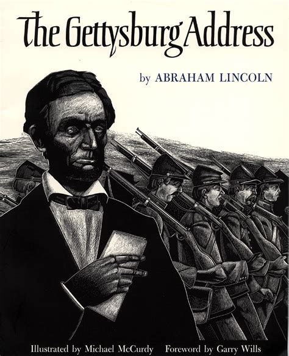

# The Emancipation Proclamation

## Introduction

Clara Barton’s story epitomizes core American values. She saw a great
need to tend the wounded on the battlefield, organized her own
supplies and team, and then proceeded to earn her nickname, “The Angel
of the Battlefield.” After the Civil War ended she established the
Missing Soldiers Office to help families locate soldiers who had not
returned from the war. Her final act of voluntary service to our
nation was founding the American Red Cross, where she served as
president for 24 years. She was one of the great social entrepreneurs
of the 19th century, one of the best illustrations of Alexis de Tocqueville’s
“voluntary associations.”

Her entrepreneurial drive was fueled by a remarkable work ethic. She
was fearless and indefatigable in her battlefield work during the
Civil War, mobilizing supplies and her team to assist at battlefield
after battlefield. She continued her work aiding soldiers for four
years after the war by writing tens of thousands of letters to their
families. And then she spent almost ten years persistently advocating for the founding of the American Red Cross before succeeding in 1881. At the age of 76 this
remarkable woman served as a volunteer in Cuba during the Spanish
American War. She didn’t retire as president of the Red Cross until
1904, at the age of 82.

Our story finds Clara Barton at the Battle of Antietam – not only the
worst single day battle of the Civil War for American casualties but
the worst single day battle in American history. While Clara Barton
brought the light of hope onto the battlefield, Abraham Lincoln used
Antietam as the opportunity he’d been waiting for to announce the
Emancipation Proclamation, setting America on the path to abolishing
slavery and living up to our ideal that “all men are created equal.”

---

## Book

Title: "To the Front! Clara Barton Braves the Battle of Antietam"
Author: Claudia Friddell
Illustrator: Christopher Cyr
Year published: 2022
Length: 40 pages

---

## Calendar

Monday:
 - songbook
 - text2

Tuesday:
 - geography
 - lantern

Wednesday:
 - "Vocabulary (before reading) [vocab]"
 - light

Thursday:
 - first-aid
 - scripture

Friday:
 - gruel
 - language

---

## American Heritage Songbook: Battle Hymn of the Republic {#songbook}

```metadata
toc: "American Heritage Songbook: _Battle Hymn of the Republic_"
time: 5 minutes
freq: daily
```

> Mine eyes have seen the glory of the coming of the Lord;
> He is trampling out the vintage where the grapes of wrath are stored;
> He hath loosed the fateful lightning of His terrible swift sword:
>
> His truth is marching on.
> Glory, glory, hallelujah!
> Glory, glory, hallelujah!
> Glory, glory, hallelujah!
> His truth is marching on.
{.nowrap}

The abolitionist Julia Ward Howe wrote the powerful and stirring words
to this song for the soldiers of the Union Army.  It is likely that
Union soldiers sang it at the battle of Antietam as it was published
six months before the battle took place.

Howe does not explicitly call out either the Union or the Confederacy
in her song, which undoubtedly contributes to it becoming a timeless
patriotic song. However, she makes it abundantly clear which side she
is on in the final verse.  Here is where she connects Jesus’s
sacrifice on the cross for our sins to the need for people to
sacrifice themselves to “make men free.”

> As He died to make men holy, let us live<sup>*</sup> to make men free,
> While God is marching on.
{.nowrap}

There are [many][song1] good [versions][song2] of the Battle Hymn of
the Republic [available][song3] on YouTube, [some with lyrics][song4]
and [some without][song5]. The lyrics can be a bit challenging for
younger singers because of the vocabulary, so you may want to focus on
just the first and last verses. Or possibly even simpler, just have
them learn the chorus.

<sup>*</sup> Originally, the lyric was “die” but most contemporary versions use “live.”

[song1]: https://www.youtube.com/watch?v=sfuLrny00t4
[song2]: https://www.youtube.com/watch?v=ORsNiReoCsw
[song3]: https://www.youtube.com/watch?v=Jy6AOGRsR80
[song4]: https://www.youtube.com/watch?v=q2LZ9cVRkDw
[song5]: https://www.youtube.com/watch?v=X3r52djSFVo

---

## Arts & Crafts: Make Your Own Lantern {#craft}

```metadata
time: 15 minutes
prep: 10-15 minutes
supplies: plastic bottle, modge podge, tissue paper, paint brushes, tea candles, string or, pipe cleaners
```

> Clara knows from darkness - with lanterns there is light. Clara
> believes from prayer - with light there is hope.


### Supplies
* Plastic bottle (with all wrappers removed and a large enough opening
  to place a light source in)
* Modge podge
* Paint brushes
* Tissue paper
* String or pipe cleaners
* Tea candles or (battery operated) tea lights or glow sticks
* Optional: scissors or other sharp tool

### Directions
1. Cut or tear the tissue paper into small squares or strips
2. Apply modge podge (Elmer’s glue may work as well, but needs to dry
   clear) to the bottle and then take the tissue paper squares and
   cover over the entire bottle. One can use only yellow tissue paper
   for more of a standard lantern look or a variety of colors.
3. Let dry.
4. Apply a coat of modge podge over the tissue paper to seal it in.
5. Let dry.
6. Create a handle for the lantern. Either punch holes in either side
   of the plastic bottle and thread a string through or attach a tight
   fitting string (or pipe cleaner) around the neck of the bottle and
   then attach a string (or pipe cleaner) handle by tying knots on two
   sides of this tight fitting string.
7. Insert light source and spread hope.

Note that glass bottles would also work. I stayed away from glass
bottles and real candles to make it a little safer to hand off to my
kids. We had a plastic bottle that had a very narrow opening so I cut
across the bottle at a wider point and then covered the sharp plastic
edge with masking tape. We bought battery operated tea lights from
Dollar Tree.

I was somewhat surprised at how accessible this craft ended up
being. My two-year-old applied some modge podge (with my guidance) and
started applying tissue paper. My older two kids were able to do much
of the modge podge/tissue paper portion without a ton of help.

See some variations here:
* [Kids "Rip and Stick" Camping Lantern Craft (using a recycled container!)][lantern1]
* [Easy Art for Kids - Make a Lantern - Picklebums][lantern2]

[lantern1]: https://www.thecrazyoutdoormama.com/kids-rip-and-stick-camping-lantern-craft-using-a-recycled-container/
[lantern2]: https://picklebums.com/easy-art-for-kids-make-a-lantern/

<br>
Three lanterns
{.center .caption}

---

## Geography: Border States {#geography}

```metadata
time: 10 minutes
supplies: U.S. puzzle
```

> On the evening of the 16th of September we reached the valley of
> Antietam.

Abraham Lincoln’s Emancipation Proclamation was an executive order
made in war time that freed all the slaves in Confederate States still
in a state of rebellion (Tennessee, one of the original slave states
to rebel, was already under Union control at the time Lincoln issued
the Emancipation Proclamation; it abolished slavery in October,
1864). Most Northern States had already abolished slavery.

However, after the Emancipation Proclamation there were still five
states where slavery was legal: Delaware, West Virginia, Kentucky,
Missouri, and Maryland (where the valley of Antietam was
located). These states are known as the Border States. Three of them
abolished slavery before the Civil War ended: Maryland (November,
1864), Missouri (January, 1865), West Virginia (February, 1865). The
remaining two, Delaware and Kentucky did not eliminate slavery until
forced to by ratification of the 13th Amendment on December 18, 1865
(oddly, we do not celebrate December 18th as a holiday).

For this activity, ask your kid(s) to assemble a jigsaw puzzle of the United States in three parts:

1. Union States that had abolished slavery prior to the Civil War:
   Maine, Vermont, New Hampshire, New York, New Jersey, Rhode Island,
   Connecticut, Massachusetts, Pennsylvania, Ohio, Indiana, Wisconsin,
   Illinois, Michigan, Minnesota, Iowa, Nebraska, California, Oregon,
   Nevada
2. Border States: Delaware, West Virginia, Kentucky, Missouri, Maryland
3. Confederate States: Virginia, North Carolina, South Carolina,
   Georgia, Florida, Tennessee, Alabama, Arkansas, Mississippi,
   Louisiana, Texas

You can also do this activity by using a coloring sheet of the United
States and asking your kids to use different colors for each of the
three categories above.

Then, ask your kid(s): why do we call those five states the Border
States?

---

## Famous American Texts: _The Gettysburg Address_ {#text2}

```metadata
time: 5 minutes
freq: daily
```

> ...that this nation, under God, 
> shall have a new birth of freedom —
> and that government of the people, by the people, for the people, 
> shall not perish from this earth.
{.nowrap}

While the Battle of Antietam marked the moral turning point in the Civil War, the Battle of Gettysburg, less than a year later, was decisively won by Union forces and was the beginning of the end for Confederate forces. The battle lasted three days, July 1-3, with enormous casualties on both sides. But it halted the Confederate invasion of the North and forced them to retreat back to the South.

Four and a half months later, on November 19, 1863, at the dedication of the Soldiers' National Cemetery at Gettysburg, President Lincoln delivered the most famous speech in American history. In just ten powerfully eloquent sentences he reminded us of the sacrifice of the men willing to die so that their country might live and that a country "conceived in Liberty, and dedicated to the proposition that all men are created equal" was worth dying for.

Consider having your children memorize either the fragment of the Gettysburg Address excerpted above or the very first sentence included in the Supplemental Reading activity below.

---

## Famous American Texts: _Emancipation Proclamation_ {#text1}

```metadata
time: 5 minutes
freq: daily
```

> **I do order and declare that all persons held as slaves within said
> designated States, and parts of States, are, and henceforward shall
> be free** .... And upon this act, sincerely believed to be an act of
> justice, warranted by the Constitution, upon military necessity, I
> invoke the considerate judgment of mankind, and the gracious favor
> of Almighty God.... - Abraham Lincoln

The Battle of Antietam marked a turning point in the Civil War. While
it was not a decisive victory for the Union forces, it was enough of a
victory for Abraham Lincoln to issue the Emancipation Proclamation
five days later, on September 22. Lincoln had prepared his
proclamation earlier but had withheld it until a Union victory because
he did not want it to appear that the Union was only issuing it
because they were losing.

Lincoln’s proclamation helped turn the Civil War into a moral crusade
against slavery. Britain and France, the two most powerful European
countries, had been on the verge of recognizing the Confederacy as a
separate country.  Both countries had already outlawed slavery; the
Emancipation Proclamation ensured they would not side with the
Confederacy as neither wanted to be perceived as supporting the
institution of slavery.

Practice reciting the first sentence, marked in bold above, with your
kid(s) until they have it memorized.

---

## Cooking: Cornmeal Gruel {#cookbook}

```metadata
time: 20 minutes
prep: 10-15 minutes
```

> “It’s a curious thing that happens when Clara feels Indian meal, not
> sawdust, packed around bottles. It’s a curious thing that happens
> when Clara finds salt and more meal stashed in the cellar. … Six
> large kettles were picked up and set over fires almost as quickly as
> I can tell it and I was mixing meal and water for gruel.  We made
> gruel, gruel, gruel.“

I modified the [following recipe][recipe]:

[recipe]: https://sandramervillehart.wordpress.com/2017/09/18/cornmeal-gruel-recipe/

### Ingredients
* 3 cups boiling water
* 2 tablespoons cornmeal (which is apparently the same thing as Indian meal)
* 2 tablespoons cold water

### Optional ingredients
* Heavy cream
* Sugar
* Cinnamon
* Ground ginger or nutmeg

### Directions
1. Put 3 cups of water in a pan on the stove and bring to a boil
2. Mix cornmeal with equal amounts of cold water
3. Add cornmeal mixture to boiling water. Reduce heat and simmer for
   at least 20 minutes.
4. Turn off heat and let gruel thicken. The longer you wait the
   thicker it will get.
5. Spoon out and serve.
6. Optionally, add additional ingredients (about 1-2 tablespoons heavy cream for
   the entire pot, 1-2 teaspoons sugar, several shakes of cinnamon and
   a bit less of ginger). These can be added to the entire pot or
   individually to bowls (scale down or just add to taste).

I had trouble getting my gruel to be thick enough initially (it was
basically grainy hot water). I added additional cornmeal and water
mixture (resulting in my adapted recipe above). It also thickened by
waiting longer after it was removed from the heat. The flavor was very
bland. My impression is that it likely provided soothing, some
hydration, and small amounts of salt and calories to the sick and
wounded. I found the optional ingredients important for flavor.  Not
the most delicious meal, but helpful in making the story more
tangible. Perhaps try the bland version and then add the optional
items for a slightly yummier experience.

Other recipes that I came across:
* [Gruel Recipes - Food For The Sick][recipe1]
* [Indian-Meal Gruel - Granula][recipe2]
* [Indian Meal Porridge - a recipe from Eating History][recipe3]
* [Cornmeal Gruel Recipe | Sandra Merville Hart][recipe4]

[recipe1]: https://vintagerecipesandcookery.com/gruel-recipes-food-for-the-sick/
[recipe2]: https://chestofbooks.com/food/recipes/Invalid-Cooking/Indian-Meal-Gruel-Granula.html
[recipe3]: http://eating-history.co.uk/recipes/indian-meal-porridge
[recipe4]: https://sandramervillehart.wordpress.com/2017/09/18/cornmeal-gruel-recipe/

---

## Science: Band-aid Adhesion {#science}

```metadata
time: 10 minutes
```

> "What are these cornhusks?"
> They are bandages.
{.nowrap}

Today we use small sticky bandages for minor cuts (rather than
cornhusks or other materials).  Are some bandages better than others?
Let's experiment to find out!  Below we outline how you can test which
type of bandage has the best adhesion by measuring how much weight
they can hold before pulling off.  However, there are many different
kinds of experiments you can do with bandages (e.g. which is stickiest
after getting wet, which surface is best for a bandage to stick to,
etc.).  Feel free to design and implement your own experiment.

### Supplies

- several types of bandages of similar size (we used Band-Aid flexible
  fabric, Band-Aid waterproof, Band-Aid kids cartoon bandages, and
  generic brand fabric bandages)
- fruit to adhere bandages to (we used oranges, but apples could also
  work)
- pails (we used plastic cups turned into buckets with strings - see
  balance activity in A More Perfect Union)
- strings and/or small hook to attach pails to band-aid
- weights (we used different sized water bottles)
- some way to suspend fruit (we extended two rulers from the edge of a
  countertop, using clamps to attach them to the countertop, and attached the Band-jAids to the fruit underneath in the gap between
  the rulers -- see photo below)
- small scale
- towel or other cushion
- Optional: paper and pencil

### Directions

1. Set up your fruit suspension (see photo below) and place towel underneath for a soft
   landing.
1. Select a bandage to start.  Place the bandage on the fruit with one
   side of the hook underneath the bandage.
1. Set up the fruit with the hook so that the hook is dangling by the
   bandage.  Put the pails on the other end of the hook (so they are
   suspended by the bandage-held hook).
1. Slowly add weights to the pails (counting for five seconds between
   adding weights).  Add until everything falls onto the towel.  Then
   measure how much weight the bandage held.
1. Repeat with other types of bandages.
1. Determine which bandage can hold the most weight.
1. Optional: graph your results.

<br>
Orange suspended between two rulers held by clamps
{.center .caption}

### Discussion

This is a great opportunity to discuss the scientific method.  Ask
your child(ren) for a hypothesis about what type of bandage they think
will hold the most weight.  Talk to your child(ren) about how to set
up a test, holding constant everything except for the one thing that
is being tested, and the importance of setting up a testing protocol.
Discuss what you learned from the results and ask how they might apply
this information in the future.  Would a certain type of bandage be
better or worse for certain types/locations of cuts?

<br>
{.center}

---

## Historical Re-enactment: Light in the Dark {#re-enactment-light}

```metadata
toc: "Re-enactment: Light in the Dark"
time: 10-15 minutes
supplies: Lanterns or flashlights or candles
```

> When I came back from the barn I went into the house where I saw a
> solitary light burning. The surgeon was sitting in one of those
> dark, dank rooms with two inches of candle by him, and his head on
> his hand, the picture of despair. ... I took him to the door, and
> told him to look towards the barn; it was like a garden illumination
> with chinese lanterns.  
> “What are they?” said he in amazement. 
> “Lanterns,” said I. 
> “Lanterns! Where did they come from?”
> “I brought them.  The men will be here in a few moments to light the
> house. You will have plenty of light, and plenty of assistance.
> Don’t despair in your good work, doctor.”
{.nowrap}

At night when it is dark, take your children into a room and turn off
all the lights. Ask them how they feel. Then light one candle or
lantern or turn on one flashlight. Ask them how they feel again and
how things have changed. Then light several more candles or lanterns
and see how the room and how people feel changes.

We used the lanterns that we had made for this activity (and a couple
of cell phone flashlights, but I think candles would be
better). Standing in the dark, my children both said that they felt
afraid. Interestingly enough, my husband walked in as we started this
activity and immediately turned on his cell phone flashlight offering
a great example of how he didn’t want to be in the dark either. As we
lit some more lanterns, the children loosened up and felt more
comfortable. After we had discussed the experience, my daughter
decided to play the game of trying to walk all around the room only by
the light of her lantern (and given the number of toys lying on the
floor was actually somewhat challenging).

---

## Historical Re-enactment: Make Your Own First-Aid Kit {#re-enactment-first-aid}

```metadata
toc: "Re-enactment: Make Your Own First-Aid Kit"
time: 30-40 minutes
prep: 30-60 minutes
supplies: Zip-lock bags, sharpies, Band-Aids, surgical tape, gauze, wipes, hand sanitizer, chewable Tylenol, Q-Tips, cotton balls
```

> Clara’s hands, like tools, dig deep to mend the broken.
> Clara’s hands, like prayers, hold hope to soothe the suffering.
{.nowrap}

Discuss what first aid is. Perhaps go through a first aid kit to get a
sense of what they typically include and how to use those items. We
pulled out the first aid kit that lives in our car and walked through
each item and how it might be used in an emergency setting. Another
option is to watch a short video that walks through a first aid kit
such as: [FIRST AID basics].

[FIRST AID basics]: https://www.youtube.com/watch?v=SKxQr49LV0Y

While going through the items, you can cover some basic first aid steps such as:

* Applying pressure to stop bleeding; cleaning and bandaging minor
  cuts and scrapes
* Rest, Ice, Compression, and Elevation (RICE) for a sprain
* Using tepid water to ease a burn
* Rolling someone into the recovery position when unconscious
* Dialing 911: what is an appropriate emergency and how to do it

Next, take turns being Clara Barton and a wounded soldier. We applied
some ketchup to the wounded soldier’s arm to represent a bleeding
wound. “Clara Barton” then took a folded paper towel (representing a
bandage or gauze) and applied pressure to the wound. Next “Clara” took
an elastic/cloth bandage and wound it around the “wound” to hold the
paper towel in place.

Finally, we made our own First Aid kits that the kids can take with
them when they are at a friend’s house or attend classes away from
home.

### Supplies
* Plastic zip lock bags or other (water proof) container
* Sharpies
* Stickers (optional)
* First aid supplies (varies depending on what you want in your kit. Below are some ideas)
    * Band-Aids of various sizes
    * wipes
    * hand sanitizer
    * gauze
    * antibiotic ointment
    * chewable Tylenol
    * list of emergency phone numbers
    * gloves/masks
    * adhesive tape
    * cloth/elastic bandage
    * instant ice packs
    * Q-tips
    * Cotton balls

### Directions:
1. Use sharpies and stickers to decorate and label the outside of the
   First Aid kit.
1. Fill the kit with various supplies.
1. Place the kit in a convenient location (backpack, car, closet).

Many of the items for the First Aid kit you may already have on hand
(bandages, wipes, etc.). We purchased most of our supplies from the
Dollar Tree, but most grocery stores or pharmacies should also
work. Making the kits can work for a wide age range depending on what
you include in them (my two-year-old proudly carried her First Aid kit
around the rest of the day). This was a nice opportunity to go over
some basics on how to handle common injuries that might occur on the
playground.

<br>
Bandaging a wounded soldier
{.center .caption}

---

## Supplemental Reading: The Gettysburg Address {#supplemental}

```metadata
time: 10 minutes
```

> Four score and seven years ago our fathers 
> brought forth on this continent, a new nation,
> conceived in Liberty, and dedicated to the 
> proposition that all men are created equal.
{.nowrap}


{.center}

**Title:** _The Gettysburg Address_

**Author:** Abraham Lincoln

**Illustrator:** Michael McCurdy

**Year Published:** 1995

**Length:** 32 pages

There are multiple illustrated versions of Lincoln's Gettysburg Address but all share one thing in common (other than the text): they are not as readily available at libraries or bookstores as the books we normally recommend. Michael McCurdy illustrates this version in stark black and white, each drawing (other than the first) a double-page spread; twelve drawings for ten sentences.

---

## Scripture: Psalm 43:3a {#scripture}

```metadata
time: 10 minutes
```

> Send forth your **light** and your truth, let them guide me.

The surgeon in the story needed both the physical light from Clara
Barton’s lanterns but also the light of the Lord to guide him and give
him hope in a hopeless situation. The scripture above can be a
reminder to your children to look to the Lord for light, wisdom, and
guidance when things turn dark. Use this as an additional memorization
exercise or instead of the Emancipation Proclamation excerpt above.

---

## Vocabulary {#vocabulary}

```metadata
time: 10 minutes
```

> I could succor the wounded until the medical aid and supplies should come up.

This module’s vocabulary words oscillate between terms of war and
terms of healing. Try introducing a couple of new words each
day. Before you start reading, introduce the words you’ve selected for
the day, define them, and then point them out during the reading.

Succor
: help, relief, aid

Wounded
: injured, hurt

Watch fires
: a fire at night to provide warmth to soldiers on guard against
  nearby enemies

Soothe
: relieve, comfort, reduce pain, calm

Artillery
: large weapons used for attacking enemies from a distance

Barrage
: continuous artillery attack to protect troops

Duel
: formal fighting between two individuals or groups

Despair
: to lose hope

Emancipation
: to free from bondage or slavery

---

## Writing: First Person Accounts and Poems {#language-arts}

```metadata
time: 10 minutes
```

> But here was to begin a new experience for me.  I was to ride 80
> miles in an army-wagon, and straight into battle and danger at that.

The author included many portions of Clara Barton’s own writing
(indicated by blue or brown italic font). Discuss first person
accounts. Have your child write up a first person account of an event
or new experience they have had.

The text by the author is frequently written almost as mini poems with
repeated phrases and stanzas. Point this out and discuss the rhythm
created by the parallel structure and repeated lines.

My son enjoyed pointing out Clara’s writing and determining what word
or line was repeated in the other sections of text. I was surprised
when my daughter noticed that the first three mini poems all started
with “Clara” (I hadn’t noticed that). It was fun to talk about how the
author structured each poem.

---

## History: Clara Barton Biography {#history}

```metadata
time: 5 minutes
```

> In my feeble estimation, General McClellan, with all his laurels,
> sinks into insignificance beside the true heroine of the age – the
> angel of the battlefield.

This [short, three-minute YouTube video][clara-barton-biography]
provides a biographical sketch of the life of Clara Barton.

[clara-barton-biography]: https://www.youtube.com/watch?v=SLwvH-k9JeU


