# Votes for Women!

## Introduction

The _Declaration of Independence_ is a revolutionary document. Its
most memorable phrases include “all men are created equal” and “they
are endowed by their Creator with certain unalienable Rights; that
among these are Life, Liberty and the Pursuit of Happiness.” No less
revolutionary was the phrase that followed: “Governments derive their
just powers from the consent of the governed.” This bottom-up
political philosophy ran counter to the top-down philosophy that has
reigned through most of human history.

From our founding, however, women had been excluded from participating
in our political process – local, state, and federal governments
exercised their “just powers” without women's consent. _I Could Do That!
Esther Morris Gets Women the Vote_ tells the story of a courageous
woman who helped secure the first statewide victory for women’s
suffrage. The fifty-year struggle culminated in the passage of the
19th Amendment to the Constitution in 1920, guaranteeing women the
right to vote and be full partners in America’s political process.

Also important are the other themes the author, Linda Arms White,
weaves into her story. Esther Morris, with her “I Could Do That!”
attitude, epitomizes the work ethic and self-reliance that are
important elements of American exceptionalism. Esther Morris is also
an undaunted, serial entrepreneur, who repeatedly opened her own
millinery businesses as she migrated west.


---

## Book

Title: "I Could Do That! Esther Morris Gets Women the Vote"
Author: Linda Arms White
Illustrator: Nancy Carpenter
Year published: 2005
Length: 40 pages

---

## Calendar

Monday:
 - songbook
 - text

Tuesday:
 - geography
 - craft

Wednesday:
 - "Vocabulary (before reading) [vocab]"
 - motif

Thursday:
 - tea party
 - scripture
 
Friday:
 - voting
 - science

---

## American Heritage Songbook: Sufferin’ Till Suffrage {#songbook}

```metadata
toc: "American Heritage Songbook: _Sufferin’ Till Suffrage_"
time: 3 minutes
freq: daily
```

_Schoolhouse Rock_ has an engaging and age-appropriate song and video
celebrating women’s suffrage and the passage of the 19th Amendment.

> Now you have heard of Women's Rights,
> And how we've tried to reach new heights.
> If we're "all created equal"... That's us too!
> Oh, we were sufferin’ until suffrage,
> Not a woman here could vote, no matter what age,
> Then the 19th Amendment struck down that restrictive rule.
> And now we pull down on the lever,
> Cast our ballots and we endeavor
> To improve our country, state, county,
> town, and school.
{.nowrap}

You can find it on [YouTube][shr] or Disney+.

[shr]: https://www.youtube.com/watch?v=CGHGDO_b_q0

---

## Arts & Crafts: Make Your Own Hats {#craft}

```metadata
time: 30-60 minutes
prep: 10-15 minutes
supplies: cardstock, hole punch, scissors, stapler, markers, string or ribbon
```

> When the ladies wanted hats to match the dresses, Esther designed
> and made those, too.  Soon, she thought about opening a millinery
> shop.

There are a lot of different options for making your own hat. I tried
to keep things in a similar style to Esther’s hats. [Here is a link
for paper plate Easter bonnets][hat1] and [here is one for tea party
hats][hat2]. However, we decided on two different approaches:

[hat1]: http://almostunschoolers.blogspot.com/2011/04/paper-plate-millinery-easter-bonnets.html?m=1
[hat2]: https://justonemomtrying.blogspot.com/2011/08/diy-tea-party-hats.html?m=1

### Supplies (Paper Hat)
* Cardstock or other stiff paper
* Hole punch
* Scissors
* Stapler
* Markers
* String or ribbon

### Directions (Paper Hat)
1. Take one sheet of paper and measure your child’s head, stapling the
   paper into a cylinder shape at the correct size.
2. Cut a brim for the hat. We did a shorter top-hat style brim for my
   son and a larger bonnet-style brim for my daughter.
3. Decorate hats with markers, stickers, etc.
4. Attach brim (tape or staplers).
5. Make a hole punch on either side of the hat.
6. Thread string or ribbon through the holes to enable the hat to be tied on.
7. Optionally add a ribbon around the base of the hat for style and more of a bonnet look.
8. See picture.

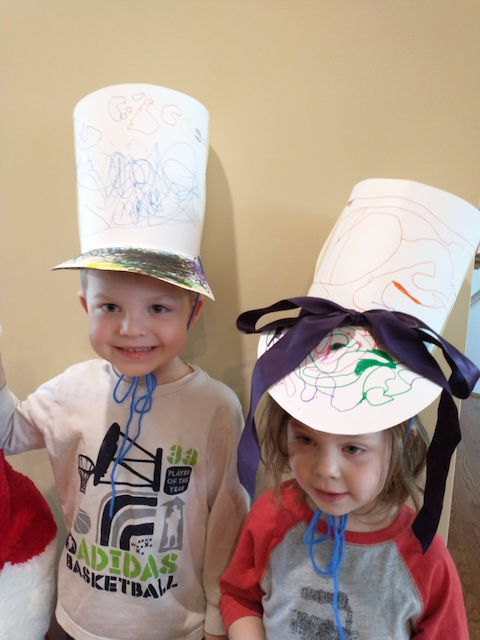<br>
Stylish paper hats
{.center .caption}


### Supplies (Felt Hat)
* Two sheets of felt, 8.5" x 11"
* Scissors
* Hot glue gun
* Ribbon
* Hole punch

### Directions (Felt Hat)
1. Take one sheet of felt and fold the long edge in on either side
   until they meet in the middle (forming a triangle shape at the
   top - see Figure A).
2. Fold the top of the triangle down to the edge of the previous
   fold (see Figure B). Hot glue gun this piece in place (see Figure C).
3. Cut a wide bonnet brim out of felt by trimming two triangles off the second piece of felt. Make the point of the triangle soft rather than a sharp point (see Figure D).
4. Hot glue to the first piece of felt (see Figure E).
5. Punch holes in the sides and thread ribbon through (you can knot
   the ribbon to hold it in place). See Figure F for your stylish, wide-brimmed felt hat!

<span>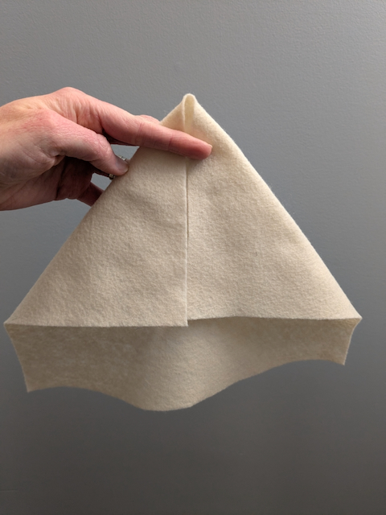</span>
<span>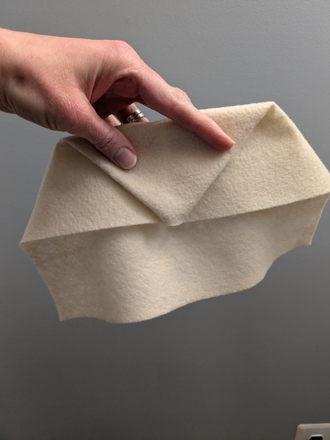</span>
<span>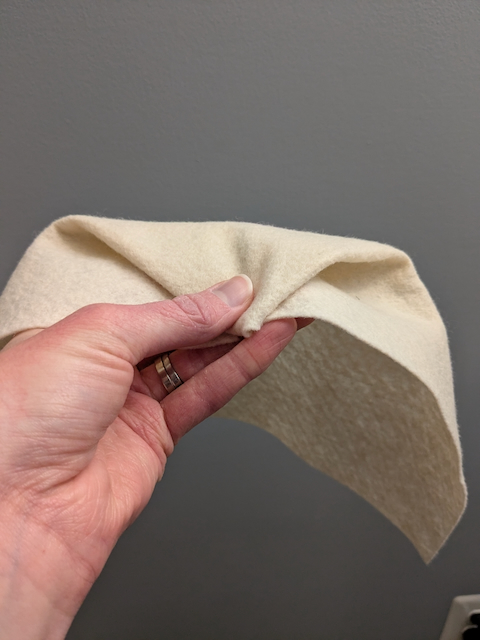</span>
<span>Figure A</span>
<span>Figure B</span>
<span>Figure C</span>
<span>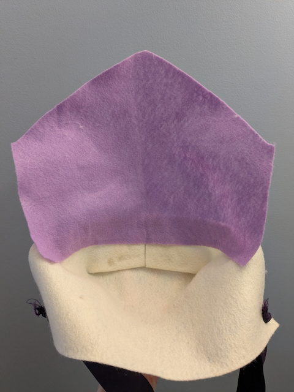</span>
<span>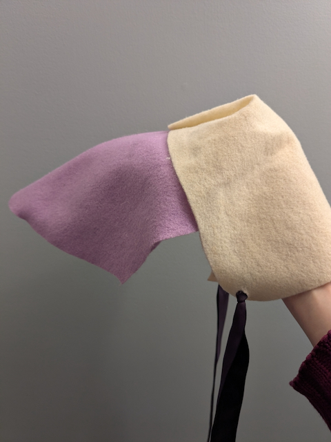</span>
<span>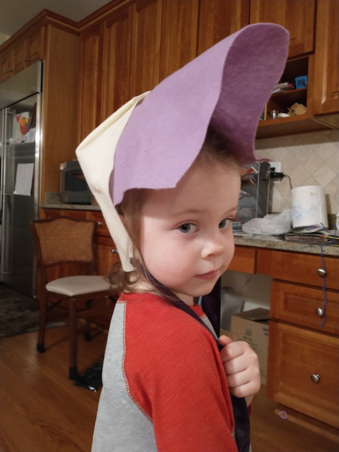</span>
<span>Figure D</span>
<span>Figure E</span>
<span>Figure F</span>
{.center .caption .grid3}

---

## Geography: Wyoming in 1869 {#geography}

```metadata
time: 10 minutes
supplies: U.S. puzzle
```

> When Esther was forty-six, she went with John to the presidential
> election polls and watched through the window while he voted. “You
> know,” she told him when he came out, “I could do that.”

Wyoming led the way in giving women the right to vote in 1869; the
Wyoming men who voted for women’s suffrage were more than half a
century ahead of the 19th Amendment. In 1870, Wyoming became the first
state with a female public official, when Esther Morris was appointed
justice of the peace. In 1893, Wyoming celebrated its role as a leader
in women’s suffrage by incorporating the motto “Equal Rights” into
their official state seal and their state flag. In 1924 Wyoming was
the first state to elect a female governor (Nellie Tayloe Ross). In
1960, Wyoming placed a statue of Esther Morris in the National
Statuary Hall Collection in the U.S. Capitol (each state gets to place
just two statues.)  Wyoming’s nickname is “The Equality State.”
 
In 1820, Esther was only six years old. How many stars are on the flag
on the second page? [23] Ask your child(ren) to start the puzzle of
the United States by placing those 23 states in their place (DE, PA, NJ, GA, CT, MA, MD, SC, NH, VA, NY, N, RI, VT, KY, TN, OH, LA, IN, MS, IL, AL, ME). By 1869,
when Esther was 55 years old and Wyoming’s legislature gave women the
right to vote, another 14 states had joined the United States. Ask
your child(ren) to show how the United States was spreading across the
West by adding those states to the puzzle (MO, AR, MI, FL, TX, IA, WI, CA, MN, OR, KS, WV, NV, NE). Wyoming became the 44th
state in 1890. Ask them to place the next six states in the puzzle
before finishing by placing Wyoming as the 44th (CO, ND, SD, MT, WA, ID).

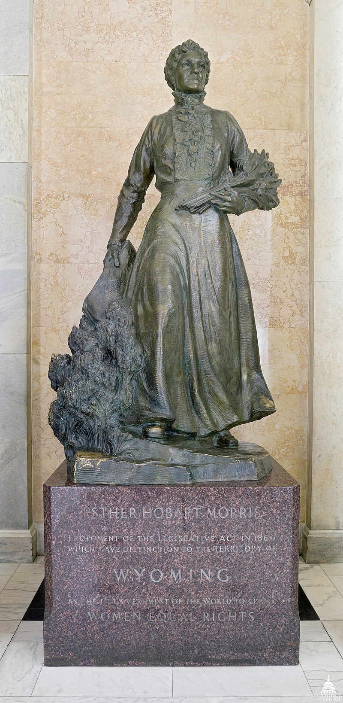<br>
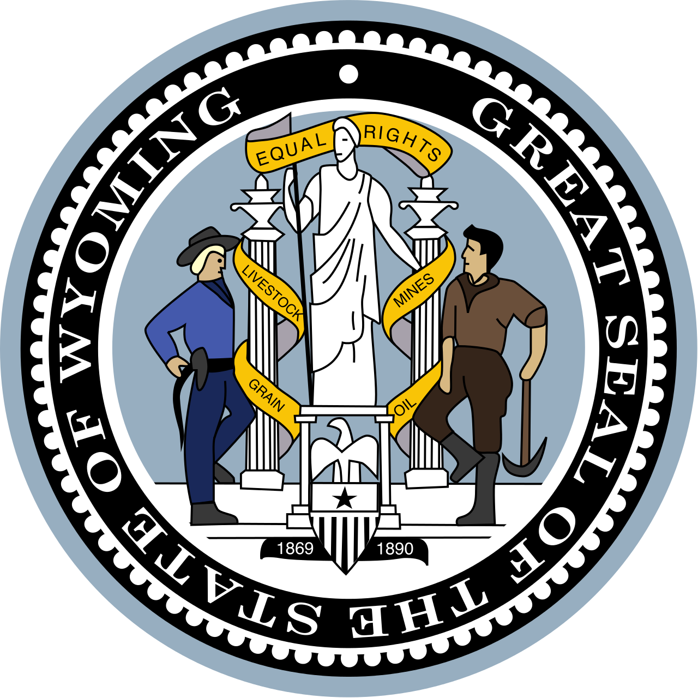
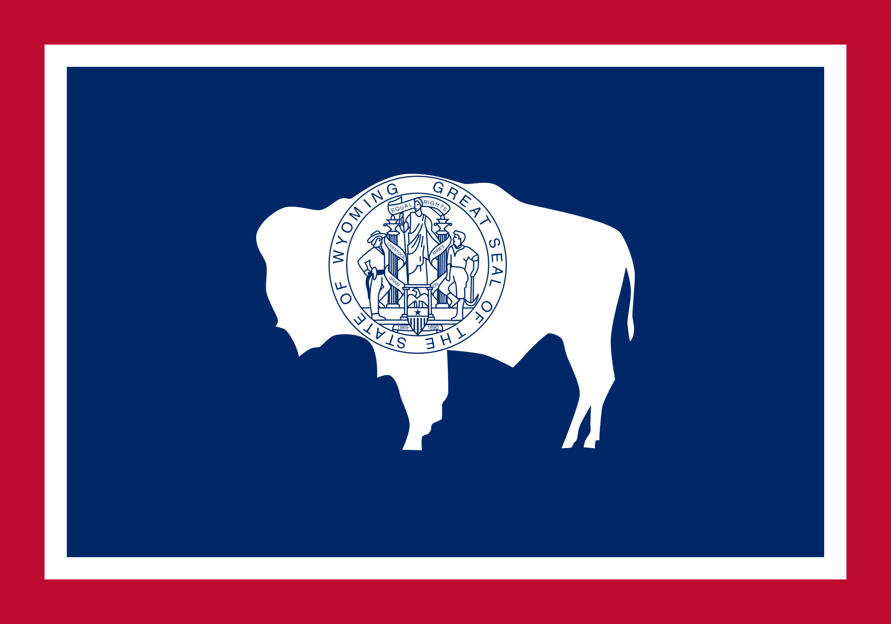
{.center}

---

## Famous American Texts: _The 19th Amendment_ {#text}

```metadata
time: 5 minutes
freq: daily
```

The 19th Amendment to the Constitution is short and to the point,
making it ideal for memorization for older children.

> The right of citizens of the United States to vote
> shall not be denied or abridged
> by the United States or by any state
> on account of sex.
{.nowrap}

Ask your kids: Do you know what state you were born in? Did women have
the right to vote in that state before the 19th Amendment to the
Constitution was ratified in 1920? The answer to this question is a
little nuanced.

Only 15 states, almost all in the West, had granted women full voting
rights: Wyoming (1869), Utah (1870), Washington (1883), Montana
(1887), Colorado (1893), Idaho (1896), California (1911), Arizona
(1912), Kansas (1912), Oregon (1912), Nevada (1914), New York (1917),
Michigan (1918), Oklahoma (1918), and South Dakota (1918). The graphic
below shows how women’s suffrage started in the West before spreading
to the East.

Another twelve states had granted women more limited suffrage; they
were granted the right to vote in presidential elections. Several of
them jumped on the bandwagon in 1919 during the ratification fight:
Illinois (1913), Nebraska (1917), Ohio (1917), Indiana (1917), North
Dakota (1917), Rhode Island (1917), Iowa (1919), Maine (1919),
Minnesota (1919), Missouri (1919), Tennessee (1919), Wisconsin (1919).


{.center}

---

## Cooking: Scones & Tea {#cookbook}

```metadata
time: 30-40 minutes
prep: 15-20 minutes
```

> When the candidates and guests arrived, Esther served them tea.

What is a tea party without something to nibble on? Below are recipes for berry scones and different kinds of tea sandwiches, all you need for a delightful tea party (see the Historical Re-enactment below).

### Easy Berry Scones Ingredients
- 2 cups flour
- 1/3 cup sugar
- 1 tablespoon baking powder
- 1/2 cup butter (slightly softened)
- 1 and 1/4 cup heavy cream
- optional: 1 cup mixed berries (fresh or frozen)

### Directions 
1) Preheat oven to 450 degrees Fahrenheit.
2) In a large bowl, mix together the flour, sugar, and baking powder.
3) Cut the butter into small pieces and add to the bowl. 
4) Cut the butter into the flour mixture. Either use a cutting tool or you can use a fork to sort of mash the butter in. It will be very crumbly.
5) Add in 1 cup of heavy cream and mix until just combined. The mixture will be very crumbly.
6) Add in the berries (no need to thaw if using frozen). If you are not adding berries you may need to add in a little more cream.
7) Form the dough into a ball (if this is impossible, add a little more cream). Flatten the ball (either by rolling it out or patting it) until if forms a circle about an inch or so tall. Cut into 8 pieces (like you are cutting a pie or pizza) and place on a lightly greased baking sheet.
8) Use a spoon or pastry brush to drizzle/brush cream on the 8 pieces.
9) Bake the scones for 15 minutes until the top is brown and a toothpick stuck in the middle of a scone comes out clean.
10) Eat on its own or with clotted cream.

The Easy Berry Scones recipe is modified from the [Sugar, Spice and Glitter website][recipe1].

[recipe1]: https://sugarspiceandglitter.com/kids-kitchen-easy-berry-scones-recipe/

### Cucumber and Cream Cheese Ingredients
- white bread
- cucumber
- cream cheese

### Directions
1) Cut the crusts off of the bread.
2) Slice cucumbers into thin disks.
3) Spread cream cheese on one slice of bread, cover with cucumbers, place another piece of bread over it.
4) Cut sandwich into small rectangles.

### Peanut Butter and Jelly Ingredients
- wheat bread
- peanut butter
- jelly

### Directions 
1) Cut the crusts off of the bread.
2) Spread peanut butter on one side and jelly on the other. Combine sides.
3) Cut sandwich into small rectangles.

### Ham and Cheese Ingredients
- wheat or white bread (whatever you prefer)
- sliced ham
- cheddar cheese
- mayonnaise

### Directions 
1) Cut the crusts off of the bread.
2) Slice the cheese.
3) Spread the mayonnaise on the bread.
4) Put the ham and cheese on and put another slice of bread on top forming a sandwich.
5) Cut sandwich into small rectangles.

### Egg Salad Ingredients
- white bread
- hard boiled eggs
- mayonnaise
- salt and pepper
- optional: paprika

### Directions 
1) Cut the crusts off of the bread.
2) Remove the shell from the eggs and mash with a fork in a bowl.
3) Add some mayonnaise (enough to make spreadable) and seasoning to taste.  Mixture will be very lumpy but should be spreadable.
4) Spread the egg salad on the bread, cover with another slice of bread.
5) Cut sandwich into small rectangles.

---

## Science: Tea Diffusion {#science-diffusion}

```metadata
time: 30 minutes
supplies: clear glass dish, tea bag, utensil
```

> In 1820, six-year-old Esther McQuigg studied her mother making tea. "I could do that," she said.

Diffusion is a process where highly concentrated molecules get spread out ("diffused"). The experiments below show how diffusion works when tea is brewed.

Experiment 1:
### Supplies
- hot water
- light colored or clear glass dish (ideally 9x13 or similar)
- tea bag
- utensil

### Directions
1) Pour hot water into clear glass dish.
2) Place tea bag into the center of the dish and place utensil on top of it to hold it down.
3) Watch the tea diffuse through the water in the dish.
4) For older students, this experiment can be made more quantitative by measuring the diameter of the diffused tea at various times after the experiment has begun.  Plot the data on graph paper with the diameter on the Y (vertical) axis and the time on the X (horizontal) axis.

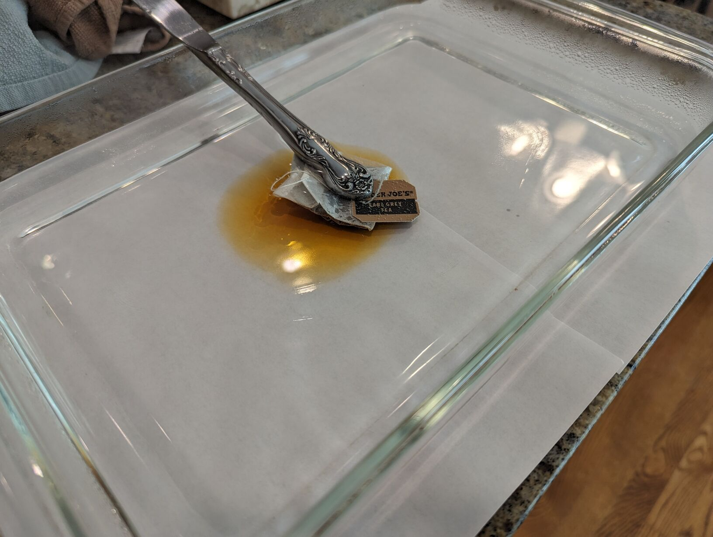<br>
Optional: Place white paper towel(s) under dish to more easily see the tea diffusing
{.center .caption}

Experiment 2:
### Supplies
- Four mugs or other small containers that can handle different temperatures of liquids (light colored or clear containers)
- three tea bags
- cold, room temperature, and hot water

### Directions
1) Fill one cup with cold water, two cups with room temperature water, and one cup with hot water.
2) Set aside one of the cups with room temperature water as a control.
2) At the same time, place a tea bag in each of the three remaining cups.
3) Observe how quickly (or slowly) the tea diffuses into the water in each cup.

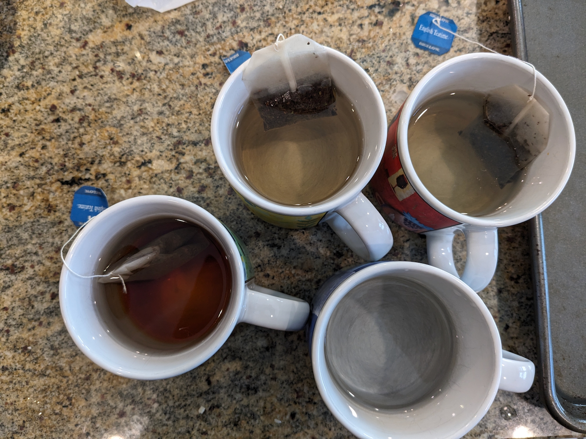<br>
The cup on the left has the hot water in it.
{.center .caption}

Discussion: Diffusion is the result of random motion of many tiny particles, known as "Brownian motion" (named after Robert Brown, the scientist who first described it, not after the color of tea as it diffuses).  The water molecules in the dish are constantly bouncing around in a random manner.  The water molecules can pass through the tea bag and pick up tea molecules, carrying them along in the same random way. Initially, the tea is concentrated entirely within the bag, but over time the concentration _diffuses_, or spreads out in a growing circle. At the beginning, almost every direction a tea molecule might go will take it outside the circle, so the circle expands quickly. Later as the circle has grown, the tea molecules spend more time in the already-visited inside parts of the circle and the expansion slows down. The speed of diffusion is determined by the speed of the bouncing water molecules, which is in turn determined by the temperature: higher temperatures mean faster motion. This partly explains why we brew tea with hot water instead of cold water: cold-brewing is possible, but it takes significantly longer to diffuse the tea throughout the entire mug.

---

## Historical Re-enactment: Voting {#re-enactment-voting}

```metadata
toc: "Re-enactment: Voting"
time: 10-20 minutes
```

> Esther smiled. She turned to the candidates.  “Then, would you, if
> elected, introduce a bill in the legislature that would allow women
> to vote?”

There are many ways to illustrate voting. A very simple one that we
used with our kids mimicked women’s suffrage. We decided to vote on
which restaurant to order our dinner from. We made ballots with the
three pre-selected alternatives (two restaurants and a home-cooked
spaghetti dinner). Before distributing the ballots we asked the older
kids:

* Should their 18-month-old sister vote? (They decided “no” because
  she couldn’t talk or write yet.)
* Would it be fair if we only counted the votes from the boys? (They
  decided “no” on that one also.)
* Would it be fair if we only counted the votes from the girls? (Our
  four-year-old daughter was okay with that but relented after some
  lobbying by her brother.)

We did the votes both ways and, unsurprisingly, the boys voted for a different restaurant than the girls. After the votes were tallied, we had two more votes to illustrate the
“tyranny of the majority” and why some decisions were inappropriate
for voting.

* The first vote was to decide who should pick up dinner. Rather than
  a secret ballot, we counted to three and asked everyone to point to
  who should pick up dinner. With a little pre-planning, the adults
  all pointed to the six-year-old. That elicited an immediate protest:
  “I can’t drive yet!” We discussed how voting was not a fair way to
  select (or force) someone to do something they weren’t willing or
  able to do. However, voting would be an appropriate way to select
  one person when multiple people had volunteered for a job.
* The second vote was to decide who should pay for dinner. Again, we
  counted to three but this time we pointed at the four-year-old. She
  subverted the lesson by saying, “Okay, I have money in my piggy
  bank.” We thanked her for her generosity and then pointed out that
  it wasn’t fair for people to vote to force other people to pay for
  things they hadn’t volunteered to pay for.

---

## Historical Re-enactment: Have Your Own Tea Party {#re-enactment-tea-party}

```metadata
toc: "Re-enactment: Have Your Own Tea Party"
time: 30-45 minutes
prep: 15-20 minutes
supplies: regular or childsized china tea set, loose tea leaves, strainer, tea kettle, sugar, cream or milk
```

> Esther invited the two men running for the territorial legislature
> to her house to speak to the citizens.  Then she sent out
> invitations to the most influential people in the territory: “Come
> for tea, and talk to the candidates.”

The formal tea party is featured multiple times in this story. This is
a great opportunity to include extended family members, family
friends, or other homeschooling families. You can invite them for a
casual tea party or a more formal affair by asking them to dress
up. At the very least, the kids can wear the hats they made if they
did the “Make Your Own Hat” activity.

To imitate Esther’s tea parties, try making the tea using tea leaves
and pour using a strainer.

### (Ideal) Supplies

* Child-sized (or regular) china tea set
* Loose tea leaves
* Strainer
* Tea kettle or other way to boil and pour water
* Scones [see Cooking activity, above]
* Tea sandwiches [see Cooking activity, above]
* Sugar
* Cream or milk
* Hats

Set the table for tea: tea cups and saucers, (fancy) table cloth, spoons, sugar, cream, snacks. Boil water.
Have the children put tea leaves into a serving pot and then watch as you pour the boiling water over
them. Let steep for a few minutes. Have the children set the strainer over a tea cup and pour the tea
through the strainer (which should collect the tea leaves). Add sugar and cream to taste.

Enjoy tea and snacks in your stylish hats. Have the kids re-pour tea as needed.

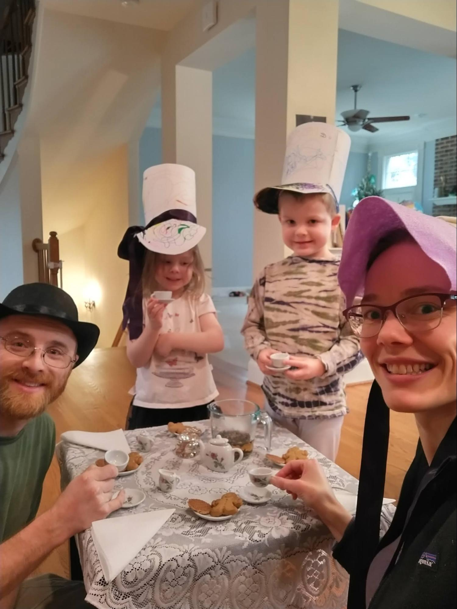
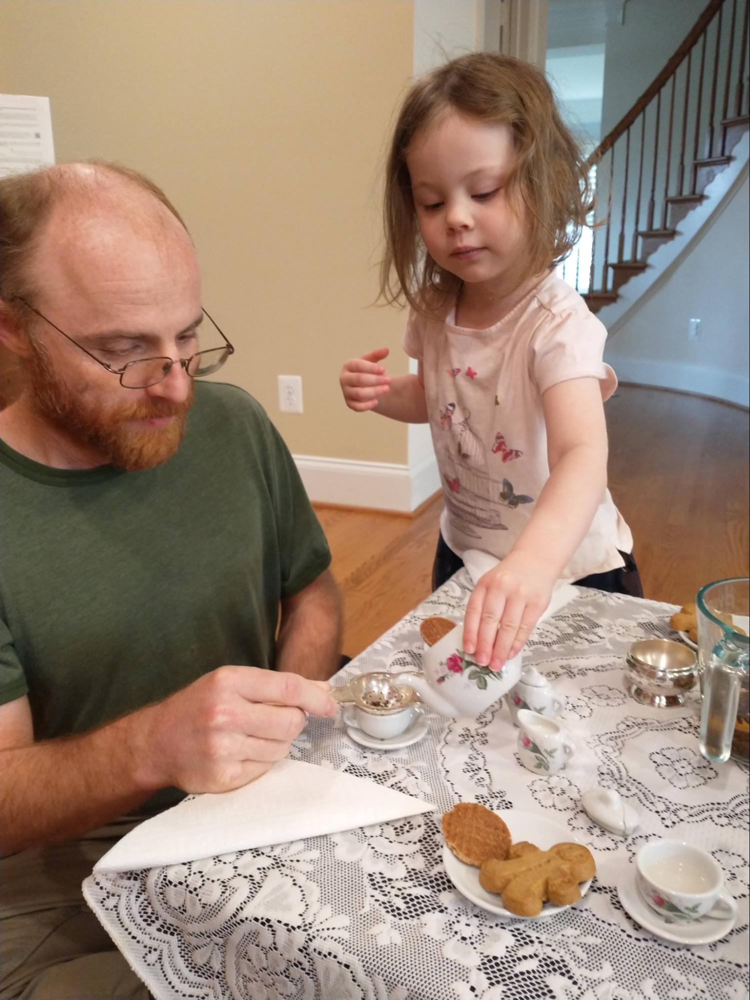
{.center}

---

## Supplemental Reading: _Marching With Aunt Susan_ {#supplemental}

```metadata
time: 10 minutes
```

>"You can help me get ready for the suffrage tea,” Mama said. “Aunt Mary will be arriving soon with our guest of honor, Miss Susan B. Anthony.”
At the tea, everybody swarmed around Miss Anthony. They called her Aunt Susan, even though they weren’t related to her.
{.nowrap}

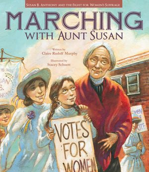
{.center}

**Title:** _Marching With Aunt Susan_<br>
**Author:** Claire Rudolph Murphy<br>
**Illustrator:** Stacey Schuett<br>
**Year Published:** 2011<br>
**Length:** 36 pages

This true story takes place in 1896, more than a quarter century after women got voting rights in Wyoming Territory. Ten-year-old Bessie Pond and her mother meet Susan B. Anthony (“Aunt Susan”), a leader in the Women’s Suffrage movement for over 40 years at the time of the story. Aunt Susan has come to Berkeley, California to advocate, organize, and march in favor of a California referendum that will grant full voting rights to women. Young Bessie and her mother join the movement, marching with Aunt Susan. By now several western states have granted voting rights to women: Wyoming, Utah, Colorado, Idaho, and Washington. 

Sadly, the 1896 referendum in California is defeated (it takes until a 1912 referendum passes for California women to gain their right to vote). The story ends on a positive note as the campaign changes the dynamics in the Pond family. It also illustrates the grit, determination, and perseverance of women who rallied peacefully for decades, endured harassment and many legislative defeats, before finally winning the right to vote nationwide.

The illustrator has a little fun with the protest march. Make sure your children notice how the banner that Bessie and her friend Rita are carrying changes from one page to the next.

---

## Scripture: Proverbs 31:25-26 {#scripture}

```metadata
time: 10 minutes
```

> She is clothed with strength and dignity; she can laugh at the days to come. 
> She speaks with wisdom, and faithful instruction is on her tongue.

The final section of Proverbs describes the "wife of noble character." Much of the description could apply to both men and women. Certainly everyone should aspire to speak (and vote) with wisdom. As homeschooling parents, as mothers and fathers, this scripture is particularly apt as we strive to provide "faithful instruction" to our children.

Ask your children to memorize and recite this scripture. With your older children, ask them what it means to be "clothed with strength and dignity."

---

## Vocabulary {#vocabulary}

```metadata
time: 10 minutes
```

> Esther started attending abolitionist meetings at her church.

The author uses words about different kinds of stores and places with which the young reader might not
be familiar: millinery, saloon, polling place. In addition, there are words associated with politics that may
be unfamiliar: abolitionist, proclamation, legislature, polling place, and suffrage. It’s always good to see
how much your child(ren) can pick up from the context of the story before asking them if they know
what the words mean.

Millinery
: a shop that sells hats

Abolitionist
: a person who worked to end slavery

Proclamation
: a public and official announcement

Legislature
: the branch of government with the power to make or change laws

Polling Place
: where voters cast their votes in an election

Suffrage
: the right to vote in public, political elections

Entrepreneur
: a person who organizes and starts a business, usually with considerable risk of failure

---

## History: Family Connections {#fam-history}

```metadata
time: 10 minutes
```

> On September 6, 1870, one year after her tea party, Judge Esther Morris put on her best dress and walked with her husband, John, and her sons down the dusty street to the polling place. She would be one of a thousand Wyoming women voting that day, the first ever given that right permanently by any governing body in the United States. 

Trace back your family history and share with your children which of your great-grandmothers was the first to vote. What state did they live in and when did it grant women the right to vote? Were they involved in the Women’s Suffrage movement?

Help your children draw a family tree that connects them to their first female ancestor who voted in a presidential election. If you aren't sure, assume she voted in the first presidential  election after her state granted women voting rights. Bonus question: who won the presidency the year she voted?

---

## Art: Motif {#art}

```metadata
toc: "Art: Tea Party Motif"
time: 10 minutes
```

> Esther strained the tea into cups, one for her mother, one for herself.

An artistic motif is an element or theme that is repeated throughout a
story, art, or music. In _I Could Do That!_ the author, Linda Arms
White, begins the story with Esther learning to make and serve
tea. Much later in the story Esther hosts a dramatic tea party where
she first proposes that women in Wyoming should be able to vote.

The illustrator, Nancy Carpenter, brings her own artistic flair to
this motif. Ask your kids to describe the pattern painted on the
teapot and teacups in the early pages. Do you notice how it is reinforced in
the first four pages, culminating in the two-page illustration on the
death of Esther’s mother? Then ask them: is there any place else in
the story where the flowered teapot and teacups are used? Show them
how the author and illustrator work together, combining their words
and pictures, to create a powerful motif that comes together at a
crucial point of the story.

---

## Civic Culture: Civil Discourse {#discourse}

```metadata
time: 10 minutes
```

> As they walked, John, who still didn't think women should vote, tried to coach her on which candidates and issues to vote for.

In both _I Can Do That!_ and _Marching With Aunt Susan_ the issue of women's suffrage divides families. Esther Morris's husband John did not think women should vote. The father of Bessie Pond's friend, Rita, also did not support voting rights for women. Family relationships are more important than political issues but people sometimes forget that. Discuss with your children how  to "agree to disagree" and respect each other's rights to their own opinion. Point out how Esther Morris politely but firmly stood her ground.

---

## Math: Count the Hats {#math}

```metadata
time: 10 minutes
```

> Esther opened another hat shop.

Esther was a serial entrepreneur. She opened up her first hat shop, to
the shock of her fellow citizens, in Oswego, New York. She opened her
second one after she moved to Illinois, and she opened her final
millinery in South Pass City, Wyoming.

To help re-engage your kids in the story after a reading or two, ask
them to count how many hats are on each page. At the end, ask them
which page had the most hats? Which page had the most interesting
hats? Which hat is their favorite? Why did one woman faint and another
cover the eyes of her daughter when Esther opened her first shop?
