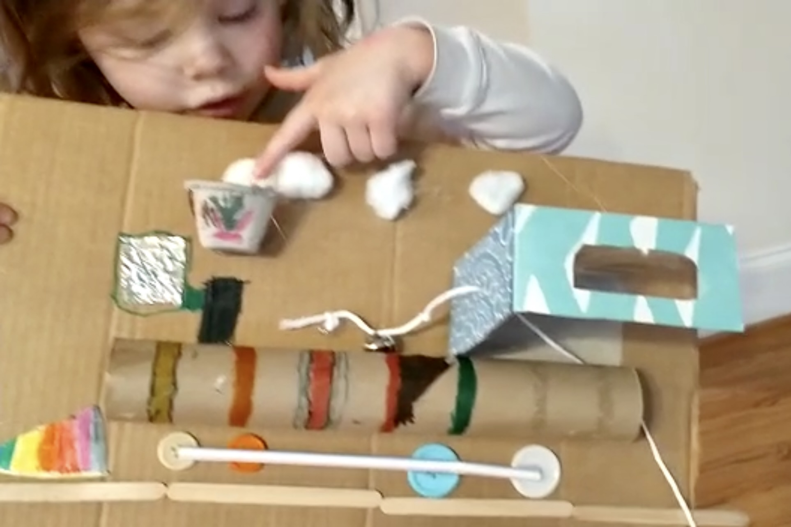
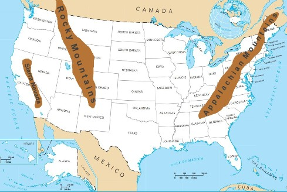
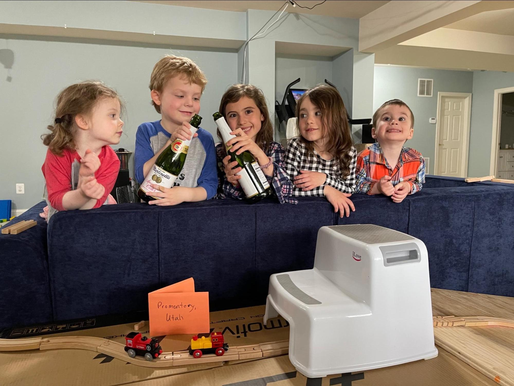
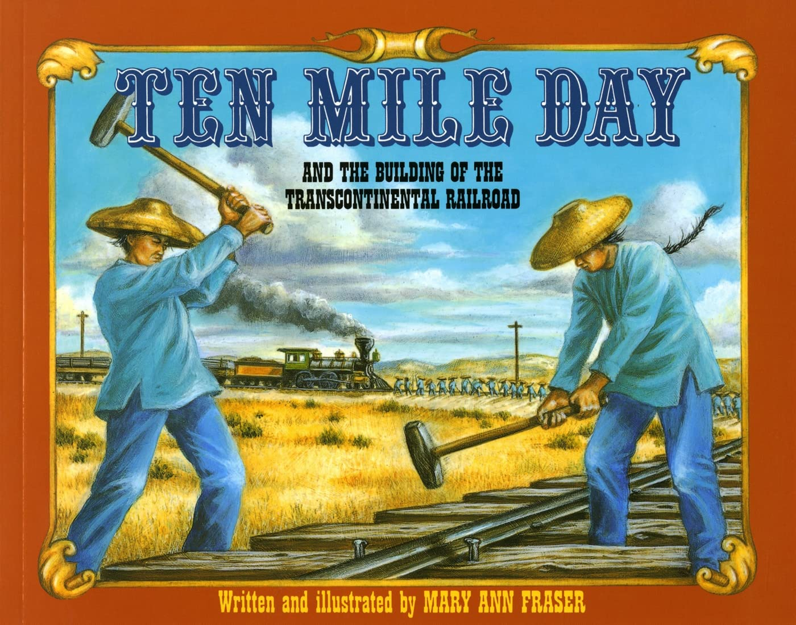

# Connecting East and West

## Introduction

Building the first transcontinental railroad was one of the most
monumental engineering feats of the 19th century. It required a
visionary belief that it could be done, an act of Congress in the
middle of a Civil War, the entrepreneurial drive of many businessmen,
and the engineering and management skill to marshal the tens of
thousands of workers needed to build an iron road across America’s
frontier that would connect the eastern half of our country with the
western half.

Congress provided powerful incentives to build it: for each mile
completed, the company received grants of government land they could
sell. Is it any wonder that the Central Pacific and Union Pacific, the
two companies formed to build the railroad, competed to see who could
build their section faster? If the CP built more miles than the UP
then they would earn a bigger reward. No one should be surprised that
this massive project was completed a year ahead of schedule and five
years before Congress’s deadline.

The fierce competition between the two companies also incentivized
them to ignore their racial and ethnic prejudices. Chinese immigrants
made up about 90% of the CP’s workforce while the despised Irish
Catholics made up the bulk of the UP’s workforce. Despite the
prejudices against them, America’s ideals still represented a land of
opportunity that attracted immigrants from around the world.

---

## Book

Title: Locomotive
Author: Brian Floca
Illustrator: Brian Floca
Year published: 2013
Length: 64 pages

---

## Calendar

Monday:
 - songbook
 - geography

Tuesday:
 - text
 - craft1

Wednesday:
 - "Vocabulary (before reading) [vocab]"
 - science

Thursday:
 - re-enactment
 - culture
 
Friday:
 - writing
 - scripture

---

## American Heritage Songbook: Canadian Railroad Trilogy {#songbook}

```metadata
toc: "American Heritage Songbook: _Canadian Railroad Trilogy_"
time: 5 minutes
freq: daily
```

> There was a time in this fair land when the railroad did not run
> When the wild majestic mountains stood alone against the sun
> Long before the white man and long before the wheel
> When the green dark forest was too silent to be real
>
> And when the young man's fancy was turnin' to the spring
> The railroad men grew restless for to hear the hammers ring
> Their minds were overflowing with the visions of their day
> And many a fortune won and lost and many a debt to pay
>
> For they looked in the future and what did they see
> They saw an iron road runnin' from the sea to the sea
> Bringin' the goods to a young growin' land
> All up through the seaports and into their hands
{.nowrap}

While this song is titled _Canadian Railroad Trilogy_, it paints a
lyrical picture of the building of a transcontinental railroad that
could equally apply to America. The first part describes the beauty of
the land before industry and the railroad, “when the wild majestic
mountains stood alone against the sun.”  As Wikipedia notes, this
section starts slow and “picks up speed like a locomotive building up
a head of steam.” The second part segues to the vision for opening up
the land via “an iron road runnin’ from the sea to the sea.” The final
part pays tribute to the “navvies,” the laborers who did the back
breaking work to build the railroad, “swingin’ our hammers in the
bright blazing sun.”

There are a couple of [good videos][song1] on YouTube that [show
photos][song2] of all three parts of the trilogy, including historical
photos of the navvies building the railroad. The Canadian Broadcast
Corporation commissioned Gordon Lightfoot to write the song to
celebrate Canada’s centennial in 1967. It became one of his signature
songs and is considered by some the best Canadian folk song ever
written. [This version][song3], done as a tribute to Gordon Lightfoot,
combines live performers with videos of the railroad being built in
the background.

[song1]: https://www.youtube.com/watch?v=tGiYI3ercf8
[song2]: https://www.youtube.com/watch?v=Yzo6Otpgj-E
[song3]: https://www.youtube.com/watch?v=bboUc6UJkxs

---

## Arts & Crafts: Build Your Own Locomotive {#craft1}

```metadata
time: 30-60 minutes
prep: 15-20 minutes
supplies: cardboard, hot glue gun, straws, craft sticks, cotton balls, paper towel roll, egg carton, craft buttons, markers
```

> Here is how this road was built,
> with a grunt and a heave and a swing,
> with the ring of shovels on stone,
> the ring of hammers on spikes:
> CLANK, CLANK, CLANK!
{.nowrap}

Coloring sheets: Here are a [couple][cs1] of [different][cs2] coloring
sheets to get your young artists warmed up!

[cs1]: http://www.usa-printables.com/Events/19th_century/1800-events-029.htm
[cs2]: http://www.usa-printables.com/Events/19th_century/1800-events-027.htm

### Supplies

* Flat sheet of cardboard for backing (can cut out the side of a box)
* Paint or markers
* Hot glue
* Various household items such as:
    * Egg carton
    * Kleenex box
    * Cotton balls
    * Aluminum foil
    * Paper towel roll
    * String
    * Bell
    * Craft sticks
    * Straws
    * Small boxes
    * Muffin cups / condiment cups
    * Craft buttons
    * Construction paper
    * Whatever items you have on hand

### Directions
1. Cut a front grill out of construction paper or muffin cup or condiment cup
2. Cut a small box (or part of a Kleenex box) to make the cab. Cut out a window and a small opening for bell string (if including the bell)
3. Cut out an egg carton section to form a smokestack
4. Color (with paint or markers) above items
5. Hot glue above items to cardboard backing
6. Hot glue craft sticks as track, buttons and straws for wheels, aluminum foil for lantern, and string for bell (I hot glued a knot in the string, then put on the bell, made a smaller knot to keep the bell from falling off, and then slipped the string through the cab so the bell will actually ring when gently tugged)
7. Hot glue cotton balls for steam
8. Color (with markers or paint) additional train or background items


{.center}

Note that there are [many][craft1], many [different][craft2] potential
train crafts. We have done both the [shoe box train][craft3] (Kleenex
boxes work as well) which fits small stuffed animal passengers very
well and also the egg [carton train][craft1]. <!-- NOTE: same link -->

[craft1]: https://craftulate.com/egg-carton-steam-train-craft/
[craft2]: https://sugarspiceandglitter.com/steam-the-little-engine-that-could/
[craft3]: https://funfamilycrafts.com/shoebox-train-craft/

---

## Arts & Crafts: Build Your Own Train {#craft2}

```metadata
time: 20-30 minutes
prep: 5-10 minutes
supplies: tissue boxes, string,
```

> insert quote here

### Supplies

* Empty tissue boxes (2-6)
* String

### Directions
1. Punch a hole

---

## Geography: Mountain Ranges {#geography}

```metadata
time: 10 minutes
supplies: U.S. puzzle
```

> Thus rivals as well as partners in their great enterprise, the
> Central Pacific and Union Pacific send their work crews racing
> together from West and East.

The three greatest mountain ranges in the United States are the
Appalachians in the east and the Rocky Mountains and Sierra Nevada in
the west. All three ranges run north and south, dividing the east from
the west. The Appalachians are significantly smaller than the other
two – the highest peak is 6,604 feet.

The highest peaks in the Rockies and the Sierra Nevada are more than
twice that high; Mount Whitney, in the Sierra Nevada range, is the
highest peak in the continental United States at 14,505 feet. The
transcontinental railroad had to cross both these mountain ranges. The
Union Pacific, coming from the east, had to cross the Rockies and the
Central Pacific, coming from the west, had to cross the Sierra Nevada.


{.center}

Ask your kids to look at the map on the inside cover of
_Locomotive_. Which railroad, the Union Pacific or the Central Pacific,
built the most miles of railroad track? Why do you think one railroad
built significantly more miles of track than the other?

There is a narrow cross-sectional map underneath the larger map on the
inside cover. This map illustrates the different challenges
confronting the two railroad companies. The Union Pacific, starting
from Omaha, Nebraska, had a nice gradual climb to the Rockies. The
Central Pacific, starting from Sacramento, California, faced the
enormously steep Sierra Nevada. They had to dynamite their way through
granite to build 15 tunnels.

To illustrate how the transcontinental railroad connected the east and
the west, get a jigsaw puzzle of the United States and do the
following:

1. Assemble all the eastern and midwestern states up to a line marked
   by Minnesota, Iowa, Missouri, Arkansas, Louisiana.
2. Assemble the west coast states of Washington, Oregon, and California
3. Finally, bridge the east and west states by inserting the states
   where the continental railroad was built: Nebraska, Wyoming, Utah,
   Nevada (and California, which is already in place).

---

## Famous American Texts: The Golden Spike {#text}

```metadata
time: 5 minutes
freq: daily
```

> May God continue the unity of this Country as this Railroad unites
> the two great Oceans of this world.

The sentence above was inscribed on the Golden Spike used to
commemorate the completion of the transcontinental railroad at
Promontory Summit, Utah on May 10, 1869. East met West and a journey
from New York to San Francisco that used to take six months could now
be done in about a week. The inscription is also a reminder of
America’s E Pluribus Unum motto: “Out of many, one.”

While the Golden Spike is the most famous, there were actually three
other ceremonial spikes driven that day. All four were donated to mark
the historic occasion of connecting the country with an iron road – an
“engineering marvel” that papers called the “eighth wonder of the
world” at the time. The San Francisco News Letter donated a second,
lower-quality golden spike with the inscription: “With this spike the
San Francisco News Letter offers its homage to the great work which
has joined the Atlantic and Pacific Oceans.” The state of Nevada
donated a silver spike without an inscription. And the Territory of
Arizona (not yet a state) donated a spike made of silver and topped
with gold inscribed, “Arizona presents her offering to the enterprise
that has banded a continent and dictated a pathway to commerce.”

When the Golden Spike was hammered in, the word DONE was sent by
telegraph across the country.  Fireworks exploded, cannons roared,
champagne glasses were raised, and the Liberty Bell rang out to mark
the occasion.

To remind your kids of this momentous occasion, ask them to memorize
the inscription on the Golden Spike.

---

## Cooking: Strawberry Shortcake {#cookbook}

```metadata
time: 20-30 minutes
prep: 10-15 minutes
```

> And if you’re bored, if you’re hungry, there is the “butch” – a boy
> who walks the aisle and sells books, maps, magazines, yesterday’s
> paper, **fruits** and candies, soap and towels, coffee, tea, sugar,
> hash, beans, bacon, and all the cigars you can smoke.

The ancestors of today’s strawberry were a tiny but flavorful berry
native to Virginia and a large but bland berry native to Chile. They
were accidentally cross-bred in the 18th century but a version that
would grow in American soil wasn’t developed until the 1840s. And then
“Strawberry Fever” swept America. From 1858 to 1870, a 12-year period
that saw the first transcontinental railroad built, strawberries
commanded premium prices. While we don’t know if the “butch” sold
strawberries to railroad passengers, he might have.

Strawberry Shortcake became an iconic American dessert. The sweeter
variety uses angel food cake as the shortcake and was more prevalent
in the northern states. The southern states favored a buttermilk
biscuit for the shortcake. While not raised in the south, our
traditional family recipe for Strawberry Shortcake is based on the
buttermilk biscuit.

### Ingredients

* 2 cups flour
* 4 teaspoons baking powder
* ¼ teaspoon salt
* ¼ cup sugar
* ½ cup margarine/butter (softened)
* 1 egg
* ⅔ cup milk

### Directions
1. Mix flour, baking powder, salt, sugar, and margarine/butter to make
   thick dough
2. Break egg and drop it into cup, beat, and fill with milk to 1 cup
   level
3. Add egg and milk mixture to dough, mix
4. Divide into two greased pie tins
5. Bake at 400-425 degrees for 15-20 minutes until golden brown
6. Serve hot with strawberries and half-and-half
7. Beware, this recipe may be habit forming!

---

## Science: Steam Power {#science}

```metadata
time: 15-20 minutes
prep: 30-60 minutes
supplies: tea kettle (or covered pot)
```

> The sounds of the engine surround him:
> the rhythm of pistons, pounding like hammers,
> the drivers drumming the rails,
> the smoke and the steam rushing up through the stack:
> CHUG-CHUG CHUG-CHUG CHUG-CHUG!
{.nowrap}

Brian Floca does not waste any space in _Locomotive_. Inside the front
cover, he illustrates the geography, map, and political history of the
first transcontinental railroad. Inside the back cover, he illustrates
the science and engineering that power the locomotives of that era.

The upper left-hand corner of the back cover illustrates a simple
experiment you can do with your kid(s) to show them the basic
principle of steam power. Water, when heated, turns to steam which
takes much more space than the liquid water. If the expansion into
steam is confined to a small space it exerts a force. That force can
be used to lift the lid on a covered pot, make a tea kettle whistle,
or even power a locomotive that pulls an entire train.

1. Boil water in an open pot. Point out the steam rising and vanishing
   without exerting any pressure
2. Boil water in a teapot (preferably one that whistles to announce
   that water is boiling). Point out that the steam is making the
   teapot whistle.
3. Alternatively, place a cover on the open pot. The steam will
   periodically lift the pot, demonstrating the force it exerts.
4. Serve yourself and the kid(s) some tea and discuss how simple
   processes can be harnessed to accomplish big things.

---

## Historical Re-enactment: Build Your Own Transcontinental Railroad {#re-enactment}

```metadata
toc: "Re-enactment: Build Your Own Transcontinental Railroad"
time: 20-60 minutes
prep: 20-30 minutes
supplies: toy railroad tracks and locomotives (Brio, Hape, etc.)
```

> Here is a road
> made for crossing the country,
> A new road of rails made for people to ride.
{.nowrap}

This activity can work with as little as two people. However, it works
best with more so you can have two teams competing against each other
(and the clock) to build your own transcontinental railroad. Think
about inviting extended family, friends, or other homeschooling
families to join you in this friendly competition.

To start, you will need to construct your own continent that needs
crossing. It could be two rooms of your home that need to be
connected, with one room labeled EAST and the other WEST (or Omaha and
Sacramento). Two sides of a room could also work. Or perhaps somewhere
outside. However you decide, there will need to be “mountain ranges”
for each side to overcome as they build their railroad toward a
designated meeting place. Be creative with placing the “mountain
range” obstacles. The teams will have the most fun figuring out how to
build their railroad around, over, and through the obstacles.

The two teams, Central Pacific (CP) and Union Pacific (UP), will need
to be supplied with generous portions of railroad track (we used
Brio). The goal for each team is to build their railroad as quickly as
possible, overcoming any obstacles along the way. Once the road is
laid down, a locomotive and tender must traverse it and meet the other
team at “Promontory Summit” for the Golden Spike ceremony. If you have
battery-powered locomotives it can be fun to see if they can
successfully make the journey to the halfway point.

There are multiple competitive opportunities you can incorporate –
which team builds the most track, which team arrives at “Promontory
Summit” first. To simulate the incentives that motivated the CP and UP
you can reward the teams with candy or snacks for every piece of track
laid (creating a perverse incentive to use short pieces of track,
similar to the perverse incentives the government used to make the CP
and UP build longer tracks and routes rather than shorter, more
efficient routes).

<br>
The “Champagne” Shot.
{.center .caption}

---

## Supplemental Reading: _Ten Mile Day_ {#supplemental}

```metadata
time: 15 minutes
```

> But Crocker and his crew had learned from their hardships. Now they
> were an efficient force.  As the transcontinental railroad was
> nearing completion, his army stood ready for its final battle, Ten
> Mile Day.

_Ten Mile Day_, written and illustrated by Mary Ann Fraser, is an
excellent supplemental reading to _Locomotive_. _Ten Mile Day_ focuses
on how the railroad was built with particular emphasis on the Central
Pacific’s Chinese immigrant workforce and how they overcame not only
the prejudices against them but also the dangerous challenges they
faced. Fraser engages the reader by framing her story around the
ten-mile-day bet between Charles Crocker of the Central Pacific and
Thomas Durant of the Union Pacific.

_Ten Mile Day_ has much more text than _Locomotive_ so we suggest
reading it once during the week either in addition to _Locomotive_ or
perhaps instead of it.


{.center}

**Title:** _Ten Mile Day: And the Building of the Transcontinental Railroad_<br>
**Author and Illustrator:** Mary Ann Fraser<br>
**Year Published:** 1996<br>
**Length:** 40 pages

---

## Scripture: Galatians 3:28 {#scripture}

```metadata
time: 10 minutes
```

> There is neither Jew nor Greek, slave nor free, male nor female, for
> you are all one in Christ Jesus. (Galatians 3:28)

The scripture above is echoed in 1 Corinthians 12:13. The words on the
Golden Spike echo these words from the Bible, emphasizing unity. And
it seems a fitting verse considering events surrounding the building
of the transcontinental railroad.

Abraham Lincoln signed the legislation authorizing the
transcontinental railroad in 1862, the middle of our great Civil War
that would lead to the abolition of slavery in America. But slaves
weren’t the only people discriminated against. The men who built the
first transcontinental railroad generally came from ethnic immigrants,
Irish for the Union Pacific, and Chinese for the Central Pacific,
denied opportunities available to other Americans.

Despite the prejudices against them, these men demonstrated the “Full
Steam Ahead” spirit of Americans, completing the first
transcontinental railroad a year ahead of schedule – with a final,
recordbreaking sprint of ten miles in a single day by the Central
Pacific Chinese teams. As part of the Golden Spike ceremony, eight
Chinese in new blue jackets laid the final pair of rails.

It took many more decades for the contributions these immigrants made
to be recognized as part of the promise to all Americans. Consider
having your kids memorize the scripture above as a reminder of the
unity we should all feel as Americans, no matter where we originated
from. E Pluribus Unum!

---

## Vocabulary {#vocabulary}

```metadata
time: 10 minutes
```

> If the rails are slick,
> if the wheels won’t catch,
> the engineers can pull a handle
> to drop some sand
> down a tube, onto the tracks.
> The wheels hit the grit,
> the **traction** does the trick..

This module’s vocabulary words are evenly divided between railroad
terms (tender, throttle, trestles, traction), and words describing the
country and towns the first transcontinental railroad traveled through
(frontier, rugged, rowdy, bleak).

Tender
: a railroad car filled with fuel and water for a steam locomotive

Throttle
: a control for regulating how fast or slow to go by allowing more or
  less steam into the engine

Frontier
: where the known, settled parts of a region end and the unknown,
  unsettled parts begin

Rugged
: rough, uneven

Trestles
: a supporting structure for a road or railroad bridge

Rowdy
: noisy, disorderly, rough

Bleak
: empty, unwelcoming, without hope

Traction
: the ability of a wheel or tire to hold the ground without sliding

---

## Writing: Onomatopoeia {#writing}

```metadata
time: 10 minutes
```

> … through the Great Basin,
> a bleak and silent land–
> silent except for the
> HUFF and the
> BANG and the
> HISS of the engine,
> the CLICK and the CLACK of the cars.
{.nowrap}

The long word onomatopoeia means to form a word from the sound it
makes. Brian Floca, the author, uses onomatopoeia extensively
throughout the story as he describes the sounds of the locomotive. In
the sentence above, he uses it five times. In other places, his
artwork emphasizes it even more: the “rickety, rickety, rickety” of
the trestles, the “ka-boom” of a locomotive exploding.

Ask your kids to look for other examples of sounds turned into words
throughout the story. They are usually indicated by capital letters
and artfully drawn letters. But occasionally, the author uses the big
letters to emphasize action, so the kids will have to pay attention!

---

## Civic Culture: Full Steam Ahead {#culture}

```metadata
time: 10 minutes
supplies: boxes, pillows
```

> He is the master of his machine,
> he knows her moods and tempers,
> where to set her bars and levers,
> when to slow down and when to speed up,
> when to run her wide open –
> FULL STEAM AHEAD!
{.nowrap}

Nowadays the expression, “Full steam ahead!” means to give a maximum
effort with all the energy and enthusiasm you can muster. What a great
description of the entrepreneurial engine that drives American
innovation!

The expression originates from the early days of the steam engines on
boats and locomotives.  Locomotive engineers and ship captains would
order “Full steam ahead!” when they wanted maximum power from their
steam engines.

Think of a time when you were “Full steam ahead!” and share the story
with your kids. Ask them about the last time they went “Full steam
ahead!”
