# Beacon of Liberty

## Introduction

After our flag, the Statue of Liberty is the second most evocative
symbol of what the United States of America stands for. Our history as
a nation is all about the struggle to provide increasing liberty to
more of our citizens.

From our earliest beginnings we saw ourselves as a “shining city on a
hill,” a beacon of liberty for other nations to emulate. _The Statue of
Liberty Enlightening the World_ holding her torch aloft is the physical
manifestation of that ideal.

For many years Liberty and her torch served as the focal point for
immigrants seeking their fortune in the new world, coming to America
for a better life for themselves and their families. They left the
oppressions of their old life behind for the freedom that America
offered.

The Statue of Liberty was a gift from the French people to the
American people. The French people paid for the statue itself while
the Americans paid for the pedestal the statue stood on. Over 120,000
people in the United States donated funds for the pedestal with 80% of
them donating less than a dollar—a great example of how widespread
American generosity is and our devotion to Liberty.

---

## Book

Title: The Story of the Statue of Liberty
Author: Betsy Maestro
Illustrator: Giulio Maestro
Year published: 1989
Length: 48 pages

---

## Calendar

Monday:
 - re-enactment
 - songbook

Tuesday:
 - geography
 - text

Wednesday:
 - "Vocabulary (before reading) [vocab]"
 - oxidation

Thursday:
 - generosity
 - journey

Friday:
 - coloring
 - symbolism

---

## American Heritage Songbook: _America (My Country ‘Tis of Thee)_ {#songbook}

```metadata
time: 5 minutes
freq: daily
```

Samuel Francis Smith wrote the lyrics to _America_ when he was a
seminary student in 1831. He used the melody from the British national
anthem, _God Save the Queen_. The song was a strong contender for the
national anthem of the United States of America but, in 1931, Congress
chose the _Star-Spangled Banner_ instead.

The song’s opening lyrics celebrate America as the “sweet land of
liberty” with the first verse ending with the uplifting call to “let
freedom ring!”

> My country ‘tis of thee
> Sweet land of liberty
> Of thee I sing
> Land where my fathers died;
> Land of the pilgrims’ pride
> From ev’ry mountainside
> Let Freedom Ring!
{.nowrap}

The last verse evokes America’s deep religious culture as well as
Smith’s theological background as it calls on God’s protection and
blessing:

> Our fathers’ God to thee,
> Author of Liberty,
> To Thee we sing.
> Long may our land be bright,
> With freedom’s Holy light,
> Protect us by Thy might,
> Great God, our King.
{.nowrap}

The Mormon Tabernacle Choir sings it with lyrics set against wonderful
images of America [here][song1]. Kelly Clarkson’s 2013 version, with
lyrics and images, is [here][song2]. Marian Anderson, a famous
contralto, was denied permission to sing in front of an integrated
audience by the Daughters of the American Revolution. Instead, Eleanor
Roosevelt arranged for her to [sing _America_ to a crowd of 75,000 in
front of the Lincoln Memorial][song3] on Easter Sunday, 1939. Millions
more heard her perform live on the radio. Finally, an elegant version
of the first verse was arranged by Michael Hedges and [sung by David
Crosby & Graham Nash][song4] immediately after 9/11.

[song1]: https://www.youtube.com/watch?v=VKj7FLg3WVA
[song2]: https://www.youtube.com/watch?v=V9-EmVNXCs0
[song3]: https://www.youtube.com/watch?v=mAONYTMf2pk
[song4]: https://www.youtube.com/watch?v=aMVmS1OJX1Q

---

## Arts & Crafts: Coloring; Connect-the-Dots {#art}

```metadata
time: 10-20 minutes
supplies: Crayons, Pencil, Coins
```
> The Statue of Liberty stands on an island in New York Harbor. She is a beautiful sight to all who pass by her.

As usual, our kids loved [coloring][coloring1] and
[connect][coloring2]-the-[dots][coloring3] sheets featuring the
[Statue of Liberty][coloring4].

[coloring1]: https://www.supercoloring.com/coloring-pages/statue-of-liberty
[coloring2]: https://www.education.com/worksheet/article/4th-of-july-dot-to-dot/
[coloring3]: https://www.bigactivities.com/ctd/presidents_day/statue_of_liberty/statue_of_liberty.php
[coloring4]: https://www.coloring-page.net/statue-of-liberty.html

---

## Geography: America & France {#geography}

```metadata
time: 15 minutes
supplies: U.S. Puzzle, Globe
```
> Bartholdi had created many other statues and monuments, but this one was to be very special. It was to be a present from the people of France to the people of America, as a remembrance of the old friendship between the two countries.

When the Statue of Liberty was unveiled in New York’s harbor in 1886,
the United States had grown to 38 states. Colorado was the most
recent, joining the union in 1876. The 12 twelve territories yet to
become states were: North Dakota (1889), South Dakota (1889), Montana
(1889), Washington (1889), Idaho (1890), Wyoming (1890), Utah (1896),
Oklahoma (1907), New Mexico (1912), Arizona (1912), Alaska (1959),
Hawaii (1959).

Take your jigsaw puzzle map of the United States and remove all the
states that have not yet joined the union. Alternatively, take a map
of the United States and color in the states that are part of the
Union.  Label the sheet “1886.”

The country of France played a crucial role in America’s War of
Independence from Great Britain. At that time, France was also at war
with Great Britain so it made strategic sense for them to ally with
America.  However, the gift of the Statue of Liberty from the people
of France to the people of America had no such geopolitical strategic
goals. In fact, the project was initiated by private individuals,
(Frederic Bartholdi, Edouard de Laboulaye), just to express their love
of liberty and the friendship between two peoples in honor of
America’s centennial.

Locate France on a globe and show your child(ren) how the Statue of
Liberty had to be transported across the Atlantic Ocean in order to
reach its destination in New York.

---

## Famous American Texts: _The New Colossus_ {#text}

```metadata
time: 5-10 minutes
freq: daily
```

> Not like the brazen giant of Greek fame,
> With conquering limbs astride from land to land;
> Here at our sea-washed, sunset gates shall stand
> A mighty woman with a torch, whose flame
> Is the imprisoned lightning, and her name
> Mother of Exiles. From her beacon-hand
> Glows world-wide welcome; her mild eyes command
> The air-bridged harbor that twin cities frame.
>
> “Keep ancient lands, your storied pomp!” cries she
> With silent lips. **“Give me your tired, your poor,
> Your huddled masses yearning to breathe free,**
> The wretched refuse of your teeming shore.
> Send these, the homeless, tempest-tost to me,
> I lift my lamp beside the golden door!”
{.nowrap}

As part of the fundraising effort to erect the pedestal for _The
Statue of Liberty Enlightening the World_, Emma Lazurus wrote a sonnet
called _The New Colossus_. The poem was published in both Joseph
Pulitzer’s _New York World_ and the _New York Times_, initially
enjoying wide popularity. Lazarus died the year after the Statue of
Liberty was erected and the poem faded from popular memory until a
friend of hers rescued it from obscurity in 1901. The poem is now
inscribed on a plaque mounted on the pedestal.

Lazarus’s poem celebrates Liberty as the “Mother of Exiles,” a symbol
of hope for immigrants seeking a new opportunity. The most famous line
has Liberty saying, “Give me your tired, your poor, your huddled
masses yearning to breathe free.”

Read the poem to your child(ren). Point out to them the [rhyme scheme]
and how it starts out “ABBA” but changes at the end to “CDCDCD” when
Liberty starts speaking.

Ask them to memorize the famous line from the poem, in bold
above. Practice each day after reading the story to them.

[rhyme scheme]: https://literarydevices.net/rhyme-scheme/

---

## Cooking: Apple Pie {#cooking}

```metadata
time: TODO
```
> At last, in 1886, Liberty was standing where she belonged. A wonderful celebration was held.

The Statue of Liberty is one of the preeminent symbols of the United States of America. Even though it originated in France, we think of it “as American as apple pie.” Interestingly enough, apple pie also has its origins in old Europe. In fact, apple trees are not native to America and had to be imported from Europe. 

So, how did apple pie come to symbolize something that was typically American or patriotic? It started in 1796 when _American Cookery_, the very first American cookbook, was published. It contained two recipes for apple pies. Apple pie became a dish with widespread popularity throughout America. The expression “as American as apple pie” was first used in the 1800s but became much more widely used after World War II, when American soldiers, when asked what they were fighting for, answered “for Mom and apple pie.”

Apropos the European origin of the apple pie and America’s propensity for borrowing many of our cultural elements, the recipe below comes from the picture book _How to Make an Apple Pie and See the World_.

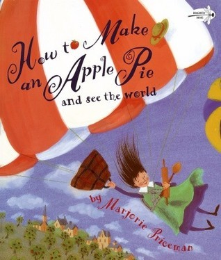
{.center} 

You can make your own pie crust (yes, there is a recipe in the story for pie crust also). But the simpler method we used was to purchase a two-pack of frozen pie crusts.

### Ingredients

* 5-7 apples
* 3/4 cup sugar
* 1 teaspoon cinnamon
* 1/4 teaspoon salt
* 2 tablespoons butter

### Directions

1) Preheat over to 425 degrees
2) In a large bowl, mix together sugar, cinnamon, and salt.
3) Peel, core, and cut apples into 1/2 inch slices.
4) Toss the apples into the sugar mixture, coating them well.
5) Arrange the apple slices in the pie pan, piling them higher in the center.
6) Dot with butter.
7) Moisten the edge of the bottom crust with water.
8) Cover the pie with the top crust, trim the edge, then pinch top and bottom edges together.
9) Cut some vents in the top crust.
10) To glaze the crust, mix an egg yolk with 1 tablespoon of water. Brush the mixture over the surface of the top crust.
11) Bake 45 minutes or until apples are tender and crust is golden brown.
12) Remove pie and allow to cool before serving.

---

## Science: Oxidation {#science-oxidation}

```metadata
time: 20 minutes
prep: 10 minutes
supplies: Pennies, Bowl, Vinegar, Salt, Towel
```
> Then, a skin of gleaming copper was put onto the skeleton and held in place by iron straps. As the huge statue grew, all of Paris watched with great fascination.

Both _The Story of the Statue of Liberty_ and _Her Right Foot_
describe how the Statue of Liberty is made from copper and started out
brown, gradually changing to the bluish-green color we know today
after decades of oxidation. Her copper covering is approximately the
width of two pennies, which leads to our science demonstration. We
will speed up the process of oxidation and turn a brown penny
bluishgreen in just a couple of hours.

For [this demonstration][oxidation] you will need:

[oxidation]: https://buggyandbuddy.com/science-for-kids-make-a-penny-turn-green/

### Supplies

* Pennies
* Vinegar
* Salt
* Paper towels
* Bowls

### Directions

1. Pour vinegar into one bowl and water into a second bowl. Add salt
   to the bowl with vinegar.
2. Place pennies into both bowls. Observe what happens. (The pennies
   in the vinegar should turn nice and shiny. The pennies in water
   remain unchanged).
3. Remove the pennies. Fold a paper towel into quarters and then soak
   it in the vinegar/salt solution. Place your pennies on top of the
   paper towel. With exposure to the oxygen in the air, your young
   scientists should start to see the pennies turning bluish-green in
   a couple of hours -- this is oxidation! (You may need to re-moisten
   the paper towel with your vinegar/salt solution periodically to
   keep the reaction going.)

As an additional control, we included nickels with the pennies. We
thought we would demonstrate the difference between copper and
nickel. Our expectation was that the nickel would not be oxidized. To
our surprise, we learned that nickels are actually made up of 75%
copper. It oxidized and turned bluish-green just as readily as the
pennies. Ah, the serendipity of science :-)

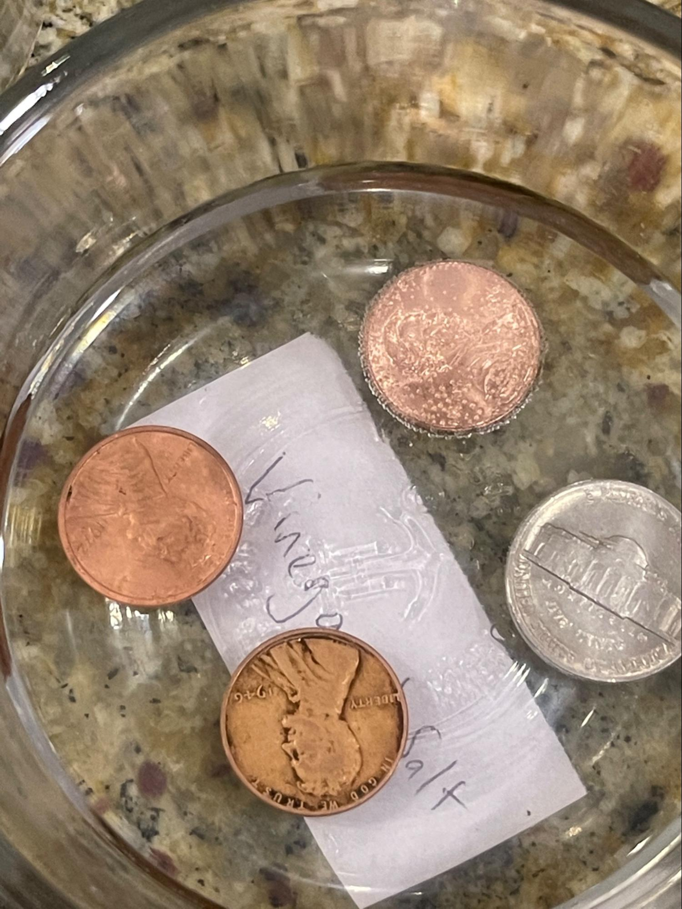
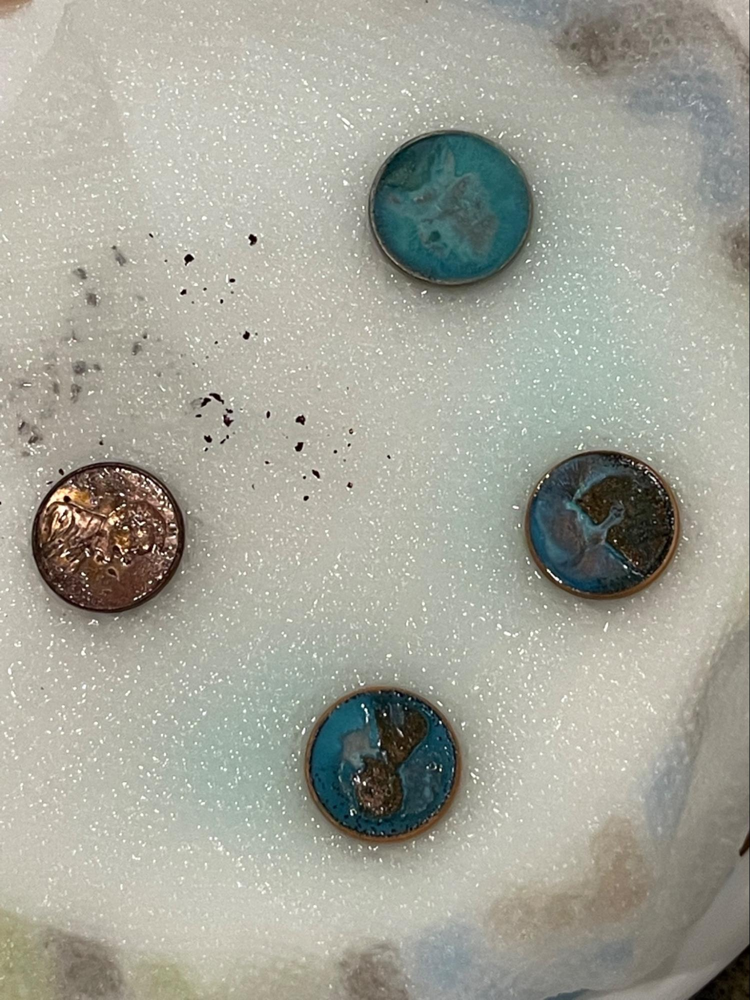<br>
The nickel is in the 12 o’clock position.
{.center .caption}

---

## Science: Virtual Tour of Statue Interior {#science-tour}

```metadata
time: 10-15 minutes
toc: "Science: Take a Virtual Tour"
```
> First, a huge skeleton was constructed from strong steel.

The Statue of Liberty is an engineering marvel. Alexandre Gustave
Eiffel, the man who later built the Eiffel Tour, developed her
internal skeleton which supports the weight of her tons of copper
sheathing.  You can see some of this in person if you can visit the
Statue of Liberty in New York. But much of the internal structure is
not open to the public. The National Park Service created [a
fascinating virtual tour][tour] that shows many of the internals of the
Statue of Liberty (as well as the externals). You start at the top,
Liberty’s Torch!

[tour]: https://www.nps.gov/stli/learn/photosmultimedia/hdp-virtualtour.htm
<!-- https://www.nps.gov/hdp/exhibits/stli/stli_tour.html -->

---

## Re-enactment: Be Your Own Statue of Liberty {#re-enactment}

```metadata
time: 20 minutes
prep: 30 minutes
supplies: Sheet, Flashlight, Headband, Foil
```
> Many people worked together in a large workshop. Some worked on Liberty's head and crown. Others worked on her right hand which would hold the torch.

This activity was fairly spontaneous and turned into a huge hit with
the kids. One of their aunts suggested including more dress-up and
costumes as part of the activities. As we were just about to launch
this module, we challenged her to put together a Statue of Liberty
outfit and do the first reading in it. As you can see below, she rose
to the challenge with the help of a sheet, a flashlight, a book and a
handmade crown (headband and foil). (Yes, to our surprise, we actually
owned a bluish-green sheet that worked perfectly; however, a brown,
pre-oxidation sheet, would have also worked nicely :-) The kids loved
it and afterwards both wanted to dress up as Liberty (tip: you might
want to remove the batteries for three-year-olds, ours had trouble
holding up the flashlight). Liberty’s Torch is more dramatic if done
at night with the lights off.

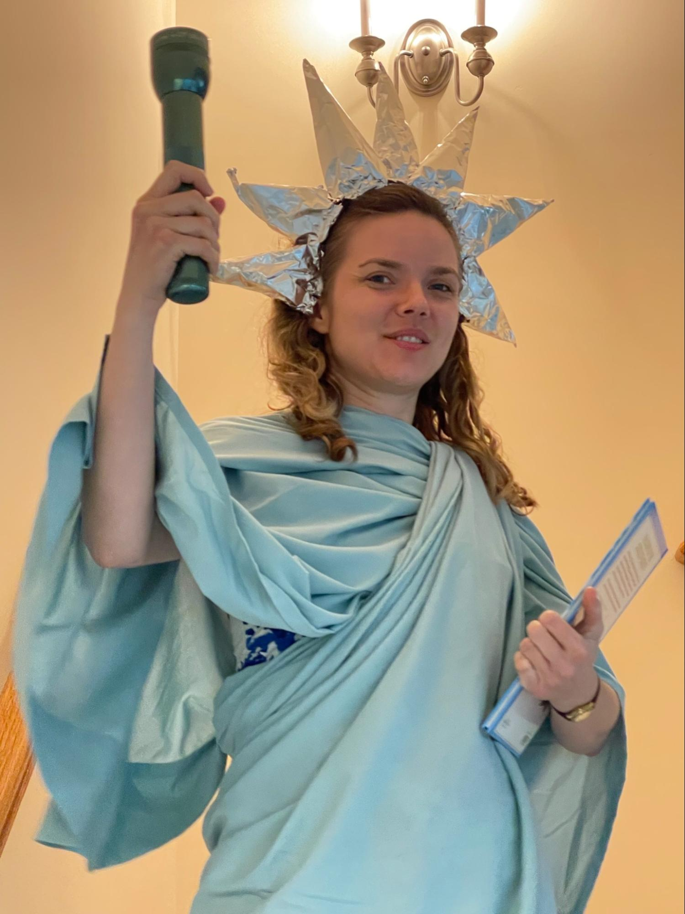<br>
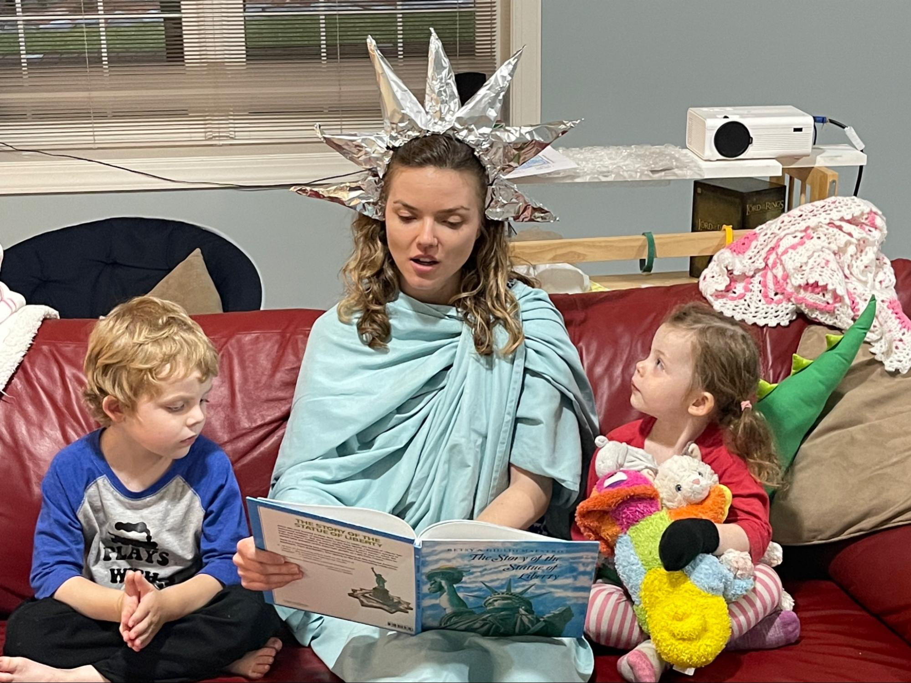<br>
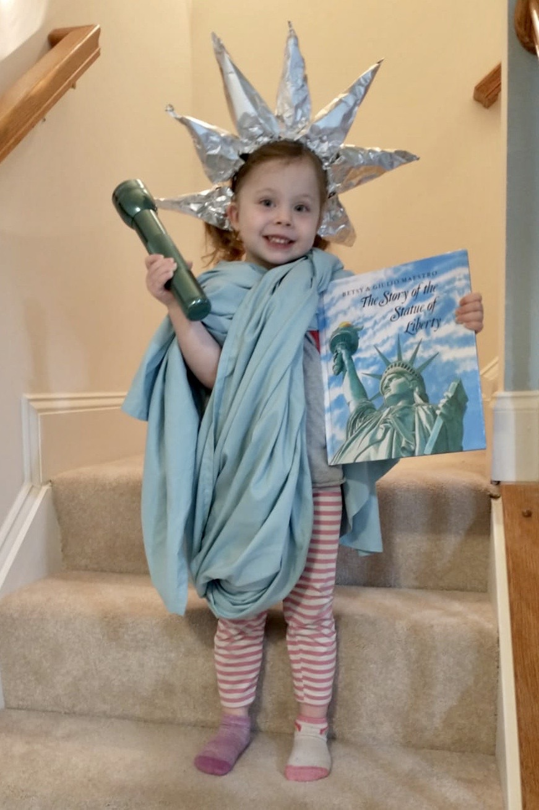
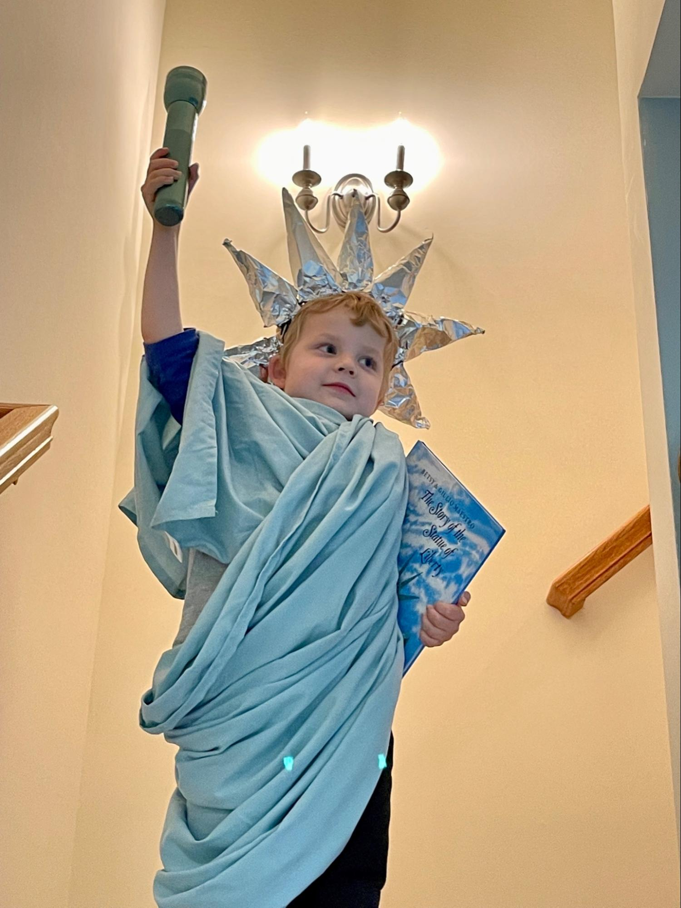
{.center}

---

## Supplemental Reading: _Liberty's Journey_ {#libertys-journey}

```metadata
time: 10 minutes
```
> But one day, Lady Liberty
> wished that she could roam and see
> the people who had come and gone;
> the land they built their dreams upon.
{.nowrap}

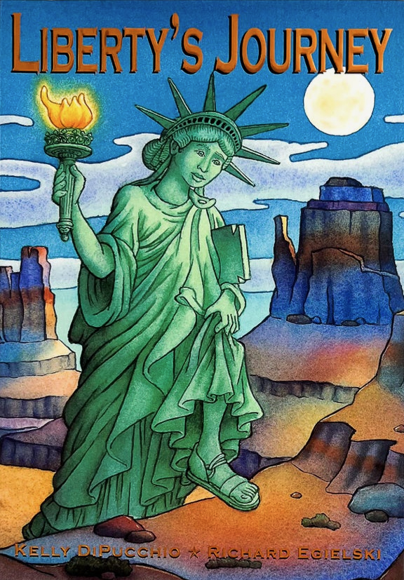
{.center}

**Title:** _Liberty's Journey_<br>
**Author:** Kelly DiPucchio<br>
**Illustrator:** Richard Egielski<br>
**Year Published:** 2004<br>
**Length:** 40 pages

_The Story of the Statue of Liberty_ provides a great history of how
the Statue of Liberty was built, from the inspiration, the
fundraising, the transport, to its dedication in New York
Harbor. _Liberty’s Journey_ is a fun supplement, telling the story of how Liberty decides to
explore our great country by going for a walk from sea to shining sea
(and back again, once she received the letter begging her to return
from the people of New York). We used this as a springboard to discuss
fact vs. fiction, comparing the two stories. Our three-year-old
enjoyed the discussion and was able to distinguish between the two.

---

## Supplemental Reading: _Her Right Foot_ {#her-right-foot}

```metadata
time: 10 minutes
```
> But no one talks about the fact that she is walking! This 150-foot woman is on the go!

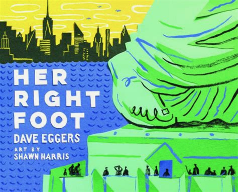
{.center}

**Title:** _Her Right Foot_<br>
**Author:** Dave Eggers<br>
**Illustrator:** Shawn Harris<br>
**Year Published:** 2017<br>
**Length:** 112 pages

_Her Right Foot_ is another great
(non-fiction) story about the Statue of Liberty. Dave Eggers recounts the
history of the Statue of Liberty. But he then goes on to point out
something about Liberty that very few people notice: her right foot is
clearly in mid-stride. Liberty is on the move!

---

## Scripture: Matthew 5:14-16 {#scripture}

```metadata
time: 10 minutes
```

> “You are the light of the world. A town built on a hill cannot be
> hidden.  Neither do people light a lamp and put it under a
> bowl. Instead they put it on its stand, and it gives light to
> everyone in the house. In the same way, let your light shine before
> others, that they may see your good deeds and glorify your Father in
> heaven.

The Statue of Liberty, with her torch held high welcoming immigrants
to America, evokes the enduring theme of “America is a shining city on
a hill, whose beacon light guides freedom-loving people everywhere,”
as President Ronald Reagan described us. President John F. Kennedy
made a similar allusion before Reagan, as have many other politicians
from both major parties. You can trace this back to John Winthrop, who
wrote in 1630, “For we must consider that we shall be as a city on a
hill, the eyes of all shall be upon us,” as he travelled to the New
World as part of the Puritan Hegira. The Biblical scripture that
inspired Winthrop was most probably from Jesus’ Sermon on the Mount in
Matthew 5:14-16.  Share this scripture with your child(ren);
consider using it as an alternate memorization exercise to the line
from the Lazurus poem.

---

## Vocabulary {#vocabulary}

```metadata
time: 10 minutes
```
> Bartholdi himself unveiled Liberty's face and she stood, gleaming in all her glory, for everyone to see.

The author uses a number of words associated with erecting a gigantic
statue that your child(ren) may not be familiar with: skeleton,
copper, pedestal, unveiled, immigrants. Try introducing a couple of
new words each day. Before you start reading, introduce the words
you’ve selected for the day, define them, and then point them out
during the reading.

Skeleton
: a supporting framework for a building, ship, statue, or body

Copper
: a reddish-brown metal that is easy to shape

Pedestal
: a supporting structure or base

Unveiled
: revealed; remove a covering like a curtain from a work of art

Immigrants
: people who move to another country

Tablet
: a flat surface with words inscribed or carved on it

---

## History: Symbolism

```metadata
time: 10 minutes
```
> The Statue of Liberty is a truly unforgettable sight -- a symbol of all that is America.

Liberty was one of the most popular symbols of America long before the
Statue of Liberty was conceived. All of our coins not only had the
word Liberty inscribed on them but also featured a figure of Liberty
herself up until the Lincoln penny was introduced in 1909. Show your
children some old coins (or pictures of old coins) to illustrate how
far back this symbolism goes. Then show them pictures of the new
bullion coins that were introduced in 1986 that revived some of the
best Liberty coinage designs of the past.

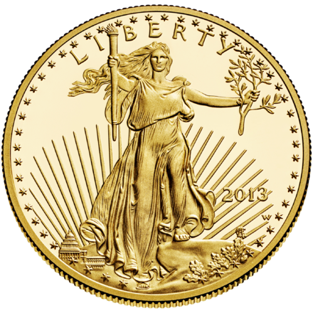
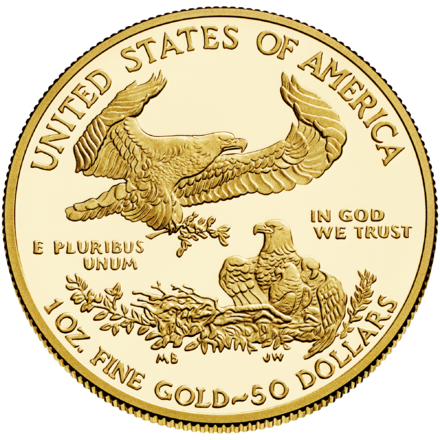<br>
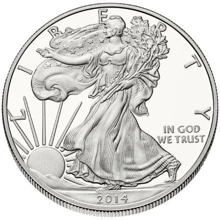
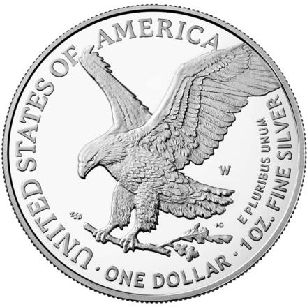
{.center}

Extend the exercise by asking your child(ren) to think of words that
symbolize your own family. How would you symbolize those? Coat of
Arms? Ask them to draw pictures of the symbols for your family.

Ask them if there are any other important symbols of the United
States. (Flag, Eagle, Liberty Bell) Can they think of any other
important symbols? (What does the cross symbolize to Christians?)

---

## Civic Culture: Generosity

```metadata
time: 10 minutes
```
> With the help of a large New York newspaper, the money was raised. People all over the country, including children, sent in whatever they could.

Tens of thousands of people donated funds for the Statue of Liberty
and her pedestal—including many children. Remind your child(ren) of
this and then discuss with them some of the areas/causes where you
donate your time or money. For older children, think about engaging
them in your annual giving by asking them if there are any areas where
they would like to give. They may be interested in causes associated
with children, like [Stanford Children’s Hospital][sch] or [St. Jude
Children’s Research Hospital][stjude].

[sch]: https://my.supportlpch.org/campaign/575738/donate
[stjude]: https://www.stjude.org/donate/donate-to-st-jude.html

---

## Games: Transporting Statue of Liberty

```metadata
time: 10-20 minutes
```
> Liberty was put back together like a giant puzzle. The statue had been built not once, but twice!

One of the amazing aspects of the history of the Statue of Liberty is
how it was built twice, first in France and then in America. You can
have some fun simulating this remarkable achievement with the help of
a [jigsaw puzzle]. Ideally the puzzle would feature the Statue of
Liberty, however, any puzzle will work.  Our kids love jigsaw puzzles,
so this activity works on a couple of levels. First, they enjoy
putting the puzzle together. Then, they simulate crossing the Atlantic
Ocean and reassembling the puzzle. You can use any barrier in your
home as the Atlantic Ocean -- a hallway separating rooms, stairs, a
carpet. But the idea is that after assembling the puzzle in one
location (France), they must transport it in chunks to another
location (America), and then reassemble it. Ask your young engineers
to brainstorm multiple ways to transport the “statue” (puzzle) from
one “country” to another. Labeling the two locations with the
appropriate country helps drive the lesson home.

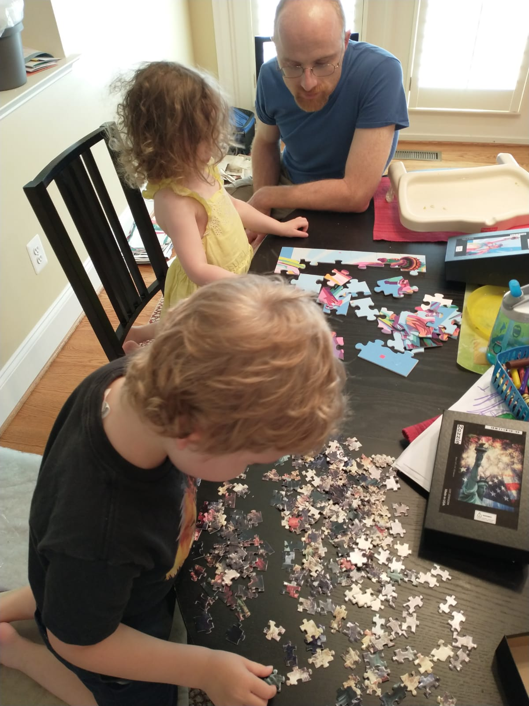
{.center}

[jigsaw puzzle]: https://www.zazzle.com/statue_of_liberty_jigsaw_puzzle-116155666048351029
