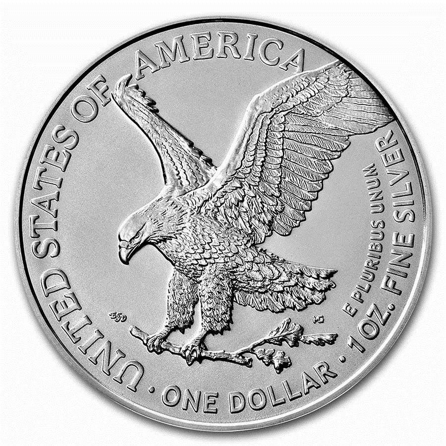

# E Pluribus Unum

## Introduction

America is a nation of immigrants. Throughout the 1800s, wave upon wave of immigrants washed up on our shores. The biggest waves were from Ireland, Germany, Italy, and China but smaller waves also came from Scandinavia, France, Poland, Japan and many other countries. Protestants, Catholics, Jews – millions of people, coming from diverse cultural, national, and religious backgrounds, needed to be assimilated and united as Americans. Our national motto reflected this: E Pluribus Unum.

They came seeking opportunity. For some, it was economic opportunity; the chance to make a better life for themselves and their families. For others, it was the opportunity to worship without fear of persecution. America, with its beacon of Liberty, called to peoples from all different ethnic, national, and religious backgrounds. E Pluribus Unum.

These people shared important traits in common. They were self-reliant risk takers, willing to leave behind what they knew in their old world in search of a new life in a strange new country, willing to work hard to forge a future for their families, willing to help others as they were helped by the ones who came before them. Together, they contributed key elements of American Exceptionalism. E Pluribus Unum.

---

## Book

Title: "Dreaming of America: An Ellis Island Story"
Author: Eve Bunting
Illustrator: Ben F. Stahl
Year published: 2000
Length: 32 pages

---

## Calendar

Monday:
 - diamond
 - craft1

Tuesday:
 - text
 - science

Wednesday:
 - "Vocabulary (before reading) [vocab]"
 - cooking

Thursday:
 - re-enactment
 - scripture
 
Friday:
 - supplemental
 - history

---

## American Heritage Songbook: America (by Neil Diamond) {#diamond}

```metadata
toc: "American Heritage Songbook: _America_"
time: 5 minutes
freq: daily
```

> Everywhere around the world 
> They're coming to America 
> Ev'ry time that flag's unfurled 
> They're coming to America 
> Got a dream to take them there 
> They're coming to America
{.nowrap}

Written and performed by Neil Diamond, this tribute to America sings the praises of all the immigrants who left their homes behind to pursue their happiness in America. Attracted by “Free, only want to be free,” these immigrants are guided to America by “Freedom’s light burning warm.” A highlight of the song comes near the end, where he recites the opening lyrics of _My Country ‘Tis of Thee_:

> My country ‘tis of thee 
> Sweet land of Liberty 
> Of thee I sing
{.nowrap}

Released in 1981 as part of the soundtrack for _The Jazz Singer_, [the song reached #1][song1] on the Billboard Adult Contemporary list and #8 on the Billboard Hot 100. It has since become an iconic song about America, with Diamond performing it at the [centennial re-dedication of the Statue of Liberty][song2] in 1986, as part of the [Capitol Fourth][song3] on the south lawn of the Capitol on July 4th, 2013, and many other venues.

For a version with lyrics on screen and great background images, sing along with [this version][song4]. YouTube has other creative versions featuring historical immigrant [images][song5] and [videos][song6] which are my personal favorites. Finally, in this [2012 live version][song7], Neil Diamond dedicates the song to his grandmother who immigrated to America from Kiev, Russia. Diamond, who was inducted into the Songwriters Hall of Fame in 1984, says that this song is the one he is most proud of writing.

[song1]: https://www.youtube.com/watch?v=wTSLRbm8L9E
[song2]: https://www.youtube.com/watch?v=g_7gcu1dmGk
[song3]: https://www.youtube.com/watch?v=qUVW478jMOQ
[song4]: https://www.youtube.com/watch?v=bCQ-GjHfbYw
[song5]: https://www.youtube.com/watch?v=9ttDUGM-1mU
[song6]: https://www.youtube.com/watch?v=ulYeE_nQL34
[song7]: https://www.youtube.com/watch?v=RrgCxSSwBto

---

## American Heritage Songbook: The Great American Melting Pot {#meltingpotsong}

```metadata
toc: "American Heritage Songbook: _The Great American Melting Pot_"
time: 5 minutes
freq: daily
```
Yes, we included two songs for this module. We had two great songs about our immigrant heritage so we decided to include them both.

> You simply melt right in
> It doesn't matter what your skin
> It doesn't matter where you're from
> Or your religion, you jump right in
> Oh, what a stew, red, white, and blue
> America was the new world and Europe was the old. 
> America was the land of hope, or so the legend told. 
> On steamboats by the millions in search of honest pay 
> Those 19th-century immigrants sailed to reach the U.S.A.
{.nowrap}

> Lovely Lady Liberty with her books of recipes 
> and the finest one she’s got
> Is the great American melting pot
> The great American melting pot 
> What good ingredients, 
> Liberty and immigrants.
{.nowrap}

Schoolhouse Rock! was a series of short animated educational musical videos that started in 1973. Nominated for a Daytime Emmy eight times for Outstanding Children’s Instructional Series, it won four times (1976, 1978, 1979, 1980). From 1975 to 1976 their videos focused on our political system in a series of ten musical animations known as America Rock! Our kids love the one about immigration, The Great American Melting Pot. The “melting pot” metaphor is an enduring theme of our exceptional American heritage. The lyrics and catchy tune of The Great American Melting Pot are a great way to introduce your child(ren) to this theme.

> Lovely Lady Liberty 
> with her books of recipes 
> and the finest one she’s got
> Is the great American melting pot
> The great American melting pot 
> What good ingredients, 
> Liberty and immigrants.
{.nowrap}

There is a [YouTube version of it here][rock1]. However, if you subscribe to Disney+ you can watch a better quality version of it there. Or you can purchase the entire set of [America Rock! songs here][rock2].

[rock1]: https://www.youtube.com/watch?v=5ZQl6XBo64M
[rock2]: https://www.amazon.com/Schoolhouse-Rock-Collection-Jack-Sheldon/dp/B001BRZ5II/ref=pd_sbs_2/146-3562273-3805534?pd_rd_w=ar0Qe&pf_rd_p=0f56f70f-21e6-4d11-bb4a-bcdb928a3c5a&pf_rd_r=F9BS6M84CGHDP5CJJ289&pd_rd_r=badde71f-aaf1-42d3-b748-a960e9e84928&pd_rd_wg=yqFJK&pd_rd_i=B001BRZ5II&psc=1

---

## Arts & Crafts: Make Your Own Scarf {#craft1}

```metadata
time: 15-20 minutes
prep: 30-45 minutes
supplies: fleece or fabric, scissors, ruler
```

> There was a scarf for each of them, a red one for Anthony, yellow for Philip, and blue for Annie. “When did she ever knit these?” Annie asked. “I didn’t see her making them.”

### Supplies

* Fleece (or other fabric that won’t fray when cut) fabric (about 7-8 inches wide and 45-60 inches long depending on the length of scarf you want; also 3 strips of contrasting fleece about 1.5 inches wide and as long as the scarf)
* Sharp scissors or rotary cutter and cutting pad
* Ruler

### Directions

1. Go to fabric store and pick out some fun fleece fabric.
2. Cut fabric to sizes described in supplies (highly recommend having an adult prep this ahead of time).
3. Cut three slits across the scarf every five or so inches.
4. Have the kids thread the thin strips of fleece through the slits weaving it through. Have them put the fleece in an up and down pattern alternating with down and up to weave along the length of the scarf. Optionally tie knots in the end(s) of the strips so that your child doesn’t pull the strip all the way through.
5. Enjoy a soft, warm scarf this winter (or any time you are traveling across the Atlantic).

See: [How To Make a Winter Scarf (Crafts for Kids #4).][scarf1]

Alternatively, take the scarf and make several small cuts on either end to form fringe. I found that even with significant guidance, my six year old had trouble cutting through fleece so this was a difficult activity in which to include the children in. See: [No-Sew Fleece Scarf for Kids][scarf2].

If you don’t want to deal with fabric, [here is a paper scarf][scarf3].

[scarf1]: https://www.youtube.com/watch?v=8bQEcp1z4Sc
[scarf2]: https://thedecoratedcookie.com/no-sew-rainbow-scarf/
[scarf3]: https://rainydaymum.co.uk/paper-snowman-scarf-weaving-craft-for-kids/#recipe

---

## Geography: England & Ireland & Russia & America {#geography}

```metadata
time: 10 minutes
supplies: Globe
```

> “I am Viktor Kirschenblatt, from Russia. I boarded ship at Liverpool.”

You need to read the Afterword to learn that the _SS Nevada_ began its Atlantic crossing from Cobh (pronounced COVE), Ireland before ending it at Ellis Island, New York. Mr. Viktor boarded the _Nevada_ at Liverpool, England; the story does not tell us how he got from Russia to Liverpool.

For this activity, we will trace Mr. Viktor’s journey: starting in Russia, boarding the ship at Liverpool, England, stopping in Cobh, Ireland to pick up Annie and her brothers, crossing the Atlantic to Ellis Island, and finally traveling to his new home in Philadelphia, Pennsylvania.

Using a globe, online map, or coloring page of the world (or Europe), show your kids how far Mr. Viktor had to travel from Russia to Liverpool, England. Even before he meets Annie and her brothers, he has traveled a long way.

Next, show them that it was just a short voyage from Liverpool, England to Cobh, Ireland. Compare the distance of this short voyage to the long voyage of the Atlantic crossing between Cobh and Ellis Island, New York.

The last leg of Mr. Viktor’s journey was from New York to Philadelphia. We don’t know how he did this. Show your kids how he could have traveled over either land or on the ocean to reach Philadelphia.

Bonus: Maps vs. Globes. On a flat map, stretch a small piece of string to find the shortest path between Ireland and New York. Depending on your map projection, you may notice that it goes through Greenland. Now do the same exercise on a globe. This shortest path lies along a “great circle”: if you extend the path in a straight line, it would form a circle around the globe the same distance as (but somewhat off-axis from) the equator. If you plot this course on a flat map, you’ll notice that it forms an arc. You can also see great circles in cross-country or international flight routes. These arcs may not seem like the shortest path, but because of the distortion inherent in flat maps, they really are!

---

## Famous American Texts: E Pluribus Unum (Out of Many, One) {#text}

```metadata
time: 5 minutes
freq: once
```
> E Pluribus Unum

_E Pluribus Unum_ was the unofficial motto of the United States of America up until 1956, when Congress officially designated _In God We Trust_ as the motto. Originally meant to signify how thirteen separate colonies became one nation in 1776 during the War for Independence, it made its first official appearance as part of the design of the Great Seal of the United States and is also incorporated into the Seal of the President. The motto first appeared on U.S. coins in 1795 and has appeared on most coins since then; the Coinage Act of 1873 made it a legal requirement on all United States coins.

_E Pluribus Unum_ evokes a powerful sense of unity for a nation of immigrants. We should not be celebrating a diversity which contends that “all cultures are of equal value.” Down that road leads the path to the balkanization of the United States. _E Pluribus Unum_ encourages people from all over the world to join America to share in our political ideals and shared civic culture. 

It is not an accident that people everywhere follow the beacon of freedom to our shores. Nor that arguably we are the most successful at assimilating people from different cultures into ours -- it is part of our DNA, our American exceptionalism, that for almost 250 years one of our ideals and mottoes has been _E Pluribus Unum_.

This is a short memorization exercise for your child(ren). But just to make it a tad more challenging, it is in Latin. To make it more fun, give your kids a handful of change and ask them to locate the motto on the different coins.


{.center}

---

## Cooking: Mince Pie {#cookbook}
```metadata
time: 60-90 minutes
prep: 30-45 minutes
supplies: butter, sugar, eggs, flour, vanilla, baking powder
```
> Never was a mince pie so good! She picked up a juicy currant that had fallen on the blanket and popped it in her mouth.

You can simplify this recipe by purchasing pre-made pie crusts. Or you can make your own using the recipe below (we modified [this Traditional British Mince Pie recipe][recipe]):

[recipe]: https://www.thespruceeats.com/easy-traditional-mince-pie-recipe-435108

### Ingredients (Pie Crusts, Makes Two)

* 2 and 2⁄3 cup flour
* 1 teaspoon salt
* 1 cup butter (solid)
* 4-6 tablespoons of very cold water (I put ice in mine)

### Directions (Pie Crusts)

1. Mix salt and flour in a large bowl.
2. Cut butter into flour and salt (note that butter should be cold/firm not melted).
3. Slowly add water one tablespoon at a time until mixture starts to come cleanly away from the sides and you
can form it into balls.
4. Roll pie crust out (using flour) to about 1⁄8 inch thick.
5. For individual pies, use a circular cutter (we used a plastic cup) to cut small circles of dough to fit into the greased muffin tin. Dough should not reach the top of the muffin cup.

### Ingredients (Pie)

* Mince pie filling (optionally can make from scratch)
* Two pie crusts
* Pie or muffin tin depending on whether you are making one large pie or several small individual pies.
* Optional toppings: confectioners sugar, vanilla ice cream

### Directions (Pie)

6. Fill pie crust(s) with mince pie filling.
7. Roll out the rest of the dough and use small cookie cutters to make fun shapes to top the pie. Place on top of pies and seal the edges by wetting slightly and pinching. If the pie top completely covers the pie, cut a small slit to let steam escape.
8. Bake at 400°F for about 20 minutes until the pie crust is golden.
9. Once cooled, remove from tin or cut slice and top as desired (i.e. with powdered sugar).

---

## Science: Sublimation {#science}

```metadata
time: 30-60 minutes
prep: 10-15 minutes
supplies: dry ice, ice cubes, clear jars, food coloring, dish soap, insulated gloves or tongs, can of soda
```

> She longed, too, for the smell of mothballs Auntie kept in her wardrobe. 
> She’d never thought she’d miss the smell of mothballs.

Mothballs undergo sublimation: a long word that just means they change directly into a gas from a solid without going through a liquid phase. You can have a lot of fun demonstrating sublimation to your kids with dry ice (which is actually frozen carbon dioxide).

### Supplies
* Dry Ice (check your local grocery store; 5 pounds is a good amount for a lot of experiments)
* Dish soap
* Food coloring
* Insulated gloves and/or tongs
* Ice cubes
* Glasses or jars to hold water and dry ice
* Paper towels
* Can of soda pop

Warning: these experiments should be done under adult supervision. Touching dry ice can damage the skin. For the sake of safety, use insulated gloves and/or tongs to handle it.

There are a lot of fun experiments you can do with dry ice. We did several and the kids loved them. Below is a description of a few simple ones. The last one is a bit messy but quite fun. Protect your table and floors or, better yet, experiment outdoors!

### Experiment: (Dry) Ice in Water

1. Start by placing a regular ice cube in a lukewarm glass of water; ask the kids to observe
2. Next, chip off some small pieces of the dry ice
3. Place the chips in a different lukewarm glass of water
4. Compare the two glasses; the one with the dry ice is sublimating by turning into gas (bubbles)
5. Pour a can of soda pop into a clear glass
6. The bubbles in the soda pop are also from carbon dioxide; the carbon dioxide has been inserted into the water in a process called “carbonation.” If you leave the soda pop out for a few hours, the bubbles will all be gone, just like the dry ice, and the soda will taste “flat.”

### Experiment: (Dry) Ice on a Paper Towel

1. Put a chip of dry ice on a paper towel
2. Next to it, put an ice cube on a different paper towel
3. Leave them setting out until they are gone
4. One towel should be wet, the other dry
5. Ask your kids: why do you think it is called “dry ice”?

### Experiment: Bubbles

This experiment should be done outside (it can be done inside but make sure you put down towels or newspapers to catch any overflow :-)

1. Fill a container three quarters full with lukewarm water
2. Add some food coloring to color the water (this can be a bit more fun with multiple containers that are
different colors)
3. Add chips of dry ice to each container and watch them bubble away. The more dry ice you add the more
bubbles – until the water cools off. You can refresh the bubbles by adding warm water.
4. After enjoying the colored bubbles for a few seconds, add some dish soap to the containers. Carbon dioxide
bubbles will start forming and overflowing your containers almost immediately.
5. Ask the kids to pop the bubbles as they form. They should be rewarded with little puffs of carbon dioxide.


{.center}

---

## Historical Re-enactment: Crossing the Atlantic in Steerage {#re-enactment}

```metadata
toc: "Re-enactment: Crossing the Atlantic in Steerage"
time: 30-45 minutes
prep: 10-20 minutes
supplies: large box, pillows, chocolate gold coins
```

> “Isn’t this the nice wee room, now?” Annie asked shakily. “Cozy, just for the three of us.”
> In truth, it wasn’t cozy, and not that nice, either. There were no windows in their cabin. 
> “What’s that noise?” Little Philip held his hands over his ears.
> “It’s the big engines that make the ship go,” Annie shouted. “I think we’re right on top of them.”

To simulate the cramped, awkward conditions of traveling to America in steerage, you will need a box large enough for 1-3 children. Have your children climb into the box, give them a couple of pillows to make them “comfortable,” and then close it up (no windows!). Then, start banging (gently) on the side of the box to simulate the sound of the engines. And finally, lift the box up (you’ll need at least two adults for this part), and start tilting it side-to-side to simulate the motion of the ocean (make sure you stop before the kids get seasick!). Or you can do what we did and use a large blue bean bag to represent the Atlantic Ocean. Place your box on it, the kids in the box, and then rock the bean bag to simulate the storm.

<br>
The kids before entering their "wee, cozy room."
{.center .caption}

Now, open up the box and ask them to “disembark” by standing in line and answering some questions from the “immigration official:” What is your name? What country are you from? Where are you going? You can prep the kids ahead of time with family history. Pick an ancestor or friend who immigrated to America: which country did he or she come from? Which state did they settle in? Our kids wanted to be the Moore children rather than an ancestor.

<br>
The kids after entering their "wee, cozy room."
{.center .caption}

Complete the immigration re-enactment with a celebration ceremony for being the “first” to immigrate through “Ellis Island.” Part of your ceremony could include eating Mince Pie (see the Cooking activity) or the ice cream and melted M&Ms from The Great American Melting Pot II activity below. Or just distributing chocolate gold coins as we did.

<br>
Wearing her new scarf and registering at Ellis Island.
{.center .caption}

---

## Supplemental Reading: _The Keeping Quilt_ {#supplemental}

```metadata
time: 10 minutes
```

> “We will make a quilt to help us always remember home,” Anna’s mother said. “It will be like having the family in backhome Russia dance around us at night.”


{.center}

**Title:** _The Keeping Quilt_<br>
**Author:** Patricia Polacco<br> 
**Illustrator:** Patricia Polacco<br>
**Year Published:** 1988<br>
**Length:** 32 pages

Patricia Polacco is the author and illustrator of this autobiographical coming-to-America story. Her great-great grandmother, a Russian Jew like Viktor in _Dreaming of America_, immigrated to America. To remind her great-great grandmother of the people they left behind, she and her mother made a quilt from fabrics worn by their relatives.

Through multiple generations, all the way through Polacco's own children, the quilt is brought out for special family occasions. Stories about the quilt and the lives it has touched become an important means of passing family history down to each new generation. Young readers should pay close attention to the weddings, as they slowly change over the generations. And ask them why Anna's dress is in color but all the other dresses are not?

---

## Scripture: 1 Corinthians 12:13 {#scripture}

```metadata
time: 10 minutes
```

> For we were all baptized by one Spirit into one body – whether Jews or Greeks, slave or free – and we were all given the one Spirit to drink.

There is a beautiful parallel between this scripture and America’s motto of _E Pluribus Unum_. Just as we all become one body after accepting Jesus Christ as our savior, America brings together peoples from all cultures and countries who are willing to share our values: from out of many, one. Ask your kids to memorize this scripture along with the short motto, _E Pluribus Unum_.

---

## Vocabulary {#vocabulary}

```metadata
time: 10 minutes
```

> Her decks were abustle with men, women, and children, some still dragging their trunks and boxes.

The young reader will encounter several new words about traveling aboard ships: abustle, steerage, wharf, port. In addition, there are some words that remind Annie and her brothers of home: mothballs, currants, and rubies. It’s always nice to ask your kids if they have an idea of what the words mean from the context of the story, after reading it to them a couple of times. That is, unless they ask in the middle of the story.


Abustle
: busy, lots of activity

Mothballs
: small balls of pesticide used to protect clothing from moths

Currants
: small dried berries like grapes

Steerage
: part of the ship where passengers travel at the cheapest rate

Rubies
: a red gem made of a hard rock called corundum

Wharf
: a structure built on a shore or stream that makes it easy for ships to unload cargo or passengers

Port
: a city or town along a coast where ships can unload cargo or passengers and shelter from storms

---

## Civic Culture: Religious Freedom & Spot the Church {#culture}

```metadata
time: 10-20 minutes
```
> “May we ask why you are going to America, Mr. Viktor?”
> “I have a son in Philadelphia.” He shrugged. “It is also very dangerous to be a Jew in Russia.”

Many immigrants came to America to escape religious persecution; among these were the Jews, who formed their own immigration wave in the 1800s, coming from Germany first and, later in the century, from Russia, Poland, and eastern Europe.
The First Amendment to the Constitution (known as the “Establishment clause”) promises freedom of religion from state influence:

> Congress shall make no law respecting the establishment of a religion, or prohibiting the free exercise thereof.

America’s values are based on a shared Judeo-Christian heritage. The First Amendment, coupled with our propensity to start new organizations whenever we see a need, has allowed a huge number of organized religious groups to flourish and spread, contributing greatly to the pluralism of American society. Today, this includes many religions that do not share our Judeo-Christian roots yet are still welcome.

The “Spot the Church” activity is meant to highlight religious pluralism in America. Ask your kids to “spot the church” every time you go for a drive with them. Try to remember which churches they see and make a list when you get home. See how many different houses of worship they can find in a week. Try driving some new routes to familiar places in order to help them Spot the Churches!

---

## Family History: The Great American Melting Pot II {#history}

```metadata
time: 20-30 minutes
prep: 15-20 minutes
supplies: coloring sheet, crayons, M&Ms, melting pot, ice cream
```

> I am Annie Moore of Cork, Ireland, she thought. And I am Annie Moore of America.

A unique aspect of America is the set of ideals it is built upon and to which it aspires. These ideals attract immigrant families from countries all over the world. In the 1800s these immigrants came in waves with one of the largest (and first) waves coming from Ireland. During the 1840s, half of all immigrants to America were Irish as many fled the Potato Famine. Later waves included Germans, Italians, Chinese, and Japanese. Each of these immigrant waves brought different cultural influences to America, impacting America’s culture in different ways and to different degrees.

For this activity, trace the ancestry of your children and identify the countries of origin for each ancestral branch. You can use the simplified Family Tree diagram (included with this module) to fill in the names of at least three generations, starting with the kids, parents, and grandparents. On a [coloring map of the world][history1] (or maybe a single continent), use a different color for each country in their ancestry using only the colors found in a standard package of M&Ms (red, green, yellow, blue, orange, brown – for more colors, include pastel M&Ms). Have them color in the squares on the family tree, matching the color to the country of origin (use stripes or sub-squares for ancestors with mixed origins).

Then, ask them to select M&Ms that match the country (or countries) of origin for each of their ancestors. (If their ancestors happen to be from just a single country, just use all the colors!) Place those M&Ms in a single layer on a plate if melting in a microwave ([see directions][history2], don’t forget the step where you “crush” the M&Ms after the first microwave; it took us a couple of tries to get it right — we burned them on our first try) or a double boiler ([see directions][history3]) and apply low heat until the M&Ms have melted into an homogenous chocolate mix. Show the kids how a) the chocolate has melted and blended into a single color but b) the mixture still retains bits of candy coating that represent parts of the original culture that are retained after blending in the Great American Melting Pot. After this illustration of The Great American Melting Pot, scoop some vanilla ice cream and pour the melted chocolate onto it and serve. Yum!

[history1]: https://coloringpagesonly.com/pages/world-map-coloring-pages#
[history2]: https://www.thespruceeats.com/how-to-microwave-mandms-521188
[history3]: https://www.ehow.com/how_5709363_melt-m_m-candies.html
