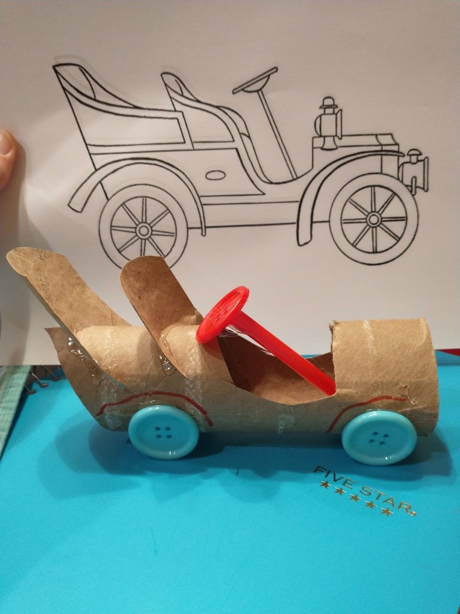
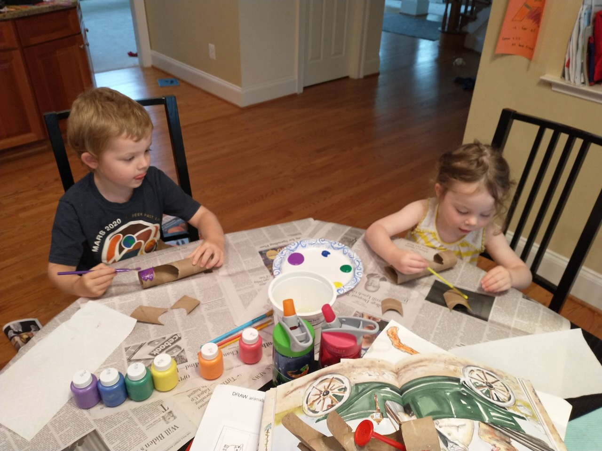
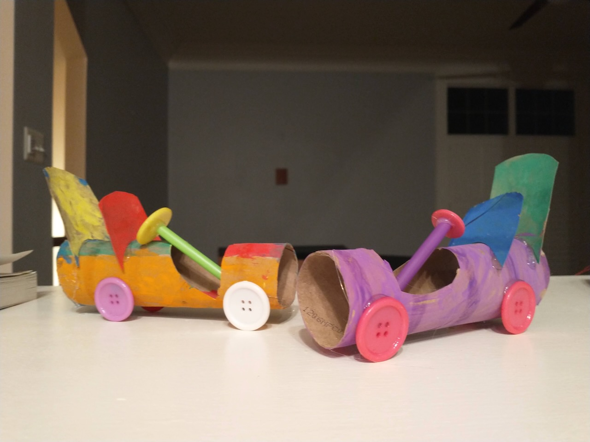
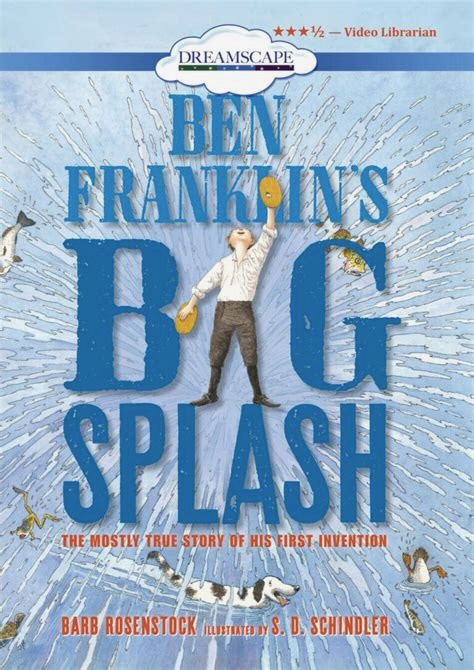

# The Secret to Success

## Introduction

Thomas Edison and Henry Ford are two of the greatest inventors, industrialists, and businessmen in America’s history. From electric lights to recorded music to automobiles, we are surrounded by the products they brought into everyone’s home to this very day. And the secret to their success is a key component of American exceptionalism: persistence and hard work.

America’s free enterprise economic system provides the incentives that created this work ethic. An economic system that rewards hard work, creativity, and innovations encourages everyone to contribute, creating an enduring civic culture of industriousness and self-reliance.

People remember Ford and Edison for the products they created that improved the lives of everyday Americans. But it’s the personal character traits underlying their success that are celebrated in this story. These men “kept at it” until they succeeded.

---

## Book

Title: "The Inventor's Secret: What Thomas Edison Told Henry Ford"
Author: Suzanne Slade
Illustrator: Jennifer Black Reinhardt
Year published: 2015
Length: 48 pages

---

## Calendar

Monday:
 - songbook
 - cooking

Tuesday:
 - scripture
 - craft1

Wednesday:
 - "Vocabulary (before reading) [vocab]"
 - science

Thursday:
 - assembly
 - art-clues
 
Friday:
 - art-animals
 - supplemental

---

## American Heritage Songbook: Electricity, Electricity {#songbook}

```metadata
toc: "American Heritage Songbook: _Electricity, Electricity_"
time: 5 minutes
freq: daily
```
Electricity, Electricity is part of the “Science Rock” set of Schoolhouse Rock! videos/songs. Its opening verse connects electricity to Edison’s light bulbs:

> When you're in the dark and you want to see
> You need, uh . . . electricity, electricity
> Flip that switch and what do you get?
> You get, uh . . . electricity, electricity
> Every room can now be lit
> With just, uh . . . electricity, electricity
{.nowrap}

You can [find it on YouTube][song1] or Disney+.

[song1]: https://www.youtube.com/watch?v=Y-k3yQe0O8w

---

## Arts & Crafts: Model T Coloring Sheet {#craft1}

```metadata
time: 10 minutes
prep: minimal
supplies: straws, construction paper, tape, scissors
```

> Models C, F, K, and N weren't quite right either.
> Henry grew tired.
> How many letters would it take?

Download [this coloring sheet][coloring] of Henry Ford’s Model T (courtesy SuperColoring) and turn your kids loose with their crayons and markers. They may want to use this as a color blueprint for designing their own Model T below.

[coloring]: https://www.supercoloring.com/coloring-pages/1919-ford-model-t

---

## Arts & Crafts: Make Your Own Model T {#craft2}

```metadata
time: 10 minutes
prep: minimal
supplies: paper towel tube, hot glue gun, scissors, straw
```
> Finally he made a special car – the Model T (though most people called her Tin Lizzie). 
> Lizzie was light, fast, and had four powerful cylinders.
{.nowrap} 

The craft below is adapted from [Meraki Mother: Racing Car Craft for Kids][modelt].

[modelt]: https://merakimother.com/racing-car-craft-for-kids/

### Supplies

* Paper towel tube
* Hot glue gun
* Paint and paint brushes (optional)
* Scissors
* Drinking straw
* Buttons (optional can use construction paper instead)

### Directions
1. Take the paper towel tube and cut out a space for the steering wheel. Trim off the end and cut out seat cushions out of the extra piece (see picture).
2. Paint the car and seat backs. Let it dry completely. (Alternatively, cover with construction paper and cut seat backs out of construction paper).
3. Cut a straw and angle one end (to make the steering wheel shaft).
4. Hot glue the steering wheel shaft into the car and a button for the steering wheel (optionally
make a steering wheel out of construction paper and glue that on).
5. Hot glue seat backs onto the car.
6. Hot glue four buttons for wheels (optionally make wheels out of construction paper and glue
them on).


<br>

{.center}

---

## Geography: Detroit & New York City {#geography}

```metadata
time: 10 minutes
supplies: Puzzle map of the United States
```

> So Henry hopped a train in Detroit and chugged six hundred miles to New York City.

On your puzzle map of the United States (or paper map), locate the states of Michigan and New York. Which states did Henry have to travel through to get to New York City? Pull them out of the puzzle and assemble them together (or color them in on your paper map). Why do you think Henry took a train to New York City instead of driving or flying?

---

## Famous American Quotes: Ford & Edison {#text}

```metadata
time: 5 minutes
freq: once
```

> If a young man makes up his mind to work, there is no limit to what he can do. - Henry Ford

> Opportunity is missed by most people because it is dressed in overalls and looks like work. - Thomas Edison

The Henry Ford quote comes from [this 1929 radio interview of Henry Ford, Thomas Edison, and Harvey Firestone][geo1], part of celebrating the 50th anniversary of Edison’s light bulb. Ford makes the comment at the 40 second mark of the two-minute video. Edison also speaks on the value of hard work and education. Watching the short video will show your child(ren) that Ford and Edison are real men, not just characters in a story.

Ask your child(ren) to select one of the quotes and memorize it.

[geo1]: https://www.youtube.com/watch?v=Q32d6RdDfoQ

---

## Cooking: Chocolate Chip Cookies {#cookbook}
```metadata
time: 20 minutes
prep: 10-15 minutes
supplies: butter, sugar, eggs, yogurt, lemon, flour, vanilla, baking powder, baking soda, salt
```
> Henry did some fast talking and got invited to a big dinner with Thomas as the guest of honor.

TBD


### Ingredients

* Dry pudding mix (5 teaspoons)
* Powdered milk (5 teaspoons)
* Water (half cup)

### Supplies
* Quart-sized zip lock bag
* Measuring spoon
* Measuring cup
* Scissors

### Directions
1. Mix the dry ingredients in the quart bag. 
2. Add water, seal the bag, and let the kids squish it around to mix it all up. 
3. Use the scissors to clip off a corner of the bag and let the kids eat the pudding by squeezing it into their mouths – this may be the most fun (and the most messy) part of the process :-)

---

## Science: Simple Machines {#machines}

```metadata
time: 10-15 minutes
prep: minimal
supplies: bicycle
```

> Most of all, Henry was curious about engines – machines that chugged and purred, hiccuped and whirred.

Simple machines redirect and transform forces. There are six classical types of simple machines: (1) inclined plane, (2) lever, (3) pulley, (4) wheel-and-axle, (5), wedge, (6) screw. The key idea behind all of these is that these machines help us to do things we couldn’t otherwise have done. Henry Ford’s engine uses ideas from these simple machines (along with some explosive chemistry) to redirect the force from exploding gasoline in the cylinders to move the car wheels.

Of the six simple machines the wheel-and-axle is probably the most pertinent to the story and easiest to demonstrate with the help of a bicycle. Turn a bicycle upside down and have your child(ren) spin the pedal to turn the wheel. Point out to them how the force they are applying to the pedal is translated by gears to a force that turns the wheel on the axle of the bicycle.

Depending on the type of bicycle, you may be able to turn the wheel backwards and see the pedals turn (which gives the inverse advantage). If you have a multi-speed bicycle you can demonstrate changing gears. Let them turn the pedals in the highest and lowest gears? Then ask them, which is easier/harder to turn? Which makes the wheel go slower/faster? At lower gears, the pedals are easier to turn, which allows one to apply more force to get the acceleration necessary to get up to the desired speed.

---

## Historical Re-enactment: Make Your Own Assembly Line {#assembly}

```metadata
toc: "Re-enactment: Make Your Own Assembly Line"
time: 15-20 minutes
prep: minimal
supplies: 8.5" by 11" sheets of paper
```

> Then he remembered. Thomas had changed his lightbulb design thousands of times before he got it right.
> So Henry kept at it.

Henry Ford is famous for more than the cars he built. He is also famous for the way he built those cars. Ford invented the moving assembly line for building cars, which revolutionized manufacturing. Assembling a Model T went from over 12 hours to just 93 minutes.

For this activity, you and your child(ren) will create your own paper airplane assembly line. This activity is more fun with more people, so consider inviting extended family or another homeschooling family to join you. You need enough people for a short assembly line but the ideal is to have two assembly lines set up that compete with each other on maximizing paper airplane production (and flight!).

To demonstrate how worker specialization and teamwork increase productivity with an assembly line, first try making paper airplanes without one. Show your child how to make a Basic Dart paper airplane (five folds). Then, time them for three (or five) minutes to see how many they can make by themselves. As a Quality Assurance step, have them fly the airplane. If the airplane doesn’t fly at least ten feet, it doesn’t count as a completed airplane. (Place a line of string or other marker down so they know whether they’ve succeeded on each flight.)

Next, build your assembly line. Depending on how many people you have, assign them different roles:

1. Paper Fetcher: bring a single sheet to the First Folder on the assembly line (a good job for younger team members)
2. First Folder: make the first two folds on the plane; pass it to the Second Folder
3. Second Folder: make the remaining folds; pass it to the Flyer
4. Flyer: glide the plane across the goal line; if it does not make it across on the first throw, it cannot be counted (this does take some practice for younger team members)

You should find that after running through the five-minute work “day” a couple of times, your team has become highly proficient at building (and flying!) paper airplanes – and that their production rate as a team is much better than it is as a group of individuals working independently. They should also see their production rate increase after they have run through a couple of “days” because they are improving as they practice whichever role they are doing. And hopefully your kids will get as caught up as ours did in the excitement of building and flying as many airplanes as they can in a short period of time. Of course, you will then be faced with what to do with a houseful of paper airplanes.

---

## Historical Re-enactment: Meals by Candlelight {#candlelight}

```metadata
toc: "Re-enactment: Make Your Own Assembly Line"
time: 15-20 minutes
prep: minimal
supplies: candles
```

> Meanwhile, Thomas was working on an electric light so people could read past dark. 
> After changing his design many times, he created an incandescent lightbulb that burned all night!

We wanted to highlight the importance of the lightbulb by having an evening without them.  We lit candles instead of turning on the lights one evening.  We made dinner, ate dinner, and got ready for bed by candlelight.  Note that this was not done completely without electricity - we used the refrigerator.  

We pointed out how it was dimmer, messier, more dangerous to use candlelights instead of lightbulbs.  After dinner, we got ready for bed and then went straight to bed (no stories) because it was hard to do things with so little light.

This activity works best in winter when it gets dark early.

---

## Supplemental Reading: _Ben Franklin's Big Splash_ {#supplemental}

```metadata
time: 10 minutes
```

> [Franklin quote here].


{.center}

**Title:** _Ben Franklin's Big Splash_<br>
**Author:** Barb Rosenstock<br> 
**Illustrator:** S.D. Schindler<br>
**Year Published:** 2021<br>
**Length:** 32 pages

TBD

---

## Scripture: 1 Thessalonians 5:11 {#scripture}

```metadata
time: 5 minutes
```

> Therefore encourage one another and build one another up, just as in fact you are doing.

Thomas Edison was enormously encouraging to Henry Ford at a time when he needed it most. As an activity, ask your child(ren) to encourage a family member or friend at least once a day for the rest of the week (perhaps set up a checklist or star chart to mark each occasion). Work on developing  the habit of encouraging one another, especially within your family. Ask your kids to memorize the scripture above as a reminder to work encouragement into their daily actions and their daily prayers.

---

## Vocabulary {#vocabulary}

```metadata
time: 10 minutes
```

> His contraption sputtered along for forty feet, then collapsed.

There are lots of great words in this story about inventing and innovating that may be new to your child(ren):

Curious
: eagerness to know or learn something

Invention
: act of making something new; typically a process or device

Gadget
: a small mechanical or electronic device or tool; especially an ingenious or novel one

Experiment
: scientific procedure to make a discovery, test a hypothesis, or demonstrate a known fact

Contraption
: a machine or device that appears strange or unnecessarily complicated 

Tinkering
:  attempt to repair or improve something in a casual way 

Patent
: a government authority or license conferring a right or title for a set period; especially the sole right for making, selling, or using an invention or idea

Incandescent
: emitting light as a result of being heated

---

## Art: Visual Clues {#art-clues}

```metadata
time: 10 minutes
```

> Henry was curious about windup toys. He took his sister’s toys apart, 
but couldn’t always get them back together.

Starting on page 6, the illustrator, Jennifer Black Reinhardt, introduces an artistic motif on each page as a visual reminder as to whether the text is discussing Henry Ford or Thomas Edison. Can your kids pick out the motifs for each of them? The Henry Ford motif is especially large on pages 24, 25, and 27. See if they notice the blended motifs on the pages when Ford and Edison are together.

Once they’ve identified the motifs, ask them why is there a light bulb over Henry Ford’s head on page 31? And why are there different light bulbs on pages 34 and 35?

---

## Art: Smoke and Thought Bubbles {#art-bubbles}

```metadata
time: 10 minutes
```

> Thomas’s phonograph is amazing!

The creative team of author and illustrator tells part of the story with illustrations showing what Edison and Ford are thinking – or dreaming. They use “thought bubbles” that look like clouds to showcase their thoughts with smaller clouds connecting the thought cloud to the character’s head.

In addition, the creative team also embeds some of the text in smoke from various sources. Ask your young readers if they can identify the thought bubbles (pages 10-11, 14-15, 21) and the smoke “bubbles” (pages 6-7, 12-13, 19, 22-23). Where is the smoke coming from?

Ask your child(ren) to draw a picture of a character/person. Then, ask them to draw a thought bubble and write or draw  in what the character/person is thinking.

---

## Art: Image Sequence {#art-sequence}

```metadata
time: 10 minutes
```
> Henry couldn’t stand it any longer.
> He had to find out Thomas’s secret!

There are two sequences of images featuring Henry Ford, the first on pages 24-25 and the second on page 27. This is a visual story-telling technique that can be used effectively to convey emotion or a series of actions occurring in a short period of time. Ask your kids to look at the images and describe what’s going on with Henry in each of the sequences. What is Henry feeling? What is he doing?

---

## Art: Find the Animals {#art-animals}

```metadata
time: 10 minutes
```
> He tied wires to his cats’ tails and rubbed their fur. Sparks flew that day!

Jennifer Black Reinhardt populates her drawings with a lot of fun animals, especially in the early pages. Ask your kids to find as many animals as they can. Look for an owl, fireflies, cats (lots of cats), baby ducks, cows, a donkey, chickens, a rabbit, robins, canary, horses, and a dog with its tongue out.

The horse on page 22 is quite expressive. What do you think it’s feeling? Scared? Shocked? Dismayed? Sad? Why?

---

## Math: Find and Count the Light Bulbs {#math-counting}

```metadata
time: 10 minutes
```
> But the whole country was crazy about Thomas’s electric light.
> Henry scratched his head. What’s his secret?

This activity is a good one to pair with the “Meals by Candlelight” Re-enactment activity. Before turning off the lights for your candlelit dinner, ask your kids to go all around the house and count the number of light bulbs. You might need to point out to them some of the “hidden” lights in the stove, microwave, freezer and refrigerator. After this first counting, you can challenge them by showing them the different light bulbs on pages 34 and 35. Ask them to count how many different kinds of light bulbs there are in your home. Why are there different kinds of light bulbs?

---

## Math: Horsepower {#math-horsepower}

```metadata
time: 10 minutes
```
> Most people thought his rattling gas buggy was a joke.
> “Get a horse!” people shouted at Henry.

Horsepower (hp) is a way of measuring power. Before steam and gasoline engines were invented, people traveled by riding horses or in coaches pulled by horses. Farm work was accomplished by hitching horses to farm equipment and having the horses pull it. When steam and gasoline engines began to replace horses for these tasks, the amount of power the engines generated was compared to how many horses it would take all yoked together to pull the load at the same speed as the engine.

Henry Ford’s Model T engine was rated at 20 hp. Today’s Honda Accord, with a turbo-charged 1.5 liter, 4-cylinder engine, is rated at almost ten times the Model T at 192 hp. How much power do you think a locomotive is rated at? (4,000 hp to 18,000 hp). How about a garage door opener? (½ to ¾ hp). Gas-powered lawn mower? (3-6 hp). Garbage disposal? (⅓ to 1 hp).