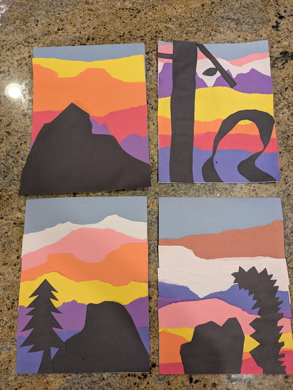
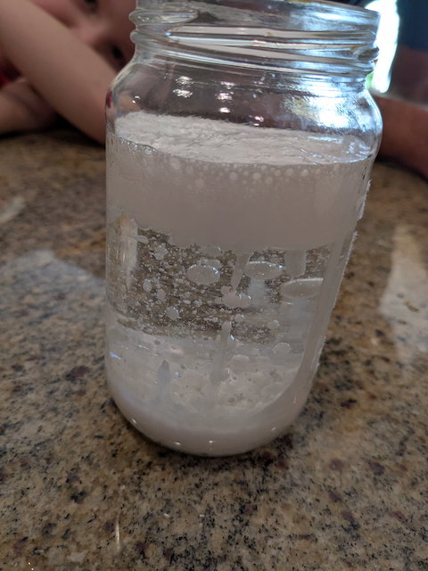
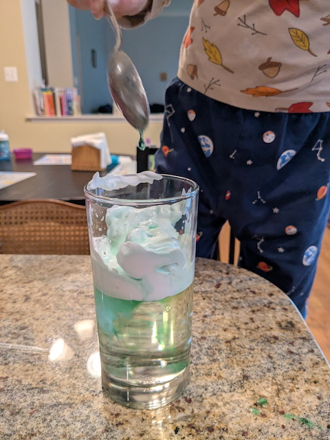
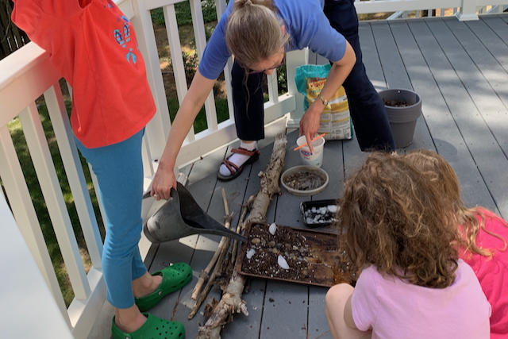
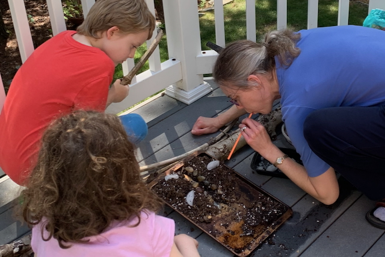
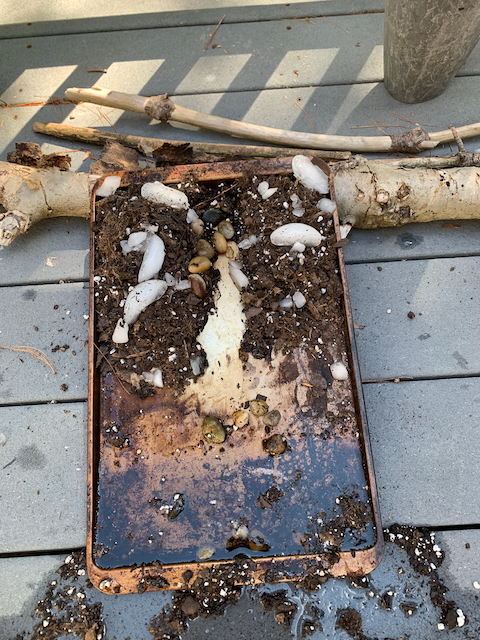
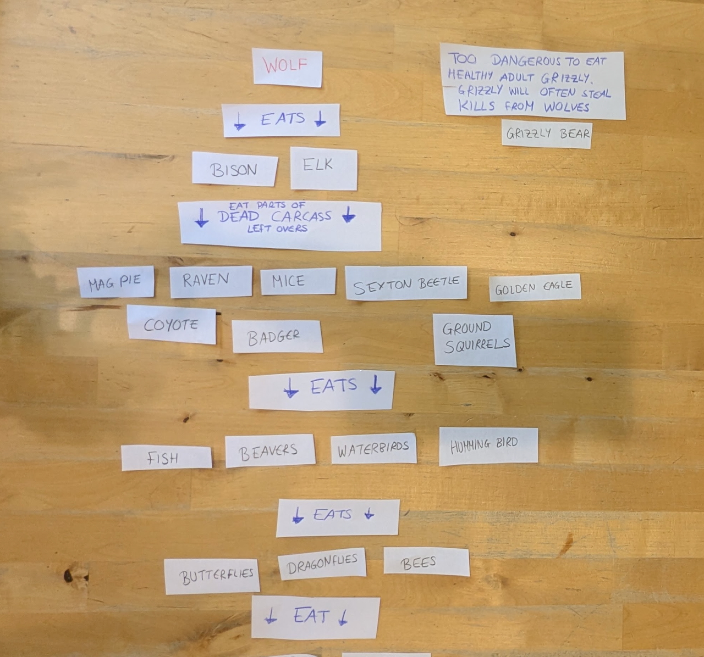
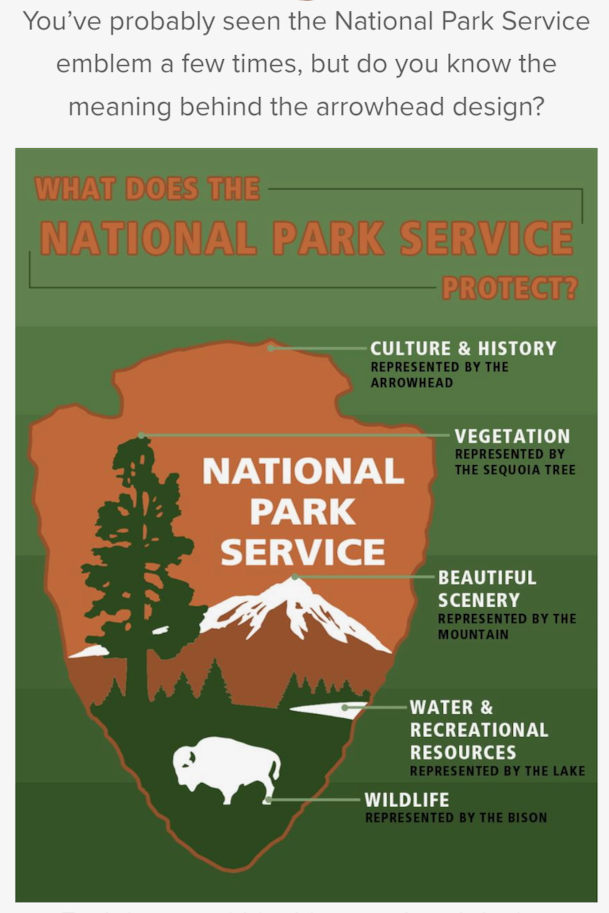
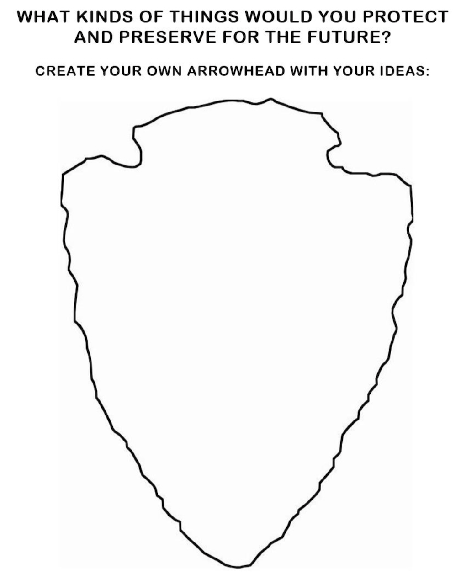

# America's National Parks

## Introduction

In 1872, America took the unprecedented step of establishing the world’s first national park. President Ulysses S. Grant signed the legislation that protected the unique natural features of Yellowstone from exploitation, preserving them for future generations. President Teddy Roosevelt, after a camping trip with John Muir, drove legislation that created even more. We now have 63 national parks and our example encouraged other countries to establish their own national parks.

National parks are a legacy from one generation to the next. We protect and preserve them as part of our American heritage, to be handed on to future generations so they, in turn, can enjoy the beauty and wonder of God’s creation. 

This generational generosity is part of America’s DNA, part of what makes us exceptional. Our example showed other countries what could be done and now national parks are standard in almost every country.

---

## Book

Title: "The Camping Trip That Changed America"
Author: Barb Rosenstock
Illustrator: Mordecai Gerstein
Year published: 2012
Length: 32 pages

---

## Calendar

Monday:
 - songbook
 - craft1

Tuesday:
 - geography
 - econ

Wednesday:
 - "Vocabulary (before reading) [vocab]"
 - erosion

Thursday:
 - re-enactment
 - weather
 
Friday:
 - counting
 - art1

---

## American Heritage Songbook: This Is My Father's World {#songbook}

```metadata
toc: "American Heritage Songbook: _This Is My Father's World_"
time: 5 minutes
freq: daily
```

> This is my Father’s world,
> And to my listening ears
> All nature sings, and round me rings
> The music of the spheres.
{.nowrap}

> This is my Father’s world: 
> I rest me in the thought
> Of rocks and trees, of skies and seas;
> His hand the wonders wrought.
{.nowrap}

This hymn celebrates the joy we find in God’s creation: “of rocks and trees, of skies and seas.” It places the listener in the center of that creation, quietly listening and communing with His creation: “in the rustling grass I hear Him pass; He speaks to me everywhere.” Written by Presbyterian minister Maltbie Babcock, the poem was published posthumously by his wife in 1901 and set to music in 1915 by Franklin Sheppard, Babcock’s friend.

An instrumental version of the hymn was included in Ken Burns’ 2009 documentary _The National Parks: America’s Best Idea_. While the version on the documentary is not available, you can [listen to this instrumental version][song1]; Amy Grant sings [this version][song2], which includes the lyrics on screen. Finally, with [this version][song3], you can turn the lyrics on and off with the “closed caption” button on the bottom.

[song1]: https://www.youtube.com/watch?v=Ad9xb4RKYi0&list=RDAd9xb4RKYi0&start_radio=1
[song2]: https://www.youtube.com/watch?v=C9g-uidS6wE&list=RDC9g-uidS6wE&start_radio=1
[song3]: https://www.youtube.com/watch?v=N3ZVLOLMRMw&list=RDN3ZVLOLMRMw&start_radio=1

---

## Arts & Crafts: Torn Paper Nature Silhouette {#craft1}

```metadata
time: 15-30 minutes
prep: 5 minutes
supplies: construction paper, pencil, scissors, glue stick
```

> On horseback, Muir and Roosevelt rode down into the famous Yosemite Valley.  The granite formations towered above them.  They passed the sheared cliff of Half Dome and the fierce face of El Capitan rising from the valley floor.

Inspired by [Imaginative Homeschool][link1]!

### Supplies

* Construction paper of various colors (including black)
* Pencil
* Scissors
* Glue sticks

### Directions
1. Trace mountain(s), rock formations, trees, or other large items from nature on the black paper which will be a silhouette in the foreground of the picture. Or, have your kids pick a National Park to represent with a recognizable silhouette (e.g., Half Dome, Arches, Joshua Tree, Old Faithful, Redwood).
2. Cut out nature items using scissors from the black paper.
3. Tear strips of construction paper for the background.  You can make additional mountains or a sunset out of the strips of construction paper.
4. Pick a background construction paper and lay out your strips and silhouettes to figure out how you want them on the sheet.  
5. Once you have laid out your picture as you like it, glue the papers on the background sheet with the glue stick.  Remember that you need to glue the strip at the very back first and end with your silhouette.



{.center}

[link1]: https://imaginativehomeschool.blogspot.com/2021/09/torn-paper-mountain-craft.html?fbclid=IwAR2xaU_HaNZ6hBPHpCU9PAWYgcWcFGH-2gfagPiIBHaO7fqX9lD8I_q4Sxk

---

## Geography: National Parks {#geography}

```metadata
time: 15-20 minutes
supplies: 
```

> “Glaciers carved this whole valley,” said Johnnie, spreading his arms. He lay down on a slab of granite and inched along on his back to show how a massive river of slow-moving ice carved the rock beneath them millions of years before.

There are currently 63 national parks designated across the country and in territories controlled by the United States (American Samoa and U.S. Virgin Islands each have one). They are not distributed equally amongst the states. Take a look at this [Wikipedia interactive map][map1] showing our national parks. Ask your kids some of the following questions:

* Are there more national parks in the eastern United States or the western?
* Which national park is closest to you? (For older kids, plot the number of miles to the nearest three)
* Can you find Yosemite National Park, where John Muir and Teddy Roosevelt camped? Where is Yellowstone National Park, our first National Park?
* Which state has the most? (California, 9; Alaska, 8) Are there any states without any national parks? (Lots, 20 of them)
* Are there any national parks that span two or more states? (Yellowstone: Wyoming, Idaho, Montana; Death Valley: California, Nevada; Great Smoky Mountains: Tennessee, North Carolina)
* What are the five most visited National Parks by visitor numbers? (A research question for older kids: 1) Great Smoky Mountains, 2) Zion, 3) Grand Canyon, 4) Yellowstone, 5) Rocky Mountain. Follow-ups: What is the source of your data and how current is it?)

You can find a [free printable checklist of our national parks here][map2]. Ask your kids to check off any national parks they have visited. Share with them the list of national parks that you have visited. Tell them about your favorites or perhaps the first national park you visited that you remember. To make this more tangible for your kids, assemble a jigsaw puzzle of all the states where you have visited a national park.

[map1]: https://en.wikipedia.org/wiki/List_of_national_parks_of_the_United_States#/map/0
[map2]: https://www.earthtrekkers.com/wp-content/uploads/2022/06/USA-National-Parks-Map-and-List.pdf

---

## Famous American Quotes: Teedie & Johnny {#text}

```metadata
time: 5 minutes
freq: once
```

> Teedie and Johnnie never spent any time together again. Teedie traveled the world but called the night of the snowstorm “the one day of my life that I will always remember with pleasure.” Johnnie felt the same.

President Teddy Roosevelt was already an ardent preservationist before his camping trip with John Muir. In 1902 he had signed legislation establishing Crater Lake as our nation’s fifth national park and in 1903 Wind Cave became the sixth. After the camping trip he signed legislation for an additional  three, more than doubling the number of our national parks during his presidency. Under the Antiquities Act, landmark legislation passed in 1906, he would establish 18 national monuments (three of which would later be upgraded to national parks, including the Grand Canyon) and 150 national forests. In his 1905 book, _Outdoor Pastimes of An American Hunter_, he wrote:

> There can be nothing in the world more beautiful than Yosemite, the groves of the giant sequoias and redwoods, the Canyon of the Colorado, the Canyon of the Yellowstone, the Three Tetons; and our people should see to it that they are preserved for their children and their children’s children forever, with their majestic beauty all unmarred.

John Muir wrote often about the wilderness, inspiring many (including President Roosevelt) to visit and help preserve it. In his 1911 book, _My First Summer in the Sierra_, he connected the wilderness to the divine: 

> Oh, these vast, calm, measureless mountain days, inciting at once to work and rest! Days in whose light everything seems equally divine, opening a thousand windows to show us God.

Watch [this short video biography (five minutes) of John Muir][muirbio] to learn more about him and why he is sometimes called the "Father of the National Parks."

[muirbio]: https://www.youtube.com/watch?v=yI7hNTnjIgE

---

## Cooking: S'mores {#cookbook}

```metadata
time: 10-20 minutes
prep: 5-10 minutes
supplies: graham crackers, chocolate, marshmallows
```

> They camped high above the valley floor. Johnnie made the president a bed of branches and they settled near the fire for warmth.

S’mores are the classic camping dessert made over a fire.  But you can make them at home without a fire as well!  Be sure to have wipes handy as this will get sticky.

### Ingredients

* Graham crackers
* Chocolate bar or small pieces of chocolate
* Marshmallows

### Directions (campfire s'mores)

1. Have a grown up build a fire.
2. Use wooden skewers or sticks and put a marshmallow on the end.
3. Hold the marshmallow over the fire until it gets slightly brown.
4. Put a piece of chocolate on top of a half a graham cracker and slide the toasted marshmallow off of the stick/skewer on top of the chocolate.  Top with the other half of the graham cracker (forming a chocolate/marshmallow sandwich).
5. Enjoy and then ask for s’more!

### Directions (oven s'mores)

1. On a baking sheet, place half of a graham cracker (as many as the number of s’mores you want to make.
2. On top of the graham cracker, put a piece of chocolate, and on top of that put a marshmallow.
3. Move the oven rack to the lowest position.  Put the baking sheet in and turn the oven onto broil.  Broil for 1-4 minutes - watch carefully so as not to burn the marshmallow.  You are looking for the marshmallow to start browning on the top.
4. Remove from oven and top with the other half of the graham cracker.
5. Enjoy and then ask for s’more!

---

## Science: Weather in a Glass {#weather}

```metadata
time: 20-30 minutes
prep: 10-15 minutes
supplies: plastic cup, jar, oil, Alka-Seltzer tablets, white paint or food coloring, shaving cream, spoons
```

> Overnight a storm blew in, spreading five inches of fresh snow. 
Teedie and Johnnie woke under a coverlet of white flakes. 
They shook themselves off like two old grizzly bears.
{.nowrap}

You can make both a snowstorm in a jar and a rain cloud in a jar. Enjoy making some contained weather (based on [onelittleproject][weather]).

### Supplies, Snowstorm In a Jar

* Mason jar or other clear glass jar (preferably one you don’t mind ruining)
* Plastic cup
* Baby oil (regular vegetable oil can be used, but the clear oil is better)
* Alka-Seltzer tablets
* Water
* Water based white paint (we used acrylic)  Note that you can also use food coloring if you don’t mind your snowstorm not being white.

### Directions, Snowstorm in a Jar

1. Fill your glass jar about half to two-thirds full of oil.
2. In a separate container, mix about ¼ cup of water with a couple of squirts of acrylic paint (or food coloring). Mix together. If you use paint, make sure the container can be thoroughly cleaned or disposed of afterwards.
3. Pour the water/paint mix into the glass of oil. Note that the water/paint sink to the bottom of the jar and do not mix with the oil.
4. Break an alka-seltzer tablet into small pieces and drop a few into the jar.
5. Watch as the water/paint bubbles rise to the top of the oil and then “snow” down.
6. Add additional alka-seltzer tablets once the “storm” ends.



{.center}

Science discussion: This isn't how snowstorms _actually_ work, but it's a fun experiment and there's some interesting science nonetheless. The white-painted water stays separate from the baby oil because oil and water are _immiscible_ (they don't mix: water's polarized molecules prefer to be closer to other polarized water molecules, while oil's non-polarized molecules also prefer their own company, so a clear boundary develops between the two substances). On the other hand, water-based paint _does_ readily mix with water, coloring it white. The water (and paint) is heavier than the oil, so it will naturally form a separate layer at the bottom of the jar. 

The snowstorm starts when the alka-seltzer tablets release carbon dioxide into the water. The gas is much lighter than both the water and the oil, so it travels up to the water-oil boundary. At this point, rather than simply passing directly into the oil, the _surface tension_ of the water kicks in: the bonds between nearby water molecules are so strong that the air bubble can't immediately break through them to get into the oil. Instead, the paint and water forms a small additional bubble _around_ the air bubble as it travels up through the oil layer (with the CO₂ inside, the water bubble is now lighter than the oil). Once it finally reaches the top of the oil layer, the gas escapes into the atmosphere, and what's left is a ball of water and paint that's again heavier than the oil around it, so it sinks back down through the oil like snow. This repeats until the alka-seltzer tablet is gone.

### Supplies, Rain Cloud in a Jar

* Mason jar or other clear glass jar (preferably one you don’t mind ruining)
* Plastic cup
* Shaving Cream
* Water
* Food coloring
* Spoons
* Pipettes (optional)

### Directions, Rain Cloud in a Jar

1. Fill a glass/jar two-thirds to the top with water
2. Add shaving cream to the top to completely cover the top of the water (you can use a spoon to spread the shaving cream so it covers).
3. Mix some food coloring into a small amount of water (you need the food coloring to be very concentrated).
4. Pipette or spoon the food colored water onto the top of the shaving cream “cloud.”
5. When there is enough colored water on top of and within it, the shaving cream “cloud” won’t be able to hold it all and you will be able to see the colored “rain” water come down into the water in the glass.


{.center}

Science discussion: While it's not exactly the same as clouds (which themselves are just water), the foam is also able to support a certain amount of water without it falling through. Once you reach that limit, the extra colored water falls out of the cloud into the clear water. Since the food coloring slightly increases the weight of the water around it, the rain drop initially starts travelling down through the slightly lighter clear water, but mixing equalizes the densities pretty quickly. This experiment can be a bit finnicky, particularly with respect to the ratio of water to food coloring. We found that if there's too little food coloring, then the trace amounts of dissolved foam actually cause the colored water to be _lighter_ than the clear water, so it just floats at the top, which is less impressive. For an interesting follow-up experiment, try using baby oil or mineral oil in the bottom layer and see if you can guess what will change.

[weather]: https://onelittleproject.com/snowstorm-in-a-jar/

---

## Science: Erosion {#erosion}

```metadata
time: 20-30 minutes
prep: 10 minutes
supplies: baking sheet, dirt, rocks, water, pitcher, straw, ice
```

> … Glaciers carved rivers and created plains.

Natural forces shaped the unique geography found in many National Parks: Glaciers (Yosemite, Glacier NP), Volcanoes (Yellowstone, Hawaii), Rivers (Grand Canyon, Zion), Tectonic Plates (Rocky Mountains, Sierras), Erosion (Bryce Canyon, Arches NP).  Many of these forces can be considered types of erosion such as wind, water, and glaciers.  It can help to see how erosion works on a smaller scale (both in terms of size and time) and so making a model can be helpful (and fun!). Directions are below but you can also watch [this short Youtube video][video1].

### Supplies

* Baking sheet (preferably old or covered in aluminum foil)
* Sand, dirt, or soil
* Small rocks/stones
* Water
* Watering can/pitcher/something with a spout to pour the water
* Drinking straw
* Ice cubes

### Directions

1. Go outside or clear an area that can get messy. Prop up the baking sheet so it is on a shallow angle (sort of a very shallow baking sheet slide). You can use rocks or branches for the prop.
2. Put sand or dirt or soil at the top of the baking sheet and cover the baking sheet about half way.
3. In the sand/dirt/soil, use your finger to make a small river bed and gather up some sand/dirt/soil to make some small hills/mountains.
4. Add small stones/rocks along either side of the river bed.
5. Observe what everything looks like.
6. Place ice cubes somewhere among your mountains and soil (not in the riverbed).
7. Pour water at the top of the river bed. Keep pouring water and see what happens. [The sand/soil/dirt should start shifting down to the bottom of the baking sheet. After enough water, some of the rocks along the riverbed may also be carried away. This is a model of water erosion.]
8. Take the straw and blow through it while pointing the end close to the sand/dirt/soil. [The sand/dirt/soil should shift. This is a model of wind erosion. ]
9. Wait until the ice melts. [With enough ice melted, new channels and valleys in the sand/dirt/soil should form. This is a model of glacier erosion.]




{.center}

[video1]: https://www.youtube.com/watch?v=-MFLgtti51I

---

## Historical Re-enactment: Camping Trip {#re-enactment}

```metadata
toc: "Re-enactment: Camping Trip"
time: weekend
prep: 20-30 minutes
supplies: s'mores, camping equipment
```

> When he found men sending his baggage to the best hotel in town, Roosevelt shouted, 
“By George, I’m going camping! Pack me one small sack!”

Ideally, for this re-enactment, you would pack up the family and drive to the nearest national park. However, state parks are more numerous and usually closer, so they can be an excellent alternative. State parks can be as stunning as national parks (for example, Niagara Falls is a state park in New York). Another possible option is camping out in the backyard. 

To enjoy the full “Teedie and Johnny” experience, you will need a campfire to tell stories around. But, you will not need a tent – just sleeping bags out under the stars! Or you can even simulate the outdoors inside the house by piling up some pillows, putting a flashlight in the middle to create a "fire" and then turning on a star projector.

And, while s’mores were not invented until the 1920s, we’re sure that Teedie and Johnny would approve of adding this campfire confection to your camping experience. (Use the "S'mores from the oven" directions for your indoor camping trip).

If there is a fourth grader in your family, you can take advantage of the National Park Service's [Every Kid Outdoors Program][outdoors]. This program provides free access to all public lands, including National Parks, for one year for all fourth graders PLUS other children in the family under the age of 16 and up to three adults. And yes, this program explicitly welcomes homeschool families: "I'm in the fourth grade or home-school equivalent."

[outdoors]: https://everykidoutdoors.gov/index.htm

---

## Supplemental Reading: _The Wolves Are Back_ {#supplemental}

```metadata
time: 15 minutes
```

> In 1995, ten adult wolves were brought down from Canada and set free in Yellowstone National Park. 
They dug dens and bore puppies.
{.nowrap}


{.center}

**Title:** _The Wolves Are Back_<br>
**Author:** Jean Craigshead George<br> 
**Illustrator:** Wendell Minor<br>
**Year Published:** 2008<br>
**Length:** 32 pages

This story features Yellowstone, the first national park in America (and the world). It is a true story of how wolves were eliminated throughout the United States (with the exception of Alaska) in the 1920s. The story demonstrates the unintended consequences of eliminating an apex predator and the downstream damage it can cause due to the interconnectedness of a food chain. As the quoted text notes, wolves were re-introduced in 1995, resulting in a complete re-balancing of the park’s eco-system. 

Wendell Minor’s illustrations of the huge variety of  animals and flowers in Yellowstone are wonderful to behold. Ask your kids to pick one of their favorite pages and try drawing it.

For older kids, ask them to write down the name of every animal that is mentioned in the story. Next, cut them out so every name is on a separate piece of paper. Finally, arrange them in a "food chain" starting with the wolf at the top. Which animal eats which? (This activity led to a passionate discussion amongst one family, especially when it came to Grizzly Bears. They eventually agreed that wolves do not attack healthy Grizzly Bears but will happily hunt down bear cubs.)


{.center}

---

## Scripture: Psalm 23: 2-3a {#scripture}

```metadata
time: 10 minutes
freq: daily
```

> He makes me lie down in green pastures, he leads me beside quiet waters, he restores my soul.
{.nowrap}

This portion of Psalm 23 evokes the serenity that flows from the Lord as He rejuvenates us within His creation. Johnnie and Teedie could certainly understand this serenity as they hiked and camped in Yosemite.

Ask your children to memorize this scripture by writing it down five times each day. You may want to get them a “copybook” for writing down scripture and phrases worthy of memorization. This can be good practice for handwriting as well.

---

## Vocabulary {#vocabulary}

```metadata
time: 10 minutes
```

> That night, under the branches of a towering sequoia called the Grizzly Giant, Teedie lay on the forty thick wool blankets his men prepared.
{.nowrap}


The vocabulary words for this module are mostly about some of the natural wonders in Yosemite and how they were created: wilderness, sequoia, glacier, valley, granite, sculpted, sheared. Understanding these words will help young readers comprehend John Muir’s description of how glaciers created Yosemite.

Wilderness
: a natural area generally undisturbed by human activity

Stagecoach
: a horse-drawn coach for carrying passengers

Sequoia
: enormous cone-bearing trees found in California; the giant sequoias are the largest trees (in volume) in the world

Grizzly Bear
: a sub-species of brown bear known for their large size

Glacier
: an extended mass of ice created by the accumulation of snow over years

Valley
: a long depression in the land running between hills or mountains

Continent
: one of the seven large land masses on earth

Sculpted
: to carve or form into a shape

Granite
: a very hard rock formed from volcanic forces

Sheared
: cut

Brawny
: strong, muscular

Prospectors
: people searching for natural resources (e.g., gold, silver, oil)

---

## Writing: Guided Writing Prompts {#writing}

```metadata
time: 10-20 minutes
```

> Johnnie began his story, "This whole continent is a great garden..."

Ask your kids to write a one-paragraph, ten-sentence story about the National Parks and/or nature, using these writing prompts (from [Brian Tolentino Writing Prompts][prompts]):

* Sentence 1: Write a vivid description of a setting using only SEVEN words.

* Sentence 2: Include ONE of these emotions: Elation, Dread, Curiosity, Frustration, Awe, Guilt

* Sentence 3: Use ONE of these nouns: Bridge, Whisper, Treasure, Storm, Shadow.

* Sentence 4: Write a sentence with exactly FOUR words.

* Sentence 5: Begin with "Suddenly," and use a sensory detail ( Sight, sound, touch, smell, etc.)

* Sentence 6 and 7: Include a simile in one sentence and a metaphor in the other.

* Sentence 8: Start with "Why" and make it a question

* Sentence 9 and 10: Use a cliffhanger ending that leaves the reader wanting more.

Here's an example from one young writer: 1) Green trees soar in the national park. 2) I was in awe when I saw the crisp gold leaves on the trees. 3) I saw the shadow of a majestic Grizzly Bear. 4) My hands trembled slightly. 5) Suddenly, I saw the bear close behind me. 6) The bear smelled like dirty socks. 7) The knot in my stomach grew tighter as the bear got closer. 8) Why did I not get bear repellant? 9/10) When it got really close I decided to run. And then the bear jumped at me...

[prompts]: https://briantolentino.com/writing-prompts/

---

## Art: Thought Bubbles and Steam/Smoke {#art1}

```metadata
time: 10-20 minutes
```

> He told Teedie the funny story of meeting his first bear.

There are three double-page spreads in the story that show Muir telling Roosevelt a story by a campfire. The smoke from the fire becomes the thought bubbles above their heads depicting what Muir is describing. The thought bubbles show the story within the story and convey what Muir is expressing to Roosevelt while also showing what is actually happening in the foreground. These spreads take advantage of two different techniques: thought bubbles and the use of steam or smoke to give a dreamy quality.

Have your child(ren) try out this technique of showing what characters are saying by using smoke thought bubbles in their own picture (or larger story). Consider incorporating this technique in your guided writing activity.

---

## Art: Make Your Own Logo {#art2}

```metadata
time: 10-20 minutes
```

> Teedie left Johnnie in Yosemite and headed back home. His time in the forest turned the outdoor-loving president into one of nature's fiercest protectors.

Congress created the National Park Service in 1916. Its mission statement reads:

> The National Park Service is dedicated to conserving unimpaired the natural and cultural resources and values of the National Park System for the enjoyment, education, and inspiration of this and future generations. The Service is also responsible for managing a great variety of national and international programs designed to help extend the benefits of natural and cultural resource conservation and outdoor recreation throughout this country and the world.

Take a look at the National Park Service's logo to see how it reflects their mission statement.


{.center}

Now, using the template below, make your own logo, identifying what you would protect and preserve.


{.center}

---

## Civic Culture: Volunteer at a National or State Park {#civic}

```metadata
time: one day
```

> "How can I help?" asked the president.
> "Keep it wild," Muir said, "and protect it forever."
{.nowrap}

Generosity is one of the virtues that makes Americans exceptional. We donate our time generously with more volunteer service hours than any other country. For those who like the outdoors, there are many opportunities to voluntarily serve in our national parks. The National Park Service runs a [Volunteer-In-Parks (VIP) program][vip] that provides nationwide opportunities to work in our national parks; trail maintenance, wildlife monitoring, teaching Junior Rangers are just a few of the volunteer opportunities. 

State parks run their own volunteer programs as well. Most states will have something similar to the volunteer website operated by the National Park Service; for example, here are websites for [Virginia][virginia], [Texas][texas], and [Florida][florida].

For this activity, find a one day volunteer activity at either a national park or a state park that the whole family can do together.

[vip]: https://www.nps.gov/subjects/volunteer/index.htm
[virginia]: https://www.dcr.virginia.gov/state-parks/volunteers
[texas]: https://tpwd.texas.gov/state-parks/help-parks
[florida]: https://volunteers.floridastateparks.org

---

## Math: Height and Girth {#counting}

```metadata
time: 15 minutes
```

> When he looked up, he couldn’t see the treetops.  The sequoias soared straight to the heavens.  “These trees grew up when the Egyptians built the pyramids,” said Johnnie.  “They are the largest living things on earth.”

It is hard to get a sense of how big Giant Sequoias are (or Yosemite’s famous granite walls) without seeing them in person. Measuring out actual sizes or finding things to compare them to (for example, El Capitan is about as tall as three Eiffel Towers) can help.

Giant Sequoias
* Age: up to 3,400 years
* Height: 250 ft (can be as tall as a 26 story building)
* Girth: 90 ft (how many people would need to hold hands in a circle to make it all the way around one of these trees?)
* To help get a sense for how enormous these trees are, try marking out 90 ft and 250 ft outside on a walk or in a field.

Take a look at [this National Park website][sequoias] that ranks the top 50 biggest Sequoias. Can you find the two located in Yosemite National Park?

[sequoias]: https://www.nps.gov/seki/learn/nature/largest-trees-in-world.htm

Half Dome
Height: About 5,000 ft above the valley or 8,800 ft above sea level. Watch [this National Park Service video][halfdomehike] for some perspective on one of the most iconic and challenging hikes in our National Park System.

[halfdomehike]: https://www.nps.gov/yose/planyourvisit/halfdome.htm

El Capitan
Height: About 3,000 ft above the valley

---

## Economics: The Goldfish Game {#econ}

```metadata
time: 5-10 minutes
prep: 5 minutes
supplies: goldfish crackers, spoons 
```

> What if everyone owned the wilderness?

Teedie and Johnnie sought to protect Yosemite and take care of its resources rather than have a lack of coordination cause the natural resource to be carved up and wasted. Without clear ownership, it can be hard to coordinate the care of a resource. Yosemite was threatened with mismanagement and depletion through short-term competing interests. Although many may have wanted to privately benefit from the natural resource, the lack of coordination from these many individuals may have destroyed the beauty of the valley (ruining the value for everyone). Turning Yosemite into a National Park solved the coordination problem and preserved the resource making everyone (including future generations) better off. A simple activity can help illustrate this.

Set out a small pile of goldfish in front of two or more children. Let them "fish" with either their hands or a spoon. Put no limitations or rules as to how many they take. Once there are no goldfish left, ask them a few questions.

* Did each child get the same amount of goldfish?
* Were you worried that you wouldn't get enough goldfish?
* Were you worried that someone else would take the goldfish you wanted?

Now give each child their own small bowl of goldfish. Ask the questions again. Point out that having their own bowl (their own "private property") meant that they didn't have to worry about not getting enough from the group pile. They also could decide what to do with the goldfish (eat them all, save some for later, etc.). When there is clear ownership, people can make decisions about how best to use a resource without worrying that other people will use it up before they get a chance.

For older children, you can ask them what would happen if they needed to leave some "fish" to make sure there were enough fish to make more fish in the future. Is it easier to make sure there are fish for the future in a common pool of fish or when each person has a private pool?

