# America Takes Flight

## Introduction

Wilbur and Orville Wright taught mankind to fly. And they did it in typical American fashion. Two brothers, both high school drop-outs, tinkering in their backyard and their bicycle shop, taught themselves the science of flight, and invented powered airplanes.

Self-reliance, perseverance, teamwork, and an incredible work ethic were all key components to their revolutionary invention. We shouldn’t forget the courage it took either. How many times did they crash and risk injury when testing their experimental designs?

The brothers were also motivated by the American free enterprise system. True entrepreneurs, hey patented many aspects of their airplane – and then had the perseverance to fight through the courts to establish patents on their inventions.

However, both Wilbur and Orville point to another factor entirely as the most important aspect of their success. It is something homeschooling families know intuitively. You can read it in the “Famous Quotes” activity below.


---

## Book

Title: "My Brothers' Flying Machine: Wilbur, Orville, and Me"
Author: Jane Yolen
Illustrator: Jim Burke
Year published: 2003
Length: 32 pages

---

## Calendar

Monday:
 - songbook
 - cooking

Tuesday:
 - geography
 - craft1

Wednesday:
 - "Vocabulary (before reading) [vocab]"
 - anemometer

Thursday:
 - re-enactment
 - coins
 
Friday:
 - culture
 - windtunnel

---

## American Heritage Songbook: Wild Blue Yonder: The U.S. Air Force Song {#songbook}

```metadata
toc: "American Heritage Songbook: _Wild Blue Yonder_"
time: 5 minutes
freq: daily
```

> Off we go into the wild blue yonder,
> Climbing high into the sun;
> Here they come, zooming to meet our thunder,
> At them boys, Give ‘er the gun!
{.nowrap}

Written in 1939, this song won the competition to be the official song of what was, at the time, the Army Air Corps. Commanders of the Army Air Corps  wanted an official song to help define them as a unique branch of the military; out of hundreds of entries, this was the hands-down winner. It wasn’t until shortly after World War II, in 1947, that the Army Air Corps officially became the newest branch of America’s military, the United States Air Force.

The original lyrics of the  second verse reminds us of the brilliance of the Wright Brothers:

> Minds of men fashioned a crate of thunder,
> Sent it high into the blue;
> Hands of men blasted the world asunder;
> How they lived God only knew!
> Souls of men dreaming of skies to conquer
> Gave us wings, ever to soar!
{.nowrap}

There are numerous versions available on YouTube; [this one has the lyrics on-screen][song1] and photos of the many types of aircraft in the Air Force.  [This version][song2] includes scenes from World War II.

[song1]: https://www.youtube.com/watch?v=JP3whmQ_OZc
[song2]: https://www.youtube.com/watch?v=8WaC6mMnsPI

---

## Arts & Crafts: Make Your Own Biplane {#craft1}

```metadata
time: 20-40 minutes
prep: 5-15 minutes
supplies: clothespin, hot glue gun, craft sticks, markers
```

> The craft was of pinewood covered with fabric and sealed with shellac.
{.nowrap}

We have two options for making your own model biplane: clothespin biplanes and toilet paper roll biplanes.  The clothespin biplanes are simpler to put together, but don’t have a propeller that one can actually spin.  Both are fun and cute!

As your kids are working (and playing) with their biplanes, look for opportunities to talk about the book and how determined and hardworking the Wright Brothers were. Then, point out examples to your kids about times when they exhibited the same qualities.

Clothespin biplane
([Based on AdventureSci.org][craft2])

### Supplies

* Clothespin
* Two craft sticks
* One mini craft stick
* Markers or paint
* Hot glue


### Directions
1. Paint or use markers to decorate the clothespin and craft sticks.

2. When they are dry/decorated, hot glue the craft sticks to the clothespin.  Put the mini craft stick on the very end (the end that you pinch to open the clothespin).  Put the regular craft sticks on opposite sides of the clothespin (slightly lower than the tip of the opposite end of the mini craft stick).  We placed ours to cover the metal spring parts. See photo.


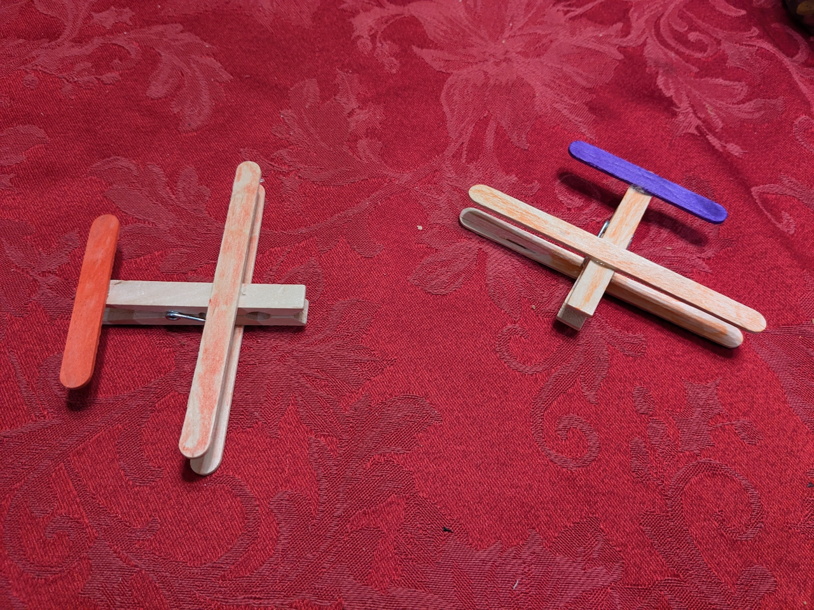
{.center}

Toilet Paper Roll Biplane
([Based on PinkStripeySocks.com][craft1])

### Supplies

* Empty toilet paper roll
* Cereal box
* Brad or similar fastener
* Two large craft sticks
* Two mini craft sticks (or a regular craft stick broken in half)
* Two pennies (or other small weights)
* Stapler
* Paint
* Glue gun
* Scissors
* Optional: hole punch


### Directions
1. Hot glue the two pennies inside the toilet paper roll close to one edge.  This will be the back of the plane (which needs some extra weight in order to stand given the weight of the front of the plane).

2. Staple the back of the toilet paper roll (where the pennies are) shut.  Make two small slits on the bottom of the toilet paper roll about in the middle (this will allow you to slide in the craft stick legs later).  

3. Out of the cereal box cut two small circles for wheels (about the size of pennies), one large circle (the size of the opening of the toilet paper roll), one fat rectangle (about 1” x 1.5”), two narrow rectangles (about 0.5” x 2”), and a propeller.

4. Paint the toilet paper roll, all the craft sticks, and all the items cut from the cereal box.  Except for the large circle, all items should be painted on both sides.  Wait for everything to dry.

5. Punch a hole through the center of the large circle and middle of propeller.  Connect them using the brad.

6. Use the hot glue gun to put all the pieces together: glue the large circle with propeller to the open end of the toilet paper roll.  Glue the small circles to the bottom of the mini craft sticks.  Glue the mini craft sticks into the slits in the bottom of the toilet paper roll.  Glue the larger craft sticks horizontally on either side of the toilet paper roll.  Glue the narrow rectangles to the two craft stick wings to connect them.

7. Admire your model and use your finger to spin the propeller.

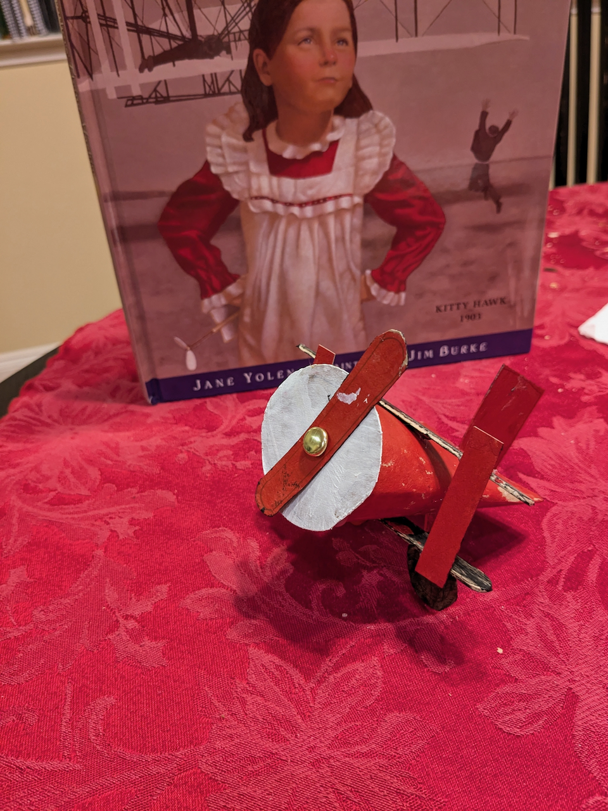
{.center}

[craft1]: https://www.pinkstripeysocks.com/2014/10/toilet-roll-biplane-airplane-craft.html?m=1
[craft2]: https://www.adventuresci.org/diy-science/posts/popsicle-stick-biplane/

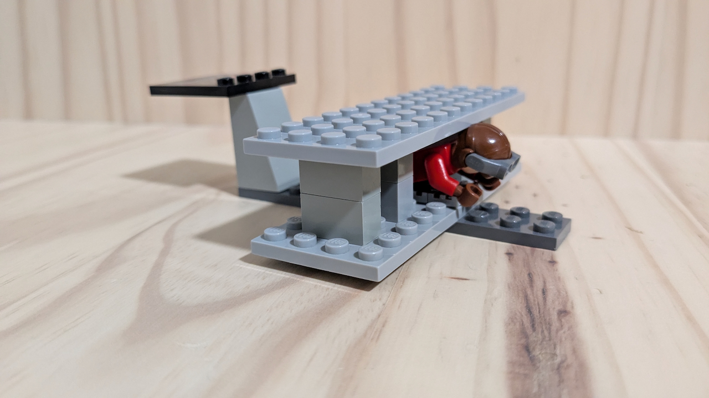<br>
Alternate (or additional) biplane construction
{.center .caption}

---

## Geography: Ohio and Kitty Hawk, North Carolina {#geography}

```metadata
time: 15-60 minutes
supplies: U.S. puzzle, kite
```

> Will and Orv needed somewhere with open spaces and strong, regular breezes… 
> At last they settled on Kitty Hawk on the Outer Banks, a two-hundred-mile strip of sand with the ocean at its face and North Carolina at its back.


Geography played an important role in the Wright Brothers’ pioneering experiments in powered flight. They needed strong, sustained wind to provide lift, especially in the early days when they were learning to control the aircraft through gliding. Why did they need open spaces? Again, the issue is all about control. In the early days, they were learning how to control the aircraft and didn’t know where their experiments would end up landing – or crashing, as happened many times. Which is also why the 200 miles of sand dunes were an important aspect of the geography they were looking for. The sand made for a softer landing (or crash) than other surfaces.

You can demonstrate the importance of their criteria (wind and wide open spaces) by taking your kids kite flying. On a windy day, talk to them about the best conditions for kite-flying and pick the best spot together, connecting the experience with how the Wright Brothers had to find the location for their flight. 

There were a couple of other criteria that played a role in their selection of Kitty Hawk, North Carolina. Pull out a map of the United States and ask your kids to indicate the location of Dayton, Ohio. In addition to Kitty Hawk, the Wrights also considered San Diego, California and St. James, Florida as possible locations for their experiments. By looking at all three locations relative to Dayton, Ohio, can your kids see another reason for picking Kitty Hawk? Yes, North Carolina is much closer to Ohio than California or Florida.

Back in 1900 it took 3-5 days by train, followed by a boat trip, to reach Kitty Hawk. There were no bridges and no roads for the last part of the journey. Isolation  was the final geographical factor they wanted. The Wright Brothers were competing with others to be the first to fly. An isolated location for their experiments could help keep their experimental flights secret from others who might steal their ideas.

[This short video][geo1] by the National Park Service shows what the isolated, windy, sand dunes of Kitty Hawk, North Carolina looked like back when the Wright Brothers were experimenting there in 1900-1903.

Have your children figure out a travel route from Dayton, Ohio to Kitty Hawk, North Carolina.  This is a great opportunity to incorporate some important life skills into a geography lesson.  You can read about the Wright Route [here][geo3].

Print out [an Amtrak map][geo2] and ask your child(ren) to plan a trip with Amtrak from Dayton, Ohio to Kitty Hawk, North Carolina.. Together figure out the closest Amtrak stops. 

Using the map,  plan which Amtrak trains you would need to take. Then go to the Amtrak website and add your family information, i.e., the  number of adults and children travelling from/to. 

Then together look up how long it would take (hours or days?), how many times you need to change trains and how much it would cost to go on the trip. Compare how long it would take you to travel by how long it took them to get there.  Also compare it to Google Maps drive time, if instead you would go on a road trip by car. 

[geo1]: https://www.nps.gov/media/video/view.htm?id=A8B1C581-CC10-5544-3256AF132BF00D26
[geo2]: https://www.amtrak.com/content/dam/projects/dotcom/english/public/documents/Maps/Amtrak-System-Map-020923.pdf
[geo3]: https://www.wrightroute.org/travel

---

## Famous American Quotes: The Importance of Family {#text}

```metadata
time: 5 minutes
freq: once
```

> What had transpired that day in 1903, in the stiff winds and cold of the Outer Banks in less than two hours time, was one of the turning points in history, the beginning of change for the world far greater than any of those present could possibly have imagined. With their homemade machine, Wilbur and Orville Wright had shown without a doubt that man could fly and if the world did not yet know it, they did.
> – David McCullough


It is astonishing to look back more than a century ago  to see what two high school dropouts accomplished. Self-taught engineers, scientists, and entrepreneurs, the turning point in their manned flight experiments came when they decided the existing data on lift and drag were wrong. They built their own wind tunnel to get precise measurements and then applied them to the wing design of their Flyers. 

Where did the confidence to question the prevailing scientific orthodoxy and the perseverance to keep going in the face of repeated failures come from? Both Orville and Wilbur attribute it to their family:

> But it isn’t true to say we had no special advantages . . . the greatest thing in our favor was growing up in a family where there was always much encouragement to intellectual curiosity.
> – Orville Wright

> If I were giving a young man advice as to how he might succeed in life, I would say to him, pick out a good father and mother, and begin life in Ohio. 
> – Wilbur Wright

These quotes can be used to initiate a conversation about the importance of family. Perhaps start it by asking your children if they've ever tried to do something where they needed help from family members. Or perhaps share a story about your own endeavors where a family member played a crucial role. These stories can help shape the culture of your family.

---

## Cooking: Lemon Muffins {#cookbook}

```metadata
time: 20-30 minutes
prep: 10-15 minutes
supplies: butter, sugar, eggs, yogurt, lemon, flour, vanilla, baking powder, baking soda, salt
```

> When dear Mama died of tuberculosis, I took over her role: keeping the house, making the meals, and always giving the boys applause, even after I graduated from college and worked as a teacher.

The Wright Brothers kept an organized pantry  when they stayed at Kitty Hawk.  The Library of Congress has a photograph of it along with many letters and diary entries that reference their food.  You can find a neat summary [here][pantry]. The Wright Brothers had a dozen lemons on hand at Kitty Hawk and discussed their muffin crusts in a letter, so we will be making Lemon Muffins to remind us of the Wrights.

Recipe from [Little Sunny Kitchen][recipe]. Makes approximately 18 muffins.

[pantry]: https://ediblepantry.com/2018/12/16/wrightbrotherspantry/
[recipe]: https://littlesunnykitchen.com/lemon-muffins/


### Ingredients

* ½ cup unsalted butter (softened)
* ¾ cup granulated sugar
* 3 medium eggs at room temperature
* ½ cup Greek yogurt
* 2 tablespoons lemon juice
* 2 teaspoons lemon zest (note: we found that one lemon was enough for both of these lemon ingredients)
* ½ teaspoon pure vanilla extract
* 1½ cups flour
* 1 teaspoon baking soda
* 1 teaspoon baking powder
* ½ teaspoon salt


### Directions
1. Grease muffin tin and preheat the oven to 425 degrees Fahrenheit.
2. Cream together (with a mixer) butter and sugar.
3. Whisk in yogurt, lemon juice and zest, and vanilla.  Give it a good mix.
4. In a separate bowl, mix together flour, baking soda, baking powder, and salt.  Then add them to the wet ingredients.  Mix together, but don’t over mix.
5. Pour batter into muffin tins.
6. Bake for 5 minutes at 425 degrees Fahrenheit.  Then reduce heat to 350 degrees Fahrenheit and bake for 15-17 minutes or until a toothpick comes out clean from the middle of a muffin.
7. Eat before (or after) a flight!

---

## Science: Make Your Own Anemometer {#anemometer}

```metadata
time: 20-30 minutes
prep: 10-15 minutes
supplies: paper cups, hole punch, straws, pencil, pin, hot glue gun, rocks, fan
```

> At last they settled on Kitty Hawk on the Outer Banks, a two-hundred-mile strip of sand with the ocean at its face and North Carolina at its back.  Will called it “a safe place for practice.”  Only sand and hearty breezes.

Meteorologists use anemometers to measure wind speed.  By knowing the wind speed and direction in many different places, we can better predict the movement of weather systems like storms and cold fronts.  It's also important for mitigating the risks of wildfires spreading, and in aviation.  Modern aviators look for strong tailwinds to help planes fly faster and more efficiently by flying with the wind, but the Wright Brothers actually wanted the opposite - a strong headwind.  Instead of minimizing drag and air resistance, they wanted to maximize the lift force generated from fast air flowing around the wing.  With the small engines they had access to, the easiest way to get a lot of air to pass around the wing was to point their plane directly into the wind.

### Supplies

* 5 small paper cups and one larger paper/plastic cup
* Hole punch
* 2 plastic straws
* 1 unsharpened pencil with eraser on end
* 1 pin (or pushpin)
* Hot glue gun
* Small weights (small rocks, small beanbags, etc.)
* Wind (outdoors or inside with a fan)

### Directions

1. Take a hole punch and make four holes in one of the paper cups: two holes directly across from each other, turn the cup 90 degrees and make another two holes directly across from each other under the rim.  Note that the second set of holes may need to be a little lower than the first pair of holes in order  to fit the straws. See photo.
2. Slide the two straws through the holes so the straws form a “+” in the middle of the paper cup.
3. Poke a hole in the middle of the bottom of the cup large enough to fit the pencil in it.  Slide the pencil in from the bottom of the cup so the straws just rest on the top (eraser) of the pencil.
4. Stick the pin through the two straws (where they cross) and into the top of the eraser.
5. Hot glue in the bottom of the pencil to the bottom of the large cup (so it stands in the middle of the large cup like it is sitting in a vase).  Hot glue the last four paper cups to the end of each of the straws.  The cups should be glued on their sides with all of the cups facing the same direction.  See photo.
6. Add small weights to the large cup around the pencil (so the wind doesn’t blow it away).
7. Mark one of the cups/straws (to make it easier to count the rotations).
8. Place your anemometer in the path of a wind source (outside or in front of a fan).

Measure how many times the anemometer makes a complete turn in a given amount of time.  Change the wind source/speed and re-measure.  We used a variable speed fan, a stopwatch (counting the number of rotations in a 10 second period), and followed the rotation of the anemometer with our hand.  Faster winds will result in more rotations in a given period.

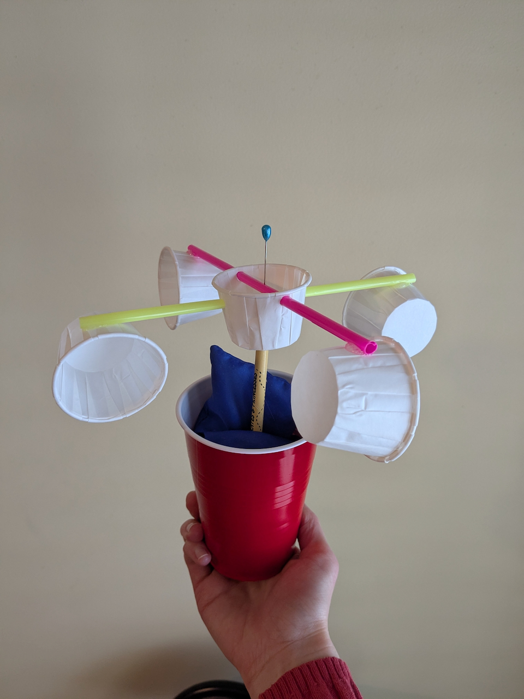
{.center}

Based on [Tina’s Dynamic Homeschool+][dynamic], but there are [many][anemom1] [anemometer][anemom2] [variations][anemom3] online.

[dynamic]: https://tinasdynamichomeschoolplus.com/wind-energy-activities/
[anemom1]: https://littlebinsforlittlehands.com/diy-anemometer/
[anemom2]: https://www.sciencebuddies.org/teacher-resources/lesson-plans/make-anemometer-measure-wind-speed
[anemom3]: https://hessunacademy.com/diy-anemometer/

---

## Science: Make Your Own Helicopter {#helicopter}

```metadata
time: 20-30 minutes
prep: 10-20 minutes
supplies: paper, pencil, scissors, paper clip
```

> When at last the “bat” fell to the floor, they gathered it up like some sultan’s treasure, marveling at its paper wings, admiring the twisted rubber band that gave it power.

We have two different helicopter designs for this activity. The first is simpler but will only float your helicopter to the ground. The second is more advanced but is closer to the one that inspired the Wright Brothers. It generates enough lift to fly upward before returning to the ground.

For the simpler alternative, you will need:

### Supplies

- paper or construction paper
- pencil
- scissors
- paper clip
- markers optional

### Directions
1. Cut out a rectangle out of the construction paper. Size doesn't need to be precise but roughly 8 inches by 2 inches.
2. Draw lines for folding and cutting. Roughly a block letter "T" with a cut line coming out of the top.  See photo.

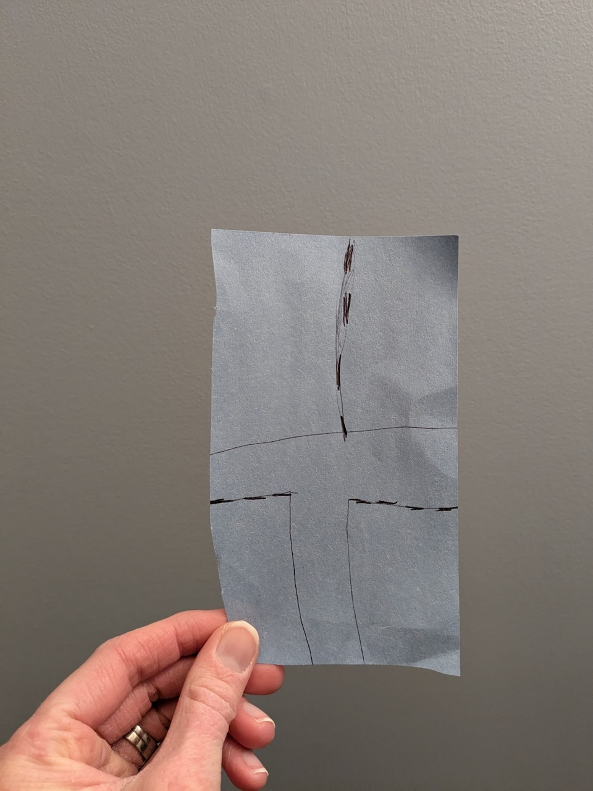
{.center}

3. Color with the markers as desired.
4. Cut along the cut lines.
5. For the two pieces at the top of the "T", fold one horizontal in each direction (so they are opposite each other). See photo.

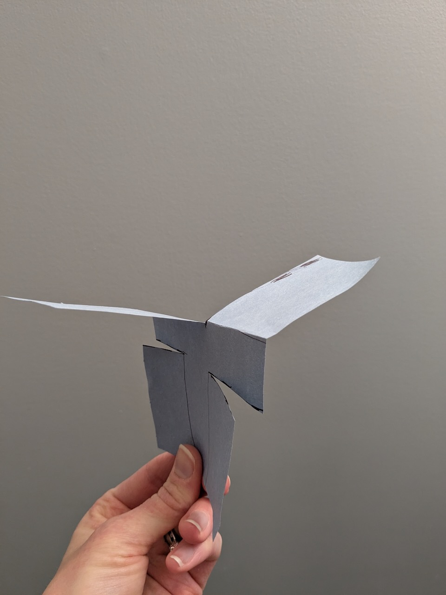
{.center}

6. For the bottom, fold the two sides around the main column. Fold the bottom part of the single column up about a half inch and paper clip in place. See photo.

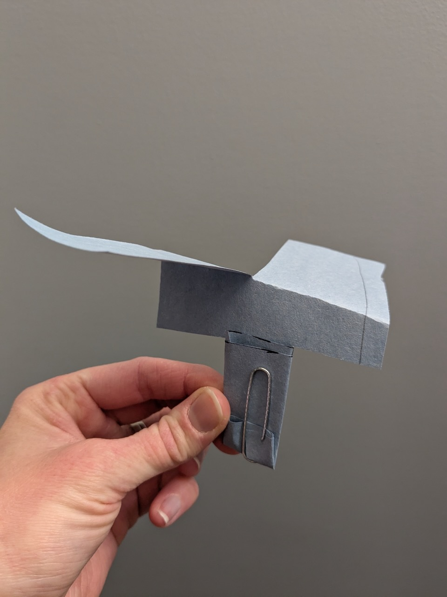
{.center}

7. Hold the paper helicopter as high as possible, paper clip down. Release and watch it spin to the ground!

The more advanced helicopter is based on [Engineering Projects for Kids][helicopter] from STEM Inventions.

[helicopter]: https://www.youtube.com/watch?v=DiJIvoHvGk4

### Supplies

* Plastic propeller that fits craft sticks (we used [these][propeller] from Amazon and they worked perfectly)
* Craft stick
* Card stock
* Paper clip
* 2-3 rubber bands (⅛ by 3.5inch rubber bands are recommended)
* Masking tape or other type of tape
* Scissors 
* Optional: markers

[propeller]: https://www.amazon.com/You-Make-10-Pack-Propeller-Helicopters/dp/B06X3Q8C24/ref=sr_1_3_sspa?crid=3LEACAJZO568D&dib=eyJ2IjoiMSJ9.AI_ILmnqakRbAo4eOmT8luzuC8tDka_j7rdBL9o_9HdqNxMDznY49h7dk7u8L4-Yi7IhqfmyI_u67ovNrSxw26rDcHaR1vetoGFdqeqL2xDBcsVrl7ndomPM21L_f4PZdMKGTokuKk8SnBo2CyD12ZMlXNTdPzBXZRNLvNlvrFGEL4tDoaq-qm9J_8p9sY_ncg0gy0pJOYxHwIDN-Cbe6kgIJ9ksuhv0Y0YGnJIeOMl0eYMYhWxL3AhkjyVZfkAkA-hun_6hDgo0PtjhUpu14CzxODqei1_JjbKoxMS-qA4.6GLZcyAcrBS-JSzE4EIio-LWyEETUhejdV3WcD4DCiI&dib_tag=se&keywords=plastic+propeller+craft+stick&qid=1736219468&sprefix=plastic+propeller+craft+stick%2Caps%2C112&sr=8-3-spons&sp_csd=d2lkZ2V0TmFtZT1zcF9hdGY&psc=1

### Directions

1. Slide the craft stick into the small plastic shaft of the propeller.
2. Bend the paper clip so half of it is vertical and half is horizontal (so the paper clip is still curved on either end but the middle has been bent to form an “L.” See photo.

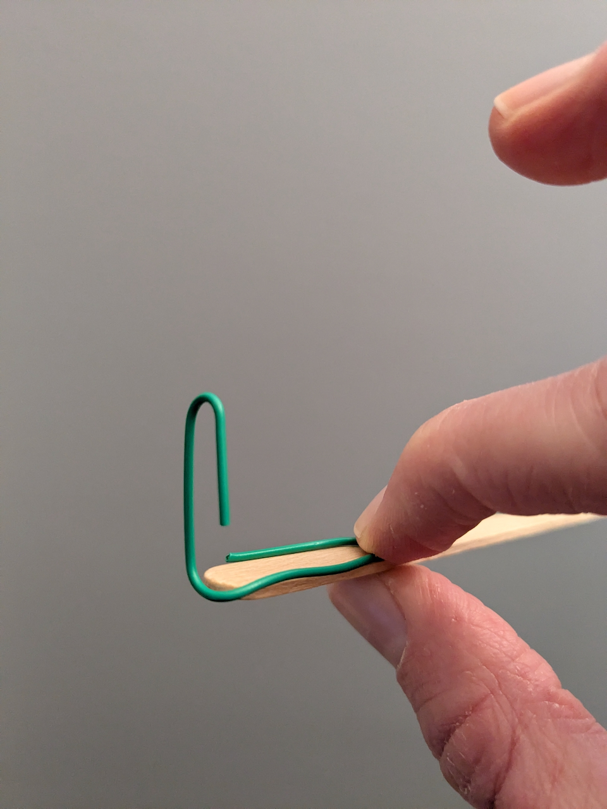
{.center}

3. Secure one side of the paper clip to the end of the craft stick opposite the propeller using tape.
4. Cut out the wings/body of the helicopter out of cardstock (if desired, decorate the cardstock with markers). The shape is roughly a narrow rectangle with curved ends. See photo.

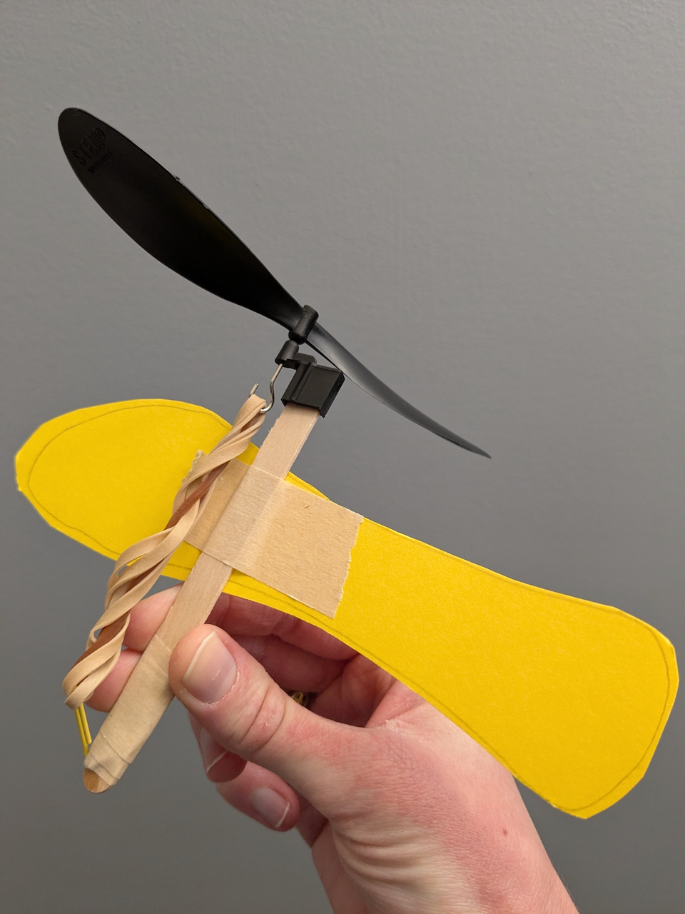
{.center}

5. Tape the card stock wings/body to the craft stick near the propeller on the opposite side of the paper clip.
6. Loop 2-3 rubber bands between the hook on the propeller and the hook created by one side of the paper clip.

### Flying Instructions

1. Wind the propeller until the rubber bands are twisted over on themselves.  See photo.  This requires a lot of winding! Be careful not to let go.

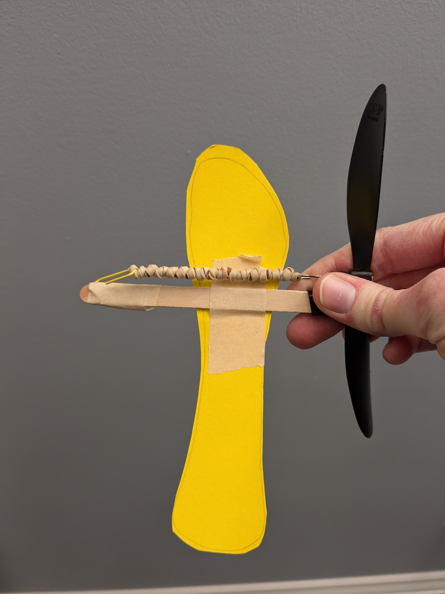
{.center}

2. Point the helicopter up (propeller pointed to the sky).  Let go of the propeller first and a second or so later let go of the base.  If you let go simultaneously, the propeller doesn’t have enough time to get up to speed and your helicopter may not fly.
3. The shape/size of the card stock matters.  Play around with some different shapes.  Without the card stock, the rubber bands mostly unwind the craft stick instead of the propeller, ruining the flight.  The card stock wings/body provide enough drag that the rubber bands power the propeller rather than the craft stick.  Of course, too much drag will drag your helicopter down and it won’t fly.  

You can also experiment with different numbers of rubber bands. Hopefully you find this as inspiring as the Wrights did!

---

## Science: Make Your Own Wind Tunnel {#tunnel}

```metadata
time: 15-30 minutes
prep: 10-20 minutes
supplies: large plastic soda bottles, tape, fan, tiny pom poms
```

> They built a small wind tunnel out of an old starch box and used a fan to make the wind.

### Supplies

* Two empty 1 or 2 liter plastic bottles (Note that the important thing is that the sides are flat/smooth.)
* Tape
* Small fan (We used a hand held fan but online suggested a box fan. Note that a large standing fan did NOT work because the wind from the fan wasn’t concentrated enough.)
* Pom poms

### Directions

1. Cut off the tops and bottoms of the two bottles, removing any of the curved portions of the bottle. You should be left with two plastic cylinders open on both ends.
2. Tape the two cylinders together to form a longer cylinder open on both ends. We used clear packing tape, but regular tape would also work.
3. Position the fan so the wind will blow in the upward direction when it is turned on.  Tape one end of the cylinder to the fan.  
4. Put scotch tape around the edge of the other end to make it less sharp/dangerous from the slightly jagged edge left from cutting off the end.
5. Turn the fan on and drop some pom poms into the wind tunnel.

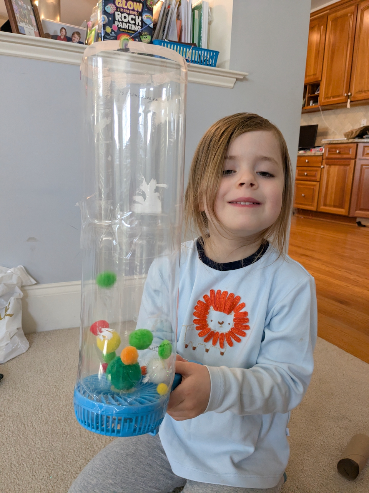
{.center}

Explore how different wind speeds impact the pom poms.  Explore how different sizes of pom poms and different numbers of pom poms impact how they float in the wind tunnel.  This activity is based on [Little Bins for Little Hands DIY Wind Tunnel][tunnel].

[tunnel]: https://littlebinsforlittlehands.com/diy-windtunnel/

Wind tunnels help researchers measure the forces on an object as it moves through the air.  But since we can’t easily move large objects at high speeds inside a lab, we instead keep the object still and move the air past it.  The simplest solution (just blowing some fans at the object) falls short in two main ways - see if your child(ren) can come up with some of the problems.

First, to simulate an object moving through otherwise mostly-still air, it’s important that the airflow be _uniform_, which is where the tunnel comes in.  The air immediately downwind from a fan is very squirrely, or _turbulent_, so typical wind tunnels will keep the test section as far away from the fan as possible, and will use flow straighteners to make the airflow as uniform as possible.  Second, modern wind tunnels will contract the tunnel so that the test section is the narrowest part.  When the same amount of air goes through a smaller cross section, it has to go faster, and this enables testing at speeds faster than what you could get with just the fan alone.

NASA has an [extensive educational site about wind tunnels][nasa], including plenty of details about the [Wright Brothers’ tunnel][wright].

[nasa]: https://www.grc.nasa.gov/www/k-12/airplane/shortt.html
[wright]: https://www.grc.nasa.gov/www/k-12/airplane/wrights/tunnel.html

Science note: My hypothesis was that small pom poms would “fly” in the wind tunnel better than large pom poms, but I was wrong!  The small pom poms we used were denser than the large pom poms.  We found that more pom poms flew better in the wind tunnel than fewer which was because more pom poms disrupted the air flow more, resulting in better flight.  Static electricity holding the pom poms to the side of the tunnel was also a factor that I hadn’t expected.

---

## Science: Buzzards in Flight {#buzzards}

```metadata
time: 15-30 minutes
prep: 5-10 minutes
supplies: cardboard
```

> Overhead, buzzards wheeled in the sky, constantly changing the position of their wings to catch the flow of air.

In their pursuit of flight, the Wright Brothers were inspired by buzzards. Wilbur Wright often observed buzzards near the Great Miami River in Ohio and noticed how they maintained balance by adjusting their wing position and angle. Wilbur was particularly interested in how the buzzard's wing tips would twist upward and downward, causing it to turn. He thought that a similar system could be used to warp the wings of a flying machine to help the pilot maintain balance and turn. This short YouTube video shows [What Birds Have Taught Us In Aviation][birds].

[birds]: https://www.youtube.com/watch?v=Wi6MLZFcv4w


Take some time to study buzzards. There are many different kinds. [This short YouTube video][buzzards] has some magnificent footage of soaring buzzards and shows their wide variety of colors, ranging from almost pure white to dark brown or black. We focused on the common buzzard. We looked at its habitat, type of nest, size, weight, wingspan.

[buzzards]: https://www.youtube.com/watch?v=cw-IGYyae6c

To help your kids appreciate the size of buzzards, compare a buzzard’s wingspan with your kid’s “wingspan.” As shown in the photo below, have them cut out a buzzard’s “wings” from cardboard – somewhere between 43 and 55 inches. They can color them if they want. Then have them spread their arms wide and hold up the cardboard wings behind them so they can see their wingspan relative to a buzzard’s wingspan.

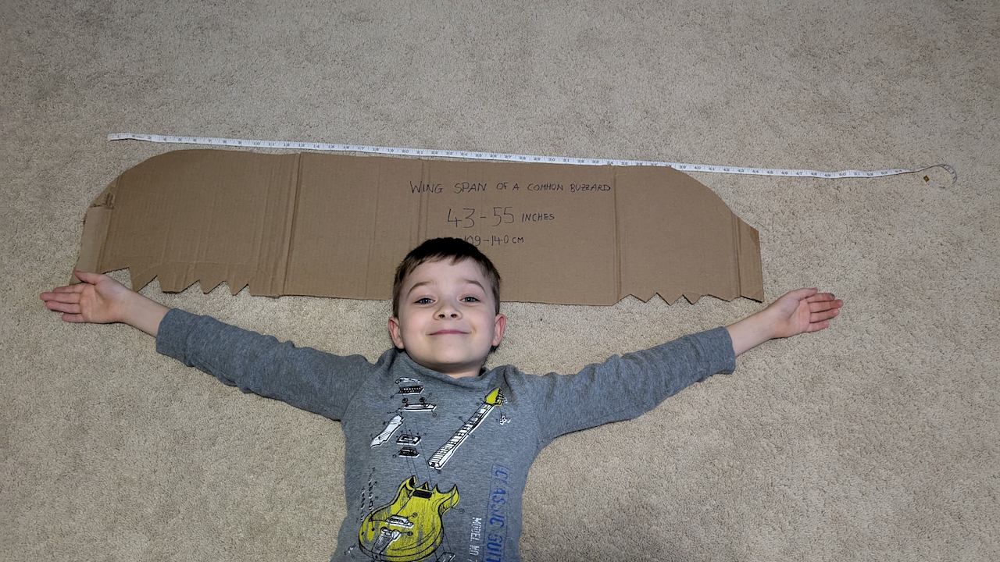
{.center}

---

## Historical Re-enactment: Flying Contest {#re-enactment}

```metadata
toc: "Re-enactment: Flying Contest"
time: 20-60 minutes
prep: 5-10 minutes
supplies: 8.5" x 11" sheets of paper
```

> The newspapers and magazines were full of stories about people trying to fly. 
> Lilienthal, Pilcher, Chanute, MEN INTO BIRDS, the headlines read.
> I wondered if such a thing were really possible.
{.nowrap}

The Wright Brothers were not the only ones experimenting with powered flight. They were in a race to see who would invent it first. For this re-enactment, you can stage your own flying contest for your family. Who can build the best paper airplane?

Wilbur and Orville experimented with many different designs, continually refining their Flyer. The [Fold ‘N Fly website][foldfly] describes dozens of paper airplane designs, with different degrees of difficulty (easy, medium, hard, expert).  Some paper airplane designs are better at gliding and staying aloft, some are better for flying long distances, and others excel at acrobatics. Remind your young aerospace engineers that the Wright Brothers tried multiple designs before they succeeded. Encourage them to try folding multiple paper airplane designs to compare how each of the designs flies. Remind them to practice, just like the Wright Brothers did. (And for the younger kids, practice throwing or launching the airplane is also important).

[foldfly]: https://www.foldnfly.com/#/1-1-1-1-1-1-1-1-2

You can arrange your Flying Contest to have one, two, or even three categories:

1. Longest distance
2. Longest time aloft
3. Most acrobatic

As you can see in [this video of the Paper Plane World Championships][world], the paper airplane design depends on which category you are competing in. If you have multiple categories for your Flying Contest, you might want to allow the contestants to enter different planes for the different categories. For our contest, we found it easiest to contend just for the longest distance.

[world]: https://www.redbull.com/int-en/recap-videos/red-bull-paper-wings-world-final-2022

Give each contestant at least three “flights” with their chosen design. Distance flights work best in a large room but they can be done outside also. The obstacles in the flight path (furniture) can also make the contest more challenging.

More contestants means more fun. This is a great activity to invite other families to join. We had two families, three generations: 6 kids and 6 adults. Everyone likes flying paper airplanes. Who knows, you may even want different divisions, one for kids and one for parents 🙂


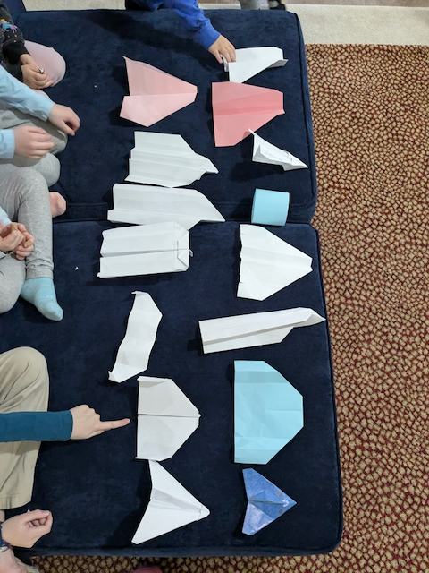<br>
We tried lots of different designs just for fun.
{.center .caption}

---

## Supplemental Reading: _Wilbur Wright Meets Lady Liberty_ {#supplemental}

```metadata
time: 15 minutes
```

> Wilbur, cautiously looking both sideways and ahead, begins to fly past the statue’s waist. For one brief moment, he flies through shadow. Lady Liberty’s huge body seems to block the light.

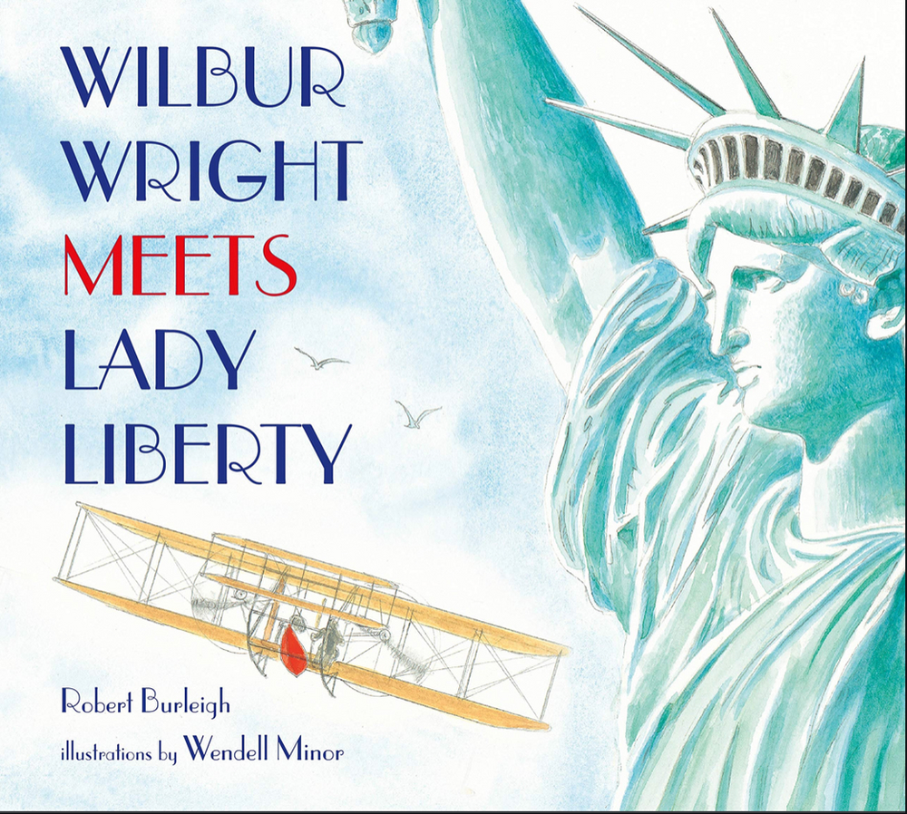
{.center}

**Title:** _Wilbur Wright Meets Lady Liberty_<br>
**Author:** Robert Burleigh<br> 
**Illustrator:** Wendell Minor<br>
**Year Published:** 2021<br>
**Length:** 40 pages

This gorgeously illustrated book tells the story of the first public flight in America by the Wright Brothers. It had been six years since the Wright Brothers first flew at Kitty Hawk in 1903 and many people still did not believe powered flight was possible. That changed on September 29, 1909 when Wilbur Wright flew around the Statue of Liberty while thousands watched and cheered. The recognition he received was an accolade to all of their hard work over the last decade.

The author, Robert Burleigh, not only captures the excitement of the crowd seeing powered flight for the first time but also the courage of Wilbur Wright: “If even one tip of the Flyer’s wing touches the statue, he will spin crazily out of control and plunge to his death.” He attached a canoe to the Flyer in case of a forced landing in the harbor. While the Wrights had proven powered flight was possible, it was still dangerous; Orville had crashed the previous year during a demonstration flight for the Army. His passenger was killed and Orville was hospitalized for weeks.

As the story shows, this historic flight also inspired a young boy on his own entrepreneurial journey. Juan Trippe grew up to found Pan American Airways, the first airline to fly worldwide and an iconic airline of the 20th Century.

---

## Scripture: Luke 6:42 {#scripture}

```metadata
time: 10 minutes
```

> How can you say to your brother, ‘Brother, let me take the speck out of your eye,’ when you yourself fail to see the plank in your own eye?

What made the Wright Brothers such an innovative team was their approach to problem-solving. Wilbur claimed that they “thought” together. But it would be more accurate to say they challenged each other’s thinking as they bounced ideas back and forth, seeking for the truth. Each had their own strengths and way of approaching problems; working together they critiqued and improved and built on  each other’s ideas. 

In April of 1903, a few months before their successful flight, Wilbur, writing to a friend, used the scripture from Luke 6:42 to describe how their “honest arguments” led them to the truth:

_"...It was not my intention to advocate dishonesty in argument nor a bad spirit in a controversy. No truth is without some mixture of error, and no error so false but that it possesses some elements of truth. If a man is in too big a hurry to give up an error he is liable to give up some truth with it, and in accepting the arguments of the other man he is sure to get some error with it. Honest argument is merely a process of mutually picking the beams and motes out of each other's eyes so both can see clearly. Men become wise just as they become rich, more by what they save than by what they receive. After I get a hold of a truth I hate to lose it again, and I like to sift all the truth out before I give up to an error.”_

Our kids  are always ready to remove the specks in the eyes of their siblings. At a certain age, kids are more ready for the message of Luke 6:42. “Honest arguments” based on a desire to seek truth can be positive ways of advancing knowledge. However, a desire to prove yourself right and your sibling wrong just leads to bad relationships and bad feelings. After discussing this scripture, ask your kids to memorize it.

---

## Vocabulary {#vocabulary}

```metadata
time: 10 minutes
```

> Then they built a larger tunnel. 
> They learned about lift and drag. 
> They tried out many different kinds of wings.
{.nowrap}


This story introduces terms that inventors like Wilbur and Orville Wright might use as well as some specific terms about flight. This might be an opportunity to review and compare  the vocabulary words from _The Inventor’s Secret_.

Tinkering
: making small, experimental changes to an object or process in order to fix or improve it

Sturdy
: strongly built, solid

Cogs
: teeth on a wheel; when the cogs of one wheel mesh with another, turning one wheel turns the other

Shellac
: a liquid painted onto wood or other surfaces to protect it

Hearty
: vigorous, strong, enthusiastic

Confidence
: a relationship of trust

Scoured
: cleaned by rubbing hard with a rough material

Lift
: a force causing an airplane to rise in the air through different pressure on wings (see graphic below)

Drag
: the slowing force acting on a body (such as an airplane) caused by friction

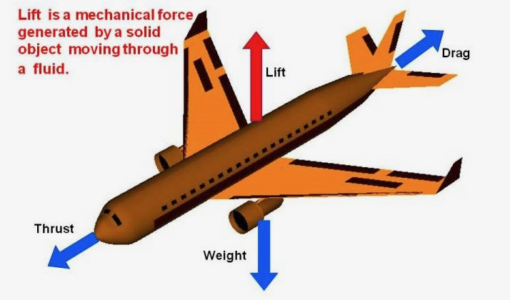
{.center}

---

## Art: State Coins {#art-coins}

```metadata
time: 10-20 minutes
```

> Dayton, Ohio, where we lived, was not the place to fly the craft.

Both Ohio and North Carolina like to claim the Wright Brothers. In 1999, the United States Mint launched the State Quarters Program. Each state got to place a design related to the state  on the back of the quarter. Over the next ten years, in the order they were admitted to the union, five new designs each year were released to the public. North Carolina (12th state in the union) was released in 2001; Ohio (17th)  was released in 2002. Both selected designs related to the Wright Brothers and their Flyer. 

The North Carolina design re-created the iconic photo of their first flight and was captioned, “First Flight.” Ohio’s design featured the Wright Flyer III and an astronaut. The caption reads “Birthplace of Aviation Pioneers,” with the astronaut a reference to two famous astronauts born in Ohio:  John Glenn (first American to orbit the earth) and Neil Armstrong (first man on the moon).

For this activity, ask your kids to draw a full-page version of either the Ohio or the North Carolina state quarter. Alternatively, (or in addition), they can draw their own design for a “family” quarter. What would you put on the back of a quarter to represent your family?

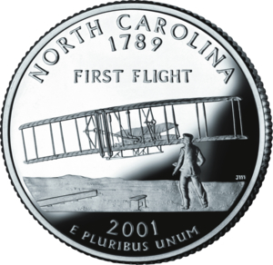
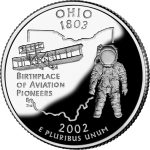
{.center}

---

## Civic Culture: Sibling Teamwork {#culture}

```metadata
time: 10 minutes
supplies: straws, tape
```

> Will and Orv. 
> Orv and Will.
> They worked side by side in the bicycle shop, whistling at the same time, humming the same tune.
{.nowrap}

Gather your children around (or if you have an only child, invite a cousin or close friend over) and challenge them to work together (as the Wright siblings did) to build the tallest (free-standing) tower they can using just straws and tape (for younger kids, magnatiles are a great alternative).  Provide them ample straws and tape and perhaps give them a time limit (we found that 5 minutes was too short and 10 minutes was about right).  Perhaps give them a target to achieve (can you make a tower taller than you?  Taller than 3 feet?).  Emphasize that they should work together and then see what they come up with!

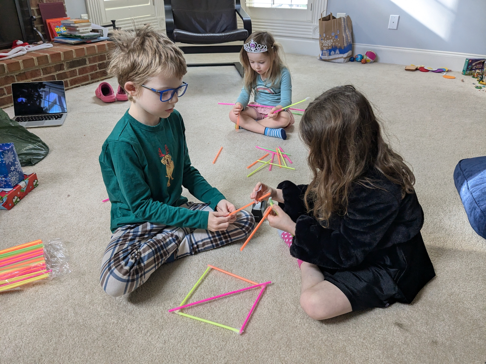
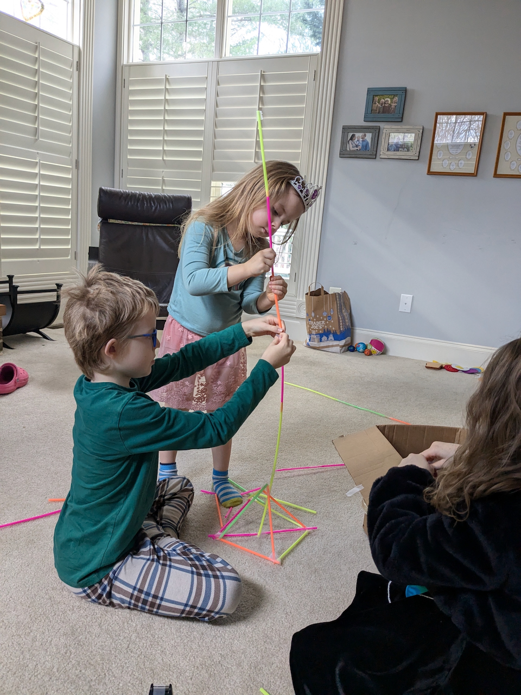
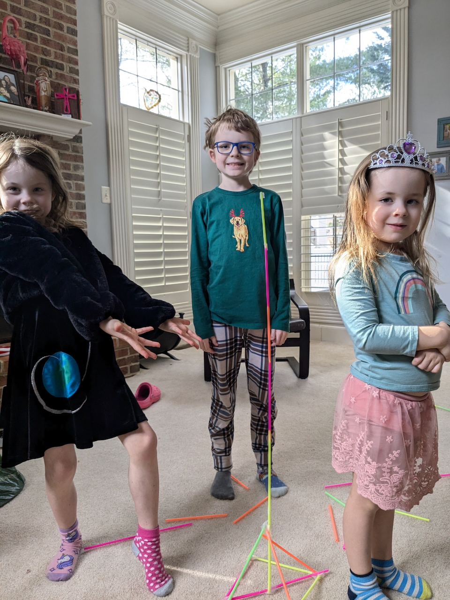
{.center}

---

## Math: First Flight Distances {#math}

```metadata
time: 20 minutes
```

> Then the plane raced forward into the strong wind and into history. 

Take a long tape measure and go outside to mark out the distances of the Wright Brothers’ first flight.  Orville flew for 12 seconds in the first flight and covered 120 feet.  The second and third flights were about 200 feet.  Wilbur flew for 59 seconds in the fourth (and last) flight of the day and covered 852 feet (you may want to pace this one off instead of using a tape measure).

Have your child(ren) measure out these distances and then walk or run them.  Alternatively, have them “fly” one of the planes they made along the distance.


