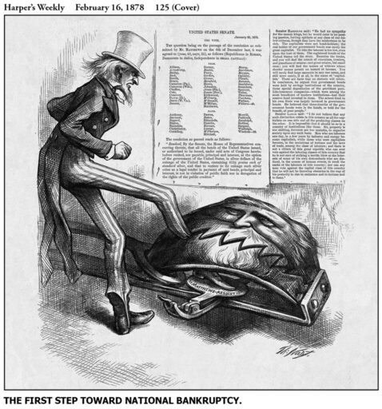
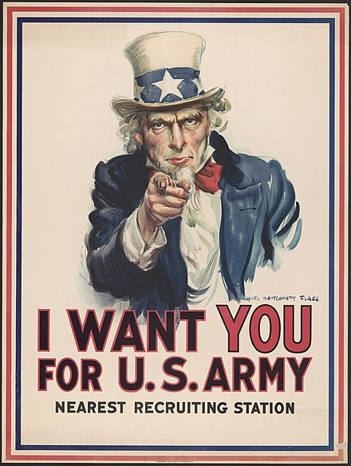
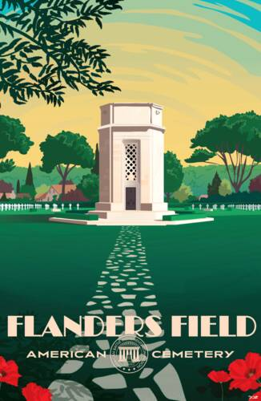
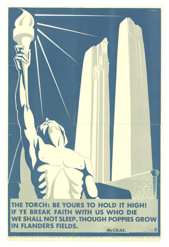
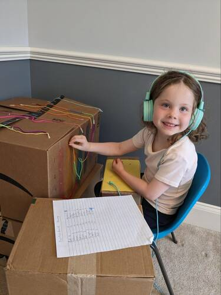
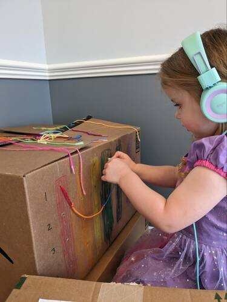
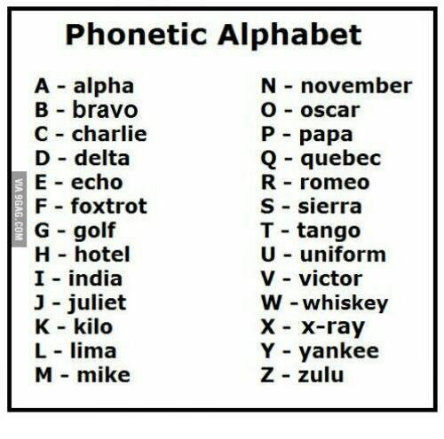

# The War to End All Wars?

## Introduction

World War I, also known as the Great War and the War To End All Wars,
devastated Europe. At its conclusion, the borders of many European
countries were changed, new countries were formed, and the Treaty of
Versailles, which formally ended the war, planted the seeds that would
lead to World War II just 20 years later. However, this war was also
famous for introducing a number of technical innovations used widely
during warfare for the first time including: airplanes, tanks,
submarines, camouflage, and the telephone. And it was also the first
time women were recruited for war by both Americans and our British
cousins.

Grace Banker’s service as chief operator of the Signal Corps Girls for
General Pershing’s American Expeditionary Forces is a singularly
American story. She, like thousands of other young women, answered the
call for volunteers to serve overseas. Her courage and dedication,
working day and night in poor conditions, through air attacks and
fires, exemplified the work ethic for which Americans are famous:
“Over here a Chief operator has a twenty-four hour job … never spent
more time at the office and never enjoyed it more.”

When Grace Banker and her Hello Girls returned from the war, they were
denied the benefits that veterans received. Other women who served in
World War I, mostly nurses (Army) and clerks (Navy), received
honorable discharges and veteran benefits. Although the Hello Girls
served closer to the front than most other enlisted women, it took
several decades of political fighting before they were awarded the
benefits and recognition their service to our country merited. This is
yet another example of the “grit” the Hello Girls displayed while
serving our country during World War I.

---

## Book

Title: "Grace Banker and Her Hello Girls Answer the Call:<br> The Heroic Story of WWI Telephone Operators"
Author: Claudia Friddell
Illustrator: Elizabeth Baddeley
Year Published: 2021
Length: 40 pages

---

## Calendar

Monday:
 - songbook
 - etiquette

Tuesday:
 - geography
 - uncle sam

Wednesday:
 - vocab
 - camouflage

Thursday:
 - re-enactment
 - trench cake

Friday:
 - the poppy lady
 - make your own poppies

---

## American Heritage Songbook: Over There {#songbook}

```metadata
toc: "American Heritage Songbook: _Over There!_"
time: 5 minutes
freq: daily
```

> Over there, over there
> Send the word, send the word, over there!
> That the Yanks are coming!
> The Yanks are coming!
> The drums rum-tumming
> Everywhere!
> So prepare, say a prayer,
> Send the word, send the word to beware - 
> We’ll be over, we’re coming over
> And we won’t come back till it’s over,
> Over There!
{.nowrap}

This song was written in 1917 by George M. Cohan, known as the “Man
Who Owned Broadway” because of the breadth of his skills as an
entertainer – he wrote over 300 songs, appeared in or produced over
three dozen Broadway shows. He wrote this song to announce to the
world that America was entering World War I and to encourage young
American men to volunteer to serve in the expeditionary force being
sent “over there” to fight the Central Powers. It is, in one sense,
the musical version of the recruitment posters seen in _Grace Banker
and Her Hello Girls Answer the Call_.

While the term Yankees (or Yanks) was applied to northern soldiers
during our Civil War, by the time of World War I it was more generally
applied to all Americans. The song, and especially the chorus above,
became an American standard, renewed in popularity during World War II
and, to a more limited extent, for the War on Terror after
9/11. General John J. Pershing led the American Expeditionary Forces
“over there.” After the war, inspired by the bands of the European
armies we were allied with, he formed the United States Army Band
(also known as “Pershing’s Own.”) You can hear Pershing’s Own
performing _Over There_ [here][ot0].

You can also [find][ot1] several other [versions][ot2] on [YouTube][ot3],
including [some that feature all][ot4] the verses.  [This version][ot5]
(just the chorus) is from the classic movie
_Yankee Doodle Dandy_, featuring James Cagney portraying George M. Cohan
himself, as America enters World War II.

[ot0]: https://www.youtube.com/watch?v=aGDds6bGFW8
[ot1]: https://www.youtube.com/watch?v=921z4LAHvak
[ot2]: https://www.youtube.com/watch?v=15R6Qv5PZqE
[ot3]: https://www.youtube.com/watch?v=wquvrM91Zz8
[ot4]: https://www.youtube.com/watch?v=9RYA0gQJ8qg
[ot5]: https://www.youtube.com/watch?v=i5oWH6JWBJY 

---

## Arts & Crafts: Make Your Own Uncle Sam Poster {#craft-uncle-sam}

```metadata
time: 15-20 minutes
prep: 5-10 minutes
supplies: construction paper, scissors, glue stick, crayons/markers, Uncle Sam coloring sheet
```

> The world was at war, and General John J. Pershing, the commander of US troops across the Atlantic, 
> was calling for female telephone operators to join the fight against Germany.

The origin of Uncle Sam as the personification of the United States
goes way back in our history. He is based on a real person, Samuel
Wilson, who owned a meat packing business. During the War of 1812,
Wilson supplied food for American soldiers. The barrels had “U.S.”
stamped on them for “United States” but soldiers knew Sam Wilson was
supplying them, so they called it “Uncle Sam’s.” The political
cartoonist Thomas Nast did much to shape our image of Uncle Sam in the
1870s. However, it was illustrator James Montgomery Flagg who was
responsible for the most iconic image of Uncle Sam, portraying him in
the famous “I Want YOU!” World War I army recruiting poster. Millions
of these posters were distributed and displayed.




{.center}

Now, it’s your turn to make your own Uncle Sam poster!

### Supplies
* Construction paper (ideally in red, white, and blue)
* Crayons or markers
* Scissors
* Glue stick
* [Uncle Sam] (or other) coloring sheet

[Uncle Sam]: https://coloringhome.com/coloring-page/269259?album=uncle-sam-coloring-pages 

### Directions
1. Color in Uncle Sam and cut him out
1. Cut out other stripes, stars, or other items from construction paper
1. Glue Uncle Sam and cut out shapes onto construction paper
1. Add phrases if desired


{.center}

---

## Geography: Whose Side Are We On? {#geography}

```metadata
time: 15 minutes
supplies: coloring map of Europe
```

> Young Women of America, Attention! Here’s your chance to serve your
> country in France with General Pershing’s Expeditionary Forces!

While we call it World War I, it was primarily a European war fought
between the Central Powers (Germany, Austria-Hungary, Bulgaria, and
Turkey) and the Allies (France, United Kingdom, Belgium, Russia, Italy
and the United States). Prior to World War II it was called the Great
War or, in America sometimes, the European War. The “war to end all
wars” began in 1914; the United States joined the Allies later in the
conflict, in April of 1917. Our entry into the war is considered by
historians as the first major turning point of the war, breaking the
stalemate between the Central Powers and the Allies. When the
armistice with Germany was declared in November of 1918, the United
States had been at war for just over 18 months.

America fought on the 400+ miles of the Western Front, which stretched
across France from the English channel to Switzerland. For this
activity, print a [map of pre-World War I Europe] that your child(ren)
can color (alternatively, you can ask them to do the activity below
with [this online map]). Ask them to:

[map of pre-World War I Europe]: http://lemosworld.weebly.com/uploads/6/6/1/3/66131857/world_war_i_map_activity.pdf
[this online map]: https://historicalmapchart.net/europe-world-war-1.html 

1. Select a color for the Central Powers and color the appropriate
   countries: Germany, Austria-Hungary, Bulgaria, Turkey (Ottoman
   Empire)
1. Select a different color for the primary Allied countries and color
   them: France, United Kingdom, Belgium, Russia, Italy)
1. With a black crayon, draw a line approximating the Western Front

While these were the primary countries involved, many others were also
pulled into the conflict, mostly on the Allied side: Serbia, Romania,
Montenegro, Portugal, Greece, China, Japan, Brazil. In the wake of
World War I and the defeat of the Central Powers, many new countries
were formed (e.g., Poland, Yugoslavia, Latvia, Estonia, Lithuania) and
the borders of others were changed significantly. This [side-by-side
comparison of European countries and borders before and after the war]
illustrates the extensive changes to Europe.

[side-by-side comparison of European countries and borders before and after the war]: http://schillingb.weebly.com/uploads/2/9/9/3/29937093/map-before-and-after-wwi.pdf

---

## Famous American Texts: _In Flanders Fields_ {#text}

```metadata
time: 5 minutes
freq: daily
```

> In Flanders fields, the poppies blow
> Between the crosses, row on row,
> That mark our place; and in the sky
> The larks, still bravely singing, fly
> Scarce heard among the guns below.
>
> We are the Dead. Short days ago
> We lived, felt dawn, saw sunset glow,
> Loved and were loved, and now we lie
> In Flanders fields.
>
> Take up our quarrel with the foe:
> To you from failing hands we throw
> The torch; be yours to hold it high.
> If ye break faith with us who die
> We shall not sleep, though poppies grow
> In Flanders fields.
{.nowrap}

_In Flanders Fields_ is the most famous poem written about World War
I. Composed in 1915 by Canadian soldier and physician, John Macrae,
who had joined the Canadian Expeditionary Force and found himself
fighting the Central Powers in the Belgium provinces of
Flanders. Flanders Fields was a major battle theater of World War I,
part of the Western Front that extended from the sea across Belgium
and France, all the way to Switzerland. More than a million soldiers
from 50 different countries were wounded, killed, or missing in action
at Flanders Fields. Today there are 247 different World War I
cemeteries there, including one for American soldiers.



{.center .small}

The popularity of the poem led to its use on recruiting posters and
ads for war bonds.


{.center}

Ask your child(ren) to memorize the part of the last stanza in the
recruiting poster above.  For younger children, ask them to memorize
just the first two lines of the first stanza.

---

## Cooking: Trench Cake {#cooking}

```metadata
time: 30-45 minutes
prep: 30-45 minutes
supplies: flour, butter, vinegar, milk, brown sugar, currants or raisins, cocoa, baking soda, nutmeg, ginger, lemon rind
```

> When she was off duty Grace was the life of the party! 
> There were villages to explore, dances to enjoy, dinners to share, and pranks to pull.

Civilians would send things to their loved ones who were at war in the
trenches.  Besides letters, some people sent trench cakes to soldiers
in the trenches (this seems to be primarily something done by those in
Europe).  Trench cakes are a dense cake, but tasty!  We have adapted a
European recipe below.

### Ingredients
* 2 cups flour
* ½ cup butter
* 1 teaspoon vinegar
* ½ cup of milk
* ⅜ cup brown sugar
* ⅜ cup cleaned currants (craisins or raisins could be used)
* 2 teaspoons cocoa
* ½ teaspoon baking soda
* Nutmeg
* Ginger
* Grated lemon rind

### Directions
1. Grease a cake tin
1. In medium bowl, rub margarine into the flour
1. Add the dry ingredients (except baking soda)
1. Mix well
1. Dissolve baking soda in vinegar and milk, and add to dry mixture
1. Beat well
1. Pour into the cake tin
1. Bake in the oven at 350 degrees for 30-40 minutes
1. Let cool and enjoy!

---

{.pagebreak}

## Historical Re-enactment: Be Grace Banker {#reenactment}

```metadata
time: 15-20 minutes
prep: 30-45 minutes
supplies: cardboard box, yarn
```

> Grace’s Signal Corps Girls connected hundreds of orders in an hour,
> thousands of commands in a day.

### Supplies
* Large cardboard box
* Scissors
* Yarn and tape or several shoestrings
* Paper and pencil
* Marker

### Directions
1. Take a cardboard box and, using scissors, punch holes in the side
   of it in rows and columns (we made four rows and six columns of
   holes).
1. Label the rows and columns.  This can be done with numbers, colors,
   shapes or some combination depending on the age of the child.  For
   example, we labeled the rows with numbers and the columns with
   colors.
1. Cut several pieces of yarn and tape each of the ends (the yarn
   should be long enough to connect the two farthest holes in your
   box.  Alternatively use shoelaces.
1. This completes the “switchboard.”
1. Write down a list of paired holes (identifying them by row and
   column) to indicate which holes should be connected via the two
   ends of the yarn.  In other words, these are the “calls” to be
   “connected.”
1. Have your child(ren) see how quickly they can connect the listed
   pairs of holes using the yarn.


For my older children, I wrote down a list of 10 pairs of holes (using
the colors/numbers to identify them).  We talked about rows and
columns (rows go across, columns go up and down) so they could
identify the correct holes. You can also make a table of coded
locations from the story (e.g., Red 3 = Waterfall, Blue 2 = Bonehead,
Green 1 = General Pershing’s HQ, Purple 4 = Podunk). Then, ask your
children to make specific connections:
* Connect General Pershing to Waterfall
* Connect Podunk to Waterfall
* Connect Jam to Buster


For my three-year-old, I simply had her match specific colors (“Can
you put one end in red and one end in blue?”).  We also had some
colored yarn and then she just tried to match the yarn color to the
hole color.  For her, it was good fine motor skills practice as well
as a chance to identify colors. My children all enjoyed being “Grace
Banker.”



{.center .smaller}

---


## Supplemental Reading: _The Poppy Lady_ {#supplemental-poppy-lady}

```metadata
time: 15-20 minutes
```

> Soon, Moina was surrounded by men wanting poppies of their own – to
> honor their buddies “sleeping” now among the poppies of Flanders
> Fields.


{.center}

**Title:** _The Poppy Lady_

**Author:** Barbara Elizabeth Walsh

**Illustrator:** Layne Johnson

**Year Published:** 2012

**Length:** 40 pages


Author Barbara Elizabeth Walsh tells the inspirational story of Moina
Belle Michael and the volunteer work she did to support American
soldiers leaving to fight in World War I. “She delivered books,
magazines, and candy to their camps nearby. She and friends invited
soldiers home for dinner… But Moina needed to do even more.” Each page
chronicles Moina’s next step as she decides what “even more” means to
her. Her lasting legacy is the red poppy, worn to honor not only the
fallen but all veterans who served America. “During the weeks before
Memorial Day and Veterans Day, veterans stand outside stores and
distribute poppies, raising millions of dollars for other veterans and
their families.” From America, wearing poppies in remembrance spread
through all the Allied countries of World War I.

And if you ask your child(ren) to flip to the “Afterword” pages of
_Grace Banker and Her Hello Girls Answer the Call_ you can see red
poppies strewn among Grace’s mementoes of World War I.

---
{.pagebreak}

## Arts & Crafts: Make Your Own Poppies {#craft-poppy}

```metadata
time: 20-30 minutes
prep: 10-15 minutes
supplies: egg carton, scissors, black tissue paper, red paint, paint brushes, glue, hole punch, ribbons or string
```

> Still … Moina needed to do even more.  She would not stop until
> every American wore a poppy to remember the soldiers.  Always.

### Supplies
* Egg carton
* Scissors
* Black tissue paper (optionally, black paint)
* Red paint 
* Paint brushes
* Glue 
* Hole punch
* Ribbons or string
* Optional: paper plate and green construction paper

### Directions
1. Cut out each egg container from the egg carton.
1. Cut out four “petals” from each egg container leaving the base
   (flower).  In other words, cut a few small ovals to convert the egg
   container from a complete cup shape to one that has gaps.  See
   picture below.
1. Paint the egg container “flowers” red and let them dry.
1. Crumple small amounts of black tissue paper into balls and glue
   them into the center of each egg container flower.  Optionally, use
   black paint instead.
1. Use a hole punch (or scissors) to make a hole in a petal and put
   string or ribbon through it to make a poppy necklace or two holes
   on opposite sides to make a poppy bracelet.
1. Optionally, make a poppy remembrance wreath.  Cut out the center of
   a paper plate and green construction paper in the shape of a
   wreath/donut.  Glue the green paper over the paper plate.  Glue egg
   container poppies onto the green wreath form.  Use hole punches to
   put in ribbon/string to form a hanger.  A phrase or word can also
   be printed on the wreath (such as “Remember” or part of Psalm 91,
   etc.)


{.center .small}

See also: [Egg Carton Poppies for Remembrance Day at Happy Hooligans][ecp].

[ecp]: https://happyhooligans.ca/egg-carton-poppies/

---

## Scripture: Psalm 91 {#scripture}

```metadata
time: 10 minutes
freq: daily
```

> He who dwells in the shelter of the Most High
> will rest in the shadow of the Almighty.
{.nowrap}

Psalm 91 is known as the Soldier’s Psalm or the Soldier’s
Prayer. Legend has it that in World War I the commanding officer of
the 91st Brigade had the Psalm printed on cards and distributed to his
troops. With its assurance of God’s protection in times of crisis for
those who put their trust in Him, over time it has become a powerful
source of inspiration and comfort to soldiers heading into
battle. During the Iraq and Afghanistan wars, [Operation Bandana]
distributed hundreds of thousands of bandanas to soldiers. The
bandanas, in camouflage colors, had Psalm 91 written on them – a great
example of Christian faith, generosity, and entrepreneurship in a
single venture.

[operation bandana]: https://www.fayobserver.com/story/news/military/2017/04/15/operation-bandanas-continues-decade-long-ministry-to-deployed-troops/21372153007/

Below is Psalm 91 in full. Consider having your children memorize the
first sentence or, for older children, the first two lines.

{{#with "&nbsp;&nbsp;&nbsp;&nbsp;&nbsp;&nbsp;&nbsp;&nbsp;&nbsp;&nbsp;&nbsp;&nbsp;&nbsp;&nbsp;&nbsp;&nbsp;&nbsp;&nbsp;" as |strophe|}}

> **He who dwells in the shelter of the Most High**
> {{{strophe}}}**will rest in the shadow of the Almighty.**
> **I will say of the Lord, “He is my refuge and my fortress,**
> {{{strophe}}}**my God, in whom I trust.”**
> Surely he will save you
> {{{strophe}}}from the fowler’s snare
> {{{strophe}}}and from the deadly pestilence.
> He will cover you with feathers,
> {{{strophe}}}and under his wings you will find refuge;
> {{{strophe}}}his faithfulness will be your shield and rampart.
> You will not fear the terror of night,
> {{{strophe}}}nor the arrow that flies by day,
> nor the pestilence that stalks in the darkness,
> {{{strophe}}}nor the plague that destroys at midday.
> A thousand may fall at your side,
> {{{strophe}}}ten thousand at your right hand,
> {{{strophe}}}but it will not come near you.
> You will only observe with your eyes
> {{{strophe}}}and see the punishment of the wicked.
> If you make the Most High your dwelling—
> {{{strophe}}}even the Lord, who is my refuge—
> then no harm will befall you,
> {{{strophe}}}no disaster will come near your tent.
> For he will command his angels concerning you
> {{{strophe}}}to guard you in all your ways;
> they will lift you up in their hands,
> {{{strophe}}}so that you will not strike your foot against a stone.
> You will tread upon the lion and the cobra;
> {{{strophe}}}you will trample the great lion and the serpent.
> “Because he loves me,” says the Lord, “I will rescue him;
> {{{strophe}}}I will protect him, for he acknowledges my name.
> He will call upon me, and I will answer him;
> {{{strophe}}}I will be with him in trouble,
> {{{strophe}}}I will deliver him and honor him.
> With long life will I satisfy him
> {{{strophe}}}and show him my salvation.”
{.psalm}

{{/with}}

---

## Vocabulary {#vocabulary}

```metadata
time: 10 minutes
```

> At the eleventh hour, on the eleventh day, of the eleventh month, an
> armistice was signed to end the war.

This story has more unfamiliar vocabulary words than most of our AHEP
recommended books. We’ve selected a subset that we think will help the
young reader better understand the story. After reviewing the
vocabulary with your listeners, ask them to ask questions about any
words that are still unfamiliar or confusing to them. Read the
sentences before and after the sentence containing the word they are
asking about to see if they can guess part of the meaning from the
context.

Doughboys
: nickname for American soldiers in World War I; origin of the
  nickname is unknown

Switchboard
: a device for manually connecting telephone calls

Grit
: courage and determination when faced with difficulties or danger

Enlist
: to voluntarily join the military

Expertise
: high level of skill or knowledge

Trenches
: long, deep holes dug in the ground for protection from enemy attacks

Shrapnel
: pieces of metal that fly through the air when a bomb explodes

Armistice
: formal agreement to temporarily stop fighting, typically so that
  peace can be negotiated

---

{.pagebreak}

## Art: Camouflage {#art-camouflage}

```metadata
time: 10-20 minutes
supplies: paper, crayons/markers
```

> Grace and her girls had plenty of grit. They kept their cool outside
> Liverpool when their ship, the perfect target for a German submarine
> attack, was stuck on a sandbar.

Camouflage is the use of artistic patterns to hide an object, person,
or animal. World War I introduced many innovations to warfare
(submarines, tanks, telephones). Among these innovations was “[dazzle
camouflage]” to conceal ships. Every ship had a unique dazzle
camouflage pattern so that enemies could not identify the type of a
ship by its camouflage pattern. (Ask your child(ren) to compare the
camouflage pattern of the ship Grace departs on and the one she
returns on? Are they the same? Is it likely that she returned on the
same ship she left on?)

[dazzle camouflage]: https://en.wikipedia.org/wiki/Dazzle_camouflage

There are also various [dazzle camouflage coloring sheets] available
[online].  In nature, some animals use dazzle camouflage. Among these
are leopards, jaguars, giraffes, and zebras. For this activity, ask
your child(ren) to draw either an object with a unique camouflage
pattern or an animal. For fun, they could camouflage an animal that
doesn’t normally use dazzle camouflage, like an elephant or
rhinoceros.

[dazzle camouflage coloring sheets]: https://rangmaher.com/wp-content/uploads/2020/07/ww1-dazzle-camo-activity-1.pdf
[online]: https://www.theworldwar.org/sites/default/files/2022-03/dazzle-ship-coloring-sheet.pdf 

---

## Civic Culture: Proper Etiquette for Phone & Video Calls {#etiquette-phone-calls}

```metadata
time: 15-20 minutes
freq: daily
supplies: pretend or real phone
```

> When you said “Number Please” I couldn’t answer, there was a lump in my throat.

This is a great opportunity to discuss proper etiquette for phone
calls and, in today’s world, video conferences and calls. If your
family is anything like ours, when we call Grandpa and Nana all three
grandchildren want to talk at once. Much has changed since the days
when telephones were introduced into homes. But proper conversational
etiquette remains unchanged and is a valuable skill for youngsters to
learn.

For speaking on the phone, review and role play: identifying who you
are, with whom you wish to speak and what you want, asking politely
who is calling and what they want, how to deal with being put on hold,
and politely ending a call.

Perhaps the hardest (and most important) skill for children to learn
is waiting for their turn to speak – and not interrupting others when
they are speaking (or listening!). This skill is needed when a parent
is having a conversation with someone else on the phone. Explain to
your child(ren) the need for them to be quiet, and wait patiently to
talk to or get answers from the parent. Explain that they are only
hearing half the conversation and so even when a parent is quiet, they
still need to wait as their parent is listening to the other person on
the line. Simulate this for them by asking them to talk to one parent
while the other parent keeps asking the child questions.

For video calls and conferences, it can be even harder for children to
wait for their turn to speak, especially when there are multiple
children competing for attention. It may help to decide the order each
child will speak ahead of time and set their expectations
appropriately before the call starts. Explain how to ask politely
about video or sound issues, not to make a lot of background noise
when someone else is talking, and to say excuse me and wait for lulls
in the conversation to raise new topics.

In general, discuss the polite back and forth of conversation -
raising topics, asking and answering questions, waiting patiently for
a turn to speak, listening quietly and attentively.

And then, practice these skills with your kids through role-playing
phone and video calls to establish good habits. Once they are
comfortable with the concepts of good conversational etiquette you can
reinforce it during day-to-day conversations by praising them when
done right or reminding them gently about proper etiquette.

---

## Game: Code Names {#code-names}

```metadata
time: 15 minutes
```

> The names of all the places here and further fronts beyond are known under code names. 
> Waterfall Buster Bonehead Podunk Jam, etc., all mean some place very definite. 
> The codes are changed frequently so I have to keep up on everything.

In addition to code names for different locations, the military
developed a radio-telephone spelling alphabet that uses different code
words for each letter of the alphabet. The primary purpose of the
spelling alphabet is to clearly communicate over devices (radio or
telephone) where sound quality can lead to mistakes. For example, the
letters “F” and “S” can be easily confused but not “Foxtrot” and
“Sierra.”

Spelling alphabets were first introduced during World War I. Over the
years the code words were modified and standardized, and are now in
use in many other applications outside the military: law enforcement,
air traffic control, amateur radio, and more.

For this exercise, have your children learn to spell their own names
using the modern radio-telephone spelling alphabet, reproduced
below. For example, “Emily” would be spelled: Echo, Mike, India, Lima,
Yankee.


{.center}

---

## Game: The Telephone Game {#telephone-game}

```metadata
time: 15 minutes
```

> Nothing could shake the Signal Corps Girls from their stations.
> Every new call could save lives.
> Any missed command could lose the battle.

The traditional game of “telephone” demonstrates how messages get
muddled as they are whispered from person to person. The actual
muddling can be hilarious – everyone enjoys comparing the final
message to the original.

The rules are very simple:

1. You need 3 or more people in a line (5 or more is best).
1. The first person whispers a word or phrase to the second person –
   but only once!
1. The whisper should be loud enough for the next person to hear but
   quiet enough that no one else can hear it.
1. No deliberate changing of the word or phrase.
1. The word or phrase continues to be whispered to the next person in
   line until it reaches the final person who says it out loud and
   compares it to the original.

The Telephone Game is more enjoyable when unusual words or phrases are
used. For this version, consider having the parent start the first few
words or phrases and incorporate vocabulary words or sentences from
the story (e.g., “Grace and her girls had plenty of grit” or “Grace
and her gritty girls worked like beavers.”)

Besides being a lot of fun, the game teaches listening skills,
patience and taking turns, and the importance of accurate
communications – “any missed command could lose the battle.”

