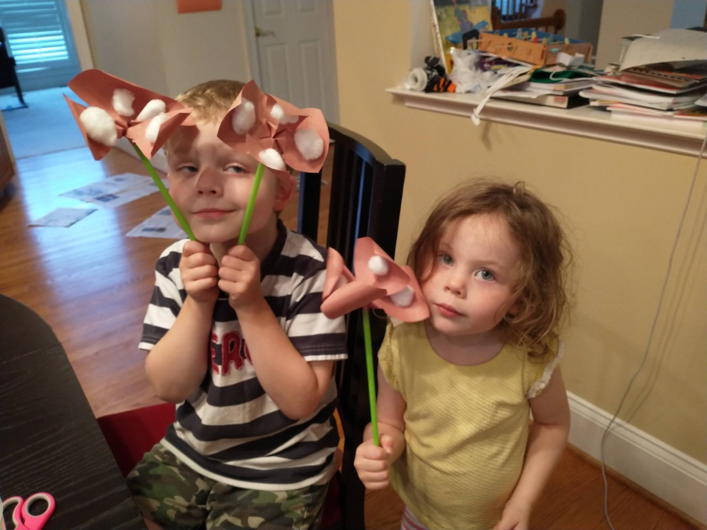
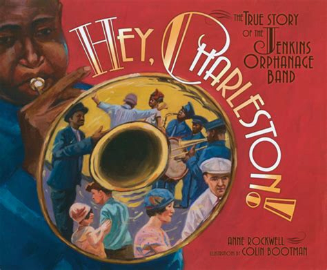

# Not Just Schools, But Pride

## Introduction

The story of the Rosenwald schools is a uniquely American story. Friends, families, neighbors joining together to raise the funds and then raise the roof for a new school for the community’s children. This was America’s civic culture at its best, a wonderful example of de Tocqueville’s 19th century observation about our unique ability to form voluntary associations to help each other: “Americans of all ages, all conditions, and all dispositions constantly form associations... Wherever, at the head of some new undertaking, you see the government in France, ...in the United States you will be sure to find an association.” And this happened not just once but thousands of times across fifteen different states.

The Rosenwald schools story also illustrates the incredible generosity of the American people. Julius Rosenwald, a man who made a fortune providing goods and services to people across the country, is inspired by Booker T. Washington to donate much of his fortune to building schools. But he will only contribute if there is a matching donation from the community. Tens of thousands of small donations are needed to earn the matching Rosenwald funds. As the narrator observes, “Mama and Daddy say raising money is hard work. I say it brings folks together.”

This is philanthropy that works – not a handout but a hand up. Epitomized by the work ethic of the American people, a community of people work together to build a better life for the next generation. “Thank you, parents and neighbors, for building this brand-new school. Your sweat taught us a lesson: Tomorrow is in our hands.”

---

## Book

Title: "Dear Mr. Rosenwald: The School That Hope Built"
Author: Carole Boston Weatherford
Illustrator: R. Gregory Christie
Year published: 2006
Length: 32 pages

---

## Calendar

Monday:
 - songbook
 - geography

Tuesday:
 - science
 - craft1

Wednesday:
 - "Vocabulary (before reading) [vocab]"
 - cooking

Thursday:
 - re-enactment
 - scripture
 
Friday:
 - thank-you
 - history

---

## American Heritage Songbook: Lift Every Voice and Sing {#songbook}

```metadata
toc: "American Heritage Songbook: _Lift Every Voice and Sing_"
time: 5 minutes
freq: daily
```
> After we sang “Lift Ev’ry Voice,” 
> Professor James told us to be proud.
{.nowrap}

The song the children sing when they first enter their new school was written in 1900 by James Weldon Johnson with music by his younger brother, J. Rosamond Johnson. At the time, James Johnson was the principal of a segregated school in Florida. He wrote it as part of a celebration of Abraham Lincoln’s birthday and it was sung by 500 school children at its debut. Johnson went on to become the president of the National Association for the Advancement of Colored People (NAACP), for decades a leader in advancing civil rights. The NAACP adopted his song as their anthem but the lyrics, with their call for the “harmonies of Liberty” and the final verse’s call to God to “keep us forever in the path,” are meaningful for all of us.

> Lift every voice and sing
> Till earth and heaven ring,
> Ring with the harmonies of Liberty;
> Let our rejoicing rise
> High as the listening skies,
> Let it resound loud as the rolling sea.
{.nowrap}

> God of our weary years,
> God of our silent tears,
> Thou who hast brought us thus far on the way;
> Thou who hast by Thy might
> Led us into the light,
> Keep us forever in the path, we pray.
{.nowrap}

YouTube has many different versions of _Lift Every Voice and Sing_ available. Many of them cover only the first verse, like this one [by Beyonce][song2]. One of the most inspiring versions, with sub-titled lyrics, is sung [by Tasha Cobbs Leonard][song3]. This a cappella version [by Committed][song4] features all three verses.

[song2]: https://www.youtube.com/watch?v=_Rn4Xh99dd4
[song3]: https://www.youtube.com/watch?v=vgN35XWnPKg
[song4]: https://www.youtube.com/watch?v=ngFDy52eCZY

---

## Arts & Crafts: Make Your Own Cotton Blossom {#craft1}

```metadata
time: 20-30 minutes
prep: 10-15 minutes
supplies: construction paper, cotton balls, straw, glue stick, scissors
```

> Harvest break –
> just when I memorized the times tables. 
> Instead of learning long division,
> I’ll be working in the field.
{.nowrap}

Not only do you make your own cotton blossom, but you can also make your own 3-D picture of a cotton field. Consider watching the video in the Science activity on Growing and Harvesting Cotton either before or after this activity.

### Supplies

* Construction paper (brown or green)
* Cotton balls
* Straw
* Glue stick
* Scissors

### Cotton Blossom Directions

1. Cut out the construction paper to form the petals of a cotton blossom, leave enough extra construction paper at the bottom to twist the petals together.
2. Twist the bottom of the petals together to form the blossom and use a glue stick to attach a cotton ball at the center of each petal.
3. Insert the twisted bottom into the straw (we used green straws to make it look more like a flower stem).

### Cotton Field Picture Directions

1. Have your child draw a picture of a cotton field.
2. Use a glue stick to glue on cotton balls (or small pieces of cotton balls) onto the field for a fun 3-D picture.

<br>
Cotton blossoms!
{.center .caption}

---

## Geography: Mapping Rosenwald Schools {#geography}

```metadata
time: 10 minutes
supplies: Puzzle map of the United States
```

> Years ago, Booker T. Washington started Tuskegee Institute in Alabama.
> The college grew strong as an oak, but Booker T. Washington would not seek the shade, not as long as young minds starved.

Over a 20-year period, from 1913 to 1932, almost 5,000 Rosenwald Schools were built in 15 states: Alabama, Arkansas, Florida, Georgia, Kentucky, Louisiana, Maryland, Missouri, Mississippi, North Carolina, Oklahoma, South Carolina, Tennessee, Texas, and Virginia. Place just these 15 states in your United States jigsaw puzzle (or color just these states in your coloring map).

Ask your child(ren) if they notice anything about where the Rosenwald Schools were built? Why do they think they were built primarily in the southern states? Why not elsewhere?
Some states had more schools than others. North Carolina had over 800, over one fifth of all schools. [This map][geo1] shows you the density of schools in the 15 states.

[geo1]: https://www.historysouth.org/schoolmap/

---

## Famous American Quotes: Booker T. Washington {#text}

```metadata
time: 5 minutes
freq: once
```
> If you can't read, it's going to be hard to realize dreams.

Born in slavery, Booker T. Washington was the founding principal and first president of Tuskegee Institute (now Tuskegee University). Washington led Tuskegee for almost 30 years, taking it from a school devoted to training black teachers to one of the historical black colleges and universities.

Washington’s most famous speech, the “Atlanta Compromise,” called for blacks to lift themselves up through education and entrepreneurship. Tuskegee Institute helped advance his goal of lifting up blacks through self-reliance. You can see those same ideals embedded in the creation of Rosenwald schools.

The quote above epitomizes Booker T. Washington’s devotion to education. Ask your child(ren) to spend time throughout the week memorizing it.

---

## Cooking: Sweetish Spirits {#cookbook}
```metadata
time: 60-90 minutes
prep: 30-45 minutes
supplies: butter, sugar, eggs, flour, vanilla, baking powder
```
> Me and Mama baked two apple pies, put them in a box and tied it shut.

This activity is an important part of the Box Party historical re-enactment below. If you have a favorite apple pie recipe, use it to bake a pie (or two!) with your child(ren). For our family, we baked some of our favorite cookies, Sweetish Spirits (originally, Swedish Spritz, but the name has been modified over time by generations of children while the recipe has been modified by generations of parents). You can find many recipes for these. The one we use is:

### Ingredients

* 1 1⁄2 cups butter
* 1 cup sugar
* 2 teaspoons vanilla
* 2 well beaten eggs
* 4 cups flour
* 1 teaspoon baking powder

### Directions

1. Mix butter and sugar together
2. Add eggs by hand
3. Add vanilla
4. Add 2 cups flour and baking powder
5. Mix well
6. Add the rest of the flour
7. Roll into two balls
8. Chill in refrigerator for 2 hours
9. Roll flat on flour board
10. Cut cookies with favorite cookie cutter shapes
11. Place on ungreased baking sheet
12. Decorate with sprinkles
13. Bake for 8-10 minutes at 400 degrees

---

## Science: Growing and Harvesting Cotton {#science}

```metadata
time: 10-15 minutes
prep: minimal
supplies:
```

> Six long weeks, down row after row, me and Junior worked right alongside Mama and Daddy, picking cotton till our fingers bled.

Cotton was the cash crop in southern states for generations. The United States, as late as World War I, produced two-thirds of the cotton for the entire world. It wasn’t until after World War II that a machine was successfully invented to harvest cotton. Up until then cotton was harvested by hand, 3-4 times per season, because the cotton bolls matured at different times.

There are many videos on YouTube illustrating the life cycle of cotton and how it is harvested. Below are some of the shorter ones. Watching them will give your kids some context for the world that Ovella grew up in – and how things have changed since then.

* The [life-cycle of cotton][cotton1], from seed to blossom to boll to cotton. (1:35)
* Time-lapse photography of [cotton boll opening][cotton2]. (0:37)
* Hand-turned cotton gin for [separating seeds from the cotton][cotton3]. (1:25)
* Modern day [tractor-combine for harvesting cotton][cotton4] and separating the seeds. (2:08)

[cotton1]: https://www.youtube.com/watch?v=Ci6NI4fhchA
[cotton2]: https://www.youtube.com/watch?v=uQuXjj5ze6c
[cotton3]: https://www.youtube.com/watch?v=wm0_ir8_AZQ
[cotton4]: https://www.youtube.com/watch?v=U4pNeBr7L8g

---

## Historical Re-enactment: Throw Your Own Box Party {#re-enactment}

```metadata
toc: "Re-enactment: Throw Your Own Box Party"
time: 30-45 minutes
prep: 15-20 minutes
supplies: 
```

> Mr. Tanner said he smelled cinnamon through the box. Made his mouth water. He bought our box and ate a slice right away.

This activity is more fun with more people. The goal is to raise money for a worthy cause by auctioning anonymous baked goods. With more people you can have more goods to auction off and also more people bidding for the boxes. This is a great opportunity to include extended family, family friends, or other homeschooling families.

We chose to donate the funds raised by the box party to [Children’s Scholarship Fund][scholarship]. The Children’s Scholarship Fund takes an approach similar to Julius Rosenwald. They provide scholarship funds to low-income families to attend the school of their choice. However, they only provide a portion of the funds required. The family needs to provide at least 25% to ensure they are fully committed.

[scholarship]: https://scholarshipfund.org

The kids baked and decorated cookies (Sweetish Spirits, a family favorite, see above) for the “boxes.” They divided them into groups of four which gave us multiple items to auction. Each group of cookies had a theme associated with them (“Hearts,” “Forest,” “Red Hot,” “Flamingo,” etc.) and some groups were hidden under foil while others were not.

We invited extended family for the auction: aunts, uncles, and grandparents. Bidding was fierce at times as everyone got into the spirit of the event. At the conclusion of each auction the kids would deliver the cookies to the winning bidder and collect the money. The kids got very excited when cookies they had decorated were auctioned.

After the auction the kids sat down with us at the computer to watch us donate the money to the Children’s Scholarship Fund.

---

## Supplemental Reading: _Hey, Charleston!_ {#supplemental}

```metadata
time: 10 minutes
```

> The Jenkins Orphanage Band became so popular that they were invited to march in the inaugural parade for U.S. president Theodore Roosevelt.


{.center}

**Title:** _Hey, Charleston! The True Story of the Jenkins Orphanage Band_<br>
**Author:** Anne Rockwell<br> 
**Illustrator:** Colin Bootman<br>
**Year Published:** 2013<br>
**Length:** 32 pages

This wonderful, true story embodies so many of the virtues that make America exceptional: self-reliance, generosity, hard work, innovation and a trust in God. Reverend Daniel Joseph Jenkins of Charleston, South Carolina is the hero of this story. This social entrepreneur started by rescuing two homeless boys and from there started an orphanage which served thousands of children for over a century and is still operating today. To raise money initially, he solicited discarded and damaged musical instruments from the Civil War, taught the children how to play them, and created the Jenkins Orphanage Band.

They started playing in the streets of Charleston but over time their reputation grew. They started touring, first in America in big cities like New York, and then overseas in London and Paris. Families started paying money to have their children taught music by the Jenkins Orphanage. Graduates from the Jenkins Orphanage Band went on to play with famous Big Bands like Duke Ellington and Count Basie’s Orchestra.

They brought more than music on their tours. The boys in the band also had a unique style of dancing which is credited with contributing to the dance that became known as the Charleston during the Roaring Twenties.

We see many of the same traditional American values in _Hey, Charleston!_ that are in _Dear Mr. Rosenwald_, making it a great complementary read-aloud. Consider substituting _Hey, Charleston!_ on one of the days you are doing the activities in this module.

---

## Scripture: Philippians 2:14-15 {#scripture}

```metadata
time: 5-60 minutes
```

> Do everything without complaining or arguing, so that you may become blameless and pure, children of God without fault in a crooked and depraved generation, in which you shine like stars in the universe.

The words of their new teacher, Miss Shaw, echo the scriptural passage above from Philippians: “Children, you are diamonds in the rough. I will polish you bright as stars.”

Much of the community life portrayed in the story centers around church life: the opening rally, the first donation, the ongoing progress reports – even the song they sing, “Lift Every Voice in Song,” raises a prayer to God in the final verse. Ask your child(ren) to ring a bell each time they see or hear a religious reference in the story.

You can also ask your child(ren) to “shine like a star in the universe” by spending a day (or an hour) without complaining or arguing.

---

## Vocabulary {#vocabulary}

```metadata
time: 10 minutes
```

> Then, he unrolled big drawings – blueprints by a Tuskegee architect.

This story has many words that will be new to the young reader, several of which are used as the titles of the free verse poems on each page. The author provides plenty of context in some cases so your child(ren) can understand the gist of the word without needing the formal definition. However, some of the definitions below might help for words with which they are less familiar.

Corncrib
: a building with openings in the walls that provide ventilation for drying corn

Sharecropping
: renting land and giving part of the crop raised as the rent

Rally
: to gather people together for a common cause

Box Party
: a fundraising event where people donate anonymous goods in boxes that others bid on

Blueprints
: special drawing showing how a building will be made; a plan

Architect
: a person who designs buildings

Lumber
: wood prepared for use in building

Hand-Me-Downs
: any items already used that can be passed on to another for additional use

---

## Writing: Thank You Notes {#thank-you}

```metadata
time: 10-20 minutes
```
> Miss Shaw got busy right away. Our first lesson – letter writing.

_Dear Mr. Rosenwald_ concludes with the new teacher asking all of the students to write a letter thanking Mr. Rosenwald for his generosity in helping them build their new school. Ask your student(s) to write a letter thanking someone outside the family for something they’ve done for them. Candidates might include a Sunday School teacher for their work or a homeschooling parent for leading an activity in which your kids participated. Taking the time to write a thank you note can send a stronger message of gratitude and appreciation than just saying it (but you should say it also!).

---

## Writing: Point-of-View {#writing}

```metadata
time: 10 minutes
```

> Me on one side; Junior on the other. Till I passed fourth grade, I sat beside him, counting with my fingers and fidgeting on the pew. Now I know better.

A literary point-of-view is defined by who is telling the story – who is the narrator. There are three different views:

1. First person: the narrator tells the story from his or her own perspective. Descriptions and actions typically start with “I” or “we” (for example, “I baked the cookies.”)
2. Second person: the narrator tells the story from the perspective of you, the reader. Descriptions and actions start with “you” (for example, “You baked the cookies.”)
3. Third person: the narrator tells the story about the characters in the story. Descriptions and actions start with “he” or “she” (for example, “He baked the cookies.”)

Ask your young reader who is telling the story? Which point-of-view does the author use? This can be confusing. For example, while Ovella is telling the story in first person, in her first sentence she quotes her teacher as saying “You can’t judge a school by the building,” suggesting second person. In her next sentence, Ovella, referring to her teacher, says “she calls us vessels of learning,” suggesting third person. But it should be clear that the whole story is being told from Ovella’s perspective.

Ask your young reader why the author chose to tell the story from young Ovella’s point-of-view? Ovella’s grammar is poor in many places: “even if class don’t meet,” “how much money been raised,” “those trees about to make history,” “I’m going to stitch me a dress.” What is the correct grammar? Why did the author decide to have Ovella use incorrect grammar?

---

## Family History: Make Your Own Family Tree {#history}

```metadata
time: 15 minutes
```

> A family is like a tree, Daddy always said. Ours sprouted a new leaf – Leona
my baby sister. Soft, brown, bright-eyed.

You can give your children a sense of their own roots by constructing a basic family tree with them. You can draw it with them using simple boxes. Draw small squares with the names of all the siblings in the family, Mom, Dad, and whatever special names you use for grandparents (for our family, it is Nana, Pop-Pop, Granica, and Grandpa). Cut out the squares and then ask your kids to place them on the family tree template in the appropriate spots. Once they have them arranged appropriately you can tape or glue them to the template. (If you want to get more elaborate, you can include small photos of everyone).

From here, you can branch out to aunts, uncles and cousins or show them their roots go deeper by adding your own grandparents to the tree. If you go back far enough you can start connecting ancestors to some of the events in the AHEP books you’ve read. For older children, you can add birth years for everyone.

---

## Math: Rosenwald's Donations {#math}

```metadata
time: 20 minutes
```
> After Booker T. passed, Mr. Rosenwald kept building – not just schools, but pride. Before his foundation will give a cent, you have to raise money on your own.

This activity should be tailored to the age of your kids. It’s an opportunity to play with numbers and get a feel for the amount of money required to build the Rosenwald Schools. For example, you can break the math problems down into several pieces to avoid complicated multiplication which our kids have not yet learned. Assume that each school cost $1,000 to build and ask your kids:

* If Julius Rosenwald donated half the cost of a new school, how much did the community have to donate? How much did Rosenwald donate?
* How much did Julius Rosenwald donate for 10 schools? 100 schools? 1000 schools? Add up the amount for 1,000 schools five times (Over 5,000 Rosenwald Schools were built).
* Why do we put commas in numbers?