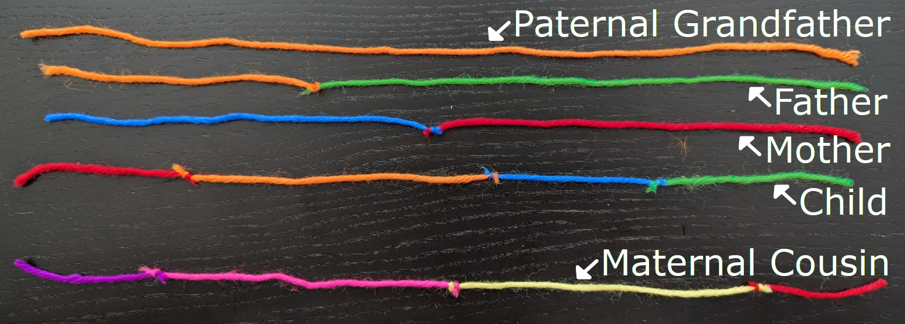

# Freedom Is Not Free

## Introduction

The freedoms we enjoy as Americans do not come without cost. The price we pay is sometimes high. In wartime, that price includes the lives of many of the men and women who join our armed forces to defend us and our American way of life, our American heritage, our American values.

An important part of our American heritage is remembering and honoring the men and women who fought and continue to fight for our freedoms. As a nation, we have established sacred traditions, erected monuments and memorials, and set aside special days each year to remind ourselves and to teach the next generation of the sacrifices made by those who came before them.

Guarding the Tomb of the Unknown Soldier at Arlington National Cemetery in Virginia is one of those sacred traditions. The Vietnam Veterans Memorial in Washington, DC is one of those memorials. And Memorial Day and Veterans Day are federal holidays designated to remember and honor those who served and are serving our country.

---

## Book

Title: "Twenty-One Steps: Guarding the Tomb of the Unknown Soldier"
Author: Jeff Gottesfeld
Illustrator: Matt Tavares
Year published: 2021
Length: 32 pages

---

## Calendar

Monday:
 - songbook
 - craft1

Tuesday:
 - history3
 - double-helix

Wednesday:
 - "Vocabulary (before reading) [vocab]"
 - cooking

Thursday:
 - re-enactment
 - supplemental
 
Friday:
 - history1
 - culture

---

## American Heritage Songbook: _Taps_ {#songbook}

```metadata
toc: "American Heritage Songbook: _Taps_"
time: 5 minutes
freq: daily
```

> There were speeches, Taps, and a twenty-one gun salute when I was laid to rest.

_Taps_ is a distinctive tune, a bugle call, traditionally played at military funerals and memorials. General Daniel Butterfield, commanding a brigade of the Army of the Potomac during the Civil War, composed Taps as a signal to his men that it was time for “lights out” at the end of the day. The tune was so popular it spread to other Union forces and eventually to the Confederates as well. Soon after its debut, it was also played at a military funeral, as a substitute for the traditional 21-gun salute, because of the fear that firing the guns would be mistaken as an attack due to the proximity of the enemy. In 1891 the haunting tune was officially adopted as a standard for military funerals.

At Arlington National Cemetery you can hear _Taps_ played several times a day. [This version}[song1] on YouTube shows members of the United States Army Band playing it in both summer and winter. [Here is another version][song2], with a drum introduction, played at the Tomb of the Unknown Soldier.

The author of the best-known lyrics for _Taps_ is unknown. Also known as “Day Is Done,” they are not part of military honors. However the first verse has been widely adopted by American scouting organizations and is sung at the end of the day.

> Day is done, gone the sun,
> From the lake, from the hills, from the sky; 
> All is well, safely rest, God is nigh.
{.nowrap}

[This beautiful a cappella version][song3] is sung by a granddaughter at her grandfather’s Celebration of Life memorial. The lyrics for all four verses are on the screen (though personalized at the end).

After familiarizing your child(ren) with one (or more) of the versions of _Taps_, consider playing it for them at bedtime when it’s time to turn out the lights.

[song1]: https://www.youtube.com/watch?v=Bfe4TxvUOiw
[song2]: https://www.youtube.com/watch?v=7_M5h0U3dng
[song3]: https://www.youtube.com/watch?v=Wkm4imcJs7E

---

## Arts & Crafts: Make Your Own Honor Guard {#craft1}

```metadata
time: 25-45 minutes
prep: 10-15 minutes
supplies: modeling clay or Play-Doh, cardboard
```

> On the eleventh day of the eleventh month, at the eleventh hour, a team of horses bore me to Arlington.

Make a model of the Honor Guard at the Tomb of the Unknown Soldier at Arlington National Cemetery. Discuss with your child(ren) what a model is – a small (or large) scale version of something. Models should include key details, but exclude other details. Pick a portion of Arlington National Cemetery (or other local national cemetery that your child may be familiar with) to model, and then discuss what the model should include. Look at some of the illustrations in the book for inspiration.

Here are some possible example scenes and items that could be modeled: Row(s) of white headstones on a lawn (with or without trees). Plaza of the Tomb of the Unknown Soldier. Tomb of the Unknown Soldier. A Sentinel Guard. Alternatively, a model could be made of the Vietnam War (or other War) memorial.

Once a scene or item is selected, discuss the details of the model. What are the important details that will make it recognizable? What scale should be used? What are details that should be skipped due to scale? (Should there be grass or snow? Are there wreaths or flags by the headstones? Are there people in the scene?)

### Supplies

* Modeling clay (optionally Play-Doh)
* Flat piece of cardboard
* Optional egg carton or other small boxes
* Optional tools: toothpicks, rolling pin, fork, knife, etc.

### Directions

Use the modeling clay (or Play-Doh) to make the model. Roll out and fashion the clay into the various pieces and stick them together. Set the model on the cardboard so you can easily move your model once it is completed. Let it harden according to clay directions. (With Play-Doh you can make the model and then put the Play-Doh away at the end to be re-used.)

The model can be done in many different ways. We set our model on cardboard and put part of an upside down egg carton on it to form a hill. We rolled out a thin sheet of green clay and set it over the carton and cardboard for a grassy hillside and lawn. My daughter used a clay tool to poke the green clay to make the “grass” more textured. We rolled out thin white snakes of white clay and then cut them into small pieces. We placed them in rows on the lawn to model the headstones (similar to the second illustration of the story).


<br>
Model of the Tomb of the Unknown Soldier, using an illustration from the story as a backdrop
{.center .caption}

We then covered a 3D rectangle in white clay for the Tomb of the Unknown Soldier and decorated the sides based on the illustrations in the book. We placed this on the hill to represent the Tomb of the Unknown Soldier plaza. We then used dark blue and yellow clay to make the Sentinel (along with some black, white, brown and peach clay). My son made the Sentinel’s rifle and shoes, and my daughter made the head and hat (leaving the rest of the Sentinel to me). My daughter insisted on making the mat for the Sentinel to walk on as well. We finished with an American flag (with only six stars).

For younger children, focusing on just making a model of the Tomb of the Unknown Soldier may be plenty. This is an opportunity to talk about clay molding techniques (rolling into balls, rolling into flat sheets, rolling into thin snakes, etc.) and color mixing (depending on what colors of clay you have available you may have to do some mixing to get the colors you want).

---

## Geography: The Four Unknown Soldiers {#geography}

```metadata
time: 15 minutes
supplies: Globe
```

> My guards were present when more Unknowns came home. One from World War II and one from Korea. Then, years later, one from Vietnam.

Sometimes the United States goes to war when we are directly attacked. However, there are also times when we go to war to help defend the freedoms of our allies, those countries who are aligned with our values or our national interests. When this happens, our soldiers may be fighting far from home and in different countries.

All around the world are American military cemeteries, where the servicemen and women who fought alongside our allies were buried. The four unknown soldiers buried at Arlington National Cemetery were selected from appropriate cemeteries to represent the four major conflicts in the 20th century involving Americans: World War I (>116,000 American deaths), World War II (>405,000), Korean War (>36,000), and Vietnam War (>58,000).

For this activity, you will need a globe or map of the world to locate the locations and countries where we fought alongside our allies. World War I, despite its designation as a “world war,” was fought primarily in Europe. And for America, the primary battles were fought in France. With your child(ren), identify Europe in general and France specifically. For World War II, identify Europe, North Africa, Hawaii, Philippines, and Japan. Finally, identify Korea (North and South), and Vietnam.

Consider wrapping up this activity with a brief discussion about why it is important to have friends (allies) when you need to defend yourself or your family or your country.

---

## Famous American Texts: Honored Glory {#text}

```metadata
time: 5 minutes
freq: once
```
> Here Rests In 
> Honored Glory 
> An American 
> Soldier 
> Known But To God
{.nowrap}

Above are the words written on the back of the Tomb of the Unknown Soldier. They are the only words on the tomb. While the first unknown soldier, from World War I, was buried there in 1921, it wasn’t until 1926 that Congress authorized funds to build a more elaborate monument. Designs were submitted and the simple but elegant design we see today, by architect Lorimer Rich and sculptor Thomas Hudson Jones, was selected and completed in 1929. Shaped like a sarcophagus, the tomb is constructed of four pieces of white, Yule marble from Colorado, weighing over 50 tons.

Have your child(ren) memorize the tomb inscription. Perhaps have them recite it at the end of the “Find 21” activity below.change and ask them to locate the motto on the different coins.


{.center}

---

## Cooking: Snickerdoodles {#cookbook}
```metadata
time: 30-45 minutes
prep: 10-15 minutes
supplies: butter, sugar, eggs, flour, vanilla, baking powder
```
> People, though, forget easily. My tomb stands on a hillcrest. It did not take long for visitors to come for the view and not the meaning.

Was there ever a more American cookie than Snickerdoodles? With a name like that, you'd think Yankee Doodle himself invented them. But, according to Stella Parks in _Bravetart: Iconic American Desserts_, snickerdoodles originated with the Pennsylvania Dutch (German) in the late 1800s, evolving around the turn of the century into the cookies we know today. The recipe below is simplified from _Bravetart_.

### Ingredients (Cookies)

* 2 and 2⁄3 cups flour
* 1 stick unsalted butter
* 1/2 cup refined or virgin coconut oil
* 1 1/2 cups sugar
* 3/4 teaspoon iodized salt
* 1 teaspoon baking powder
* 1/8 teaspoon nutmeg
* 1 tablespoon vanilla extract
* 1 large egg

### Ingredients (Cinnamon Sugar)
* 1/4 cup sugar
* 4 teaspoons cinnamon

### Directions

1. Preheat over to 400 degrees.
2. Sift flour into medium bowl.
3. Combine butter, coconut oil, sugar, salt, baking powder, nutmeg, and vanilla in the bowl of a mixer. Start on low speed, then increase to medium and beat until light and fluffy (about 5 minutes).
4. With the mixer running, mix in the egg and beat until smooth.
5. Reduce speed to low, add flour, and mix to form a stiff dough.
6. Divide into 26 portions and roll each portion into a smooth ball.
7. Mix sugar and cinnamon in a small bowl.
8. Tumble the cookie portions in the Cinnamon Sugar until fully coated, arrange on parchment-lined baking sheets, leaving 2.5 inches between each one. 
9. Flatten each portion into discs. Before baking, sprinkle all the discs with the remaining Cinnamon Sugar.
10. Bake for 6 minutes or until Snickerdoodles begin to spread.
11. Rotate baking sheet and reduce temperature to 350 degrees. Continue baking until cookies are firm around the edges but still puffy in the middle, about 5 minutes.
12. Cool on the baking sheet until edges are crisp (about 10 minutes).
13. Hum Yankee Doodle while you enjoy your Snickerdoodles! 

---

## Science: Make Your Own DNA Double Helix {#double-helix}

```metadata
time: 15-20 minutes
prep: 10-15 minutes
supplies: craft sticks, tape, markers or crayons
```

> In time, through the wonder of science, the Vietnam Unknown was named and returned to his family.

While everyone’s DNA is unique, it is all shaped the same. And the shape is very interesting, it is like a spiraled ladder, or what is called a “double helix,” two spirals winding around each other that are connected by the “ladder steps.” You can make your own model of the DNA double helix with the directions below.

### Supplies

* Craft sticks
* Tape
* Markers or Crayons (optional)

### Directions

1. Place two pieces of tape, roughly 12-18 inches long, parallel to each other on a table. The sticky side should be facing up, and they should be almost the width of the craft sticks apart.
2. Place craft sticks on the tape about an inch apart.
3. Place a second piece of tape on each side of your DNA so that no more sticky tape shows
4. Pick up your DNA by the top and bottom and gently twist it into a double spiral!

The strands of your DNA (the tape) are connected by four DNA building blocks (the craft sticks) that come in pairs. Optionally, you can represent these building blocks by asking your child(ren) to color the craft sticks before you assemble your double helix. Color them by making them half one color and half another color (see illustration below).


<br>
Make Your Own DNA Double Helix!
{.center .caption}

---

## Science: Modeling DNA Tests {#dna}

```metadata
time: 20-25 minutes
prep: 15-20 minutes
supplies: multiple colors of yarn, scissors
```

> His crypt is now empty.

### Supplies

* Multiple colors of yarn or string
* Scissors

### Preparation

Prepare several “strings of DNA” by tying several different colors of string together into a line (a normal square knot could work here, but tends to fall apart too easily; we recommend the sturdier “magic joining knot”, see this video or the instructions below). You’ll do one demo knot with your child(ren), but we found it’s better to have it mostly prepared ahead of time. All the final strings should have similar length. Ensure some pairs of strings have colors in common and other pairs have no colors in common, and have on hand several single-color strings as well. Ideally, each string has 1, 2, 4, or (maybe) 8, different colors.


{.center}

### Magic Knot Instructions

Cross the strings over each other (picture 2 below). Tie the first string (green here) in a simple overhand knot around the other (picture 3). Tie the second string (purple here) in a simple overhand knot around the first (picture 4). Note that with the knots arranged as in this picture, the lower strands will be cut off; the longer ends that will remain attached should each be going through a knot. Pull the knots as tight as possible (picture 5), then pull on the long ends to bring the knots together (picture 6). The loose ends can now be cut off very close to the knots (picture 7).


{.center .large}

### Directions

Explain to your child(ren) that their body is made up of trillions of cells, and each one contains an identical copy of a long stringy molecule called DNA. Each person’s DNA has thousands of chapter books’ worth of instructions that their cells use to do their day-to-day work. Every “chapter” in your DNA is copied from one or the other of your parents’ DNA, but siblings will get different parts from each parent, so that (aside from identical twins) everybody’s DNA is different from everybody else’s. Scientists today can chop up DNA into smaller pieces to recognize when two people share the same versions of the same “passage” and therefore likely inherited that same version from a common ancestor. We’ll be representing each person’s unique DNA as a different-colored string.

To demonstrate to your child(ren) how DNA mixing happens, start with a pair of single-colored (parent) strings and tie them together as earlier, but this time ensure the knot is closer to the center. As before, cut off (and discard) the loose ends to produce a full-length two-colored strand, representing the child. (My children wanted to pick out the colors of strings to join together and then cut off the loose ends themselves.) Explain that this sort of crossover happens in around 50 random places when two parents’ DNA combine to produce a child’s DNA. Now show another uncut strand that’s the same color as one of the parents and ask if (and how) these two people are related. Next show some pairs of the pre-tied strings and again ask if they’re related.

The child(ren) should recognize that two strings are related (as siblings, cousins, parents, etc) if and only if they have some color in common, and that a greater length in common corresponds to a closer relation. You can select a string to represent the unknown soldier and see if the child(ren) can find the closest relation among the other strings. In summary, each child has half of the DNA from each parent. Given two DNA strands, the more colors they have in common the closer they are related.

---

## Historical Re-enactment: Guarding the Tomb {#re-enactment}

```metadata
toc: "Re-enactment: Guarding the Tomb"
time: 30-45 minutes
prep: 10-20 minutes
supplies: shoe polish, white (or other) gloves, hats, formal attire, formal shoes, lint roller, pretend rifle
```

> They press their creases sharp as a razor. Re-hem their trousers so they lie just right. Singe loose threads from their jackets’ topstitching. Space their medals down to 1/64 of an inch. Practice keeping their forearms at 90 degrees. Recount pages of cemetery history. Set their hat brims two fingers above their eyes. Dampen their gloves to better grip their rifles. March so their heads stay ever level. Add metal to their heels for the sharpest click. Polish their “spits” for hours every day.

Re-enacting the sentinels guarding the Tomb of the Unknown Soldier helps demonstrate what a challenging job it is and how seriously they perform their duty. There are many elements of what the sentinels do that could be included in the re-enactment. Below are some possibilities.

### Supplies

* Shoe polish
* White (or other) gloves
* Hats
* Formal attire
* Formal shoes (ideally with a hard heel or toe that clicks)
* Lint roller (or masking tape wrapped around hand with sticky side out)
* Pretend gun (such as a nerf gun) or something to carry (could even be an empty wrapping paper roll)
* Sunglasses (optional)
* Model Tomb (optional)
* Pretend medals to pin on clothes (optional)

<br>
Preparing
{.center .caption}

To prepare for guarding the tomb, have your child(ren) shine some shoes, dress in Sunday best clothes, brush and slick their hair, lint roll their clothes and remove any loose threads, place a hat two fingers above their eyes, put on dress shoes, put on gloves, and hold their “rifle.” Have someone inspect your child(ren) to see that everything is perfect. Then have your child(ren) walk 21 steps, click their heels together, pause for 21 seconds, turn 180 degrees with a click, pause for 21 seconds, and then repeat. If you have multiple children they can take turns being on duty and relieving each other. Repeat the activity when it is dark to give a sense of what it is like for the sentinels who guard the Tomb of the Unknown Soldier 24 hours a day.


<br>
Guarding the Tomb
{.center .caption}

I was impressed with how serious my children were while “on duty.” They took turns marching and relieving each other. While guarding the tomb, they were focused and solemn (and even my two-year-old was faithful to her duty while waiting a long time for the next guard to be ready). Counting steps and then counting for the pause is difficult (especially at young ages). We counted out loud for my younger children while my eldest was able to count silently to himself. We used some old tap shoes for shoes that provided a satisfying click. I think the white gloves were particularly helpful in getting into character (we didn’t have any good hats on hand for this). We also had some of the grown ups participate (one as a guard and one doing the inspections). Having a grown up sentinel start the re-enactment may help demonstrate the task and make it more concrete for the younger sentinels. We had our model tomb in the background to provide something to guard.

---

## Supplemental Reading: _The Wall_ {#supplemental}

```metadata
time: 10 minutes
```

> This is the wall, my grandfather’s wall. On it are the names of those killed in a war, long ago. 
> “Where is Grandpa’s name?” I ask.
> “We have to find it,” Dad says.
{.nowrap}


{.center}

**Title:** _The Wall_<br>
**Author:** Eve Bunting<br> 
**Illustrator:** Ronald Himler<br>
**Year Published:** 1992<br>
**Length:** 32 pages

The Wall is an excellent supplemental reading for this module. While the Tomb of the Unknown Soldier honors the unknown soldiers who died for our country, the Vietnam Veterans Memorial lists the name of every known American who died in the Vietnam War — 58,318 of them, etched with simple elegance into black granite. Just like Twenty-One Steps, this story is about introducing the next generation to how we honor the warriors who fight for our freedoms.

The story is told through the eyes of a young boy, searching with his father for his grandfather’s name on the wall. Along the way he meets a disabled Vietnam veteran, a teacher and class visiting the wall, and a grieving couple. At the end, he leaves his own small memorial to his grandfather. A moving story with artwork to match.

---

## Scripture: Romans 12:10 {#scripture}

```metadata
time: 10 minutes
```

> Be devoted to one another in love. Honor one another above yourselves.

This scripture complements the “honored glory” our military exhibits in their round-the-clock, rain or shine, punctilious, sacred tradition of guarding the Tomb of the Unknown Soldier. The scripture emphasizes humility and respect, exhorting us to “honor one another above ourselves,” just as the soldiers do with their twenty-one steps.

The first sentence, “be devoted to one another in love,” is written about our Christian brothers and sisters. But it is worth asking our kids if it applies to their own brothers and sisters. You can follow up by asking your children what it means to them to “honor one another” above themselves. Then, ask them to memorize both sentences. This scripture could come in handy the next time siblings get into a spat. 

---

## Vocabulary {#vocabulary}

```metadata
time: 10 minutes
```

> Reverence in the angle of their rifles. 
> Discipline in their learning. 
> Respect in their hat brims. 
> Fidelity in their gloves.
{.nowrap}


_Twenty-One Steps_ will introduce the young reader to many new words concerning honor and respect (or the lack thereof). It’s always nice to ask your kids if they have an idea of what the words mean from the context of the story, after reading it to them a couple of times. An alternative is to ask them if there are any words they didn’t understand and then discuss the context with them with a few hints.

Salute
: to pay respect or honor with a formal sign, for example, raising your hand to the side of your head

Roiled
: disturbed, upset

Desecration
: to treat disrespectfully, shamefully

Sentinel
: guard

Tomb
: a burial room for an important person; crypt

Reverence
: to strongly feel or show respect or honor

Fidelity
: exact observance to details or duties

Desolate
: deserted, empty

---

## Writing: A Soldier's Story {#writing}

```metadata
time: 10-20 minutes
```

> I am an Unknown. I am one of many....
> In life, we were our mothers’ sons.
> In death, we are faded photos on the mantel, 
> empty chairs at Thanksgiving, 
> prayers in the dark before dawn.
{.nowrap}


_Twenty-One Steps_ is told from an unusual point-of-view (POV): a soldier killed in battle in the War to End All Wars (World War I). We don’t even know his name because he is “known but to God.” This can be confusing to young readers. But it is a powerful story-telling technique. Ask your young reader(s), why did the author choose to tell the story through the imaginary eyes of a dead soldier? He made the ultimate sacrifice for his country and by using his POV the author shows the impact on the family he left behind. 

By telling the story in first person, the author personalizes the story by inviting us to share the soldier’s perspective. And because the soldier is unknown, the author generalizes the soldier’s story to all fallen soldiers, past and present. Finally, because the soldier is dead, his story can span decades of time to include World War II, the Korean War, and the Vietnam War.

For older children, ask them to write a short story using the first person point-of-view of someone (or some thing) other than themselves.
 
---

## History: U.S. Military, Six Branches {#history1}

```metadata
time: 15 minutes
prep: 10-15 minutes
```

> They marvel at our sentinels. Then they gaze past the mat to the tomb, and imagine our stories. In that moment, we become theirs.

The United States military has an illustrious history that dates back many centuries. Since the founding of our nation, the need to protect American citizens and our national interests on both United States and international soils has been paramount.

Joining any branch of the military requires sacrifices and intense training to ensure all servicemen and women meet the unique physical and psychological requirements to successfully serve our nation. Although the different branches have many common goals they are all distinct.

Until quite recently, the armed forces of the United States consisted of five different branches: Army (founded 1775), Navy (1775), Marines (1775), Coast Guard (1790), and Air Force (1947). In 2019 a sixth branch was added, the Space Force. Each branch of our military is responsible for a specific mission. And, they each have their own song and emblem:

<br>
The Army is the oldest branch. The Army serves as a ground force, providing protection for U.S. interests and stability on U.S. soil and abroad.
{.center .caption}

<br>
The Navy protects American interests on water and near sea ports.
{.center .caption}

<br>
The Marine Corps are trained to combat on both land and at sea. Their primary focus is warfare. They bridge the land and the sea.
{.center .caption}

<br>
The Coast Guard protects lakes and rivers and provides search and rescue services. They operate under the Department of Homeland Security; all other branches operate under the Department of Defense.
{.center .caption}

<br>
The Air Force focuses on maintaining air superiority, global mobility and attack/combat support.
{.center .caption}

<br>
The Space Force protects American interests in space.
{.center .caption}

As Lee Greenwood sings [in this 1992 song][emblem1], these are the Great Defenders of the U.S.A., the [champions of freedom][emblem2].

[emblem1]: https://www.youtube.com/watch?v=5eiiwhorb8o
[emblem2]: https://www.youtube.com/watch?v=ALZeiANsBlk

As part of this activity, print the emblems for the six branches and use them as flash cards to teach your child(ren) to learn the branches and their primary missions. Or, you can also print two copies of each and play the memory game with them.

<br>
The Memory Game with military emblems.
{.center .caption}

---

## History: Find 21 {#history3}

```metadata
time: 15 minutes

```

> Late one half-moon night, I heard footsteps. 
> The sharp click of heels. Silence. 
> Another click. More silence. 
> Twenty-one footsteps. Click. 
> Twenty-one seconds of silence. Click.

The book is called _Twenty-One Steps_. However, the number twenty-one is associated with more than just the number of steps that the Tomb Guards pace off. Ask your child(ren) to find all the instances of twenty-one in the story (21 steps, 21 seconds, 21-gun salute, 1921).

Now ask them why the number twenty-one is so significant? Why do the Tomb Guards take twenty-one steps followed by twenty-one seconds of silence?

Today, the 21-gun salute is considered a high ceremonial honor used to signal respect to heads of state and at military funerals or other formal occasions. It evolved from the ancient tradition of demonstrating your peaceful intent when approaching a potential enemy. Ships approaching a foreign harbor would discharge their one-shot cannons to show their weapons were empty and they were on a peaceful mission. Typically, the number of cannon discharged were seven, and the shore batteries, with larger stores of ammunition, would respond with three volleys of seven cannon, or twenty-one.

The twenty-one steps and twenty-one seconds of silence are derived from the 21-gun salute as a way to quietly (and continuously) honor the unknown men and women who gave their lives while serving our nation.

After discussing the significance of the number twenty-one with your child(ren), have them practice marching twenty-one steps back and forth, with a pause of twenty-one seconds of silence in-between (the marching can also be done during the Historical Re-enactment activity).

---

## Family History: Military Service {#history2}

```metadata
time: 15 minutes
prep:
supplies: 
```

> I am one of many. From Bunker Hill to Heartbreak Ridge, we gave all we had for our country and freedom.

Many families have a relative who has served (or is serving!) in one of the branches of our armed forces. This is a great opportunity to share their stories with your child(ren). Any time you can personalize history by connecting it to family history you help history come alive for your child(ren). If you are unfamiliar with your relative’s story yourself, perhaps this would be a good opportunity to capture the story for future generations by sitting down and asking them to tell you about it. Or if it is an ancestor who served but is no longer alive, what can you share with your children about their story? What branch did they serve in? How long did they serve? What did they do in the service? Are any of them buried in one of our national cemeteries? Did they enlist or were they drafted? Were they involved in any wars? A visit to their grave or memorial might enhance the story of their service.

For some veterans the trauma of war never recedes and they may be uncomfortable talking about or remembering their service. In these situations, knowing that they served and thanking them for their service may be enough.

---

## Art: Backgrounds {#art}

```metadata
time: 15 minutes
prep: 
supplies: 
```

> In glorious sunshine, on bluebird days, the plaza shimmers with life.

Illustrator Matt Tavares paints gorgeous images to accompany the text by Jeff Gottesfeld. One of the techniques he uses in his paintings is to blur the backgrounds of the image. You can see this on the cover, where the soldier is drawn sharply but the trees and the sunset sky in the background are blurred.

Blurring the background is an artistic technique borrowed from photography, where it is called bokeh. Artists use it to make [a subject in the foreground stand out][pop] or “pop,” and thus provide a focal point for the viewer. Artists also use blurring to give the viewer a [sense of depth][depth] (in photography, the term “depth of field” is used to indicate how much of the image is focused vs. how much is blurred). Looking at the cover again, it’s clear that the soldier is closer to the viewer than the trees that are blurred in the background. In this example the blurring provides a focal point and sense of depth.

[pop]: https://photographylife.com/what-is-bokeh
[depth]: https://eclecticlight.co/2021/08/08/blur-in-paintings-2-depth-and-movement/

Blurring is also used to indicate that something is in rapid motion (again, something painters adopted from photography).

Start this activity by paging through Twenty-One Steps and asking your young reader to point out examples where the artist uses blurring for each of the three reasons described above: 1) make a subject in the foreground stand out to the viewer, 2) give the viewer a sense of depth, and 3) indicate rapid motion (see the sleet storm on the second to last illustration).

Finally, ask your young artist to make a drawing using blurring for one of the three reasons above.


{.center}

(Oh, and while you are studying the artwork of Twenty-One Steps, don’t forget to look at the bonus image underneath the dust jacket! We didn’t discover this Easter egg until we’d read the book multiple times!)

---

## Civic Culture: Honoring Military Service {#culture}

```metadata
time: 10 minutes
prep: 
supplies: 
```

> The Tomb Guards give all they have for us.

We have two major holidays to remember and honor the men and women who serve in our military forces. Memorial Day comes first on the calendar, the fourth Monday of May, as well as historically. The focus of Memorial Day is on those who have died serving our country. Memorial Day started after the Civil War with families laying flowers on the graves of soldiers; back then, it was called “Decoration Day.” Many communities lay claim to being the first to celebrate Memorial Day; so many in fact that it’s almost like it sprang up simultaneously after the Civil War.

After World War I, Decoration Day was enlarged to include all fallen soldiers, not just ones from the Civil War. To recognize this change, the name was changed to Memorial Day.

Today, we celebrate with parades, wearing red poppies (a tradition from World War I), and placing flowers on graves. At Arlington National Cemetery, soldiers place an American flag on every gravesite, 250,000 flags in a ceremony called Flags-In. And a wreath is laid at the Tomb of the Unknown Soldier.

Veterans Day comes on the eleventh day of the eleventh month, marking the armistice of World War I when fighting formally ended; for many years it was called Armistice Day. The name was changed to Veterans Day after World War II, to honor all veterans, not just those from World War I. While Memorial Day honors the dead, the focus on Veterans Day is on the living. Veterans Day honors all veterans of our armed forces.

Like Memorial Day, Veterans Day is celebrated with parades, poppies, and the laying of a wreath at the Tomb of the Unknown Soldier.

Twice a year, on Memorial Day and Veterans Day, is not too often to remember and honor the men and women who served and sacrificed for our freedoms. These are great opportunities to introduce your child(ren) to what and why we celebrate on these days. Wear a poppy, cheer a parade, thank a veteran, visit one of our 164 national cemeteries – start a tradition in your family the next time one of these holidays rolls around on the calendar.
