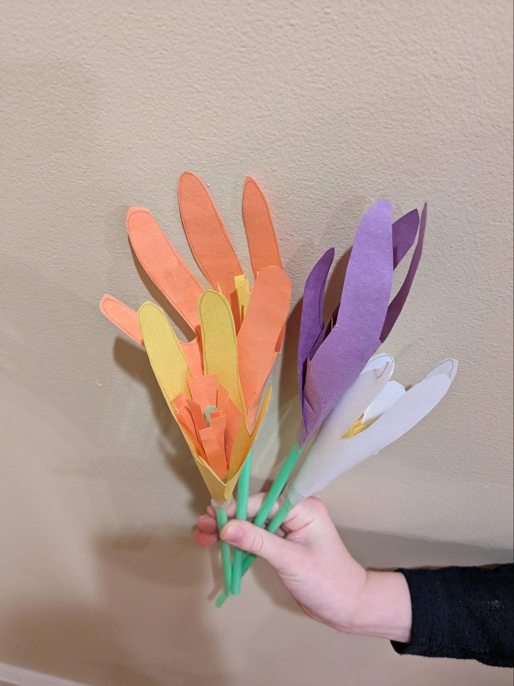
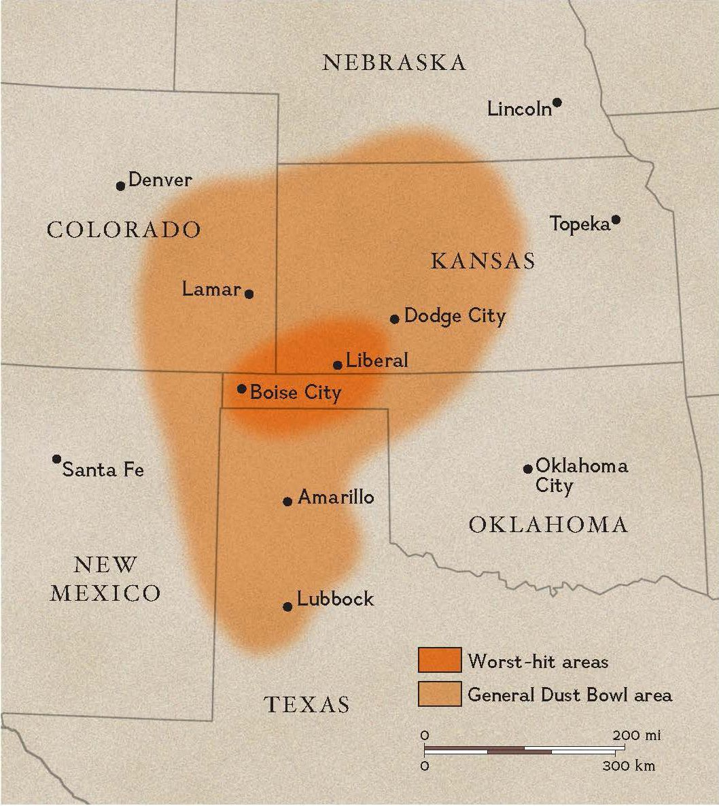

# The Great Depression

## Introduction

The Great Depression was an economic calamity for the United States and the world. In the United States it lasted over ten years (1929 – 1939), with massive unemployment levels hitting 25%, bank panics that led to hundreds of failures, and families losing their life savings, their livelihoods, their farms and homes. 

Economists dispute the causes of the Great Depression but there is a general consensus that government actions contributed significantly to it – and may have been almost completely responsible for it. The Smoot-Hawley Tariff Act of 1930, intended to protect American farmers from foreign competition by raising prices on foreign goods, resulted in countries around the world retaliating by raising their own tariffs. People in foreign countries could no longer afford to buy American products. Global trade shrank to almost nothing. The Federal Reserve, created in 1913 to prevent economic crises, played a leading role in causing the Great Depression. First, by encouraging financial speculation by making too much money, then triggering a collapse by taking money away, and next failing to lend to banks to save them from failing. 

Amidst economic  hardship we can barely imagine today, families and communities pulled together to help each other through the hard times. The Great Depression is where we saw our American heritage of **self-reliance, hard work, generosity, and voluntary associations** tested almost to the breaking point. Families started small “kitchen gardens” and communities organized “thrift gardens” on vacant lots where people could grow their own food. Churches organized potluck lunches and dinners as a way to share food. And in some farming communities, neighbors banded together to prevent bank foreclosures with “penny auctions.” When the property was put up for auction by the bank, neighbors would purchase it for pennies and then return it to the original owner.

---

## Book

Title: The Gardener
Author: Sarah Stewart
Illustrator: David Small
Year Published: 1997
Length: 40 pages

---

## Calendar

Monday:
 - songbook
 - text-fdr-speech

Tuesday:
 - geography
 - bouquet

Wednesday:
 - vocab
 - family

Thursday:
 - re-enactment
 - cooking1

Friday:
 - supplemental
 - science

---

## American Heritage Songbook: _Happy Days Are Here Again_ {#songbook}

```metadata
toc: "Songbook: _Happy Days Are Here Again_"
time: 5 minutes
freq: daily
```
> Happy days are here again
> The skies above are clear again
> So let’s sing a song of cheer again
> Happy days are here again
{.nowrap}

Ironically, this song was written before the stock market crash of 1929 that marked the beginning of the Great Depression. However, it was not released until after the crash and didn’t become popular until FDR adopted it as the theme of his presidential campaign in 1932. After three years of economic hard times, the song’s theme helped propel Roosevelt to the first of his four terms as president. Since then it has become an American standard, recorded by hundreds of artists and appearing in over 80 movies.

[Barbra Streisand’s slow, expressive version] is one of the best known; it was nominated for Record of the Year for the 1964 Grammy Awards. However, the song  is generally performed in a more rousing, upbeat tempo. [Here is one of the earliest versions], from 1930. Or you can [try this version], from 1961 by Mitch Miller.

[Barbra Streisand’s slow, expressive version]: https://www.youtube.com/watch?v=lcpnL8bIHk0
[Here is one of the earliest versions]: https://www.youtube.com/watch?v=oI5VfVAMyEI
[try this version]: https://www.youtube.com/watch?v=tsgw0W1RE5A

---

## Arts & Crafts: Make Your Own Paper Flower Bouquet {#bouquet}

```metadata
time: 15-20 minutes
freq: once
prep: minimal
supplies: tape, pencil, scissors, straws, construction paper
```

> Flowers are blooming all over the place.

### Supplies
* construction paper
* straws
* scissors
* pencil
* tape

### Directions
* Select various colors of construction paper to form the petals (outer part) of the flower.
* Trace your child’s hand on the paper and cut it out (tip: have the fingers semi-spread apart and make sure there is a wide base at the bottom (along the wrist)).
* Pick a different color (e.g., yellow) for the inner part of the flower.  Cut a rectangle about 1.5 inches by an inch.  Cut slits down the long way, but don’t go all the way to the bottom.
* Wrap the inner part of the flower around a straw and tape it in place near the top of the straw.
* Wrap the outer part of the flower around the straw and tape it in place a little below the inner part of the flower.
* Repeat until you have a small bouquet.

With the bouquet, you can arrange the flowers, connect them with a rubber band at the bottom of the straws, place them in a vase, or give them to someone going through a tough time.


{.center}

---

## Arts & Crafts: Burlap Doll Dress {#doll}

```metadata
time: 60 minutes
freq: once
prep: 20 minutes
supplies: burlap, scissors, sturdy needle, thick thread, doll
```

> I feel so pretty in your dress that you made over for me.  I hope you don’t miss it too much.

> Mama used flour sacks to make underwear for Leah.  (Leah’s Pony)

Both _The Gardener_ and _Leah's Pony_ include references to making clothing from used materials. For this craft, we will make a burlap dress for a doll. This activity is geared more toward older children. However, younger children may enjoy just feeling the material and describing how it feels.

### Supplies
* doll going through the “hard times” of the Great Depression
* burlap or other similar material
* thick/sturdy needle
* scissors
* thick thread


### Directions
* Fold the burlap in half (this way you only have to sew the sides and not deal with two individual pieces of burlap to be sewn together).  Lay the doll on the burlap with head just above the fold and trace out the dress.  The dress should be simple with a couple of sleeves and a skirt.  Leave enough room for seams and enough room to be able to slip the dress on the doll.
* Cut out the dress and a hole in the top for the doll’s head.  
* Optionally sew a design on the front piece (or possibly could use permanent marker).
* Place the two sides of material back-to-back.
* Take the needle and thread and stitch along the edges of the material everywhere except the holes for arms, neck/head, and legs.
* Put dress on doll.


{.center}

---

## Geography: The Great Plains and the Dust Bowl {#whose-side}

```metadata
time: 15 minutes
freq: once
supplies: jigsaw puzzle of U.S.
```

> Grandma told us after supper that you want me to come to the city and live with you until things get better.

The Great Depression impacted the entire United States and then spread to many other parts of the world. However, within the United States, some areas were impacted more severely than others. In particular, farmers living in parts of the Great Plains were hit by severe, even deadly, weather conditions that compounded the economic hardships of the Great Depression. Drought gave birth to erosion and enormous dust storms that blackened the skies, covering everything, and making breathing difficult. The part of the Great Plains most severely impacted by these conditions became known as the Dust Bowl. Watch [this two-minute video] to get some idea of one of the worst environmental disasters in American history.

The Great Plains stretch from the Mexican border all the way up into some Canadian provinces (see map below). Parts of several states comprise the Great Plains: most or all of Kansas, Nebraska, North Dakota and South Dakota; eastern parts of Colorado, Montana, and Wyoming; and parts of New Mexico, Oklahoma and Texas. What characterizes the Great Plains is broad, flat prairie grasslands which are situated east of the Rocky Mountains.

[this two-minute video]: https://www.pbs.org/video/dust-bowl-woody-guthrie-great-dust-storm/


{.center}

The Dust Bowl is part of the southern Great Plains. It consists of parts of the states of Kansas, Oklahoma, Texas, Colorado, and New Mexico (see map).



{.center}

For this activity, ask your kids to use your jigsaw puzzle map of the United States to assemble the states comprising the Great Plains. Ask them how large is the Great Plains compared to the (continental) United States as a whole. (Overall, the Great Plains are approximately 2,000 miles in length and 500 miles wide; over a million square miles).

Next, ask them to assemble just the states that were part of the Dust Bowl. Looking at the map above, ask them to draw a dust storm to represent the Dust Bowl. Draw it to the scale of the jigsaw puzzle map, cut it out, and place it on the map to cover the parts of the states impacted.


{.center}

Note: My children also enjoyed being a dust bowl/tornado.  Each child grabbed a Dust Bowl state and danced/spun/twirled around the room with it.

---

## Famous American Texts: _FDR's Inaugural Speech_ {#text-fdr-speech}

```metadata
time: 5 minutes
freq: daily
```

> The only thing we have to fear is fear itself.

Historians and economists mark October 29, 1929, the day the stock market crashed, as the beginning of the Great Depression. Herbert Hoover had been sworn in as president in March of that year and thus spent most of his presidency trying to turn the economy around. He failed. The presidential election of 1932 was a landslide win for his opponent, Franklin Delano Roosevelt (a.k.a. FDR), who carried 42 of the then 48 states. 

FDR faced the same problem as Hoover: how to turn around the economy of the United States of America. A key aspect of the Great Depression was the number of banks that failed. What sparked many bank failures was a “run” on the bank, which occurred when people lost confidence that a bank would be able to return their money and they all tried to withdraw it at the same time. Banks do not keep all the money people deposit with them in a vault; they loan most of it to other people. So if everyone wants their money back at the same time, the banks don't have it.

In his inauguration speech, FDR tried to restore the confidence of U.S. citizens in our economy. His speech focused on attacking the psychology that had gripped our nation. The most famous line from that speech summarizes that psychology: “the only thing we have to fear is fear itself.” 

It’s also worth noting that FDR declared “war” on the Great Depression, and asked Congress for extraordinary powers to wage that war: “I shall ask the Congress for the one remaining instrument to meet the crisis -- broad Executive power to wage a war against the emergency, as great as the power that would be given to me if we were in fact invaded by a foreign foe.” 

For this activity, ask your kids to memorize the famous line from FDR’s inauguration speech. Also, the next time you read _The Gardener_, see if they can find FDR’s photo.

---

## Cooking: Water Pie {#cooking1}

```metadata
time: 60 minutes
freq: once
prep: 15 minutes
supplies: pie crust, water, flour, butter, vanilla extract
```

> I know a lot about gardening, but nothing about baking. 

This surprisingly simple Great Depression recipe comes to us from [Southern Plate]. 

### Supplies
* 9-inch deep-dish pie crust, unbaked
* 1 1/2 cups water
* 4 tablespoons all-purpose flour
* 1 cup sugar
* 2 teaspoons vanilla extract
* 5 tablespoons butter, cut into 5 pieces

### Directions
1) Preheat oven to 400 degrees. Set empty pie crust on a baking sheet.
2) Pour water into the pie crust.
3) Mix the flour and sugar in a small bowl. Sprinkle evenly over the water in the crust. Do not stir.
4) Drizzle the vanilla over the water in the pie crust. Place pats of butter on top.
5) Bake at 400 for 30 minutes. Reduce heat to 375 and cover sides of crust to prevent burning, if needed. Continue cooking for an additional 30 minutes.
6) Pie will be watery when you pull it out of the oven but will gel as it cools. Allow to cool completely and then cover and place in fridge until chilled before cutting.

[Southern Plate]: https://www.southernplate.com/water-pie-recipe-from-the-great-depression/#recipe

---

## Cooking: Frosting Flowers {#cooking2}

```metadata
time: 30-45 minutes
freq: once
prep: 30-45 minutes
supplies: cupcakes or cake, frosting, frosting tips, plastic knives, sprinkles
```

> He appeared with the most amazing cake I’ve ever seen – covered in flowers! 

### Supplies
* Cake or cupcakes
* Frosting (homemade or store bought) - can be from a can if piping or from tubes for simplicity
* Various frosting tips (if using them) and bags
* Plastic knives
* Optional: sprinkles

### Directions
Take any cake or cupcakes and frost them in flowers.  Frosting can be homemade or purchased pre-made at the store.  For young children, you can either have them use some frosting that comes in a tube (store bought) to squeeze onto the cake or have them use plastic knives to spread the frosting.  They can then add sprinkles or other decorations.  For older children, you can introduce them to different frosting tips ([leaf], [rose], [carnation]) and let them try to make some frosting flowers of their own.  Whatever the end result, it should be delicious and worth a thousand smiles!

[rose]: https://www.youtube.com/watch?v=92OwOcq4Qr0
[carnation]: https://www.youtube.com/watch?v=nK5vKLBoQew
[leaf]: https://www.youtube.com/watch?v=j4loq1jRQdg

---

## Science: Grow Your Own Garden {#science}

```metadata
time: 15-20 minutes
freq: once
supplies: zip lock bag, paper towels, masking tape, uncooked lentil and/or bean seeds, green construction paper and markers
```

> I’ll try to write more, but I’m really busy planting all your seeds in cracked teacups and bent cake pans.

We are going to build a Sandwich Bag Green House so we can grow our own garden, rain or shine!

### Supplies
* zip lock bag 
* paper towels 
* uncooked lentil and/or bean seeds 
* masking tape
* optional: green construction paper and markers


### Directions
* Wet the paper towels with water and place them in the plastic bag (have them be fairly flat).
* Place the seeds on the wet paper towels in the plastic bag and seal it.
* Tape the plastic bag to a window that gets sunlight.
* Optionally cut the green construction paper into the shape of a house with a rectangular opening large enough for the flat zip lock bag to fit in it.  Use the markers to give the green house a name (example: Lydia Grace's Greenhouse) and then tape it around the plastic bag.
* Wait a few days and watch your seeds sprout!

Note: If you soak the bean seeds overnight in water, it will “wake up” the seeds and it will get them ready to germinate and deliver faster results. Lentils do not need to be presoaked.  

This activity can be done anywhere at any time of the year at low cost and low mess! It was fun to watch the lentils and pinto beans sprout!


{.center}

---

## Historical Re-enactment: Food Drive {#reenactment}

```metadata
time: 90 minutes
freq: twice
prep: 60 minutes
supplies: food bags, wagon
```

> Did she tell you that Papa has been out of work for a long time, and no one asks Mama to make dresses any more?
> I’m small, but strong, and I’ll help you all I can.

During the Great Depression families and communities worked together to help one another. In _The Gardener_, Uncle Jim takes in Lydia Grace and cares for her, while she returns his generosity with her own surprise. When economic conditions improve for her family, she is able to return home.

For this activity, you will need to locate a local food bank. These food banks solicit donations of food and money so that they can distribute food to families in need. Almost every community has a food bank (frequently more than one), however many of them only accept large scale food donations from restaurants, groceries, and wholesalers. 

You will need to find a food bank that accepts food donations from individuals. Typically, they will post on their website specific items that the food bank is running low on and need to be replenished. These are your primary “scavenger hunt” targets. 

Ideally, you would do this activity in two parts. The first part would be distributing bags to your neighbors that they can fill with food. We obtained bright green bags from our food bank. Then, we attached a letter describing what we were doing, the food bank we were partnering with, and the list of items needed by the food bank. The letter also said that we would return in a week to collect the (hopefully filled) bags from their porch. Because we were doing this in our local neighborhood, we were able to use a local emailing list to remind our neighbors the day before that we’d be returning to collect the bags.

The second part was collecting the bags the following Saturday. Seeing the bright green bags sitting on porches was not only encouraging to the kids (and parents!) but also a reminder to neighbors who might have forgotten. We collected the bags in a wagon that the kids pulled and pushed; we had to return to the house multiple times to unload the wagon. 

One of the kids suggested we leave a “paper flower” thank you to every household that contributed (see Arts & Crafts above). The kids made an entire bouquet of paper flowers, wrote "thank you" on each one, and distributed them either in person or left one on the porch.

This is a great activity to do with multiple families. You can go together as a large group, which is recommended by some people because it reminds neighbors to get their food donations ready when they see a large group of folks going door-to-door in the neighborhood. Or you can make it a friendly competition to see which family can get the most items on the food bank’s list and which family can get the most overall donations. 

You can also simplify this activity by taking your kids shopping for the needed food bank items and then delivering just your own contributions to the food bank. Or just make it a scavenger hunt through your own pantry with them.


{.center}

---

## Supplemental Book: _Leah's Pony_ {#supplemental}

```metadata
time: 15-20 minutes
freq: once
```

> Each day Leah loved to ride her pony into town just to hear Mr. B. shout from the door of his grocery store, 
> “That’s the finest pony in the whole county.”


{.center}

**Title:** _Leah's Pony_

**Author:** Elizabeth Friedrich

**Illustrator:** Michael Garland

**Year Published:** 1999

**Length:** 32 pages


_The Gardener_ is a window on life in a major city during the Great Depression. _Leah’s Pony_ shows the impact on rural families. More specifically, farming families in the Great Plains states who suffered from severe drought and deadly dust storms. Parts of Oklahoma, Texas, Kansas, Colorado and New Mexico became known as the Dust Bowl. “Some days the wind blew so hard it turned the sky black with dust.”

_Leah’s Pony_ tells the story of a young girl’s sacrifice for her family and how a community banded together to save her family’s farm when a bank foreclosed on the loans they could not pay back. Ask your kids to compare the corn growing taller than Leah's father and the blue skies in the early pictures with the black and yellow skies and the corn growing “no taller than a man’s thumb” later in the story. Children can be heroes too!

---

## Scripture: Matthew 25: 35-36, 40 {#scripture}

```metadata
time: 10 minutes
freq: daily
```

> For I was hungry and you gave me something to eat, 
> I was thirsty and you gave me something to drink, 
> I was a stranger and you invited me in, 
> I needed clothes and you clothed me, 
> I was sick and you looked after me, 
> I was in prison and you came to visit me… 
> **I tell you the truth, whatever you did for one of the least of these brothers of mine, you did for me.**

This scripture embodies the Christian ideal of caring for one another. The Bible has many verses on this subject (e.g., Hebrews 13:16, James 2:14-17) but none say it better than Jesus’ words as reported by Matthew. Our Judeo-Christian heritage is woven into our culture, making the American people the most generous nation on earth in terms of donating our time, talents, and financial resources.

Read the scripture to your children and discuss its meaning with them. Then, ask them to memorize the last sentence.

---

## Vocabulary {#vocabulary}

```metadata
time: 10 minutes
freq: once
```

> I adore the seed catalogues you sent for Christmas. And, Grandma, thank you for all the bulbs.

New vocabulary words from _The Gardener_ are, surprisingly, mostly about gardening: window box, bulbs, sprouting, blooming. Read the story a couple of times before asking your young reader if they know what the words mean from the context of the story. See if they can find the bulbs (two on the table and two on the chair) and Lydia Grace hugging the seed catalogues, then turn the page to Lydia Grace kneading the bread and, finally, go forward a few pages to see Lydia Grace sprucing up the bakery.

Window box
: a rectangular box situated at a window, filled with soil for growing flowers and other decorative plants

Catalogue
:  a list of items for sale (also spelled catalog)

Bulbs
: round roots from which some plants grow

Knead
: mix ingredients into a smooth blend by pressing, folding, and shaping

Sprouting
: when plants begin to grow

Sprucing up
: cleaning, improving, beautifying

Blooming
: when a plant’s flowers open

Unemployment
: when someone wants to find a job but can not (note: that this is not explicitly said in the book, but may be useful in discussing the Great Depression)

---

## Writing: Epistolary {#epistolary}

```metadata
time: 10 minutes
freq: once
```

> Dear Mama, Papa, and Grandma

_The Gardener_ is told through letters that Lydia Grace writes. Ask your children to write a story through letters. Who is the letter writer? Who are they writing to? What are the challenges of conveying everything through what is written to another character?

---

## History: Family Connections {#family}

```metadata
time: 10 minutes
freq: once
```

> I saw Uncle Jim almost smile today. The store was full (well, almost full) of customers.

Tell your children about relatives who lived through the Great Depression. How did their families make it through the tough times? How did the Great Depression impact their future lives?

---

## Art: Find the Cat {#art-find-cat}

```metadata
time: 10-20 minutes
freq: once
supplies: paper, crayons/markers
```

> More good news: We have a store cat named Otis who at this very moment is sleeping at the foot of my bed.

Shortly after Lydia Grace arrives in New York, she meets Otis, the store cat. Otis is in (almost) every illustration once he is introduced, including the end pages (the exception: when Lydia discovers the stairway to the secret place). Ask your kids to “find Otis” on each page. Then, go back to the beginning and “find the dog” who is reunited with Lydia (and meets Otis) in the very last illustration.

What does David Small, the illustrator, do to make Lydia Grace stand out in each picture? Point out to them how he uses white space almost as a spotlight to draw our attention to her. Finally, look at the picture of Lydia Grace when she first arrives in New York. How do you think she feels? What has the artist done in this picture to evoke this feeling?

Now, ask your young artists to try Small’s white space spotlight technique on one of their own drawings.


{.center .small}

---

## Math: Months and Days {#months-days}

```metadata
time: 15 minutes
freq: once
```

> September 5, 1935  …  December 25, 1935

All of Lydia Grace’s letters include a date at the top. For older children, you can ask them how many days (or months) are in between each letter.  You can ask what is the longest/shortest time between letters in the book.  For younger children, you can talk about how many days are in a month and count days between letters (on your hands in some cases).  You can use the "[knuckle mnemonic]" to help your child(ren) remember which months have 31 days and which have less than 31 days.

[knuckle mnemonic]: https://en.wikipedia.org/wiki/Knuckle_mnemonic

---

## Economics: Deflation, Bank Failures, Unemployment {#economics}

```metadata
time: 20-30 minutes
freq: once
prep: 10-15 minutes
supplies: egg carton, scissors, black tissue paper, red paint, paint brushes, glue, hole punch, ribbons or string
```

> “I borrowed money from the bank. I bought seeds, but the seeds dried up and blew away. Nothing grew. I don’t have any corn to sell. Now, I can’t pay back the bank,” Papa paused. “They’re going to have an auction, Leah. They’re going to sell the cattle and the chickens and the pickup truck.”

Hundreds of banks failed during the Great Depression. People who had deposited money in those banks, lost it. In economics, this is called deflation – a reduction in the amount of money in circulation. Prices, and economic activity in general, are also reduced because fewer dollars are available and people and businesses are afraid to spend them. Businesses don’t hire workers; people lose their jobs when businesses fail or when they reduce staffing levels to survive.

To illustrate these economic concepts you can do a couple of simple activities with your kids:

1. Bank Failure: to simulate a bank failure, confiscate (temporarily) their piggy bank. Tell them to pretend that it got lost and all the money they’ve saved is now gone. Ask them how they would feel if their piggy bank was gone forever. This is what happened to some families during the Great Depression – banks failed and families lost their life savings.

1. Unemployment: to simulate losing a job, tell your kids that you can no longer pay them an allowance. Ask them what they would do to replace their allowance.  In the Great Depression, you would look for another job. But all businesses were shutting down or downsizing and none were hiring new workers.


