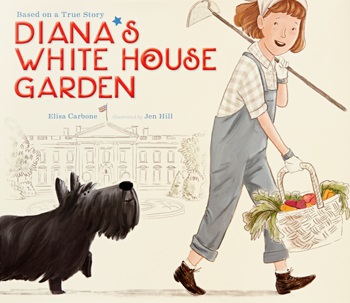

# Generosity In War & Peace

## Introduction

At its heart, the story of _Tucky Jo and Little Heart_ is about people helping one another. It starts with one act of kindness, a starving little girl showing a soldier how to get relief from bug bites. In return, he shares his food with her. Those initial acts of generosity grow and spread. First, he feeds her entire village. Then he gets his fellow soldiers to share their rations and, finally, risk their lives to save the villagers. This is American generosity on display in the midst of a World War.

The heart-warming conclusion to the story brings the cycle of generosity to a full circle. However, it also illustrates another aspect of the American story. Little Heart, the little Filipino girl, immigrated to America, became a nurse, married, and raised three sons, two of them doctors and the third an engineer. Because of Tucky Jo she jumped into the Great American Melting Pot and lived her own version of the American Dream.

Finally, we shouldn’t forget what brought Tucky Jo to the Philippines in the first place: his love for his country, his desire to defend her when she was attacked, his patriotism. Author and illustrator Patricia Polacco dedicated her story “To Kentucky Johnnie Wallen and his family and all of the brave soldiers who honor their country.”

---

## Book

Title: Tucky Jo and Little Heart
Author: Patricia Polacco
Illustrator: Patricia Polacco
Year published: 2015
Length: 48 pages

---

## Calendar

Monday:
 - songbook
 - craft1

Tuesday:
 - text
 - science

Wednesday:
 - "Vocabulary (before reading) [vocab]"
 - cooking

Thursday:
 - re-enactment1
 - scripture
 
Friday:
 - supplemental
 - history

---

## American Heritage Songbook: Stars and Stripes Forever {#songbook}

```metadata
toc: "American Heritage Songbook: _Stars and Stripes Forever_"
time: 5 minutes
freq: daily
```
John Philip Sousa composed and conducted dozens of musical pieces. He is most famous for his military marches, earning him the nickname of “The March King” for the 136 marches he wrote. In 1896 he composed his best-known march, Stars and Stripes Forever, which became the official march of the United States.

Marching bands typically play _Stars and Stripes Forever_ without the lyrics. The lyrics of the first verse introduce the themes of liberty and freedom that are emphasized throughout the song:

> Let martial note in triumph float
> And liberty extend its mighty hand
> A flag appears 'mid thunderous cheers,
> The banner of the Western land.
> The emblem of the brave and true
> Its folds protect no tyrant crew;
> The red and white and starry blue
> Is freedom's shield and hope.
{.nowrap}

[This version, by the U.S. Marine Band][song1], includes a brief introduction that describes the history of the song (Sousa led the U.S. Marine band from 1880-1892). [This version, by the U.S. Army Field Band][song2], includes a chorale that sings the last verse and shows several instruments being played up close, which your kids may find interesting. _Stars and Stripes Forever_ is a staple of [high school][song3] and [college marching bands][song4] across the country. Kids may enjoy watching them more than the stationary bands.

[song1]: https://www.youtube.com/watch?v=a-7XWhyvIpE
[song2]: https://www.youtube.com/watch?v=M5bcpjUjLpU
[song3]: https://www.youtube.com/watch?v=FBklceHey7A
[song4]: https://www.youtube.com/watch?v=fvdP13TetVI

---

## Arts & Crafts: Make Your Own Jiggy Doll {#craft1}

```metadata
time: 10-15 minutes
prep: 30-60 minutes
supplies: card stock, brads, scissors, pencil, hold punch, crayons or markers
```

> I spent most of that night whittling a hinged dancin’ doll for that little girl.

You and your kids can make your own jiggy doll without doing any whittling by using card stock and scissors. You can shape it yourself or use the template attached [here]. This activity can also be used with the “Not Just Schools, But Pride” module which also features a jiggy doll.

### Supplies

* Card stock
* 12 brads (as small as you can find, we used one inch but half inch would be better)
* Scissors
* Pencil
* Hole punch
* crayons or markers
* Optional: jiggy doll template

### Directions

1. Free hand draw a torso with head, feet, thighs, calves, hands, forearms, and upper arms on the card stock or print the jiggy doll template on the card stock.
2. Cut out the 13 individual pieces.
3. Make a face and decorate with crayons or markers.
4. Hole punch at all connection points (there are 12 connection points and so you will be punching 24 times). We used a crop-o-dile on the large setting, but standard hole punch is probably fine as well.
5. Insert a brad to secure both pieces of each connection point. Don’t make the brad too tight
otherwise the doll won’t dance. Bend the brad back loosely (we folded ours in half to eliminate
the sharp edges and reduce the size as one inch was more than what was needed).
6. Turn on music and shake. Enjoy a jiggy doll dance party!

---

## Geography: Japan, Pearl Harbot, Kentucky, Papua New Guinea, Philippines {#geography}

```metadata
time: 10 minutes
supplies: Globe
```

> Our division was sent to so many places to fight that everything started blurring together. We were in Milne Bay, then Maffin Bay, then Lone Tree Hill, New Guinea; Munoz; finally we were sent to Luzon in the Philippines.

This activity works best with an online map program (Google Maps or Apple Maps). It can also be done with a globe but youngsters may get a better sense of the distances involved by zooming in and out with a map program.

Start by locating Pearl Harbor, Hawaii on the map. Then, zoom out slowly, step by step, until Japan is also on the map. The United States entered World War II when the Japanese attacked Pearl Harbor. They had to cross half the Pacific Ocean to reach it.

Next, locate Allen City, Kentucky where Tucky Jo lived. Again, zoom out slowly, step by step, until you are at maximum zoom and can see both sides of the Pacific Ocean. Point out the islands of Papua New Guinea and the Philippines.

Finally, use your map program to locate Milne Bay, Maffin Bay, and Lone Tree Hill on Papua, New Guinea. Then, use the map program to locate Munoz and Luzon in the Philippines. Try to give your child(ren) an idea of the vast distances involved.

---

## Famous American Texts: A Date That Will Live In Infamy {#text}

```metadata
time: 5 minutes
freq: daily
```
> Yesterday, December 7, 1941 – a date that will live in infamy – the United States of America was suddenly and deliberately attacked by naval and air forces of the Empire of Japan. -- President Franklin Delano Roosevelt

The Japanese surprise attack on Pearl Harbor triggered America’s formal entry into World War II. The day after the attack, President Franklin Delano Roosevelt (FDR) asked Congress to declare war on Japan. The most famous line is his first sentence, above.

FDR concluded his six-and-a-half-minute speech by calling on God’s help in defeating the Japanese:

> With confidence in our armed forces, with the unbounding determination of our people, we will gain the inevitable triumph – so help us God.

> I ask that the Congress declare that since the unprovoked and dastardly attack by Japan on Sunday, December 7, 1941, a state of war has existed between the United States and the Japanese Empire.

Congress responded immediately, declaring war on Japan. Japan’s allies, Germany, and Italy, responded by declaring war on America; Congress declared war on them on December 11. This ended America’s isolationist foreign policy and, in the eyes of some historians, marked the beginning of her march to a global superpower.

A generation later, after America helped rebuild them, Japan and Germany became some of our strongest allies.

Ask your kids to memorize the date and the phrase: “December 7, 1941 – a date that will live in infamy.”

---

## Cooking: Baking Powder Biscuits {#cookbook}
```metadata
time: 20-30 minutes
prep: 10-15 minutes
supplies: milk, oil, baking powder, salt, flour
```
> But at night I’d have dreams about my ma and her bakin’ powder biscuits.

### Ingredients 

* 3⁄4 Cup milk
* 1⁄4 oil
* 1T baking powder
* 1⁄2t salt
* 2 cups flour (can be whole wheat)
* Optional: butter, cream cheese, jam, honey or other spread/topping

### Directions (Pie Crusts)

1. Mix all ingredients together in a bowl
2. Preheat oven to 350 degrees
3. Scoop spoonfuls of batter onto a baking sheet or roll out flat and then fold dough over itself (basically fold in half) and cut out small biscuits with a small cup or small cookie cutters. The latter approach is more work, but also more fun. The kids enjoy the cookie cutter version. Also, the fold in half makes breaking the biscuit in half to smother in toppings easier.
4. Bake for 10-12 minutes.
5. Cool and top as desired.
6. Enjoy!

---

## Science: Make Your Own Anti-Itch Goo {#science}

```metadata
time: 15-20 minutes
prep: 30-60 minutes
supplies: aloe vera plant
```

> She reached out and touched one of the swollen bug bites on my arm. Then she bent down and plucked a plump leaf from a ground-huggin’ plant. She broke it in half and squeezed the goo that was oozing out of it on the bite.
It was instant, blessed relief!

God has gifted us with many beneficial plants. Aloe vera, a succulent plant, is one of them. The gel (or “goo”) from its leaves is most commonly used as a topical agent to speed up wound healing of burns or sores, to protect the skin, and to soothe insect bites. When applied to the skin aloe vera reduces or prevents itching.

We don’t know exactly what plant Little Heart used to soothe Tucky Jo’s insect bites but it may well have been aloe vera. You can get a common aloe vera (aloe barbadensis) plant from a local nursery, garden center, or even a single leaf from a grocery store. Cut one leaf with a sharp knife at the base of the leaf. Then squeeze out the gel by applying pressure near the cut. Let the kids rub some of it between their finger and thumb to feel how gooey it is – or even apply it to the back of their hands.

---

## Historical Re-enactment: Evacuation {#re-enactment1}

```metadata
toc: "Re-enactment: Evacuation"
time: 15-20 minutes
prep: 
supplies: 
```

> “Enemy troops are headed this way!” the sergeant barked.
“High command has ordered firebombing of the jungle all around us ... so we have to evacuate!”

When Tucky Jo was notified of the bombing, he and his fellow soldiers had only a few minutes to evacuate the villagers and themselves. Fortunately, they knew what to do and how to do it.

Do your kids know what to do in the event of an emergency? We used this opportunity to practice fire drills with the kids. We identified a location outside the house for everyone to gather (the mailbox by the curb) and then practiced evacuating from different locations in the house. Different locations meant using different routes and different exits. The kids got the hang of it quickly. And as an added bonus, they got their energy out by running quickly to the gathering point. They also learned that in some situations you need to act immediately and save your questions for later.

---

## Historical Re-enactment: Raining Fish {#re-enactment2}

```metadata
toc: "Re-enactment: Raining Fish"
time: 20-30 minutes
prep: 10 minutes
supplies: paper, crayons, scissors, bowl, hair dryer
```

> Fish started fallin’ out of the sky. They landed all over the bank... From that day on they all called me “that boy who made it rain fish”

Don’t worry there are no explosives involved in this activity (though I suppose a small firecracker could be used). We used a hair dryer to simulate the explosion of (paper) fish that then rained down on the kids. Here is the list of supplies needed for this activity:

### Supplies
* Paper
* Crayons/markers
* Scissors
* Bowl
* Hair Dryer

### Directions
1. Draw and color a few dozen small and large size fish.
2. Cut them out with the scissors.
3. Place them in a large bowl (the “river”).
4. Position yourself somewhere relatively high with the “river” full of “fish” in one hand and the hair dryer in the other hand. Position the kids somewhere relatively lower.
5. Set off the “dynamite” by turning on the hair dryer while pointing it at the “river.”
6. Watch the fish explode out of the bowl and rain down on the kids.
7. The kids can imitate the villagers by gathering up all the fish as quickly as possible.
8. Repeat starting with step #3 but this time let the kids take turns setting off the “dynamite.”

---

## Supplemental Reading: _Diana's White House Garden_ {#supplemental}

```metadata
time: 10 minutes
```

> The president continued. "I want every backyard and vacant lot turned into a garden. That way, our soldiers and our citizens will be well fed and strong. We'll call them Victory Gardens, because they will help us win the war."


{.center}

**Title:** _Diana's White House Garden_<br>
**Author:** Elisa Carbone<br> 
**Illustrator:** Jen Hill<br>
**Year Published:** 2016<br>
**Length:** 44 pages

Victory gardens were one way that every American could contribute to the war effort during World War II. By the time Eleanor Roosevelt planted a victory garden on the White House lawn in 1943 there were 18 million of them across the United States — 12 million of them in cities. One estimate is that one third of the vegetables grown in the United States during this time came from victory gardens.

While the government promoted victory gardens as the patriotic duty of Americans, many families grew them more for economic reasons. The United States was still in the midst of the Great Depression when World War II broke out and growing their own food was an important way to lower family food costs.

The inspiring true story of eleven-year-old Diana Hopkins during World War II shows how even children can make meaningful contributions to civil society. The story also shows the importance (and challenge) of directing a child’s restless energy into productive channels.

---

## Scripture: Matthew 7:12 {#scripture}

```metadata
time: 5 minutes
freq: daily
```

> So in everything, do to others what you would have them do to you. 

This scripture is known as the Golden Rule. It is repeated in the gospel of Luke (Luke 6:31). The verse “Love your neighbor as yourself” (Mark 12:31, James 2:8, Galatians 5:14) is also considered a variant of the Golden Rule. Tucky Jo and Little Heart are great examples of this scripture in action. Ask your kids: how did Tucky Jo and Little Heart apply the Golden Rule in the story?

The Golden Rule is a wonderful piece of scripture for your kids to memorize. Try having them practice it each day after reading the story.

---

## Vocabulary {#vocabulary}

```metadata
time: 10 minutes
```

> My unit’s mission on Luzon was to clear the jungle to build an airstrip and also to level the land to bivouac and pitch our tents for an outpost.

This module’s vocabulary words include a few military terms (deployed, bivouac, ordnance), a couple of uncommon expressions (onliest, tuckered out) and a couple of other words important to the story (whittle, welts). There is also an important word from FDR’s War Speech: infamy.

Onliest
: non-standard, dialectical form of only

Whittle
: to shape a piece of wood by carving off small bits

Deployed
: to move troops and equipment to where they can be used effectively

Bivouac
: a temporary camp

Ordnance
: military supplies, specifically weapons, bombs, ammunition

Tuckered out
: very tired

Welts
: a raised, red area of skin

Infamy
: famous for something extremely bad or evil

---

## Writing: Dialects {#writing}

```metadata
time: 10 minutes
```
> The onliest thing was, I wasn’t old enough to join up. So soon enough my folks lied me older when I went to sign up. Sure ‘nuff the army took me that very day.

America is one of the most culturally diverse countries on the planet. Immigrants from many countries settled here and typically they settled near people who emigrated from the same country they did. The result is that even though we all speak English in the United States, some people speak it differently from others. Different regions of our country have different “flavors” of English.

These various “flavors” are called dialects. Experts group them differently, ranging from 4-8 major dialects to a few dozen minor dialects. Major regional dialects include New England, Southern, Midwest, and Western. Minor dialect examples include Maine, Boston, New York City, Appalachian, and California.

Tucky Jo was born and raised in eastern Kentucky and speaks with an Appalachian accent. The author, Patricia Polacco, tries to capture that dialect by the way she narrates his story. For example, he frequently drops the “g” at the end of his words: huntin’, shootin’, dodgin’, bein’, fightin’. He also uses a number of expressions associated with his dialect: onliest, a-sayin’, spark, tuckered, plumb, holler.

Next time you read _Tucky Jo and Little Heart_, ask your kids to ring a bell each time they hear Tucky Jo dropping a “g” with his Appalachian dialect.

---

## Family History: The Greatest Generation {#history}

```metadata
time: 15 minutes
prep: 
supplies: 
```

> To think that I wanted in on all this fightin’ ... Now I knew there ain’t no glory in war. But I was in the army and it was up to me to take a stand and fight for my country.

The men and women born between 1901 and 1927 are sometimes described as the [Greatest Generation][history1]. They came of age during the Great Depression and then fought and won World War II. Tucky Jo and his wife Freda are part of the Greatest Generation.

[history1]: https://en.wikipedia.org/wiki/Greatest_Generation

History comes alive for kids when it is connected to their own lives. Share with them stories of their great-grandparents who lived through World War II. Did any of their ancestors serve in the military? Were they in the Pacific theater like Tucky Jo? Or the European theater? Or did they serve on the homefront by growing [Victory Gardens][history2]? In our family one of our kids’ great-grandmothers sang to raise money for war bonds while another helped the war effort by scrounging through their neighborhood for [scrap rubber][history3].

[history2]: https://en.wikipedia.org/wiki/Victory_garden
[history3]: https://uwsslec.libguides.com/c.php?g=416691&p=2839329

---

## Civic Culture: Generosity {#culture}

```metadata
time: 10 minutes
```
> After that, almost every single day, I’d meet up with Little Heart so I could share my K rations with her. After a time I’d take along extra food so’s she could take some back to her people.

The American people have a long history of generosity and helping others. It is an important element of our civic culture, our American exceptionalism. By most measures we are [the most generous people][culture1] on the planet as measured by both monetary donations and volunteer time. As Tocqueville noted in his famous _Democracy in America_ books, Americans are unique in the way they form voluntary associations to solve problems rather than expecting the government to do so.

Tucky Jo not only shared his food with the starving villagers but also enlisted his sergeant to share the food intended for the troops with the villagers. Today we have food banks established in communities across America for sharing food with hungry people. Most of them are funded by donations and staffed by volunteers in the best tradition of American voluntary associations.

Our family and our church support a local food pantry called [Koinonia][culture2]. There are food banks located in most communities. Gather some groceries with your kids and take them to a local food bank to make a donation so they can experience the power of giving to others.

[culture1]: https://www.patheos.com/resources/additional-resources/2009/12/are-americans-generous
[culture2]: http://www.koinoniacares.org/our-mission.html
