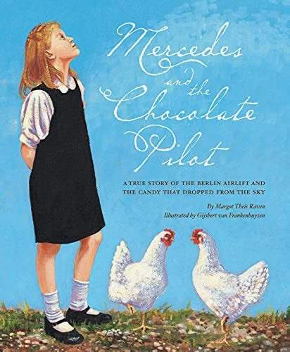

# Generosity From Above and Abroad

## Introduction

This story portrays one of the earliest confrontations of the Cold
War, demonstrating how far America was willing to go to keep West
Berlin free from Soviet tyranny. Because of America’s dedication (and
Great Britain’s), the citizens of West Berlin preserved their freedoms
and eventually thrived, though completely surrounded by the socialism
of East Berlin and East Germany. Prosperous West Berlin and
impoverished East Berlin provide a stark contrast between free
enterprise capitalism and Marxist communism. This is captured most
dramatically in the story: “Although the children had been on meager
rations, they were more concerned with freedom than flour. They wanted
what Hal had always had -- the opportunity to pursue their dreams.”

American exceptionalism is also on display in the character of bomber
pilot Hal Halvorsen. Acting solely on his own initiative and
generosity, he organized the “candy bombing” which helped win the
hearts and minds of our former WWII adversaries. From inside a
military hierarchy, Halvorsen created a “voluntary association” of
fellow pilots and airmen that was so successful top brass made it
official policy.

Appropriately, the story is set during Christmastime, emphasizing the
charitable theme and connecting us to America’s devout religious
heritage (Christmas From Heaven). Americans are the most generous
people on Earth in terms of giving and this story does a marvelous job
of demonstrating that generosity as Halvorsen’s initial efforts
sparked candy donations by individuals and corporations across
America.


---

## Book

Title: "Christmas From Heaven: The True Story of the Berlin Candy Bomber"
Author: David T. Warner
Illustrator: Robert T. Barrett
Year published: 2013
Length: 32 pages

---

## Calendar

Monday:
 - songbook
 - pretzels

Tuesday:
 - geography
 - craft1

Wednesday:
 - "Vocabulary (before reading) [vocab]"
 - science

Thursday:
 - re-enactment
 - scripture
 
Friday:
 - supplemental
 - culture

---

## American Heritage Songbook: God Bless America {#songbook}

```metadata
toc: "American Heritage Songbook: _God Bless America_"
time: 5 minutes
freq: daily
```

> God bless America, land that I love 
> Stand beside her and guide her 
> Through the night with the light from above
{.nowrap}

Irving Berlin, one of America’s greatest songwriters, wrote God Bless
America and [Kate Smith][song0] made it famous in 1938 when tensions
were mounting between Axis and Allied countries, shortly before World
War II. Berlin wrote it initially as a prayer to God to guide America
to peace through the turbulent times.

_God Bless America_ was the official campaign song for both Franklin
Delano Roosevelt and his Republican opponent Wendell Willkie
in 1940. In the wake of the September 11, 2001 terrorist attacks,
members of Congress sang it on the steps of the Capitol. Both [Celine
Dion][song1] and [LeAnn Rimes][song2] released versions of it in
October of 2001 that charted more than 60 years after its debut
(Dion’s reached #14 on Adult Contemporary, Rimes #50 on Country). This
2013 version by [Sandi Patty][song3] includes the original
introduction with its allusion to the beginnings of World War II
(“while the storm clouds gather, far across the sea”) and makes the
prayer explicit (“as we lift our voices in this solemn prayer”).

To keep it fresh for your child(ren), try playing a different version
each day before (or after) the reading.

[song0]: https://www.youtube.com/watch?v=7AOAH2lv3H0
[song1]: https://www.youtube.com/watch?v=6LSarhZpnMs
[song2]: https://www.youtube.com/watch?v=MHYKzBW__SY
[song3]: https://www.youtube.com/watch?v=XD-aXtcUEOs
---

## Arts & Crafts: Candy Wrapper Story {#craft1}

```metadata
time: 20-40 minutes
prep: 5-15 minutes
supplies: 
```

> Without a word, the four children tore the gum wrappers into strips
> and passed them to the others. One by one, each small nose was
> pressed to the paper, breathing in the minty smell.

Make a list of the candy names available locally (or order what you
need). Then write a story inserting the candy names. Use cardboard and
a sharpie to write up the story and tape the candy bar in place for
the word. This can be a fun gift. Here is an example story: Once upon
a time there was a fun family who went on a journey through the Milky
Way. The family was full of Smarties and Nerds. They built a rocket
powered by Atomic Fireballs and hoped it wouldn’t be a Milkdud. They
went into Orbit and saw an Eclipse, a Starburst, Mars, and a planet
with Peach Rings. The trip brought the Kinder Joy. The rocket Dove
back to earth and thankfully they didn’t need any Lifesavers. The
Junior [mints] thought the trip was worth 100 Grand. The End.

---

## Geography: East vs. West Germany {#geography}

```metadata
time: 15-60 minutes
supplies: 
```

> When World War II had ended three years earlier, Germany and its
> capital city were divided between the Western allies and the Soviet
> Union.

There is a map of East and West Germany in the front of the
book. Explain how Germany was divided into four sectors after losing
World War II, with different allies (Americans, British, French,
Russians) controlling different sectors. In particular, point out how
Berlin, the capital of Germany, was located deep in East Germany and
the city was also divided into four sectors controlled by different
allies. Conclude the discussion by [watching a video][geo1] of the
[fall of the Berlin Wall][geo2] which marked the end of the Cold War
and the beginning of the [reunification of Germany][geo3], 40 years
after the Berlin Airlift.


[geo1]: https://www.youtube.com/watch?v=zmRPP2WXX0U
[geo2]: https://www.youtube.com/watch?v=snsdDb7KDkg
[geo3]: https://www.youtube.com/watch?v=A9fQPzZ1-hg

---

## Famous American Texts: The Truman Doctrine {#text}

```metadata
time: 5 minutes
freq: once
```
> I believe it must be the policy of the United States to support free peoples who are resisting attempted subjugation by armed minorities or by outside pressures. 
> I believe that we must assist free peoples to work out their own destinies in their own way.
> I believe that our help should be primarily through economic and financial aid which is essential to economic stability and orderly political processes.
> – President Harry S. Truman
{.nowrap .center}

In the aftermath of World War II, the Soviet Union attempted to spread
communism by pressuring and influencing many devastated European
governments. The Soviets wanted to build a buffer zone of countries
that were friendly or under their direct control. In March of 1946,
Winston Churchill warned the United States about an “iron curtain”
descending across Europe, with the communists controlling eastern
European countries behind the curtain.

Just a year later, in March of 1947, President Harry Truman addressed
a joint session of Congress to advocate for what became known as the
Truman Doctrine: the containment of the Soviet bloc and stopping the
spread of communism through economic aid to western European countries
— starting with Greece and Turkey as [this historic video][text1]
shows. Historians date the beginning of the Cold War to these two
speeches by [Churchill][text2] and Truman.

The Marshall Plan, economic aid to the war-torn western European
countries, began on April 3, 1948. The Soviets blockaded Berlin on
June 24. Two days later, the Berlin airlift began, a joint operation
of Americans, British, and French.

[text1]: https://www.youtube.com/watch?v=0OKB3pdc_FU
[text2]: https://www.youtube.com/watch?v=X2FM3_h33Tg

---

## Cooking: Chocolate Pretzel Bites {#pretzels}

```metadata
time: 20-30 minutes
prep: 10-15 minutes
supplies: cookie tray, pretzel twists, chocolate candy kisses, M&Ms
```

> By December, the Little Vittles operation had gathered eighteen tons
> of candy from American candy makers, and three more tons came in
> from private donors. The spirit of Christmas was descending on
> people everywhere, lifting them up in the joy of giving.

### Ingredients

- 1 (15 ounce) package of small pretzel twists
- 1 (8 ounce) package of milk chocolate candy kisses (unwrapped)
- 1 package of candy-coated milk chocolate pieces (like M&Ms) 

### Directions
1. Preheat oven to 175 degrees Fahrenheit.
2. Set the small pretzel twists in a single layer on a cookie tray.
3. Place one chocolate kiss on the center of each pretzel.
4. Put the cookie tray into the oven to warm and slightly melt the
   chocolate kisses.  This should take about two minutes.  Watch the
   chocolates to see when they start to shine.
5. Remove from the oven.  Gently press a candy coated chocolate into
   the top of the slightly melted chocolate kiss.
6. Refrigerate for about 10 minutes.
7. Pull out for a tasty snack!

---

## Cooking: Christmas Caramels {#caramels}

```metadata
time: 20-30 minutes
prep: 10-15 minutes
supplies: sugar, corn syrup, heavy cream, butter, vanilla, pan, pot. wooden spoon, candy thermometer, wax paper
```

> These children had little to eat, and no candy at all, yet they were
> grateful for what the airlift had given them and asked for
> nothing. Their gratitude melted Hal's heart.

### Ingredients (for about 60 caramels)

- 1 cup white sugar
- 3/4 cup corn syrup
- 1 cup heavy cream
- 1/2 cup butter
- 1/2 teaspoon vanilla extract
- 9x9 pan
- large pot
- wooden spoon
- candy thermometer
- wax paper

### Directions
1. Butter the 9x9 pan.
2. In the large pot/saucepan combine sugar, corn syrup and half (1/2
   cup) of cream and butter.
3. Bring to a boil while frequently stirring, and then stir in
   remaining (1/2 cup) of cream.
4. Heat (without stirring) to 242 degrees Fahrenheit (soft ball or
   firm ball stage) until a small amount of the syrup dropped into
   cold water forms a firm but pliable ball.
5. Remove from the heat, stir in the vanilla, and pour into the 9x9
   pan.
6. Refrigerate.
7. When cool, cut into one inch squares and wrap individually in small
   rectangles of wax paper (note twist the ends of the wax paper in
   opposite directions so caramels unwrap easily). We recommend
   keeping refrigerated until ready to eat.
8. Eat or bomb your friends with them!

---

## Science: Make Your Own Candy Bomb Parachute {#parachute}

```metadata
time: 10-20 minutes
prep: 5 minutes
supplies: tissue paper, string, candy
```

> By the next day, Hal had secretly enlisted his crew to donate their
> rations and make parachutes from handkerchiefs.

The book has excellent directions in the back for making your own
candy bomb parachutes. Our kids really enjoyed making these. The
colorful tissue paper for the canopies was a big hit (our
three-year-old wanted to make all the pink ones): “Not only do they
work, they’re beautiful!” And of course, who doesn’t love a craft
where candy is involved?

For science, we did a couple demonstrations of falling objects. Using
a small candy and a big candy (without parachutes) we showed how they
both fell at approximately the same rate. Then we dropped a candy at
the same time as we dropped one with a parachute and discussed how
[air resistance slows a falling object][parachute].

[parachute]: https://www.explainthatstuff.com/how-parachutes-work.html

---

## Historical Re-enactment: Candy Bombing {#re-enactment}

```metadata
toc: "Re-enactment: Candy Bombing"
time: 20 minutes
prep: 5-10 minutes
supplies: parachute, candy
```

> With the precision of bombardiers, the airmen pushed the candy out
> the flare chute, and white canopies floated to earth. The children
> ran with open arms to catch the treasures.

This re-enactment can be the culmination of previous activities:
rationing, make your own parachute, paper airplanes. Start by opening
a pack of gum and giving your kids some gum wrappers to smell. Then,
you will need a high place to launch your paper airplane bombers and
candy parachutes. We planned to launch our “candy bombs” from our
second-floor patio deck but rain forced us to do an indoor launch from
the top of the stairs. But you can pretty much count on happy kids any
time you parachute candy to them :-)

<br>
Smelling gum wrappers.<br>

<br>
We candy bombed inside because of rain.
{.center .caption .small}

---

## Supplemental Reading: _Mercedes and the Chocolate Pilot_ {#supplemental}

```metadata
time: 15 minutes
```

> Mercedes fed each chicken a worm and tried not to cry. She loved her
> four feathered pets, but Mama would not be happy. Eggs were more
> precious than gold in West Berlin during the Russian blockade.


{.center}

**Title:** _Mercedes and the Chocolate Pilot_<br>
**Author:** Margot Theis Raven<br> 
**Illustrator:** Gijsbert van Frankenhuyzen<br>
**Year Published:** 2002<br>
**Length:** 48 pages

Introduce your child(ren) to the literary concept of “point-of-view.”
In _Christmas From Heaven_ the story is told from the point-of-view of
the Candy Bomber. All the action revolves around his actions and how
he sees things. Read _Mercedes and the Chocolate Pilot_ to your
child(ren) and then ask them who does all the action revolve around?
Who is the main character? Through whose eyes do we see the story?

---

## Scripture: Acts 20:35 {#scripture}

```metadata
time: 10 minutes
```

> In everything I did, I showed you that by this kind of hard work we
> must help the weak, remembering the words the Lord Jesus himself
> said: 'It is more blessed to give than to receive.'

Why do we give gifts at Christmas? Where did this tradition come from?
Share the story of the three wise men bringing gifts to Jesus at his
birth and read them the following scripture: “They [the Magi] opened
their treasures and presented him [the Christ] with gifts of gold and
of incense and of myrrh” (Matthew 2:11). At Christmas we now give
gifts blessing each other as the Magi blessed the Christ child.

Ask your children why does the Bible say it is more blessed to give
than to receive? Then, ask them to memorize this fragment of
scripture.

---

## Vocabulary {#vocabulary}

```metadata
time: 10 minutes
```

> Hal wrapped his hands around the yoke of his C-54 cargo plane,
> packed with 20,000 pounds of flour.

The author uses a number of words associated with airplanes that your
child(ren) may not be familiar with: yoke, cockpit, runway, canopy,
parachute. In addition, there are some words out of the ordinary that
they may not have encountered: bombardier, rations, squabble. Try
introducing a couple of new words each day. Before you start reading,
introduce the words you’ve selected for the day, define them, and then
point them out during the reading.

Yoke
: an airplane control that changes flight direction

Cockpit
: a small compartment for steering a plane or boat

Runway
: a paved strip of ground for landing and takeoff of aircraft

Canopy
: transparent covering over an airplane cockpit; fabric part of a
  parachute that catches the air

Parachute
: a device for slowing the descent of a person or object through the
  air that consists of a fabric canopy beneath which the person or
  object is suspended

Bombardier
: a crew member of a bomber aircraft who releases the bombs

Rations
: controlled distribution of scarce resources, in this case, food

Squabble
: an argument over something unimportant

---

## Civic Culture: Generosity {#culture}

```metadata
time: 10 minutes
supplies: 
```

> Hal and his buddies were as excited as the children. The thrill of
> giving was irresistible. Soon they were dropping parachutes every
> day – hundreds of them.

The concept that there are children now in our world without enough
food, let alone candy, was an astonishing one to our five- and
three-year-old grandchildren. I asked them how Hal felt when he gave
his candy parachutes to the children. “Joyful” was their response.

As the scripture above says, it is more blessed to give than
receive. One way to connect your children to this blessing is through
[Operation Christmas Child][occ], an annual Christmastime charity
sponsored by Samaritan's Purse. It is a group activity at our church
where we fill shoeboxes with toys, gifts, candy, and hygiene products
for children. It is often the only Christmas gift the recipient gets
-- again quite an eye-opener to our youngsters. This charitable
activity provides a good connection to the story.

[occ]: https://www.samaritanspurse.org/operation-christmas-child/the-journey-of-a-shoebox/

---

## Free Enterprise: Rationing {#economics}

```metadata
time: 10 minutes
supplies: 
```

> These children had little to eat, and no candy at all, yet they were
> grateful for what the airlift had given them and asked for
> nothing. Their gratitude melted Hal's heart.

Identify some of your kids’ favorite foods and prepare ration cards or
coupons that they can use to claim them throughout the day. To drive
home the idea of rationing, make sure that the coupons don’t allow
them to claim as much as they want or usually eat. We did this as a
family. Everyone was a West Berliner for the day with ration cards. At
mealtimes, we punched everyone’s card to indicate they had had their
ration for the day (note: rations were in units of servings). Our
five-year-old looked at his ration card and then planned what he was
going to eat for each meal of the day. (To soften this exercise, it
might be good to schedule the candy bombing reenactment for the
evening, signaling an end to rationing and the arrival of the
Americans).


{.center}
