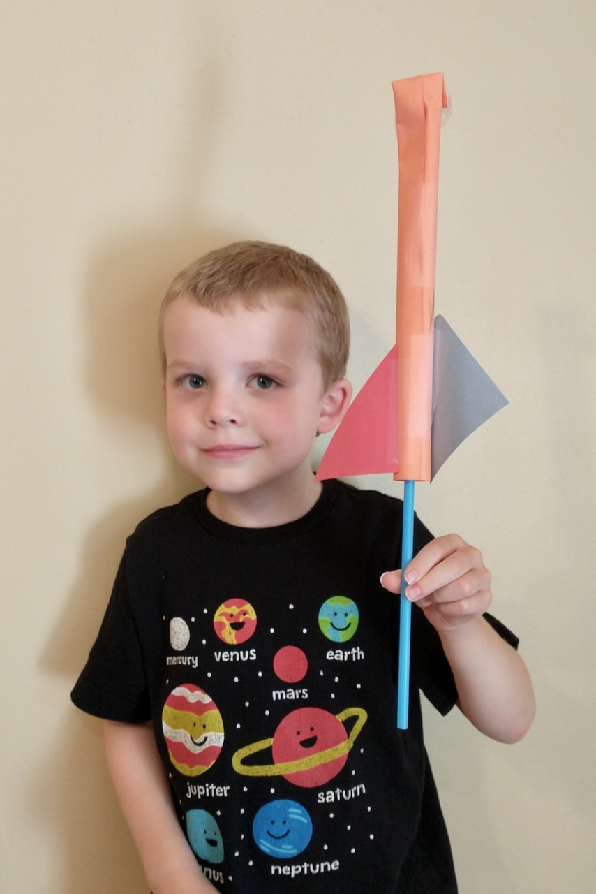
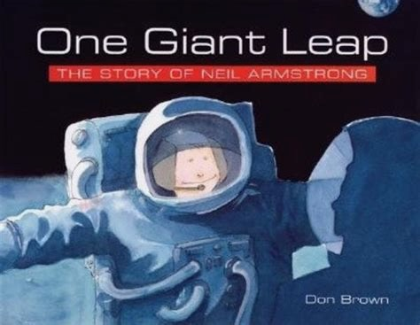
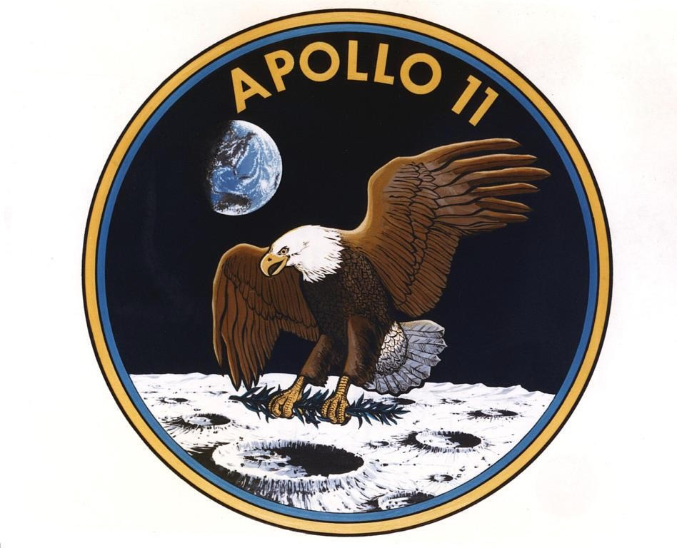
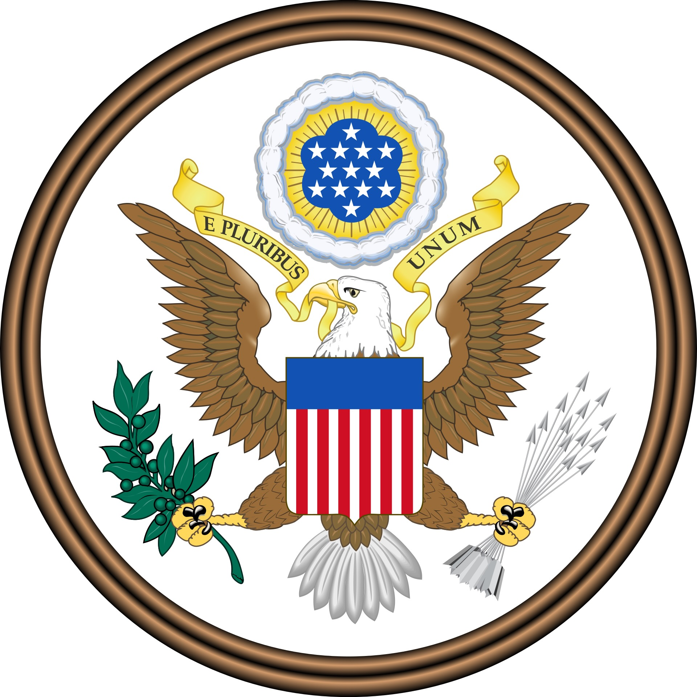
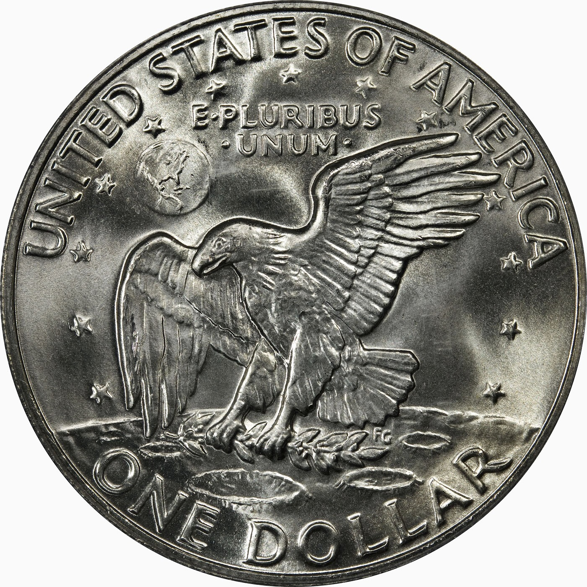
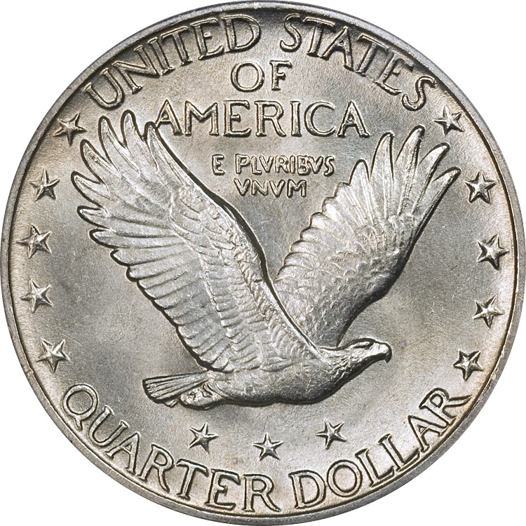
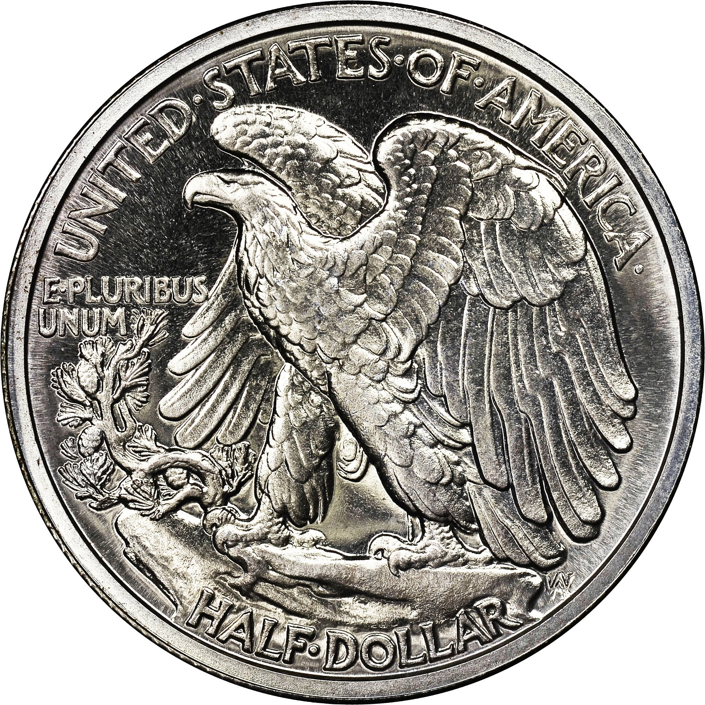
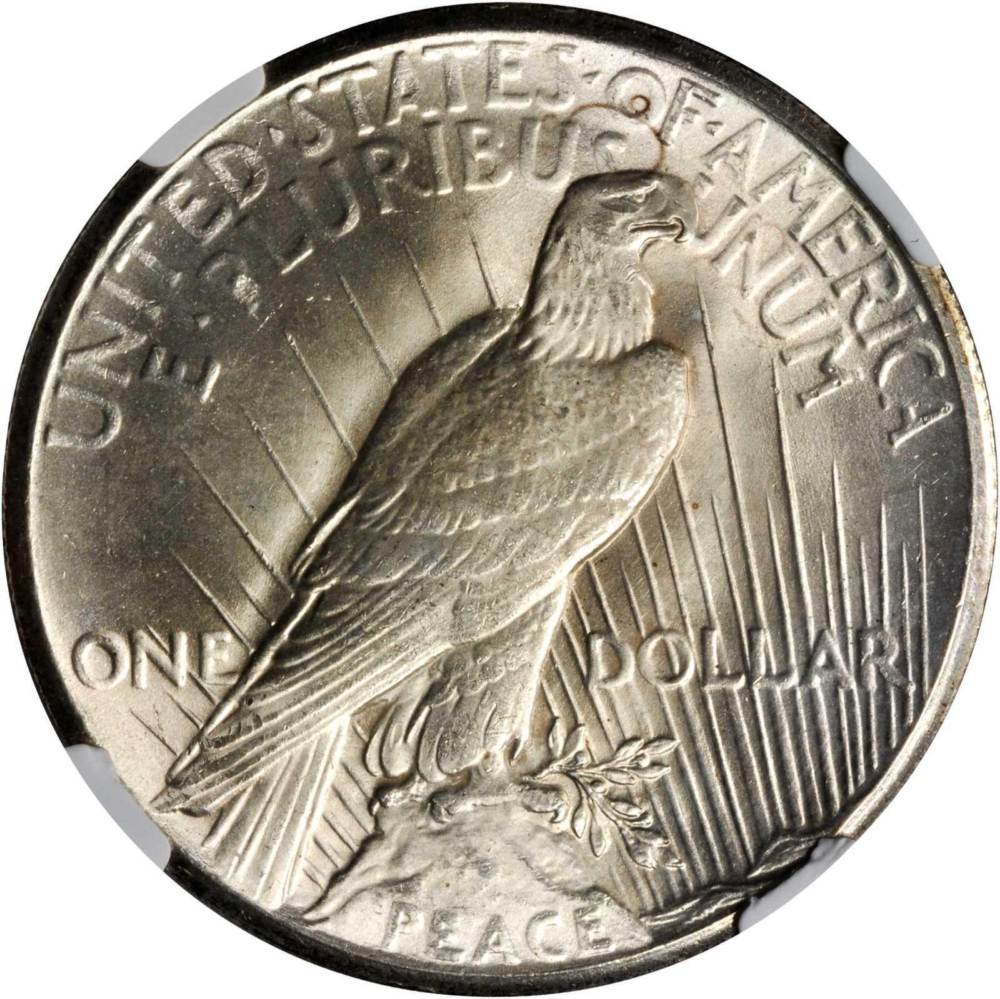
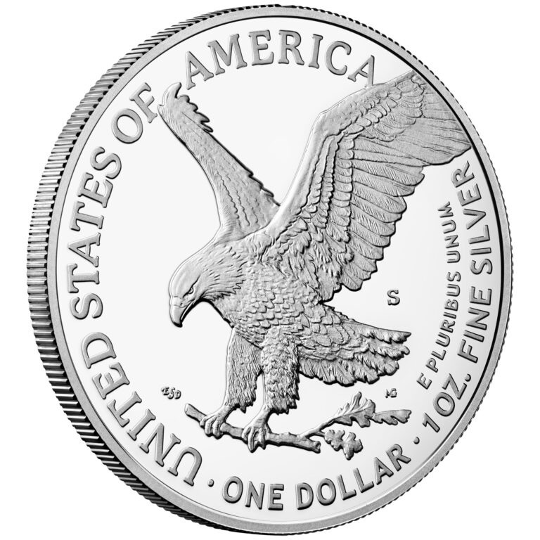

# Men On The Moon

## Introduction

America’s Apollo 11 mission changed human history forever by landing
two men on the moon. Our space program captured the attention of the
entire world on July 20, 1969. It was the culmination of years of
dedicated work by thousands of people striving towards the same
goal. New technologies, new industries, and new government agencies
were born of the effort.

Few endeavors are more emblematic of American Exceptionalism than the
Apollo program. The work ethic, the aspirations, the entrepreneurial
drive to open up a new frontier are all essential elements of our
exceptionalism. Our space program harnessed the power of our free
enterprise system for this historic achievement.

The Bald Eagle is our National Bird, and its image symbolizes American
strength, dignity, determination, and faithfulness. The Bald Eagle was
initially incorporated into our National Seal. From there, the iconic
eagle spread to our coinage, becoming an important symbol of
America. Apollo 11 took that symbol to new heights.

---

## Book

Title: "Moonshot: The Flight of Apollo 11"
Author: Brian Floca
Illustrator: Brian Floca
Year published: 2019
Length: 56 pages

---

## Calendar

Monday:
 - songbook
 - cooking

Tuesday:
 - geography
 - craft1

Wednesday:
 - "Vocabulary (before reading) [vocab]"
 - science

Thursday:
 - re-enactment
 - art-eagles
 
Friday:
 - nature
 - supplemental

---

## American Heritage Songbook: It's America {#songbook}

```metadata
toc: "American Heritage Songbook: _It's America_"
time: 5 minutes
freq: daily
```

> It’s a man on the moon and fireflies in June and kids sellin’ lemonade 
> It’s cities and farms, it’s open arms, one nation under God
> It’s America
{.nowrap}

Country singer Rodney Atkins captures much of the spirit of America in
this song. Released in 2008, it reached #1 on the country charts
in 2009. “Kids sellin’ lemonade'' is not only part of the chorus but a
recurring visual motif in Atkins’ [music video of the song][song1].

The lemonade stand starts off as symbolic of America’s entrepreneurial
culture. But in the music video, as we move into the second stanza,
the lemonade stand changes into a tornado relief fundraising station
that represents how we as a nation come together in Tocqueville’s
voluntary associations to help one another.

> And people came from miles around just to help their neighbors out 
> And I was thinking to myself I’m so glad that I live in America
{.nowrap}

In the final stanza of the song and video, the lemonade stand is now
part of a “welcome home parade” for a soldier returning home. Atkins
acknowledges our imperfections on the bridge of the song before
concluding:

> Now we might not always get it all right
> There’s no place else I’d rather build my life
{.nowrap}

Here’s an [alternate video][song2] of the song with different images
of America.

[song1]: https://www.youtube.com/watch?v=TZBrBJseyv0
[song2]: https://www.youtube.com/watch?v=7wa1O0sAPco

---

## Arts & Crafts: Make Your Own Rocket {#craft1}

```metadata
time: 15 minutes
prep: minimal
supplies: straws, construction paper, tape, scissors
```

> LIFTOFF!
> The rocket is released! 
> It rises foot by foot,
> It rises pound by pound.
{.nowrap}

Using a few common craft supplies, you can make your own straw-based
rocket, powered by your own breath! Here is what you need:

### Supplies

* Plastic straws
* Construction paper
* Tape
* Scissors
* Markers (optional)

### Directions

1. Wrap a piece of construction paper (possibly cut down the middle
   long ways first) around a plastic straw. Tape it in place.
2. Bend the tip of the paper over and tape in place.
3. To make tail fins for your rocket, cut triangle shapes out of paper
   and tape them onto the construction paper tube at the opposite end
   from the bent and taped tip.
4. Optional: Decorate the rocket (either now or before
   wrapping/taping).
5. Put the rocket on the straw and then blow on the straw and watch
   the rocket fly.
6. Experiment with weight (more/less paper) and tail fins (more/fewer
   and shapes). Which designs fly farthest/highest? Also experiment
   with the angle you hold the straw for take-off and amount of air.

The above is based on the instructions from the website
[AllForTheBoys][craft1]. You can find instructions for a slightly more
complicated design at [NASA’s JPL site][craft2].


{.center}

[craft1]: https://allfortheboys.com/space-week-part-2-paper-straw-rocket/
[craft2]: https://www.jpl.nasa.gov/edu/resources/project/make-a-straw-rocket/

---

## Geography: Cape Canaveral & Houston {#geography}

```metadata
time: 10 minutes
supplies: globe
```

> It is summer here in Florida, 
> Hot, and near the sea.
{.nowrap}

> Near the rocket, in Launch Control,
> and far away in Houston, in Mission Control,
> there are numbers, screens, charts,
> ways of watching and checking every system and part of Apollo 11, 
> the fuel, the valves, the pipes, the engines,
> the beats of the astronauts’ hearts.
{.nowrap}

This geography lesson should start by getting out your globe and
showing your kids where the Kennedy Space Center is located on Cape
Canaveral in Florida. The first question to ask your kids is: “Why do
you think they chose a location on the coast of Florida?” With a few
hints, they should be able to get the first part of the answer: in
case there is a problem after it launches, the rockets will crash in
the ocean where there it is less likely they will injure
people. Similarly, it was a largely undeveloped area at the time but
with good roads because of military bases. Again, very few people in
the area in case of accidents or explosions at the launch site.

The other parts of the answer have to do with the rotation of the
earth. If you look down on the earth from the North Pole, the earth is
spinning in a counterclockwise direction. Ask your kids to spin your
globe slowly to illustrate this. Then, show them how Cape Canaveral is
located on the east side of Florida and how rocket launches are always
aimed over the Atlantic Ocean. Show them how this enables the rockets
to take advantage of the angular momentum provided by the rotation of
the earth when they launch (this is rocket science!).

Moreover, the closer the launch site is to the equator, the greater
the angular momentum. For the United States, this meant the Kennedy
Space Center should be located in a southern state. While Hawaii is
the southernmost state, its remote location meant it was not seriously
considered. Florida is the southernmost state in the continental
United States.

Now, show your kids on the globe where Mission Control is located in
Houston, Texas. Then ask them: “Why is Mission Control located so far
away from where the rockets are launched?” Well, there is no practical
reason why Mission Control must be located at the same site where the
rockets are launched. And because exploring space was largely a
government funded program, politics became a big factor in deciding
which state would reap the benefits of hosting Mission
Control. Mission Control is now located in Houston at the Johnson
Space Center, named after President Lyndon Baines Johnson, who was
from Texas and was intimately involved in establishing the space
program, first as vice-president (1961-1963), and then president
(1963-1968).

---

## Famous American Texts: John F. Kennedy and Neil Armstrong {#text}

```metadata
time: 5 minutes
freq: once
```

> We choose to go to the moon.

In 1961 the United States was losing the space race to the
Russians. Russians were first to launch a satellite (Sputnik in 1957),
they were first to launch a space probe to hit the moon (Luna 2 in
1959), and they were first to launch a man into space (Yuri Gagarin in
April of 1961).

In May of 1961, President John F. Kennedy put forth a bold goal for
the United States: to land a man on the moon “before this decade is
out.” He rallied America for the effort in a speech at Rice University
in September of the following year. Known as the “We choose to go to
the moon” speech, you can [see two minutes of the highlights on
YouTube][geo1]. Here is the key paragraph:

_We choose to go to the Moon. We choose to go to the Moon in this
decade and do the other things, not because they are easy, but because
they are hard, because that goal will serve to organize and measure
the best of our energies and skills, because that challenge is one
that we are willing to accept, one we are unwilling to postpone, and
one which we intend to win, and the others, too._

On July 20, 1969, Neil Armstrong and Buzz Aldrin fulfilled Kennedy’s
bold goal by landing their lunar module, the Eagle, on the moon. Neil
Armstrong uttered two famous sentences that have echoed down to
us. The first was upon touchdown on the moon: _The Eagle has landed._

The second was when he became the first man to set foot on the moon:
_That’s one small step for [a] man; one giant leap for mankind._

Ask your kids to memorize one of Armstrong’s famous sentences or the
single sentence of Kennedy’s speech: “We choose to go to the moon.”

While we started out behind in the space race, we quickly caught
up. It’s been over 50 years since the last Americans walked on the
moon (Apollo 17, December 1972). In all that time, no other nation has
ever sent anyone to the moon.

[geo1]: https://www.youtube.com/watch?v=g25G1M4EXrQ

---

## Cooking: Astronaut Pudding {#cookbook}

```metadata
time: 20 minutes
prep: 10-15 minutes
supplies: butter, sugar, eggs, yogurt, lemon, flour, vanilla, baking powder, baking soda, salt
```
> Here, where everything floats, it takes some skill to eat a meal.
> That ham salad sandwich? Watch the crumbs!
> Soup? It comes in a bag, dry as dust.
{.nowrap}

You too can eat like an astronaut with this simple three ingredient
astronaut pudding, courtesy of FeelsLikeHomeBlog.com. [Check out their
entry on astronaut pudding][recipe], there are some great videos
embedded in it. Or go straight to the recipe below:

[recipe]: https://feelslikehomeblog.com/how-to-make-astronaut-pudding/


### Ingredients

* Dry pudding mix (5 teaspoons)
* Powdered milk (5 teaspoons)
* Water (half cup)

### Supplies
* Quart-sized zip lock bag
* Measuring spoon
* Measuring cup
* Scissors

### Directions
1. Mix the dry ingredients in the quart bag. 
2. Add water, seal the bag, and let the kids squish it around to mix it all up. 
3. Use the scissors to clip off a corner of the bag and let the kids
   eat the pudding by squeezing it into their mouths – this may be the
   most fun (and the most messy) part of the process :-)

---

## Science: Make Your Own Gas-Powered Rocket {#anemometer}

```metadata
time: 30-60 minutes
prep: 20-30 minutes
supplies: plastic bottle, straws, duct tape, cardboard, cork, baking soda, vinegar, paper towels, scissors
```

> It climbs the summer sky.
> It rides a flapping, cracking flame 
> and shakes the air,
> and shakes the earth,
> and makes a mighty ROAR.
{.nowrap}

[This three-minute video][gasrocket] from STEM Little Explorers will
show you how to build your own baking soda and vinegar powered
rocket. We used a very small bottle when we did this which meant it
didn’t take long for the gas to build up, but also meant that it
didn’t fly very high (I’d recommend something larger along the lines
of 1.5 liters minimum). We had a little bit of difficulty getting our
straws to hold up the rocket while awaiting launch. Something with a
little more weight may fare better. Lots to experiment with here!

And of course, after you make your first successful launch, you can
call yourself a rocket scientist!

### Supplies

* Empty plastic bottle
* Straws or pencils
* Duct tape
* Cardboard (thin) or cardstock paper
* Cork (that fits nozzle of plastic bottle)
* Baking soda
* Vinegar
* Paper towels
* Scissors

[gasrocket]: https://www.youtube.com/watch?v=jjU1IAgRcQg

---

## Historical Re-enactment: More Rockets {#re-enactment}

```metadata
toc: "Re-enactment: More Rockets!"
time: 20-60 minutes
prep: 5-10 minutes
supplies: water-powered rocket
```

> The rocket flies higher,
> The rocket flies faster,
> in twelve minutes' time,
> it's one hundred miles high.
{.nowrap}

After watching Apollo 11 lift-off, who doesn’t want to launch their
own rocket? There are a number of different types of rockets that you
can launch yourself, including the breath-powered rocket in the Arts &
Crafts activity and the gas-powered rocket in the Science
activity. [Estes model rockets][estes-rocket] are also a
possibility. They have a real engine that ignites and they fly higher
and farther. However, they are expensive, are more suitable for older
children/adults and some counties have regulations regarding their
use. (But they are very cool and kids love chasing them down when they
land).

For the historical re-enactment we used both the baking soda and
vinegar rocket described in Science, but also a water-powered rocket
that we purchased. However, it is possible to [make a water-powered
rocket][water-rocket-make] as well.

Here is [a link to the water powered rocket][water-rocket-purchase]
that we bought (but there are many options available). In addition to
the kit, you need 3 1.5-2 liter bottles and water to anchor it. This
kit was easy to put together and worked well (that is, until after
some crash landings). We played around with angle, number of pumps of
air, and amount of water. We got some good launches (20+ feet in the
air). The kit enabled a countdown to release the rocket after the air
and water were inside the rocket. I also liked the clean fuel it
used. This was very cool! We needed a large outdoor space for the
launch and so naturally attracted a number of neighborhood kids to
watch.

[estes-rocket]: https://estesrockets.com
[water-rocket-make]: https://www.science-sparks.com/making-a-bottle-rocket/
[water-rocket-purchase]: https://www.amazon.com/PLAYSTEAM-Outdoor-Powered-Learning-Experiment/dp/B07M5DPHXW/ref=sr_1_1_sspa?crid=2R7NNG8ZKZEAG&keywords=water%2Bpowered%2Brocket&qid=1653766287&sprefix=water%2Bpowered%2Brockets%2Caps%2C112&sr=8-1-spons&spLa=ZW5jcnlwdGVkUXVhbGlmaWVyPUExNzRaUTJFUEZMTUZZJmVuY3J5cHRlZElkPUEwMjAzMTE5MzkwVzUzTUZPQ0RNVSZlbmNyeXB0ZWRBZElkPUEwNDE5NjAzOUYzNU9XQzAwVllIJndpZGdldE5hbWU9c3BfYXRmJmFjdGlvbj1jbGlja1JlZGlyZWN0JmRvTm90TG9nQ2xpY2s9dHJ1ZQ&th=1

---

## Supplemental Reading: _One Giant Leap_ {#supplemental}

```metadata
time: 10 minutes
```

> With only seconds of fuel remaining, Neil safely lowered the
> hovering spacecraft to the moon’s surface.


{.center}

**Title:** _One Giant Leap: The Story of Neil Armstrong_<br>
**Author:** Don Brown<br> 
**Illustrator:** Don Brown<br>
**Year Published:** 2001<br>
**Length:** 32 pages

Don Brown’s _One Giant Leap_ provides the inspirational biography of
Neil Armstrong, the first man to set foot on the moon. This book is an
excellent supplemental reading to Brian Floca’s _Moonshot!_, providing
a deeper background on how the boy with dreams of flying turned into
an astronaut commanding Apollo 11. Your kids will learn how Armstrong
realized his dreams by working hard to buy flying lessons, earning his
pilot’s license when he turned 16 (before he got his driver’s
license!). Before joining the space program, he was a Navy fighter
pilot during the Korean War and a test pilot for rocket-powered
airplanes.

Brown starts and ends his story by focusing on a young boy’s
dreams. We recommend reading this story as a supplemental reading
sometime in the middle of the module as either a replacement for the
daily reading of _Moonshot!_ or in addition to it.

---

## Scripture: Isaiah 40:31 {#scripture}

```metadata
time: 5 minutes
```

> ... but those who hope in the LORD will renew their strength. They
> will soar on wings like eagles; they will run and not grow weary;
> they will walk and not be faint.

This inspirational scripture from the Old Testament ties in nicely
with the “eagles” theme of this module. Consider having your kids
memorize it as part of their daily prayers.

---

## Vocabulary {#vocabulary}

```metadata
time: 10 minutes
```

> Armstrong, calling from the Moon, calm as a man who just parked a car. 
> “Houston,” he says. “Tranquility Base here. The Eagle has landed.”
{.nowrap}


This module’s vocabulary words introduce young audiences to the
exploration of space and rocket science. Some terms are
self-explanatory, and many may be picked up from the context and
pictures.

Launch
: to throw forward or send off

Orbit
: the circular path an object follows around a planet, moon, or sun

Ignition
: starting a fuel mixture to burn or explode

Lift-off
: the moment an aircraft or rocket leaves the ground

Astronaut
: a person trained in spaceflight

Tranquility
: a sense of calmness

Crater
: a round hole in the ground, formed by meteors, explosions, or
  volcanoes

Drogue Parachute
: a small parachute used to slow down a vehicle and pull a larger
  parachute out of storage

---

## History: Apollo 11 {#history}

```metadata
time: 93 minutes
```

> Their two small spaceships are Columbia and Eagle.
> They are locked to the top of the rocket that will lift them into space, a monster of a machine... 
> the mighty, massive Saturn V.
{.nowrap}


There are many documentaries about Apollo 11 but one of the best came
out in 2019 on the 50th anniversary of when we first landed on the
moon. You can [watch it online here][video1] for a small fee. It
includes fantastic footage and audio of the event and is highly
recommended.

Your kids might also be interested in the computer-generated imagery
of the Eagle landing and taking off from the moon. The first of these
extremely short videos (57 seconds) shows [Eagle undocking from
Columbia][video2] (the command module). The next shows [Eagle landing
on the moon][video3] (1:40). And the last (38 seconds) shows [Eagle
taking off from the moon][video4] to rejoin Columbia.

[video1]: https://www.amazon.com/Apollo-11-Todd-Douglas-Miller/dp/B07RDY36Z6/ref=sr_1_2?crid=32K73UDGLFDKK&keywords=apollo+11+dvd&qid=1653750833&s=instant-video&sprefix=apollo+11+dvd%2Cinstant-video%2C65&sr=1-2
[video2]: https://www.youtube.com/watch?v=fO2u9LftqD4
[video3]: https://www.youtube.com/watch?v=Bj__4trRYz8
[video4]: https://www.youtube.com/watch?v=8T4vH8cnh6g

---

## History: The Eagle Has Landed {#history1}

```metadata
time: 10-15 minutes
```

> The Eagle has landed.
{.nowrap}


{.center .small}

Apollo astronauts got to design their own mission patch. With the
exception of Apollo 11, all the other Apollo mission patches included
the names of the three astronauts. Neil Armstrong, Buzz Aldrin, and
Michael Collins, the three Apollo 11 astronauts wanted their patch to
symbolize the work of the entire space program in putting the first
men on the moon. Astronaut Jim Lovell (commander of Apollo 8 and
Apollo 13) suggested the eagle, but it was Michael Collins who drew
the initial sketch that was developed into the patch.


{.center .small}

Why did Lovell suggest a bald eagle? Because the bald eagle was
adopted by Congress in 1782 to represent the United States of America
as part of our National Seal. They selected the bald eagle because it
was native to North America, and it represented strength, dignity,
determination and faithfulness (they mate for life).

Ask your kids to examine the National Seal above and see if they can
explain the symbolism of the various elements: olive branch, arrows
(how many?), shield, stars (how many?), and the motto E Pluribus Unum.


{.center .small}

The bald eagle has been incorporated into our coinage from our
earliest days, though always on the reverse. When the Eisenhower
dollar coin was introduced in 1971, it featured the Apollo 11 mission
patch design; for the bicentennial celebration in 1776 the eagle was
replaced by a Liberty Bell.





{.center .smaller}

So, what did Neil Armstrong mean when he said, “The Eagle has landed”?
Interestingly enough, Eagle was the name of the Lunar Module that
landed Armstrong and Aldrin on the moon. They named it after they
designed the moon patch with its eagle landing on the moon – an eagle
that symbolizes America. So, Armstrong was not only telling Mission
Control that he had successfully landed the Eagle but also telling the
world that America had reached the moon.

---

## Art: Eagles {#art-eagles}

```metadata
time: 10-20 minutes
```

> Armstrong and Aldrin leave in Eagle, and take it low and lower. 
> They have just enough time and just enough fuel.
{.nowrap}


Your kids might enjoy coloring some of these pictures of bald eagles,
courtesy of supercoloring.com:

* [Bald Eagle Perched][perched] 
* [Bald Eagle Soaring (1)][soaring1]
* [Bald Eagle Soaring (2)][soaring2]
* [Bald Eagle Attacking][attacking]
* [Heraldic Bald Eagle][heraldic]

After watching the live cam of the Bald Eagle nest in the Natural
History activity, our kids added nests to the coloring pages so the
eagles had a place to rest.

[perched]: https://www.supercoloring.com/coloring-pages/bald-eagle-4
[soaring1]: https://www.supercoloring.com/coloring-pages/bald-eagle-2
[soaring2]: https://www.supercoloring.com/coloring-pages/bald-eagle-with-wings-spread
[attacking]: https://www.supercoloring.com/coloring-pages/bald-eagle-diving-for-prey
[heraldic]: https://www.supercoloring.com/coloring-pages/bald-eagle-3

---

## Natural History: Bald Eagles in the Wild {#nature}

```metadata
time: 15 minutes
```
> Onboard Eagle, Aldrin calls out information while Armstrong steers the ship. 
> They fly lower and lower, looking, looking for their landing site.
{.nowrap}

If you happen to live close enough to a bald eagle habitat you can
observe these magnificent creatures soaring and nesting at the right
time of the year. For example, there are several bald eagle habitats
along the riverbanks of the [Potomac River][potomac] or the [James
River][james] in Virginia. Take your kid(s) on a field trip to see
them in the wild.

[james]: https://discoverthejames.com/?q=eagle-tour
[potomac]: https://a-z-animals.com/blog/the-best-places-and-times-to-see-bald-eagles-in-virginia/

If a field trip is not practical, you can also observe bald eagles in
the wild via live cams set up by amateur and professional
naturalists. [This Eagle Cam][cam1] was set up for a nesting pair
along the Dulles Greenway in Virginia. Scroll through the comments to
see some of the greatest sequences: the mother laying the eggs, the
mother and father arriving, building the nest, incubating the eggs,
feeding the eaglet. Best time of the year for viewing is late winter
through spring. You can find many other Eagle Cams at the [DC Eagle
Cam][cam2] in the National Arboretum, courtesy of the [American Eagle
Foundation][cam3].

[cam1]: https://www.dullesgreenway.com/eagle-cam/
[cam2]: https://hdontap.com/stream/134173/washington-dc-national-arboretum-bald-eagle-cam/
[cam3]: https://eagles.org

Finally, you can also take the kids on a field trip to a bald eagle [sanctuary for disabled eagles][sanctuary] that are recovering from injuries or can no longer survive in the wild. Your family may be interested in [supporting one of the foundations][support] that care for these birds. The [American Eagle Foundation][foundation] is an organization that has been supporting the care and rehabilitation of injured bald eagles for decades.

[sanctuary]: https://maymont.org/explore/animals/wildlife-habitats/bald-eagles/
[support]: https://eagles.org/donate/
[foundation]: https://eagles.org

### Fun Facts About Bald Eagles
* Bald Eagles can live up to 28 years in the wild, 48 years in
  captivity.
* Bald Eagles do not get their distinctive white heads until they are
  four or five years old.
* Bald Eagles have a wingspan of 6-8 feet.
* Bald Eagles fly up to 10,000 feet in the air and reach speeds up to
  30-35 miles per hour; up to 75-100 miles per hour when diving.
* Bald Eagles mate for life.
* Bald Eagles build enormous nests, called aeries, in the tops of
  trees. The nests can be eight feet across and weigh 1,000 pounds; the
  largest recorded was 9.5 feet across, 20 feet deep, and weighed 6,000
  pounds.
* Males and females take turns incubating their eggs.
* [June 20 is National American Eagle Day!][eagle-day]

[eagle-day]: https://nationaltoday.com/american-eagle-day/
