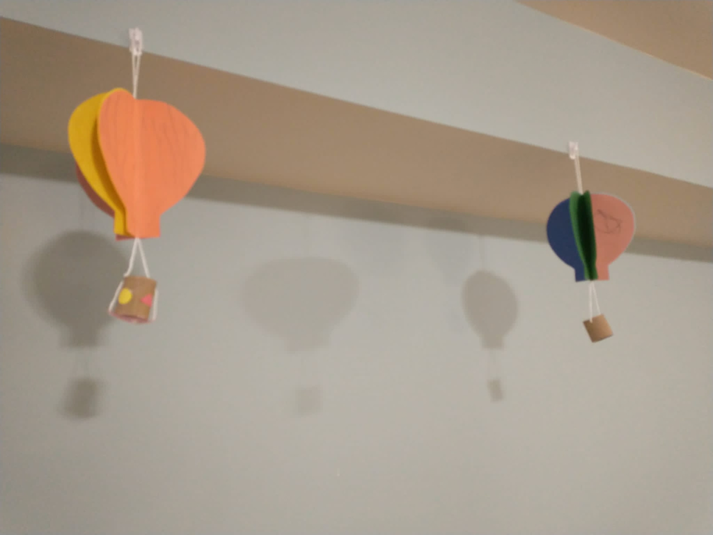
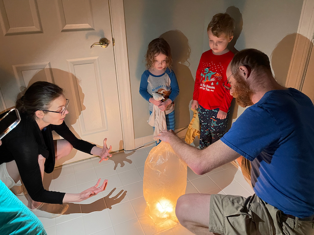
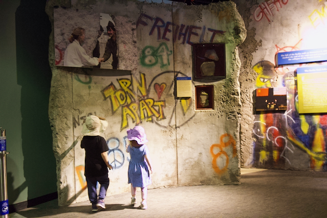

# Flight for Freedom

## Introduction

This dramatic Cold War story shows the risks parents willingly undertake in the hope of freedom for themselves and their children. The figurative Iron Curtain at the beginning of the Cold War is now a solid wall nine hundred miles long defended by barbed wire and armed guards, turning East Germany into one giant prison. Secret police spy on everyone. The United States and the West are beacons of freedom that people like the Wetzels risk their lives to reach.

The book starts by presenting the stark contrast in living conditions between East and West Germany. People with similar cultural backgrounds, work ethic, and natural resources were arbitrarily separated by a wall. The only difference is the political/economic system they are living under. The result is prosperity for the free market capitalism of the West and relative poverty for the socialist communism of the East where you had to wait in line for a banana once a year.

The Wetzels exhibit the self-reliance, perseverance and work ethic that are cultural hallmarks of America and the immigrants who streamed to her shores for centuries. It takes courage to leave your home and everything you know in search of a better life for you and your children. The Wetzels display more courage than most immigrants in their daring escape to the freedom of West Germany.

---

## Book

Title: Flight for Freedom
Author: Kristen Fulton
Illustrator: Torben Kuhlmann
Year published: 2020
Length: 56 pages

---

## Calendar

Monday:
 - songbook
 - craft1

Tuesday:
 - text
 - cooking

Wednesday:
 - "Vocabulary (before reading) [vocab]"
 - science

Thursday:
 - re-enactment1
 - culture
 
Friday:
 - economics
 - history

---

## American Heritage Songbook: God Bless the USA {#songbook}

```metadata
toc: "American Heritage Songbook: _God Bless the USA_"
time: 5 minutes
freq: daily
```
> And I’m proud to be an American, where at least I know I’m free 
> And I won’t forget the men who died, who gave that right to me
{.nowrap}

_God Bless the USA_ was written and performed by Lee Greenwood in 1984, just five years after the Wetzel family escaped East Germany. Greenwood wrote it in response to the Soviet Union shooting down a civilian aircraft, Korean Air Lines Flight 007. It originally peaked at #7 on the Country chart. The song is also known as [_Proud to Be An American_][song1] because of the first line of the chorus, above.

The song gained increasing popularity over the years, first during the Gulf War in 1991-1992. It jumped in popularity after the terrorist attacks on 9/11 in 2001, seventeen years after it debuted. It re-entered the charts, rising to the top 20 on the Country (#16), Billboard Hot 100 (#16), and Adult Contemporary (#12) charts, becoming a modern-day classic of American Exceptionalism and patriotism.

To help engage the kids in this song, try introducing them to some [simplified sign language][song2] they can use when they sing [the first or last line][song3] (“God Bless the USA”) of the chorus.

[song1]: https://www.youtube.com/watch?v=SrMftm6Km3g
[song2]: https://www.youtube.com/watch?v=TJ6OgeH_LqY
[song3]: https://www.youtube.com/watch?v=5nniyIWap00

---

## Arts & Crafts: Make Your Own Hot Air Balloon {#craft1}

```metadata
time: 30 minutes
prep: 15 minutes
supplies: construction paper, paper towel tube, string, glue, crayons, scissors, hole punch
```

> Every night for more than a year, Peter lay on his bed watching the light from Papa’s welding flicker underneath his bedroom door.

We made the Spinning 3D Hot Air Balloon craft ([via Crafty Morning][craftymorning]) with some minimal adjustments. My daughter took replicating the Wetzel’s balloon quite seriously. She studied the pictures in the book, selected construction paper in the same colors as their balloon, drew stripes on her balloon (also like their balloon), and had a square base for her basket.

[craftymorning]: https://www.craftymorning.com/spinning-3d-hot-air-balloon-craft-for-kids-to-make/

### Supplies

* 4-5 pieces of different colored construction paper
* Empty paper towel or toilet paper tube
* String
* Glue
* Crayons
* Scissors
* Hole punch

### Directions

1. Select 4-5 different colored construction papers and fold them in half. Trace a balloon shape (elongated circle with square/rectangle base) out and cut it out (yielding 4-5 balloons with a fold down the middle).
2. Color construction paper as desired.
3. Cut paper tube to size of balloon basket - about 1.5 inches or so. Use the hole punch to punch two holes - one on each side. Optionally decorate with crayons or paper. Optionally cut and glue a base onto the non-hole punched end of the tube.
4. Cut a string long enough so that when it is doubled up it extends beyond the construction paper balloons a couple of inches on either side.
5. Tie ends of string to the two holes in the tube.
6. Glue construction paper balloon together. Take two different pieces and glue half of the balloon to each. Repeat until there is only one piece left. Lay the construction paper flat and place the string in the middle (with enough excess for a hanger loop above the balloon and a dangling basket below). Glue the entire balloon (both sides) and place the final piece of construction paper on it. Press firmly.
7. Adjust completed balloon so all the different colored papers show. Hang from ceiling.


{.center}

---

## Geography: East vs. West {#geography}

```metadata
time: 10 minutes
supplies: Globe
```

> Six-year-old Peter Wetzel understood the difference. He lived on the wrong side, the east side.

The inside cover is a map of the route the Wetzel family took to escape East Germany. There are actually two maps, one of them is an inset map which shows a view of East Germany and West Germany with a small section highlighted to indicate where the escape took place. Walk your children through the relationship between the two maps. Then use a piece of string and the key on the bottom left to measure how many miles their balloon flew.

---

## Famous American Texts: Reagan's Berlin Wall Speech {#text}

```metadata
time: 5-10 minutes
freq: daily
```
> The Wall cannot withstand freedom!

Watch key excerpts of President Reagan’s famous Berlin Wall Speech. Ask your child(ren) to memorize the key phrase above.

You can find the other famous phrase from Reagan’s speech at approximately the 12 minute mark of [this video][geo1]: “We welcome change and openness; for we believe that freedom and security go together, that the advance of human liberty can only strengthen the cause of world peace. There is one sign the Soviets can make that would be unmistakable, that would advance dramatically the cause of freedom and peace. General Secretary Gorbachev, if you seek peace, if you seek prosperity for the Soviet Union and Eastern Europe, if you seek liberalization, come here to this gate. Mr. Gorbachev, open this gate. Mr. Gorbachev... Mr. Gorbachev, tear down this wall!...

And near the very end, [at the 25 minute mark][geo2]: “As I looked out a moment ago from the Reichstag, that embodiment of German unity, I noticed words crudely spray-painted upon the wall, perhaps by a young Berliner, 'This wall will fall. Beliefs become reality.' Yes, across Europe, this wall will fall. For it cannot withstand faith; it cannot withstand truth. The wall cannot withstand freedom."

[geo1]: https://www.youtube.com/watch?v=5MDFX-dNtsM
[geo2]: https://www.youtube.com/watch?v=5MDFX-dNtsM

---

## Cooking: Pretzels {#cookbook}
```metadata
time: 20-30 minutes
prep: 10-15 minutes
supplies: yeast, salt, sugar, butter, flour, coarse salt, baking soda
```
> On the west side, children watched cartoons, wore blue jeans, and ate pizza.
In the East, children watched the news, wore scratchy uniforms, and waited in long lines for a banana once a year.

During the latter half of the 19th century, millions of Germans immigrated to the United States. They brought their traditional foods with them, many of which were adopted by Americans. One of the most popular is the pretzel. The recipe below for soft pretzels comes from [Sally's Baking][recipe].

[recipe]: https://sallysbakingaddiction.com/easy-homemade-soft-pretzels/

### Ingredients (Pretzels)

* 1 1/2 cups warm water
* 2 1⁄4 teaspoons instant or active dry yeast
* 1 teaspoon salt
* 1 tablespoon brown sugar or granulated sugar
* 1 tablespoon unsalted butter, melted
* 3 3/4 or 4 cups all-purpose flour
* coarse salt or coarse sea salt for sprinkling

### Ingredients (Baking Soda Bath)

* 1/2 cup baking soda
* 9 cups water

### Directions (Pie Crusts)

1. Whisk the yeast into warm water and allow to sit for one minute.
2. Whisk in salt, brown sugar, and melted butter.
3. Slowly add 3 cups of flour, one cup at a time. Mix with a wooden spoon until dough is thick.
4. Add 3/4 cup more flour until dough is no longer sticky (if still sticky, add a bit more). Poke the dough with your finger -- if it bounces back, it is ready to knead.
5. Keep the dough in the mixer and beat for an additional 5 minutes (or knead by hand on a lightly floured surface for 5 minutes).
6. Shape the dough into a ball. Cover lightly with a towel and allow to rest for 10 minutes.
7. Preheat over to 400 degrees. Line 2 baking sheets with parchment paper or silicone baking mats (preferred).
8. With a sharp knife or pizza cutter, cut dough into 1/3-cup sections. Roll the dough into a 20-22 inch rope. Form a circle with the dough by bringing the two ends together at the top of the circle. Twist the ends together. Bring the twisted ends back down towards yourself and press them down to form a pretzel shape.
9. Bring baking soda and 9 cups of water to a boil in a large pot. Drop 1-2 pretzels into the boiling water for 20-30 seconds (any longer and your pretzels will have a metallic taste). Using a slotted spatula, lift the pretzel out of the water and allow the excess water to drip off.
10. Place the pretzel onto the prepared baking sheet. Sprinkle the top with coarse sea salt.
11. Bake for 12-15 minutes or until golden brown.
12. Remove, cool, and enjoy!

---

## Science: Make Your Own Hot Air Balloon {#science}

```metadata
time: 30 minutes
prep: 30 minutes
supplies: dry cleaning bag, tape, straws, birthday candles
```

> He listened as his papa and mama discussed what they needed: almost two hundred yards of fabric. Heavy-duty thread. Fuel. And scrap metal, to make a basket large enough for both families. They had to succeed.

This activity requires lots of parental involvement -- but it’s really cool! Yes, you can make your very own hot air balloon and, with a little bit of care, fly it inside without burning the house down (did we mention that parental involvement is key to this activity?). 

### Supplies

* plastic dry cleaning bag
* tape
* straws
* birthday candles

[This YouTube video][hotair] demonstrates how to make your own hot air balloon with just tape, straws, birthday candles and a dry cleaning bag (the size of the bag is critical -- you need a large enough volume of hot air to get lift-off. As we learned, a plastic grocery bag isn’t large enough and is too heavy). The video emphasizes not overdoing use of tape to reduce weight. However, there is a great tip in the comments for reducing weight -- cut the birthday candles in half. Another critical weight tip from the comments: the bag should be .25 mm or less in thickness to be light enough to lift.

[hotair]: https://www.youtube.com/watch?v=HTimRtAmSMs

To help connect this to the reading, use this activity in conjunction with the historical re-enactment below.

---

## Historical Re-enactment: Flight to Freedom {#re-enactment1}

```metadata
toc: "Re-enactment: Flight to Freedom"
time: 30 minutes
prep: 
supplies: hot air balloon from Science activity
```

> Just past midnight on September 16, 1979, Peter’s parents gently shook him awake. It was time.

For this re-enactment, we tinkered with bedtime. Because it was a surprise to young Peter Wetzel, we did not tell the kids what we were planning. Instead of waiting until midnight, the time of the Wetzel departure, we went back into their bedroom five minutes after tucking them in and pretended to wake them up. We told them we were the Wetzel family, and it was time to escape to the freedom of the West.

With the lights out all over the house, we guided them downstairs to the bathroom in the basement (we thought that would give us the greatest temperature differential for the launch). Then we lit the birthday candle “blowtorches” and waited for our balloon to ascend. Which it didn’t. That’s when we reminded the kids that the Wetzels tried three times before they successfully escaped the tyranny of East Germany.

This is a great activity to do with another homeschooling family. Remember, the Wetzels escaped with their best friends, the Strelzyk family! You might try a family sleepover. Or just invite grandparents like we did.

Safety note: we had a grandparent with a fire extinguisher handy to make sure the kids knew that flying hot air balloons in the house was a serious business. We didn’t think telling them “Don’t try this at home” would effectively convey the message :-)

<br>
This bag was too small. It represented one of the Wetzel family’s failed attempts :-)
{.center .caption}

---

## Scripture: Galatians 5:1 {#scripture}

```metadata
time: 5 minutes
freq: daily
```

> It is for freedom that Christ has set us free. Stand firm, then, and do not let yourselves be burdened by the yoke of slavery. 

The Wetzels made their "flight for freedom" to escape the communist tyranny of the East German government. But here in the West, as Thomas Jefferson reminded us, "eternal vigilance is the price we pay for liberty." The Bible is no less adamant: while Christ has set us free, if we do not "stand firm" the "yoke of slavery" will be our burden.

Ask your children to memorize this scripture as both a reminder of their spiritual freedom in Christ and their freedoms as Americans. 

---

## Vocabulary {#vocabulary}

```metadata
time: 10 minutes
```

> Billowing off the ground, the balloon stood taller than the trees. Trembling with fear and excitement, they all scurried into the basket.

The author uses a number of words associated with hot air balloons that your child(ren) may not be familiar with: welding, flicker, blowtorch, billowing, descended, plummeting. In addition, there are a couple of words associated with escaping: scurried, stifled. Try introducing a couple of new words each day. Before you start reading, introduce the words you’ve selected for the day, define them, and then point them out during the reading.

Welding
: joining metal parts together by heating them until they melt together

Flicker
: a waving or momentary light

Blowtorch
: a tool used to heat metal (or air) by producing an extremely hot flame

Billowing
: to bulge or swell out; to be filled with air and appear to be larger

Scurried
: to move quickly with small, agitated steps

Descended
: to go down

Plummeted
: to fall down quickly and suddenly

Stifled
: to prevent something from happening

---

## History: The Fall of the Wall {#history}

```metadata
time: 15 minutes
prep: 
supplies: 
```

> Papa pulled a surprise from his knapsack. With a spark and a toss, firecrackers exploded across the West German sky. And Peter and his family celebrated.

The fall of the Berlin Wall in 1989 is one of the most dramatic moments in recent history, marking the beginning of the end of America’s Cold War with the USSR. After reading about the Wetzels incredible escape in 1979, you can bring this module to a satisfying close by sharing with your child(ren) the joy of East Germans when the Berlin Wall came crashing down a decade later. YouTube has [a number of videos][history1] that [capture the astonishing moment][history2] when [East Berliners poured into West Berlin][history3] and then toppled the wall. There are also a few that tell an [animated version][history4] of the [history of the Berlin Wall][history5].

Do you have any personal memories of where you were when the Berlin Wall fell? Share them with your kids or ask grandparents to share their memories.

[history1]: https://www.youtube.com/watch?v=snsdDb7KDkg
[history2]: https://www.youtube.com/watch?v=zmRPP2WXX0U
[history3]: https://www.youtube.com/watch?v=fjNz1lvXgzU
[history4]: https://www.youtube.com/watch?v=A9fQPzZ1-hg
[history5]: https://www.youtube.com/watch?v=IXzODWlTWgk

<br>
Section of the Berlin Wall exhibit in the Smithsonian’s National Museum of American History. “FREHEIT” is German for FREEDOM.
{.center .caption}

---

## Civic Culture: Secrets Discussion {#culture}

```metadata
time: 10 minutes
```
> He knew why his mama and papa had kept it hidden under their mattress – that picture was illegal. Peter also knew that it was part of Mama and Papa’s secret plan.

In the story, Peter must keep an important secret and not tell anyone or ask about the balloon and the planned escape. You can use this to start a discussion of “good” secrets and “bad” secrets. Some secrets are fun (e.g., birthday surprises) or are important to keep in order to prevent someone from being hurt. These are good secrets and should be kept. Some secrets could result in someone getting hurt if they are kept (e.g., a child hurting another child on the playground and telling the other children not to tell). These are bad secrets and should be shared with someone appropriate (e.g., parents). Provide your children some examples of secrets and ask them whether these are good secrets or bad secrets. Have they ever had to keep a (good) secret?

---

## Economics: Build Your Own Wall {#economics}

```metadata
time: 20 minutes
prep: 5-10 minutes
supplies: blocks or Legos
```
> In the days when Germany was divided by a wall, life was very different. For nearly nine hundred miles, concrete and steel sliced through the country.

Build a wall across the dining room table. Use blocks or Legos to simulate the high concrete walls and some tangled yarn to simulate the barbed wire. Mark one side as East Berlin and the other as West Berlin. At dinner, have the kids sit on one side and the parents on the other. Whoever sits on the West Berlin side should be served an elaborate meal with lots of choices. Whoever sits on the East Berlin side gets a bowl of oatmeal (or something equally spartan). Discuss how economic freedom leads to prosperity. (Or tell the story with stuffed animals, some on one side of the wall and some on the other.)
