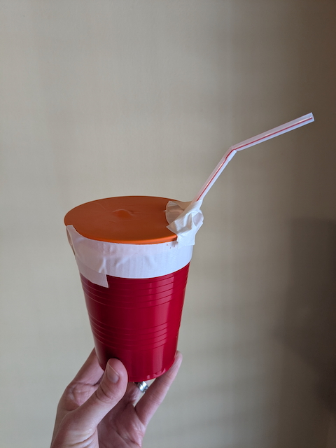

# Terror From the Sky On 9/11

## Introduction

_The recency of these events makes this a challenging topic to discuss, particularly since many parents lived through 9/11 and have their own personal feelings and perspectives._

On September 11, 2001 (9/11), terrorists hijacked four airplanes full of passengers. Two of them struck the Twin Towers of the World Trade Center in New York City causing them to collapse, a third struck the Pentagon near Washington, DC, and the fourth was aimed at either the White House or the Capitol in Washington, DC before the passengers on Flight 93 fought back, resulting in the plane crashing in western Pennsylvania. 

_Fireboat: The Heroic Adventures of the John J. Harvey_ tells the story of how a group of people voluntarily saved, restored, and preserved an aging fireboat. On the morning of 9/11, the crew of the John J. Harvey answered the call for help, at first ferrying people affected by the World Trade Center attack to safety as part of the largest volunteer boat lift in history. Then they answered a second call for help, re-entering service as a fireboat when the Manhattan water pipes were broken and buried.

This wonderful story illustrates the resilience of the American people when tragedy strikes, as well as their self-sacrifice, courage, kindness and generosity in coming together to help one another. These traits were exhibited all over the country (not just in New York City) during this time and the aftermath.

---

## Book

Title: "Fireboat: The Heroic Adventures of the John J. Harvey"
Author: Maira Kalman
Illustrator: Maira Kalman
Year published: 2002
Length: 48 pages

---

## Calendar

Monday:
 - "Songbook: _Where Were You (When the World Stopped Turning)_ [songbook]"
 - craft1

Tuesday:
 - geography
 - cooking

Wednesday:
 - "Vocabulary (before reading) [vocab]"
 - pump

Thursday:
 - re-enactment
 - fire1
 
Friday:
 - hero
 - writing

---

## American Heritage Songbook: Where Were You (When the World Stopped Turning) {#songbook}

```metadata
toc: "American Heritage Songbook: _Where Were You (When the World Stopped Turning)_"
time: 5 minutes
freq: daily
```

> Where were you when the world stopped turning on that September day?

Dozens of songs were written about 9/11; Wikipedia currently lists over 180, several of them performed but never released. For our American Heritage Songbook, we selected _Where Were You (When the World Stopped Turning)_ by Alan Jackson. [First performed at the Country Music Association’s annual awards show][song1] just a few weeks after 9/11, the song won the Song of the Year award at both the Country Music Association and the Academy of Country Music. It also won a Grammy for Best Country Song. _Where Were You_ topped the Billboard’s country chart for five weeks. [This version on YouTube][song2] has the lyrics and images from 9/11 (so view with caution).

The chorus includes a paraphrase from Paul’s first letter to the Corinthians:

> But I know Jesus and I talk to God
> And I remember this from when I was young
> Faith, Hope and Love are some good things He gave us
> And the greatest is Love
{.nowrap}

See the Scripture activity below for the exact quote. 

[song1]: https://www.youtube.com/watch?v=mwcWVs4Eejg
[song2]: https://www.youtube.com/watch?v=gPHnadJ-0hE

---

## Arts & Crafts: First Responder Badges {#craft1}

```metadata
time: 20-40 minutes
prep: 5-15 minutes
supplies: thin cardboard, foil, scissors, pencil, tape, markers
```

> But people were brave.  The entire city sprang into action.  Firefighters and police officers and doctors and construction workers and teachers and children and cooks and parents.

September 11, 2001 provides an opportunity to discuss first responders (who are they, what do they do). This activity is based on one of the home activities on the [National September 11 Memorial and Museum website][badges].

[badges]: https://www.911memorial.org/learn/youth-and-families/activities-home/first-responder-badges

### Supplies

* Empty cereal box or other thin cardboard or foam sheet
* Aluminum foil
* Scissors
* Pencil
* Tape
* Markers (like sharpies)
* Optional: [badge templates][templates]
* Optional: magnets or pins

[templates]: https://www.911memorial.org/sites/default/files/inline-files/2020_VirtualActivityStation_Badges.pdf


### Directions
1. Draw badge shapes on the back of the cereal box.  Either free-hand or use a template.
2. Cut the badges out of the cereal box.
3. Cover the badges with aluminum foil and attach it with tape on the back of the badge.  Trimming the aluminum foil so there isn’t too much excess makes covering the badges a little easier.
4. Decorate the badges with markers.  You can make them look like first responder badges or draw something to help you remember September 11, 2001.
5. Add double sided or masking tape to the back to stick on a shirt as a badge.  Optionally, add a pin to attach to a shirt or add a magnet (with glue) to either attach to a shirt (with a second magnet on the other side of the shirt) or use on your refrigerator.


{.center}

---

## Geography: The 9/11 Boat Lift {#geography}

```metadata
time: 15-60 minutes
supplies: 
```

> You can’t help fight the fire but you can ferry people to safety.


New York City is an economic powerhouse due primarily to its geographic features. It sits at the confluence of major waterways: the Atlantic Ocean provides easy access to European markets and the Hudson River provides easy access to domestic markets. It boasts a great natural harbor, sheltered by Staten Island and the Brooklyn peninsula. These geographic features made it a major international trade center throughout its history. Commercially, it is home to Wall Street and the financial district. Use the map below to show your kids New York Harbor, Manhattan Island, Hudson River and the Atlantic Ocean. 


<br>1) Hudson River; 2) East River; 3) Long Island Sound; 4) Newark Bay; <br> 5) New York Harbor; 6) Lower New York Bay; 7) Jamaica Bay; 8) Atlantic Ocean
{.center .caption}

With over 60 million tourists a year, New York City is the most visited city in the world. Culturally, it is home to Broadway musicals and plays. The Statue of Liberty lives there, a reminder of the millions of immigrants that passed through Ellis Island looking for a fresh start in a new home. Its iconic skyscraper skyline reflects the scarcity of land on Manhattan Island, the most heavily populated borough of New York City. 

The Twin Towers were located on Manhattan Island. When they collapsed on 9/11, hundreds of thousands of people needed to evacuate lower Manhattan. But the 21 bridges and 15 tunnels connecting Manhattan to the mainland were all closed due to security concerns and a need to clear the roads for first responders. Have your kids [use this map][map1] to locate some of the bridges and tunnels connecting Manhattan Island to the mainland.

How do you get off an island when all the bridges and tunnels are closed? The solution was the 9/11 Boat Lift. Hundreds of boats, all shapes and sizes, answered the Coast Guard’s call. Working together, on the darkest day of New York’s history, they ferried over 500,000 people to safety in nine hours – the biggest boat lift in history.  We usually consider  police, firefighters, and paramedics as first responders. On 9/11, the crews of every boat in New York Harbor were also first responders.  [This short documentary][documentary] (12 minutes), narrated by Tom Hanks, tells that dramatic story.

Many of the people were evacuated by boat from Battery Park. [Take a look at this map][map2], and ask your kids to locate the 9/11 Memorial (former location of the Twin Towers) and Battery Park, where most of the evacuees were picked up by the 9/11 Boat Lift. Use the key in the lower left to estimate the distance to Battery Park from the Twin Towers.

[map1]: https://worksheets.clipart-library.com/worksheet/printable-map-of-manhattan-island-1.html
[documentary]: https://www.youtube.com/watch?v=18lsxFcDrjo
[map2]: https://worksheets.clipart-library.com/worksheet/printable-map-of-manhattan-island-1.html

---

## Famous American Quotes: The World Will Always Remember 9/11 {#text}

```metadata
time: 5 minutes
freq: once
```

> This republic is young, but its memory is long. Now, we have inscribed a new memory alongside those others. It’s a memory of tragedy and shock, of loss and mourning. But not only of loss and mourning. It’s also a memory of bravery and self-sacrifice, and the love that lays down its life for a friend – even a friend whose name it never knew.  – President George W. Bush

The Twin Towers in New York City were not the only targets of the terrorists. They also claimed victims at the Pentagon in Washington, DC. A fourth plane was aimed at either the White House or the DC Capitol before passengers forced it to crash in an open field in western Pennsylvania. 9/11 memorials were raised at all three sites: the [9/11 Pentagon Memorial][pentagon] opened on September 11, 2008 and both the [Flight 93 National Memorial][flight93] in Pennsylvania and the [National September 11 Memorial and Museum][nycmemorial] in New York opened in 2011 on the tenth anniversary of the attacks.

The quote above is from a speech, _The World Will Always Remember 9/11_, that President Bush delivered at the Pentagon on September 11, 2002, as part of a memorial service that marked the one year anniversary of the attacks. He referenced the bravery and self-sacrifice of the first responders, the firefighters who went up into the burning towers and never came down, and the Flight 93 passengers who gave their lives to prevent the fourth attack.

You can read the full text of the speech, or hear the full four minute speech delivered by President Bush, [here][speech].

[pentagon]: https://pentagonmemorial.org
[flight93]: https://www.nps.gov/flni/index.htm
[nycmemorial]: https://www.911memorial.org
[speech]: https://www.americanrhetoric.com/speeches/gwbush911worldremembers.htm

---

## Cooking: New York Style Pizzas {#cookbook}

```metadata
time: 20-30 minutes
prep: 10-15 minutes
supplies: sugar, yeast, flour, salt, cornmeal, pizza sauce, cheese, toppings
```

> People brought supplies: fuel, sweaters, gloves, pizza, sandwiches and coffee.

New York Style Pizza has a thin crust that is often hand tossed. It is crispy at the edges and softer in the middle - so soft that it is possible to fold the pizza in half and eat it more like a sandwich.

### Ingredients (for 12-inch New York style crust, double the ingredients below)

* ⅔ cup warm water (110-115 degrees Fahrenheit)
* 1 teaspoon sugar
* ⅛ ounce package of active dry yeast
* 1 and ¾ cups all-purpose flour (or bread flour)
* ½ teaspoon salt
* 1 tablespoon cornmeal
* Cooking spray
* Pizza sauce (store bought or use your favorite homemade recipe)
* Shredded mozzarella cheese
* Your favorite pizza toppings (bell peppers in many colors, olives, pepperoni, mushrooms, pineapples, etc.)

Note that instead of making a thin crust New York Style pizza, you can also purchase a pre-made crust. We did both.

### Directions
1. Combine water and sugar in a small bowl and stir to dissolve sugar.
2. Add yeast and stir to combine.
3. Wait 5-10 minutes or until the yeast mixture has become foamy.
4. Combine flour and salt in a medium bowl.
5. Add in yeast mixture and stir to form a soft dough.
6. Put dough on a lightly floured surface.
7. Knead for 5 minutes or until dough is smooth and elastic.  Add additional flour as needed to avoid the dough being too sticky.
8. Place dough in a medium bowl coated with cooking spray and flip dough over to coat both sides.  Cover with a towel or plastic wrap.
9. Let dough rise in a warm place for approximately 30 minutes or until the dough has roughly doubled in size.
10. Punch the dough down and place on a lightly floured surface to knead for an additional 2 minutes (or until smooth).
11. Pat dough into a flat disc about 7 inches in diameter.
12. Let rest for 2-3 minutes.
13. Continue patting, stretching and resting until the dough is 12-14 inches in diameter.
14. Spray a pizza pan (or cookie sheet) with nonstick spray and sprinkle with cornmeal.
15. Press dough into pan.
16. Preheat oven to 500 degrees Fahrenheit.

Alternatively (or if using a premade crust), shape into a circle (or other 9/11 shape such as two long thin rectangles to represent the Twin Towers).

Once crust is made:

17. Add sauce.
18. Decorate with toppings and cheese.  You can decorate as a normal pizza or in a way to remind you of 9/11.
19. Bake (follow directions based on crust).  We cooked for about 10 minutes at 500 degrees Fahrenheit.
20. Enjoy and/or offer it to those nobly self-sacrificing to help others!


{.center}

---

## Science: Make Your Own Mini Water Pump {#pump}

```metadata
time: 20-30 minutes
prep: 10-15 minutes
supplies: plastic cup, balloon, water, scissors, toothpick, bendable plastic straw, masking tape
```

> The water pipes were broken and buried.  And the fire trucks that had raced to the scene could not pump water.  The firefighters attached hoses to the Harvey.  … For four days and nights the Harvey pumped water.

A pump is a mechanical device to move fluids, essentially a "water
pusher". You may be surprised how many pumps you can find in your own
house, including soap dispensers, washing machines, dishwashers, and
water heaters.  There's even a pump involved in pouring water out of
sink faucets (though if you live in a city, this pump could be miles
away). Most industrial and appliance pumps use spinning blades to
push the water. You can think of a boat's propellor, but instead of
pushing the boat through the water, it pushes the water through the
pump. 

A simpler way to push water is through mechanical pressure.
Since water is virtually _incompressible_, pushing water _into_ one
end of a filled pipe means that water needs to be pushed _out of_ the
other end. A common example of this is a water tower: here, gravity
(i.e. the weight of the water in the tower) is pushing the water
_into_ the pipe at the bottom of the reservoir. This creates
_pressure_ to push water _out of_ the pipe at the other end. 

Here we'll make a simple pump that translates air pressure into water
pressure to push water through a straw. When we press on the balloon,
it compresses the air at the top of the cup, increasing the air
pressure and causing the air to push harder on the water. If the
increased pressure is enough to lift the water up the straw against
gravity, then water will squirt out the other side.

### Supplies

* Plastic cup
* Balloon
* Water
* Scissors
* Toothpick
* Bendable plastic straw
* Masking tape

### [Directions][youtube1]

1. Fill the plastic cup about ¾ full of water.
2. Cut the bottom of the balloon off and stretch the top portion of it over the top of the plastic cup.
3. Secure the balloon to the cup with tape.
4. Use the toothpick to make a small hole in the balloon.
5. Insert the bendable plastic straw into the hole and push all the way into the cup (to near the bottom).  Note that you do NOT need to make the hole from the toothpick as large as the straw.  It will stretch and you need a tight fit around the straw.
6. Secure the straw with tape.
7. Press the stretched balloon up and down a few times.  Watch the water get pumped out of the cup!



{.center}

The John J. Harvey was designed to be the largest and most powerful fireboat in the world when it was launched in 1931, and was capable of pumping 18,000 gallons of water per minute. To give a sense of this, put one gallon of water in a bucket and take a measuring cup. Try to see if you can “pump” one gallon of water from one bucket into another within one minute by using the measuring cup to scoop water from one bucket to another. (Fun Fact: did you know a human heart pumps 1.5 gallons of blood per minute?)

[youtube1]: https://www.youtube.com/watch?v=bN_kNc86Cdg
---

## Science: Extinguishing Fire {#fire1}

```metadata
time: 20-30 minutes
prep: 10-20 minutes
supplies: tea candles, matches, spray bottle, glass bowl, Play-Doh or modeling clay, baking soda, vinegar
```

> The Harvey went up and down the river, fighting fires.

Fires require three things: heat, air, and fuel.  This activity shows what happens to a flame when it is deprived of one of these items. This fire safety activity comes from the [Pencil, Glue & Tying Shoes][science1] blog. Adult supervision required!

Older students may appreciate the following more detailed explanation.
The _combustion reaction_ behind a fire is a chemical reaction between
the fuel and the oxidizer. For example, when burning methane, the
reaction is CH₄ (methane gas) + 2 O₂ (oxygen gas) ⟶ CO₂ (carbon
dioxide gas) + 2 H₂O (water) + Energy (see if your student can count
the number of each element on each side to show that they balance).

Notice that this reaction is _exothermic_: it produces energy as a
byproduct, but it also requires a certain (smaller) amount of
_activation energy_ to initially break some of the chemical bonds
before it can get started. This is why gas leaks can be so dangerous,
you can build up large amounts of two ingredients, just waiting for
the activation energy. Once the reaction starts, though, the released
energy is more than enough to keep an explosive reaction going until
one of the other two ingredients runs out.

### Supplies

* Three tea candles (or other small candles)
* Matches or some sort of lighter
* Spray bottle with water
* Glass bowl, cup or jar

### Directions

1. If you have a candle that is nearly burned down, you can use that.  Otherwise, you may want to pre-burn one candle until there is very little wax/wick left.
2. Set the three candles on a safe surface (we used our kitchen counter).  Place the spray bottle by one of them, the glass jar by another.
3. Light the three candles with the match or lighter (parental supervision here!).
4. Remove heat from the first candle by spraying it with the water bottle.  What happens to the flame?
5. Remove air from the second candle by placing the glass jar over the top of the candle completely enclosing it. What happens to the flame?
6. Remove fuel from the third candle (the one mostly burned down already) by letting it completely burn down.  What happens to the flame?


{.center}

[science1]: https://pencilsglueandtyingshoes.blogspot.com/2011/10/fire-safety-science-project.html

While most fires can be extinguished with water there are some where water actually spreads the fire or can cause extensive damage by itself. For example, pumping water on grease and oil fires spread the fire wider. When valuable electronic equipment is at risk, extinguishing a fire with water can cause extensive damage. In these situations, it is best to extinguish a fire using something other than water. The following activity illustrates how this might work.

### Supplies

* Play-doh or modeling clay
* Glass bowl
* Tea candle
* Matches or some sort of lighter
* Baking soda
* Vinegar


### Directions

1. Use a little bit of play-doh or modeling clay to secure the tea candle to the bottom of the glass bowl.
2. Sprinkle baking soda all around the candle until it covers the bottom of the bowl (about ¼ inch high).  You should not cover the candle with the baking soda.
3. Light the candle and observe the flame (adult supervision required).  Is it strong and steady?
4. Slowly pour some vinegar onto the baking soda.  Do NOT pour directly onto the candle.  Pour a little bit at a time (ultimately dissolving all the baking soda).
5. What happens to the flame?
6. Immediately try to re-light the candle.  Why doesn’t it work?


{.center}

Point out that the baking soda and vinegar never touch the candle/flame.  If you have done the previous science activity, ask which component got removed when the vinegar was added? 

Here's what's happening: when you mix baking soda (a weak base) with
vinegar (a weak acid), it quickly releases a lot of carbon dioxide.
For the older students, that's NaHCO₃ (baking soda) + CH₃COOH
(vinegar) ⟶ CH₃COONa + H₂O + CO₂. You can think about it as the Na
swapping places with the H, and then the H₂CO₃ breaks down further
into H₂O and CO₂. Now, carbon dioxide is heavier (more dense) than
oxygen, so it "pours into" and eventually fills the bowl, pushing the
lighter oxygen up and out, and starving the flame of its oxidizer.

This was almost like magic!  Parents and children alike were amazed when the flame flickered out seemingly on its own without contact from anything.

---

## Historical Re-enactment: Putting Out "Fires" {#re-enactment}

```metadata
toc: "Re-enactment: Putting Out 'Fires'"
time: 20-60 minutes
prep: 5-10 minutes
supplies: bucket, hose, water guns, chalk, solo cups, swimsuits
```

> But suddenly an urgent message came loud and clear.  “John J. Harvey.  … WE NEED YOU!”  The water pipes were broken and buried.  And the fire trucks that had raced to the scene could not pump water.  The firefighters attached hoses to the Harvey.  The Harvey fought the fires alongside the McKean and the Fire Fighter.

### Supplies

* Bucket to hold water
* Hose
* Cannon water guns ([can be purchased at Dollar Tree][dollartree] - these are the most similar to pumping water, but other water guns with a large spray could work) 
* Sidewalk chalk
* Solo cups, or other plastic stackable items (we used orange cones and some empty yogurt containers that we had lying around, as well as some sand toys)
* Swimsuits or other clothes that can get wet

Fill the bucket with water and put it outside on the sidewalk or driveway. Use chalk to draw the outline of a boat around the bucket; alternatively, you can have the kids step into their own plastic tub or bin for their boats. You can write the name of the boat inside the chalk outline. Put the cannon water guns into the bucket.

Set up some “fires” on the lawn or driveway by stacking up the plastic cups (or other items). You can also draw some fires using the sidewalk chalk.

Round up the crew of the fireboats and provide them with instructions. Then send out the call to action (“We need you!”) and give the crew two minutes to get in their swimsuits/water clothes and get to the boat.

Have the crew stay within the chalk outline of the boat and use the cannon water guns (or a hose) to “put out the fires” by knocking over (with the spray of water) the plastic “fires” and/or washing away the chalk fires.

We did this over and over - knocking down all the items with the water spray and then re-setting them up and doing it again. Eventually, my children split into three “boats” just like in the book by drawing separate chalk boats next to each other and spreading out the “fires.” They had to work together for some of the heavier “fires.” My daughter even ran inside to bring out snacks to represent the supplies that people brought.


{.center}

[dollartree]:https://www.dollartree.com/h2o-blasters-plastic-water-squirters-26-in/252267
---

## Supplemental Reading: _Survivor Tree_ {#supplemental}

```metadata
time: 15 minutes
```

> A tree stood steel-straight and proud
> At the foot of the towers that filled its sky.
{.nowrap}


{.center}

**Title:** _Survivor Tree_<br>
**Author:** Marcie Colleen<br> 
**Illustrator:** Aaron Becker<br>
**Year Published:** 2021<br>
**Length:** 48 pages

The story of the Callery Pear tree that survived the 9/11 attack is a true story of resilience, hope, and recovery. Burned, broken, and buried under the rubble, it was unearthed and removed to a nursery. Ten years later, restored to health, it was returned and replanted at the 9/11 Memorial.

Author Marcie Colleen uses the seasons as her framework  to tell the story of the survivor tree. Parents and children will enjoy the way the tree changes as the seasons change. Those seasonal changes propel the story forward through the devastating attack and damage and then the slow recovery as the tree’s resilience brings it back to health.

Illustrator Aaron Becker’s illustrations tell their own story and will draw your children deeper into this book. Becker intertwines the mother taking photos of her children into the story. Have your children pay close attention to how he does it. For those who want to go deeper into Becker’s art and creative process, [watch this short video][youtube2] where he describes the “visual language” he tried to create to match Marcie Colleen’s words.

There are at least three different picture books that tell the story of the Callery Pear tree that survived the 9/11 attack. We also liked _This Very Tree: A Story of 9/11, Resilience, and Regrowth_. Both stories were published in time for the 20th anniversary of 9/11.

Consider an historical re-enactment based on this story: plant your own Survivor Tree as a memorial. Or organize a tree-planting as part of a community beautification project.

[youtube2]:https://www.amazon.com/Survivor-Tree-Marcie-Colleen/dp/0316487678/ref=sr_1_1?crid=2FGZQLVDQOBXC&dib=eyJ2IjoiMSJ9.riEwAYp9FUmrBZMQ-I6BcMiG1_ECvjDy28QN2dUid7Bi7HzhX_-QejZJF96CfPpHxRBdTw827ZnnZyV95YtK2GGCarr7UCCJzkU6agM85zNO9HOycRyQ_fDzy6fYIWYv8i0mI5zfj6OExSsNFCsCVO8uVd1YxmFHnseqc-1BlChFSjhqzCGesOqm84mp7O5jsF2ZvVAUEQS1b96JPKkLVnEJu4-85S09ktOuOvQHzQt4IJsPYD_lROlRXywP8wbzffbSQ3KSlrbYN7N7DVe0MmaPQpJXmRorBWPL9n_K1B4.n_tgkStIlFGYPeTLi4AqICkjIstVsl6a-4U3nuPvDjY&dib_tag=se&keywords=survivor+tree&qid=1750626648&sprefix=survivor+tree%2Caps%2C245&sr=8-1

---

## Scripture: 1 Corinthians 13:13 {#scripture}

```metadata
time: 10 minutes
freq: daily
```

> And now these three remain: faith, hope and love.
> But the greatest of these is love.
{.nowrap}

1 Corinthians 13:13  is one of the most popular and oft quoted verses in the Bible. The verse was paraphrased in Alan Jackson’s Grammy-winning song about 9/11 (see above). It speaks to the timeless nature of these foundational truths – and how the greatest of these is love. This verse is the summation of Paul’s magnificent description in 1 Corinthians 13 of how love underpins all the other virtues (“if I have a faith that can move mountains, but have not love, I am nothing”).

Read all of 1 Corinthians 13 to your children. Then ask them to memorize this verse.

---

## Vocabulary {#vocabulary}

```metadata
time: 10 minutes
```

> They repaired the 2 propellers making them new with a shiny coat of brass.
> They repaired the holes with steel plates and covered the places where the rivets wept.
{.nowrap}


_Fireboat: The Heroic Adventures of the John J. Harvey_ contains words describing the operation of a fireboat as well as how a boat, in general, is constructed. Many of these words may be new to young readers so we’ve selected a handful of them to define at greater length. We suggest you review these definitions with your kids after reading the story a couple of times. Then ask them to point them out the next time you read the story.


Diesel Engine
: an engine using a  type of heavy oil as fuel

Nozzle
: a cylindrical or round spout at the end of a pipe, hose, or tube used to control a jet of gas or liquid  

Pier
: a platform supported on pillars or girders leading out from the shore into a body of water, used as a landing stage for boats.

Scrap
: discarded metal for reprocessing

Propellers
: a mechanical device for propelling a boat or aircraft, consisting of a revolving shaft with two or more broad, angled blades attached to it.

Brass
: a yellow combination of copper and zinc

Rivet
: a metal pin used to connect two pieces of metal

Barnacle
: a marine crustacean with an external shell, which attaches itself permanently to a variety of surfaces.

Welding
: attaching or connecting two pieces of metal by applying heat

Pump
: a device that propels fluid (such as water for a fireboat)

Plucky
: brave or courageous

---

## Writing: Semantic Typography {#writing}

```metadata
time: 10 minutes
```

> Amazing things 
> were happening
> BIG and small.
{.nowrap}


When reading _Fireboat_, you may notice that the author/illustrator, Maira Kalman, is playing with the text. Look at the cover. The sub-title of the book, (“The Heroic Adventures of the John J. Harvey”), is in an arc, like the words were pumped out of a firehose. The author’s name, in the lower right,  looks like it is floating on gentle water ripples. On the first page, the word “big” is printed in a larger font and “small” uses a smaller font size. Some words follow the curves of the artwork (George Washington Bridge). This is called "semantic typography," where the shape and position of the words themselves have meaning. Read through the story and ask your kids to point out instances of semantic typography. Then, ask them why they think the author used it?

Finally, ask them to write a sentence, paragraph, or short story that uses semantic typography.

---

## Art: Design Your Own Memorial {#art-memorial}

```metadata
time: 10-20 minutes
```

> The heroes who died will be remembered forever.

On all the crash sites, memorials have been built to remember the events of 9/11. Discuss with your children what purpose a memorial has, maybe plan to visit a local memorial. Look at photos of the various 9/11 Memorials, discuss how the artists choose to remember the events of 9/11. What did the artists emphasize?  How do the Memorials make you feel? Why was that location chosen for the memorial? 

These are the best known 9/11 memorials in the USA:

The Pentagon (Arlington, Virginia) has the [National 9/11 Memorial][pentagon] - 184 illuminated benches arranged according to the victims' ages, starting with Dana Falkenberg (age 3) to John Yamnicky Sr. (71).

[Flight 93 National Memorial][flight93]. The Tower of Voices (Stoystown, Pennsylvania) - A common field one day, a field of honor forever. It has a wall of names of all the victims. It has a massive wind chime tower, the only like it in the world. There is one chime for each passenger and crew member. There is also an engaging museum with recordings of the passengers making their final phone calls.

[National September 11 Memorial & Museum][nycmemorial] (New York City, New York) - A museum that tells the stories through artifacts, imagery, personal stories and more. The museum has The Last Column, the final piece of the World Trade Center steel that was removed from Ground Zero and twin reflecting pools set in the footprints of the original towers.

After viewing one or more of the memorials above, ask your children to draw their own version of a 9/11 memorial. Or they can make their own memorial out of Legos, Magna-Tiles, or pipe cleaners as in the photos below.

<br>
The Never Forgotten Airplanes<br>
Half an airplane: visitors walk along the middle aisle and all the names of the victims of the attacks are written on the seats.<br><br>
<br>
A memorial combining both stories.
{.center .caption}

[pentagon]: https://pentagonmemorial.org
[flight93]: https://www.nps.gov/flni/index.htm
[nycmemorial]: https://www.911memorial.org

---

## Family History: Where Were You? {#history1}

```metadata
time: 10 minutes
```

> What were the people of the Harvey doing when the planes hit?  
Bob Lenney was trimming hedges.  Tom was drinking tea in his kitchen...


Tell your child(ren) where you were and what you were doing when the Towers fell.  I told my children that every American who was old enough on September 11, 2001 would remember what they were doing when the news came in about the Twin Towers.  They immediately asked me what I was doing and shortly thereafter asked my husband (and continued to test my statement by asking others).  We explained that this was such a big event for the whole country that even though the planes were all on the East Coast, everyone was impacted.  The grounding of all air traffic made things eerily quiet for a few days above and beyond the tragedy itself that rocked the whole country.

---

## Family History: What Happened When? {#history2}

```metadata
time: 10 minutes
```

> New York City. 1931. Amazing things were happening big and small. 


The author begins the book by talking about some interesting things that were happening the same year that the John J. Harvey was launched.  This is an interesting way to set the stage and give context for the story.

Pick a year such as the year your child was born or the year you got married or some other meaningful year.  Find out some interesting things (maybe 4-6) that happened that same year.  Take this a step further by beginning a story with these facts.

---

## Civic Culture: What Is a Hero? {#hero}

```metadata
time: 15 minutes
```

> The Harvey was a hero.

What is a hero and how can people show gratitude to those who act heroically in their own communities? Who are your heroes? What makes them a hero for you? Can a regular person become a hero? How?

Many people became heroes on 9/11, simply by their willingness to help. Some people allowed strangers to take a rest at their homes, others offered free meals. Some acts of kindness happened far away. For example, due to the attacks the entire U.S. airspace was closed off and planes that were already up in the air were diverted. Many planes from Europe, which had already crossed the Atlantic, ended up grounded in Canada. The small town of Gander in Newfoundland welcomed 6,500 stranded passengers from around the globe, offering them food, shelter and comfort for five days before the airspace slowly opened up again. The Canadian city converted churches and schools into makeshift shelters. 

In times of crisis, we all need to be willing to help when the need arises. Tell your children this week/month you want them to look for a way to be helping others! If you see trash that needs to be picked up, don't just notice it, act on it and clean it up. Within your own family, teach your kids to ask “what can I do for you?” Can I help a little sibling with a school project? Can I help my parents with loading the dishwasher/folding laundry/making a meal plan? Challenge your child(ren) to act as heroes in small ways everyday.  It may also be helpful to come up with some larger service project to emphasize this (volunteering at an event, participating in a community clean up day, etc.).

---

## Civic Culture: 9/11 and 911 {#911}

```metadata
time: 10 minutes
```

> But then on September 11, 2001 something so huge and horrible happened that the whole world shook. 

Depending on your child(ren)’s age, you can teach or review that calling 911 is what you do in an emergency in the US.  Emphasize how serious this is and perhaps do a practice drill.  Note that this is only for the U.S. and that other countries have different emergency numbers (but in many countries calling 911 will automatically re-direct the call to the local emergency number).

You can also point out that the date September 11 has the digits 9-1-1 because September is the ninth month.  I started with this and got to watch the surprise as my son figured out the connection between the date and the emergency number.

This can also be a great opportunity to teach or review disaster preparedness and fire drills.  See the _Tucky Jo and Little Heart_ WWII module for a fire drill activity.

---

## Math: Time & Distance {#math}

```metadata
time: 15 minutes
```

> It had 5 diesel engines so it could go 20 miles per hour.
> For four days and nights the Harvey pumped water.
{.nowrap} 

Assume the Harvey was pumping water at its maximum capacity (18,000 gallons per minute) for all four days and nights. How many gallons of water did the Harvey pump? (4 days x 24 hours/day x 60 minutes/hour x 18,000 gallons/minute = 103,680,000 gallons)

Before the Harvey was recruited to put out fires, it was part of the 9/11 Boat Lift, rescuing people from the Museum of Jewish Heritage in Battery Park and dropping them off at Pier 40 along the Hudson River. Assuming the Harvey traveled at its top speed, how long was the round trip  travel time if the distance between Battery Park and Pier 40 was 2.5 miles? (15 minutes or ¼ of an hour; round trip = 5 miles; 20 miles/hour = 5 miles/? 5/20 = x hours ).

A ceremony was held on May 2, 2002 to mark the end of the 9/11 clean-up in New York City. How many months, weeks, and days was that from September 11, 2001? (Months = 7 months + 3 weeks; Weeks = 33 weeks + 2 days; Days = 233).

---

## Math: Counting Steps {#counting}

```metadata
time: 15 minutes
```

> The city had been attacked.  Everyone was terrified.  But people were brave.  The entire city sprang into action.  Firefighters and police officers…

Each of the Twin Towers had 110 floors and 2,071 steps from the top of the building all the way down to the ground level.  Around the U.S. many 9/11 stair climb events are held annually to honour the brave firefighters and other first responders, who ran up the stairs in their heavy equipment to bravely try to evacuate and rescue as many people as possible. During these events, participants run and climb up 2,071 steps to  honor the brave men and women who lost their lives that day. 

2,071 stairs is a lot of stairs. Can you try to (at your own speed, take breaks if needed) walk up and down 208 (207 +1 ) stairs in your house? How long does it take you to do that?


