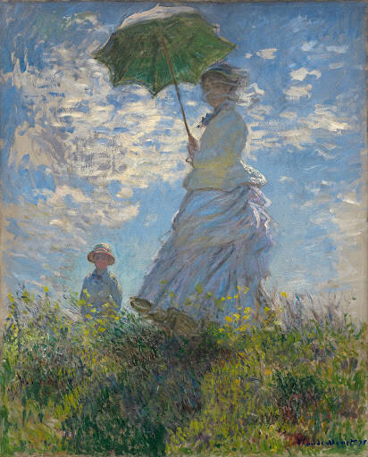

# Civil Rights

## Introduction

_Freedom on the Menu_ tells the story of one of the seminal events of
the Civil Rights movement of the 1960s, as seen through the eyes of a
young girl and her family. We are introduced to Martin Luther King,
Jr., the man who galvanized the nation with his speeches and
non-violent protests. It was Martin Luther King, Jr. who repeatedly
reminded America of the claim in our founding document that “All Men
Are Created Equal” and asked America when that would be true for black
Americans.

While Martin Luther King, Jr. towers over the era of Civil Rights,
_Freedom on the Menu_ focuses on the story of ordinary people—an
ordinary family—rising up, organizing, marching, boycotting,
picketing, protesting, and practicing civil disobedience so that they
could participate fully in the American dream. It is a very American
story, the story of an oppressed people joining together voluntarily
across all walks of life to fight for the American ideal, that “All
Men Are Created Equal.”

Finally, it’s worth noting the importance of the family in this
story. Families are the fundamental unit of American society. _Freedom
on the Menu_ demonstrates the centrality of families for transmitting
values from one generation to the next. Connie’s parents, her older
brother and sister, even her great-Aunt Gertie all support the Civil
Rights movement – and young Connie wants to be part of it, too. The
author, Carole Boston Weatherford, shows us a loving family fighting
together, but in different ways, to move America closer to her own
ideals.





---

## American Heritage Songbook: This Little Light of Mine

|Name| Songbook: _This Little Light of Mine_
|Time| 5 minutes
|Freq| Daily
|Cal | M1
{:.metadata}

> This little light of mine, I’m gonna let it shine
> Let it shine, let it shine, let it shine
> Everywhere I go, I’m gonna let it shine
> Let it shine, let it shine, let it shine
{:.nowrap}

No one knows the exact origin of this song but it goes back at least
to the 1930s. Many, many people and groups have recorded a variation
of it; the simple lyrics lend themselves to adaptations. The song is a
staple in many Christian children’s song books and is believed by many
to be inspired by scripture (specifically, Matthew 5: 14-16, see
below).  The Civil Rights movement of the 1960s adopted it as one of
its anthems. You can [hear it sung] here in a recording preserved by the
Smithsonian Institute in a project called The Story of the Civil
Rights Movement through its songs.  Raffi, the well-known children’s
music artist recorded his version [here][raffi]. Even Bruce Springsteen
[recorded his version].

[hear it sung]: https://www.youtube.com/watch?v=Au0AFyB-m_8
[raffi]: https://www.youtube.com/watch?v=L6jHFtvSiaM
[recorded his version]: https://www.youtube.com/watch?v=R0qAYq1GVec

---

## Famous American Texts: _I Have a Dream_

|Time| 5 minutes
|Freq| Daily
|Cal | M2: Famous Texts: _I Have a Dream_
{:.metadata}

> I have a dream that one day this nation will rise up and live out the true meaning of its creed:
> “We hold these truths to be self-evident, that all men are created equal.”
> …
> I have a dream that my four little children will one day live in a nation
> where they will not be judged by the color of their skin but by the content of their character.
{:.nowrap}

Martin Luther King Jr.’s “I Have a Dream” speech galvanized our
nation, reminding people of our founding creed — and how black
Americans had all too often been excluded from the American dream. The
speech was delivered by King on the steps of the Lincoln Memorial on
the 100th anniversary of the Emancipation Proclamation to a quarter of
a million people lining the National Mall and millions more via
television. It vaulted King to the forefront of the national Civil
Rights movement and helped lead to the passage of the Civil Rights Act
of 1964 which abolished all of the Jim Crow laws that discriminated
against black Americans.

To experience the power and the poetry of his speech, your children
need to [hear Dr. King deliver it]. To help them internalize it, ask
them to memorize one of the lines above.

[hear Dr. King deliver it]: https://www.youtube.com/watch?v=o8dzxh7Ybqw

---

## Political Geography: Jim Crow Laws

|Time| 15 minutes
|Cal | T2
|Supp| U.S. puzzle
{:.metadata}

> “Connie, the sit-ins have spread all over the South,” said Daddy.

The Greensboro sit-ins spread rapidly. By the end of the month
(February) they had jumped from North Carolina to South Carolina,
Tennessee, Maryland, Kentucky, Alabama, Virginia, and Florida. By
March, they were happening in Texas, Louisiana, Arkansas, and
Georgia. After that, people rose up in West Virginia, Ohio, Oklahoma,
Mississippi, Illinois, Kansas, and Missouri. All told, scholars
estimate 70,000 people, black and white, participated in the sit-ins.

Ask your kids to use a jigsaw puzzle of the United States (or a
coloring page) to illustrate how the sit-ins spread. First, assemble
the states that joined North Carolina in February. Ask them if they
notice anything about this first group of states (they are all very
close to North Carolina, where the sit-in movement started).

Next, ask them to add the states where sit-ins started in
March. Finally, ask them to add the last batch of states. Ask them if
there are any states that stand out in particular in this last
group. The law that prevented black Americans from eating at lunch
counters with white Americans is an example of a “Jim Crow” law – a
law that discriminates against some people based on the color of their
skin. Jim Crow laws are usually thought of as a phenomenon of southern
states. Are all the states in this last group southern states?

---

## Biography: Rev. Martin Luther King, Jr.

|Time| 5 minutes
{:.metadata}

> Later that week, our whole family went to hear Dr. King preach at the college chapel.
> I didn’t really understand all of his speech, but I liked his booming voice.
> It sounded as if he believed God was on our side.
{:.nowrap}

The Reverend Dr. Martin Luther King, Jr. was the leading figure in the
Civil Rights Movement of the 1960s. Like his father and grandfather
before him, he was a Baptist minister. He was a master strategist when
it came to non-violent protests. He continually called for America to
live up to her ideals, pointing us back to our founding document and
Thomas Jefferson’s revolutionary phrase that “all men are created
equal.”

In October of 1960, just a few months after the Greensboro Four
started the sit-ins that swept through the South, Reverend King joined
the Atlanta sit-ins at a restaurant inside Rich’s, a rival department
store to Woolworth’s. He was arrested and, because of his prominence,
was the only one sentenced to hard labor at a maximum-security
prison. Pressure from political figures resulted in his release two
days later. This was only one of the more than 20 times King was
arrested for peacefully protesting.

You can introduce your children to this extraordinary man in [this
short five-minute YouTube video].

[this short five-minute YouTube video]: https://www.youtube.com/watch?v=3ank52Zi_S0

---

## Arts & Crafts: _I Have a Dream_ Speech

|Time| 20 minutes
|Prep| 10 minutes
{:.metadata}

>“Dr. King’s coming to town,” he told us one morning.
>“Who’s sick?” I asked.
>“He’s not that kind of doctor, Connie,” Daddy laughed.
>“He’s a minister who’s working to make things better for us,” said Daddy.
{:.nowrap}

**Supplies:**

* Markers/crayons
* Cardstock/construction paper
* Photo of Martin Luther King Jr. (for example, [this one])
* Craft pom-poms
* Glue

[this one]: https://www.theatlantic.com/photo/2015/01/remembering-martin-luther-king-jr-in-photos/384635/

**Directions:**

1. Cut a rectangle out of blue paper (to make a reflecting pool).
1. Cut a rectangle with a triangle on top out of white paper (to make a Washington Monument).
1. Cut out the photo of MLK Jr.
1. Paste the three cut outs onto the main paper as if MLK Jr. was standing at the Lincoln Memorial delivering
his I Have a Dream speech.
1. Glue pom-poms all around to represent all the people listening to his speech.
1. Can add words or a speech bubble if desired.

{:.center}

---

## Arts & Crafts: Make Your Own Picket Sign

|Time| 15–20 minutes
|Prep| 10–15 minutes
|Cal | W2
|Supp| Paint, paint brushes, Cardboard or cardstock, hole punch, string, craft sticks, glue.
{:.metadata}

> “I never get to do anything important.” I pouted.
> “You can help make the picket signs,” said Sister. “That’s very important.”
{:.nowrap}

**Supplies:**

* Paint (can make your own—see below)
* Paint brushes
* Cardboard or thick paper (cardstock, etc.)
* Hole punch
* String
* Craft sticks
* Glue

**Directions:**

1. Discuss what the picket sign should say or look like.  What message
   is trying to be conveyed?  What words or pictures convey this
   message?
1. Use the paint and paint brushes on the cardboard to make a picket
   sign.
1. Once the paint is dry, glue a craft stick on to the cardboard to
   create a handle to hold.
1. Alternatively, make two hole punches, one on each top corner of the
   cardboard sign.  Repeat with a second cardboard sign. Tie string
   from one cardboard hole to the other piece of cardboard’s hole.
   Repeat on the other side.  Slip this over your child’s head for a
   “sandwich” board version.

{:.center}

---

## Science: Make Your Own Paint and Color Mixing

|Name| Science: Make Your Own Paint
|Time| 30–60 minutes
|Prep| 10–15 minutes
|Cal | W1
|Supp| Flour, cold water, salt, food coloring, sauce pan, wooden spoon, several small containers, cardboard or thick paper, fingers or thick paint brushes, Paper towels.
{:.metadata}

> Hundreds of people walked up and down the sidewalks in front of stores, restaurants, and movie theaters.
> I saw my own sister carrying a picket sign.
{:.nowrap}

You can make homemade finger paint (for picket signs among other things).

**Supplies:**

* 1 cup  flour
* 2.5 cups cold water
* 2 tablespoons salt
* Food coloring
* Sauce pan
* Wooden spoon
* Several small containers (ice cube tray, small class jars, paper cups, or muffin tin)
* Cardboard or thick paper
* Fingers or thick paint brushes
* Paper towels

**Directions:**

1. Mix together the flour and water in a sauce pan over low heat.
Once the mixture is smooth (lumps have been removed) add the salt and
stir again until smooth.
1. Remove from heat.  Pour or spoon the mixture into several small
   containers.  Set aside until cool.
1. Add different food colorings to the different containers and mix it
   in.
1. Use fingers or paint brushes to apply paint to cardboard.
1. Clean up with paper towels.

We took the opportunity to discuss what colors to mix to create other
colors.  After the basic rainbow (red, orange, yellow, green, blue,
purple), we also worked on some other colors (black, pink) and how to
make the shades darker or lighter.

Our “finger paint” came out pretty thick and a little blobby.  It
worked out okay, but took a while to dry.  My toddler was hands-on
into it.  My 6-year-old preferred using thick paint brushes.  The
mixture took the food coloring quite well and the colors were fairly
vibrant. See [here][paints] for more details.

There are many other DIY paint options, here’s [another] you might
try.

[paints]: https://kidsactivitiesblog.com/10867/homemade-finger-painting-fun/
[another]: https://kidsactivitiesblog.com/48147/homemade-paint/

---

## Historical Re-enactment: Sit-In

|Time| 30–45 minutes
|Prep| 10–20 minutes
|Cal | R1
|Supp| Signs.
{:.metadata}

> “Look over at the lunch counter! We know those boys!” There sat four of Brother’s friends from A&T College.
> “Do they know they’re in the wrong place?” I whispered.
> “Some rules have to be broken,” Mama whispered back.
{:.nowrap}

Pick an arbitrary characteristic to discriminate between children or
family members.  This should be done with some care as we want to
demonstrate how unreasonable, ridiculous, and unkind such
discrimination is but we do not want to create or foster it. Age is
one option (though this isn’t entirely arbitrary as there can be
reasons that someone needs to achieve a certain age to participate in
some things).  Hair type or color and eye color are other options.
Whether a certain characteristic will be problematic in your house
will vary.  We selected eye color as this made for a good division in
our family (one adult and the two older children discriminated
against).

Based on the characteristic, put up signs and explain rules for where
people with the discriminated against characteristic are not allowed
to go and what they are not allowed to do.  Those discriminated
against in our home could not use the bathroom on the main level (the
most convenient bathroom during the day) and could not sit at the
table for meals (they had to stand at the counter).

We did the discrimination for one day.  Over lunch, we picketed (using
our homemade picket signs) and sat in (sitting at the table without
eating).  We did another round of picketing and sitting in at dinner.
Some picketers were arrested and spent some time in jail (sitting in a
corner in another room).  They chanted “jail not bail!”

At the middle/end of dinner, equality was won and all eye colors could
enjoy sitting at the table.  We celebrated with banana splits (see
recipe below) for dessert!

The discrimination definitely stung my older two children.  There was
interest in (a form of) retaliation - they posted signs on other rooms
saying “Kids only.”  There were even some tears when one of my
children accidentally forgot and used the bathroom sink that was not
designated for them.  The inconvenience was definitely felt as they
had to go longer distances to use a bathroom and wash up.

{:.center}

---

## Cooking: Banana Split

|Time| 15–20 minutes
|Prep| 15–20 minutes
|Cal | R2
|Supp| Ripe bananas, ice cream (vanilla, chocolate and strawberry), chopped nuts (walnuts or peanuts), chocolate (or caramel or butterscotch) sauce, whipped cream, Maraschino cherries.
{:.metadata}

> It was the best banana split I ever had.

Apprentice pharmacist David Strickler invented the banana split in
1904 while working at a pharmacy in Latrobe, Pennsylvania. The odd
shape of this classic American dessert, with a banana sliced
lengthways, prompted him to work with a glassmaker who developed a
proper container (called a “boat”) for the new-fangled dessert. The
original recipe included a banana with three scoops of ice cream
(vanilla, chocolate, strawberry) with a variety of different fruits,
chopped nuts, and sauces (chocolate, marshmallow) as toppings. Many
variations have been developed over the years – it’s very easy to
customize the basic recipe!

**Supplies:**

* Ripe bananas
* Ice cream (vanilla, chocolate and strawberry)
* Chopped nuts (walnuts or peanuts)
* Chocolate (or caramel or butterscotch) sauce
* Whipped cream
* Maraschino cherries

**Directions:**

1. Slice bananas lengthwise and place in a large dish
1. Place three scoops of ice cream on the bananas
1. Add toppings: sauces, whipped cream, nuts
1. Add cherries on top and enjoy!

---

## Civic Culture: Biblical Scripture

|Time| 10 minutes
|Freq| Daily
{:.metadata}

> You are the light of the world. A city on a hill cannot be
> hidden. Neither do people light a lamp and put it under a bowl.
> Instead they put it on a stand, and it gives light to everyone in
> the house. In the same way, let your light shine before men, that
> they may see your good deeds and praise your Father in heaven.
> (Matthew 5: 14-16)

Many believe the song _This Little Light of Mine_ has Christian
origins that are based on the scripture above, where Matthew quotes
Jesus’ Sermon on the Mount. As the origin of the song is unknown, we
can’t be certain. However, there is an obvious relationship between
the song and the scripture. And this particular scripture is woven
into the fabric of American culture, with John Winthrop in 1630 to
Presidents John F. Kennedy (1961) and Ronald Reagan (1980) describing
America as the “city upon a hill.”

As an alternative memorization exercise, ask your younger children to
memorize the first line. Older children can memorize the entire
quote. To help them, try acting out the scripture with flashlights in
the evening.

---

## Family: One-on-One Time

|Time| 60 minutes
{:.metadata}

> Just about every week, Mama and I went shopping downtown.
> I loved having her all to myself for the afternoon.
{:.nowrap}

Connie describes how shopping with her mother was something they did
together, just the two of them.  Spending time one-on-one with a
parent/child can be very impactful (especially if there are other
siblings).  This can be a one-off special event or a regularly
scheduled time (along the lines of Connie’s regular shopping trip).
It can be going to a special event or program or be as simple as
spending 20 minutes of focused attention with the child (reading,
playing a game, etc.).  Set up a one-on-one time to get some quality,
focused time interacting with each of your children.

---

## Supplemental Reading: _Granddaddy’s Turn: A Journey to the Ballot Box_

|Name| Supplemental Read: _Granddaddy’s Turn_
|Time| 10–15 minutes
|Freq| Twice
|Cal | F2
{:.metadata}

> When I went to vote for the first time, I remembered what my
> granddaddy always said: “Patience, son, patience.” He was right. The
> day finally came. And I knew that – just like my granddaddy – I
> would never take it for granted.

The very last of the Jim Crow laws were the laws that prevented black
Americans from voting. Unlike Freedom on the Menu, the story of
_Granddaddy’s Turn_ (authors: Michael S. Bandy & Eric Stein,
illustrator: James E. Ransome) doesn’t portray the struggle to
overturn these unjust laws. _Granddaddy’s Turn_ shows the emotional
impact of being denied a fundamental civil right. It’s also a
heartfelt story of the bond between a grandfather and a grandson,
illustrating how none of us should ever take our right to vote for
granted.

This story is a great supplemental reading to _Freedom on the Menu_, illustrating another vital way in which the civil rights of black Americans were unlawfully violated. The landmark federal legislation contained in the  Voting Rights Act of 1965 marked the beginning of the end of this shameful period of American history.  

---

## Art: Find the Family

|Time| 15 minutes
{:.metadata}

> Soon after that, my brother and my sister joined the
> National Association for the Advancement of Colored People… 
> They let me tag along as they went door-to-door helping people to sign up to vote.
{:.nowrap}

Connie is the youngest child in her family and the story is told from
her point of view. Connie is the only one who appears on almost every
page. As you read through the story, ask your kids to find Connie and
any of her family members in the artwork. Ask them why only Connie’s
Brother and Sister joined in the protests and not her Mama and
Daddy. Follow up by asking them how old they think Connie is? What do
they think an appropriate age would be to participate in a protest?

---

## Art: Impressionism

|Time| 15 minutes
|Cal | F1
{:.metadata}

> All over town, signs told Mama and me where we could and couldn’t go.
> Signs on water fountains, swimming pools, movie theaters, even bathrooms.
{:.nowrap}

Impressionism is a style of artistic expression developed in the late
19th century in France. It was a radical departure from the style that
prevailed at the time; early critics described the paintings as poorly
defined sketches. Impressionists were excluded from major art shows
and were forced to start their own to get their work exhibited to the
public.

Impressionists do not try to paint a scene realistically. They try to
capture their “impression” of the scene – the mood, the feeling it
evokes. Or, as one commentator expressed it, “they render not the
landscape but the sensation produced by the landscape.” Forms are not
clearly delineated but are “shimmering and vibrating” with color
providing definition rather than black lines.

Jerome Lagarrigue, the illustrator for _Freedom on the Menu_, paints
in an impressionistic style. One reviewer described his art as
“somber, somewhat impressionistic paintings [that] capture the dignity
and gravity of the situation.” Ask your young art critics: how would
they describe the mood of Lagarrigue’s paintings?

 
Impression, Sunrise by Claude Monet (1872) 
(This painting, panned by an art critic, gave Impressionism its name.)
{:.center .caption}

 
Woman with a Parasol by Claude Monet (1875) 
(Claude Monet was one of the most famous of the Impressionists)
{:.center .caption}

---

## Language Arts: Vocabulary

|Time| 10 minutes
|Cal | T1: Vocabulary (before reading)
{:.metadata}

> “The protests are growing!” I told Daddy.
> “I’m joining the sit-ins,” Brother said, bursting into the room.
> “And I’m going to picket downtown,” said Sister. “Tomorrow.”
{:.nowrap}

The story of the Greensboro sit-ins introduces the vocabulary of civil
disobedience: protests, sit-ins, pickets, arrest, bail. Most of these
words will be new to your kids and you may need to spend a bit more
time explaining these words upfront. For example, “sit-ins” is in the
title with no context as to what it means. Some of these words are at
the heart of the story, so understanding them will be important.

Cater
: to provide food or service to an individual or group

Huffed
: to be angry or offended

Protests
: strong complaints indicating disapproval

Sit-In
: an organized peaceful way to protest by sitting in a public space,
  disrupting normal operations and refusing to leave until a concern
  has been addressed

Picket
: people protesting by marching and carrying signs outside a business
  to discourage others from shopping at the business

Arrested
: to capture a person by legal means and take them to jail

Bail
: money or property given to the legal system to ensure a person will
  appear before the court

Civil Rights
: the rights to fully participate in the civil and political life of a
  country; the rights to personal liberty

Creed
: a fundamental set of beliefs or guiding principles (this word comes
  from MLK’s speech)
