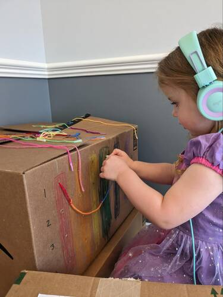

# The War to End All Wars?

## Introduction

World War I, also known as the Great War and the War To End All Wars,
devastated Europe. At its conclusion, the borders of many European
countries were changed, new countries were formed, and the Treaty of
Versailles, which formally ended the war, planted the seeds that would
lead to World War II just 20 years later. However, this war was also
famous for introducing a number of technical innovations used widely
during warfare for the first time including: airplanes, tanks,
submarines, camouflage, and the telephone. And it was also the first
time women were recruited for war by both Americans and our British
cousins.

Grace Banker’s service as chief operator of the Signal Corps Girls for
General Pershing’s American Expeditionary Forces is a singularly
American story. She, like thousands of other young women, answered the
call for volunteers to serve overseas. Her courage and dedication,
working day and night in poor conditions, through air attacks and
fires, exemplified the work ethic for which Americans are famous:
“Over here a Chief operator has a twenty-four hour job … never spent
more time at the office and never enjoyed it more.”

When Grace Banker and her Hello Girls returned from the war, they were
denied the benefits that veterans received. Other women who served in
World War I, mostly nurses (Army) and clerks (Navy), received
honorable discharges and veteran benefits. Although the Hello Girls
served closer to the front than most other enlisted women, it took
several decades of political fighting before they were awarded the
benefits and recognition their service to our country merited. This is
yet another example of the “grit” the Hello Girls displayed while
serving our country during World War I.

---

## Book

Title: "Grace Banker and Her Hello Girls Answer the Call:<br> The Heroic Story of WWI Telephone Operators"
Author: Claudia Friddell
Illustrator: Elizabeth Baddeley
Year Published: 2021
Length: 40 pages

---

## Calendar

Monday:
 - songbook
 - etiquette

Tuesday:
 - geography
 - uncle sam

Wednesday:
 - vocab
 - camouflage

Thursday:
 - re-enactment
 - trench cake

Friday:
 - the poppy lady
 - make your own poppies

---

## American Heritage Songbook: Over There {#songbook}

```metadata
toc: "Songbook: _Over There!_"
time: 5 minutes
freq: daily
```

> Over there, over there
> Send the word, send the word, over there!
> That the Yanks are coming!
> The Yanks are coming!
> The drums rum-tumming
> Everywhere!
> So prepare, say a prayer,
> Send the word, send the word to beware - 
> We’ll be over, we’re coming over
> And we won’t come back till it’s over,
> Over There!
{.nowrap}

This song was written in 1917 by George M. Cohan, known as the “Man
Who Owned Broadway” because of the breadth of his skills as an
entertainer – he wrote over 300 songs, appeared in or produced over
three dozen Broadway shows. He wrote this song to announce to the
world that America was entering World War I and to encourage young
American men to volunteer to serve in the expeditionary force being
sent “over there” to fight the Central Powers. It is, in one sense,
the musical version of the recruitment posters seen in _Grace Banker
and Her Hello Girls Answer the Call_.

While the term Yankees (or Yanks) was applied to northern soldiers
during our Civil War, by the time of World War I it was more generally
applied to all Americans. The song, and especially the chorus above,
became an American standard, renewed in popularity during World War II
and, to a more limited extent, for the War on Terror after
9/11. General John J. Pershing led the American Expeditionary Forces
“over there.” After the war, inspired by the bands of the European
armies we were allied with, he formed the United States Army Band
(also known as “Pershing’s Own.”) You can hear Pershing’s Own
performing _Over There_ [here][there].

You can also [find] several other [versions] on [YouTube], including
[some that feature all] the verses. [This version] (just the chorus)
is from the classic movie _Yankee Doodle Dandy_, featuring James
Cagney portraying George M. Cohan himself, as America enters World War
II.

[there]: https://www.youtube.com/watch?v=aGDds6bGFW8
[find]: https://www.youtube.com/watch?v=921z4LAHvak
[versions]: https://www.youtube.com/watch?v=15R6Qv5PZqE
[YouTube]: https://www.youtube.com/watch?v=wquvrM91Zz8
[some that feature all]: https://www.youtube.com/watch?v=9RYA0gQJ8qg
[this version]: https://www.youtube.com/watch?v=i5oWH6JWBJY 

---

## Famous American Texts: _In Flanders Fields_ {#text-in-flanders-field}

```metadata
time: 5 minutes
freq: daily
```

> In Flanders fields, the poppies blow
> Between the crosses, row on row,
> That mark our place; and in the sky
> The larks, still bravely singing, fly
> Scarce heard among the guns below.
>
> We are the Dead. Short days ago
> We lived, felt dawn, saw sunset glow,
> Loved and were loved, and now we lie
> In Flanders fields.
>
> Take up our quarrel with the foe:
> To you from failing hands we throw
> The torch; be yours to hold it high.
> If ye break faith with us who die
> We shall not sleep, though poppies grow
> In Flanders fields.
{.nowrap}

_In Flanders Fields_ is the most famous poem written about World War
I. Composed in 1915 by Canadian soldier and physician, John Macrae,
who had joined the Canadian Expeditionary Force and found himself
fighting the Central Powers in the Belgium provinces of
Flanders. Flanders Fields was a major battle theater of World War I,
part of the Western Front that extended from the sea across Belgium
and France, all the way to Switzerland. More than a million soldiers
from 50 different countries were wounded, killed, or missing in action
at Flanders Fields. Today there are 247 different World War I
cemeteries there, including one for American soldiers.


{.center}

The popularity of the poem led to its use on recruiting posters and
ads for war bonds.


{.center}

Ask your child(ren) to memorize the part of the last stanza in the
recruiting poster above.  For younger children, ask them to memorize
just the first two lines of the first stanza.

---

## Political Geography: Whose Side Are We On? {#whose-side}

```metadata
time: 15 minutes
freq: once
supplies: coloring map of Europe
```

> Young Women of America, Attention! Here’s your chance to serve your
> country in France with General Pershing’s Expeditionary Forces!

While we call it World War I, it was primarily a European war fought
between the Central Powers (Germany, Austria-Hungary, Bulgaria, and
Turkey) and the Allies (France, United Kingdom, Belgium, Russia, Italy
and the United States). Prior to World War II it was called the Great
War or, in America sometimes, the European War. The “war to end all
wars” began in 1914; the United States joined the Allies later in the
conflict, in April of 1917. Our entry into the war is considered by
historians as the first major turning point of the war, breaking the
stalemate between the Central Powers and the Allies. When the
armistice with Germany was declared in November of 1918, the United
States had been at war for just over 18 months.

America fought on the 400+ miles of the Western Front, which stretched across France from the English channel to Switzerland. For this activity, print a [map of pre-World War I Europe] that your child(ren) can color (alternatively, you can ask them to do the activity below with [this online map]). Ask them to:

[map of pre-World War I Europe]: http://lemosworld.weebly.com/uploads/6/6/1/3/66131857/world_war_i_map_activity.pdf
[this online map]: https://historicalmapchart.net/europe-world-war-1.html 

1. Select a color for the Central Powers and color the appropriate countries: Germany, Austria-Hungary, Bulgaria, Turkey (Ottoman Empire)
1. Select a different color for the primary Allied countries and color them: France, United Kingdom, Belgium, Russia, Italy)
1. With a black crayon, draw a line approximating the Western Front

While these were the primary countries involved, many others were also pulled into the conflict, mostly on the Allied side: Serbia, Romania, Montenegro, Portugal, Greece, China, Japan, Brazil. In the wake of World War I and the defeat of the Central Powers, many new countries were formed (e.g., Poland, Yugoslavia, Latvia, Estonia, Lithuania) and the borders of others were changed significantly. This [side-by-side comparison of European countries and borders before and after the war] illustrates the extensive changes to Europe.

[side-by-side comparison of European countries and borders before and after the war]: http://schillingb.weebly.com/uploads/2/9/9/3/29937093/map-before-and-after-wwi.pdf

---

## Arts & Crafts: Make Your Own Uncle Sam Poster {#craft-uncle-sam}

```metadata
time: 15-20 minutes
freq: once
prep: 5-10 minutes
supplies: construction paper, scissors, glue stick, crayons/markers, Uncle Sam coloring sheet
```

> The world was at war, and General John J. Pershing, the commander of US troops across the Atlantic, 
> was calling for female telephone operators to join the fight against Germany.

The origin of Uncle Sam as the personification of the United States goes way back in our history. He is based on a real person, Samuel Wilson, who owned a meat packing business. During the War of 1812, Wilson supplied food for American soldiers. The barrels had “U.S.” stamped on them for “United States” but soldiers knew Sam Wilson was supplying them, so they called it “Uncle Sam’s.” The political cartoonist Thomas Nast did much to shape our image of Uncle Sam in the 1870s. However, it was illustrator James Montgomery Flagg who was responsible for the most iconic image of Uncle Sam, portraying him in the famous “I Want YOU!” World War I army recruiting poster. Millions of these posters were distributed and displayed.


{.center}

Now, it’s your turn to make your own Uncle Sam poster!

### Supplies
* Construction paper (ideally in red, white, and blue)
* Crayons or markers
* Scissors
* Glue stick
* [Uncle Sam] (or other) coloring sheet

[Uncle Sam]: https://coloringhome.com/coloring-page/269259?album=uncle-sam-coloring-pages 

### Directions
1. Color in Uncle Sam and cut him out
1. Cut out other stripes, stars, or other items from construction paper
1. Glue Uncle Sam and cut out shapes onto construction paper
1. Add phrases if desired


{.center}

---

## Code Names {#code-names}

```metadata
time: 15 minutes
freq: once
```

> The names of all the places here and further fronts beyond are known under code names. 
> Waterfall Buster Bonehead Podunk Jam, etc., all mean some place very definite. 
> The codes are changed frequently so I have to keep up on everything.

In addition to code names for different locations, the military developed a radio-telephone spelling alphabet that uses different code words for each letter of the alphabet. The primary purpose of the spelling alphabet is to clearly communicate over devices (radio or telephone) where sound quality can lead to mistakes. For example, the letters “F” and “S” can be easily confused but not “Foxtrot” and “Sierra.”

Spelling alphabets were first introduced during World War I. Over the years the code words were modified and standardized, and are now in use in many other applications outside the military:  law enforcement, air traffic control, amateur radio, and more.

For this exercise, have your children learn to spell their own names using the modern radio-telephone spelling alphabet, reproduced below. For example, “Emily” would be spelled: Echo, Mike, India, Lima, Yankee.


{.center}

---

## The Telephone Game {#telephone-game}

```metadata
time: 15 minutes
freq: once
```

> Nothing could shake the Signal Corps Girls from their stations.
> Every new call could save lives.
> Any missed command could lose the battle.

The traditional game of “telephone” demonstrates how messages get muddled as they are whispered from person to person. The actual muddling can be hilarious – everyone enjoys comparing the final message to the original.

The rules are very simple:

1. You need 3 or more people in a line (5 or more is best).
1. The first person whispers a word or phrase to the second person – but only once!
1. The whisper should be loud enough for the next person to hear but quiet enough that no one else can hear it.
1. No deliberate changing of the word or phrase.
1. The word or phrase continues to be whispered to the next person in line until it reaches the final person who says it out loud and compares it to the original.

The Telephone Game is more enjoyable when unusual words or phrases are used. For this version, consider having the parent start the first few words or phrases and incorporate vocabulary words or sentences from the story (e.g., “Grace and her girls had plenty of grit” or “Grace and her gritty girls worked like beavers.”)

Besides being a lot of fun, the game teaches listening skills, patience and taking turns, and the importance of accurate communications – “any missed command could lose the battle.”

---

## Historical Re-enactment: Be Grace Banker {#reenactment-be-grace-banker}

```metadata
time: 15-20 minutes
freq: once
prep: 30-45 minutes
supplies: cardboard box, yarn
```

> Grace’s Signal Corps Girls connected hundreds of orders in an hour, thousands of commands in a day.

### Supplies
* Large cardboard box
* Scissors
* Yarn and tape or several shoestrings
* Paper and pencil
* Marker

### Directions
1. Take a cardboard box and, using scissors, punch holes in the side of it in rows and columns (we made four rows and six columns of holes).  
1. Label the rows and columns.  This can be done with numbers, colors, shapes or some combination depending on the age of the child.  For example, we labeled the rows with numbers and the columns with colors.  
1. Cut several pieces of yarn and tape each of the ends (the yarn should be long enough to connect the two farthest holes in your box.  Alternatively use shoelaces.  
1. This completes  the “switchboard.” 
1. Write down a list of paired holes (identifying them by row and column) to indicate which holes should be connected via the two ends of the yarn.  In other words, these are the “calls” to be “connected.”
1. Have your child(ren) see how quickly they can connect the listed pairs of holes using the yarn.


For my older children, I wrote down a list of 10 pairs of holes (using the colors/numbers to identify them).  We talked about rows and columns (rows go across, columns go up and down)  so they could identify the correct holes. You can also make a table of coded locations from the story (e.g., Red 3 = Waterfall, Blue 2 = Bonehead, Green 1 = General Pershing’s HQ, Purple 4 = Podunk). Then, ask your children to make specific connections: 
* Connect General Pershing to Waterfall
* Connect Podunk to Waterfall
* Connect Jam to Buster


For my three-year-old, I simply had her match specific colors (“Can you put one end in red and one end in blue?”).  We also had some colored yarn and then she just tried to match the yarn color to the hole color.  For her, it was good fine motor skills practice as well as a chance to identify colors. My children all enjoyed being “Grace Banker.”



{.center}

---

## Civic Culture: Proper Etiquette for Phone & Video Calls {#etiquette-phone-calls}

```metadata
time: 15-20 minutes
freq: daily
supplies: pretend or real phone
```

> When you said “Number Please” I couldn’t answer, there was a lump in my throat.

This is a great opportunity to discuss proper etiquette for phone calls and, in today’s world, video conferences and calls. If your family is anything like ours, when we call Grandpa and Nana all three grandchildren want to talk at once. Much has changed since the days when telephones were introduced into homes. But proper conversational etiquette remains unchanged and is a valuable skill for youngsters to learn. 

For speaking on the phone, review and role play: identifying who you are, with whom you wish to speak and what you want, asking politely who is calling and what they want,  how to deal with being put on hold, and politely ending a call.

Perhaps the hardest (and most important) skill for children to learn is waiting for their turn to speak – and not interrupting others when they are speaking (or listening!). This skill is needed when a parent is having a conversation with someone else on the phone. Explain to your child(ren) the need for them to be quiet, and wait patiently to talk to or get answers from the parent. Explain that they are only hearing half the conversation and so even when a parent is quiet, they still need to wait as their parent is listening to the other person on the line. Simulate this for them by asking them to talk to one parent while the other parent keeps asking the child questions.

For video calls and conferences, it can be even harder for children to wait for their turn to speak, especially when there are multiple children competing for attention. It may help to decide the order each child will speak ahead of time and set their expectations appropriately before the call starts. Explain how to ask politely about video or sound issues, not to make a lot of background noise when someone else is talking,  and to say excuse me and wait for lulls in the conversation to raise new topics.

In general, discuss the polite back and forth of conversation - raising topics, asking and answering questions, waiting patiently for a turn to speak, listening quietly and attentively.

And then, practice these skills with your kids through role-playing phone and video calls to establish good habits. Once they are comfortable with the concepts of good conversational etiquette you can reinforce it during day-to-day conversations by praising them when done right or reminding them gently about proper etiquette.

---

## Civic Culture: Biblical Scripture {#scripture}

```metadata
time: 10 minutes
freq: daily
```

> He who dwells in the shelter of the Most High
> will rest in the shadow of the Almighty.
{.nowrap}

Psalm 91 is known as the Soldier’s Psalm or the Soldier’s Prayer. Legend has it that in World War I the commanding officer of the 91st Brigade had the Psalm printed on cards and distributed to his troops. With its assurance of God’s protection in times of crisis for those who put their trust in Him, over time it has become a powerful source of inspiration and comfort to soldiers heading into battle. During the Iraq and Afghanistan wars, [Operation Bandana] distributed hundreds of thousands of bandanas to soldiers. The bandanas, in camouflage colors, had Psalm 91 written on them – a great example of Christian faith, generosity, and entrepreneurship in a single venture.

[operation bandana]: https://www.fayobserver.com/story/news/military/2017/04/15/operation-bandanas-continues-decade-long-ministry-to-deployed-troops/21372153007/

Below is Psalm 91 in full. Consider having your children memorize the first sentence or, for older children, the first two lines.
{{#with "&nbsp;&nbsp;&nbsp;&nbsp;&nbsp;&nbsp;&nbsp;&nbsp;&nbsp;&nbsp;&nbsp;&nbsp;&nbsp;&nbsp;&nbsp;&nbsp;&nbsp;&nbsp;" as |strophe|}}

> **He who dwells in the shelter of the Most High**
> {{{strophe}}}**will rest in the shadow of the Almighty.**
> **I will say of the Lord, “He is my refuge and my fortress,**
> {{{strophe}}}**my God, in whom I trust.”**
> Surely he will save you
> {{{strophe}}}from the fowler’s snare
> {{{strophe}}}and from the deadly pestilence.
> He will cover you with feathers,
> {{{strophe}}}and under his wings you will find refuge;
> {{{strophe}}}his faithfulness will be your shield and rampart.
> You will not fear the terror of night,
> {{{strophe}}}nor the arrow that flies by day,
> nor the pestilence that stalks in the darkness,
> {{{strophe}}}nor the plague that destroys at midday.
> A thousand may fall at your side,
> {{{strophe}}}ten thousand at your right hand,
> {{{strophe}}}but it will not come near you.
> You will only observe with your eyes
> {{{strophe}}}and see the punishment of the wicked.
> If you make the Most High your dwelling—
> {{{strophe}}}even the Lord, who is my refuge—
> then no harm will befall you,
> {{{strophe}}}no disaster will come near your tent.
> For he will command his angels concerning you
> {{{strophe}}}to guard you in all your ways;
> they will lift you up in their hands,
> {{{strophe}}}so that you will not strike your foot against a stone.
> You will tread upon the lion and the cobra;
> {{{strophe}}}you will trample the great lion and the serpent.
> “Because he loves me,” says the Lord, “I will rescue him;
> {{{strophe}}}I will protect him, for he acknowledges my name.
> He will call upon me, and I will answer him;
> {{{strophe}}}I will be with him in trouble,
> {{{strophe}}}I will deliver him and honor him.
> With long life will I satisfy him
> {{{strophe}}}and show him my salvation.”
{.psalm}

{{/with}}

---

## Cooking: Trench Cake {#cooking-trench-cake}

```metadata
time: 30-45 minutes
freq: once
prep: 30-45 minutes
supplies: flour, butter, vinegar, milk, brown sugar, currants or raisins, cocoa, baking soda, nutmeg, ginger, lemon rind
```

> When she was off duty Grace was the life of the party! 
> There were villages to explore, dances to enjoy, dinners to share, and pranks to pull.

Civilians would send things to their loved ones who were at war in the trenches.  Besides letters, some people sent trench cakes to soldiers in the trenches (this seems to be primarily something done by those in Europe).  Trench cakes are a dense cake, but tasty!  We have adapted a European recipe below.

### Ingredients
* 2 cups flour
* ½ cup butter
* 1 teaspoon vinegar
* ½ cup of milk
* ⅜ cup brown sugar
* ⅜ cup cleaned currants (craisins or raisins could be used)
* 2 teaspoons cocoa
* ½ teaspoon baking soda
* Nutmeg
* Ginger
* Grated lemon rind

### Directions
1. Grease a cake tin
1. In medium bowl, rub margarine into the flour
1. Add the dry ingredients (except baking soda)
1. Mix well
1. Dissolve baking soda in vinegar and milk, and add to dry mixture
1. Beat well
1. Pour into the cake tin
1. Bake in the oven at 350 degrees for 30-40 minutes
1. Let cool and enjoy!

---

## Supplemental Reading: _The Poppy Lady_ {#supplemental-poppy-lady}

```metadata
time: 15-20 minutes
freq: once
```

> Soon, Moina was surrounded by men wanting poppies of their own – to honor their buddies 
> “sleeping” now among the poppies of Flanders Fields.

Author Barbara Elizabeth Walsh tells the inspirational story of Moina Belle Michael and the volunteer work she did to support American soldiers leaving to fight in World War I. “She delivered books, magazines, and candy to their camps nearby. She and friends invited soldiers home for dinner… But Moina needed to do even more.” Each page chronicles Moina’s next step as she decides what “even more” means to her. Her lasting legacy is the red poppy, worn to honor not only the fallen but all veterans who served America. “During the weeks before Memorial Day and Veterans Day, veterans stand outside stores and distribute poppies, raising millions of dollars for other veterans and their families.” From America, wearing poppies in remembrance spread through all the Allied countries of World War I.

And if you ask your child(ren) to flip to the “Afterword” pages of _Grace Banker and Her Hello Girls Answer the Call_ you can see red poppies strewn among Grace’s mementoes of World War I.

---

## Arts & Crafts: Make Your Own Poppies {#craft-poppy}

```metadata
time: 20-30 minutes
freq: once
prep: 10-15 minutes
supplies: egg carton, scissors, black tissue paper, red paint, paint brushes, glue, hole punch, ribbons or string
```

> Still … Moina needed to do even more.
> She would not stop until every American wore a poppy to remember the soldiers.  Always.

### Supplies
* Egg carton
* Scissors
* Black tissue paper (optionally, black paint)
* Red paint 
* Paint brushes
* Glue 
* Hole punch
* Ribbons or string
* Optional: paper plate and green construction paper

### Directions
1. Cut out each egg container from the egg carton.
1. Cut out four “petals” from each egg container leaving the base (flower).  In other words, cut a few small ovals to convert the egg container from a complete cup shape to one that has gaps.  See picture below.
1. Paint the egg container “flowers” red and let them dry.
1. Crumple small amounts of black tissue paper into balls and glue them into the center of each egg container flower.  Optionally, use black paint instead.
1. Use a hole punch (or scissors) to make a hole in a petal and put string or ribbon through it to make a poppy necklace or two holes on opposite sides to make a poppy bracelet.
1. Optionally, make a poppy remembrance wreath.  Cut out the center of a paper plate and green construction paper in the shape of a wreath/donut.  Glue the green paper over the paper plate.  Glue egg container poppies onto the green wreath form.  Use hole punches to put in ribbon/string to form a hanger.  A phrase or word can also be printed on the wreath (such as “Remember” or part of Psalm 91, etc.)


{.center}

See also: [https://happyhooligans.ca/egg-carton-poppies/]

[https://happyhooligans.ca/egg-carton-poppies/]: https://happyhooligans.ca/egg-carton-poppies/

---

## Art: Camouflage {#art-camouflage}

```metadata
time: 10-20 minutes
freq: once
supplies: paper, crayons/markers
```

> Grace and her girls had plenty of grit. They kept their cool outside
> Liverpool when their ship, the perfect target for a German submarine
> attack, was stuck on a sandbar.

Camouflage is the use of artistic patterns to hide an object, person, or animal. World War I introduced many innovations to warfare (submarines, tanks, telephones). Among these innovations was “[dazzle camouflage]” to conceal ships. Every ship had a unique dazzle camouflage pattern so that enemies could not identify the type of a ship by its camouflage pattern. (Ask your child(ren) to compare the camouflage pattern of the ship Grace departs on and the one she returns on? Are they the same? Is it likely that she returned on the same ship she left on?)

[dazzle camouflage]: https://en.wikipedia.org/wiki/Dazzle_camouflage

There are also various [dazzle camouflage coloring sheets] available [online].
In nature, some animals use dazzle camouflage. Among these are leopards, jaguars, giraffes, and zebras. For this activity, ask your child(ren) to draw either an object with a unique camouflage pattern or an animal. For fun, they could camouflage an animal that doesn’t normally use dazzle camouflage, like an elephant or rhinoceros.

[dazzle camouflage coloring sheets]: https://rangmaher.com/wp-content/uploads/2020/07/ww1-dazzle-camo-activity-1.pdf
[online]: https://www.theworldwar.org/sites/default/files/2022-03/dazzle-ship-coloring-sheet.pdf 

---

## Language Arts: Vocabulary {#vocabulary}

```metadata
time: 10 minutes
freq: once
```

> At the eleventh hour, on the eleventh day, of the eleventh month, an armistice was signed to end the war.

This story has more unfamiliar vocabulary words than most of our AHEP recommended books. We’ve selected a subset that we think will help the young reader better understand the story. After reviewing the vocabulary with your listeners, ask them to ask questions about any words that are still unfamiliar or confusing to them. Read the sentences before and after the sentence containing the word they are asking about to see if they can guess part of the meaning from the context.

Doughboys
: nickname for American soldiers in World War I; origin of the nickname is unknown

Switchboard
: a device for manually connecting telephone calls

Grit
: courage and determination when faced with difficulties or danger

Enlist
: to voluntarily join the military

Expertise
: high level of skill or knowledge

Trenches
: long, deep holes dug in the ground for protection from enemy attacks

Shrapnel
: pieces of metal that fly through the air when a bomb explodes

Armistice
: formal agreement to temporarily stop fighting, typically so that peace can be negotiated


