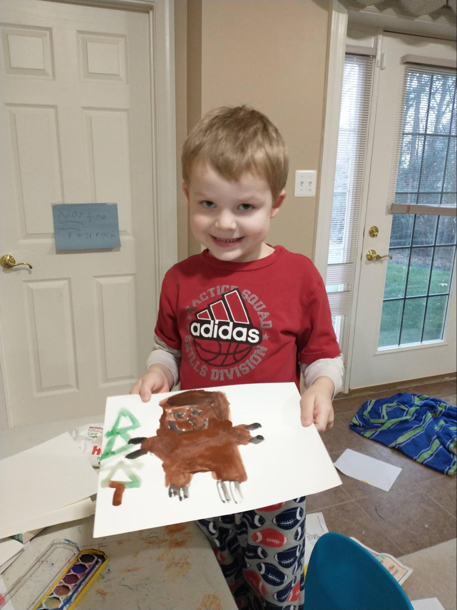

# The Louisiana Purchase

## Introduction

The Louisiana Purchase, one of the biggest real estate deals in
history, more than doubled the size of the United States for what
turned out to be a bargain price of $15,000,000. Not only did the
United States acquire a vast territory that would be turned into 13
new states, the deal secured for America the right to travel on the
Mississippi River all the way to the Gulf of Mexico, a vital
right-of-way that opened up enormous commercial opportunities for
farmers throughout the interior of our country. While other nations
fought wars over territory, the United States grew with a relatively
simple financial transaction.

The men who negotiated the purchase from France, Robert Livingston and
James Monroe, exceeded the authority they had been given by President
Jefferson – they only had the authority to negotiate for the port of
New Orleans. President Jefferson himself doubted whether the
Constitution gave him the authority to purchase more land for the
United States. In the end, the United States Senate confirmed the
purchase in an overwhelming vote.

President Jefferson sent Meriweather Lewis and William Clark to
explore the enormous territory the U.S.  had just acquired. These men,
with their Corps of Discovery, led the most astonishing expedition in
the history of America. They represent the epitome of America’s
self-reliance, rugged individualism, and pioneering spirit in
overcoming numerous obstacles in their two-year round-trip to the
Pacific Ocean and back. In addition to the hundreds of new plant and
animal species they recorded, they mapped the Louisiana Territory,
found a route all the way across the continent, and helped establish
America’s claim to the Oregon Territory.

---

## Book

Title: "Seaman’s Journal: On the Trail with Lewis and Clark"
Author: Patricia Reeder Eubank
Illustrator: Patricia Reeder Eubank
Year published: 2010
Length: 40 pages

---

## Calendar

Monday:
  - songbook
  - cooking

Tuesday:
  - geography
  - journal

Wednesday:
  - Vocabulary (before reading) [vocab]
  - science

Thursday:
  - naturalists
  - art-find

Friday:
  - watercolor
  - pov

---

## American Heritage Songbook: Schoolhouse Rock!: Elbow Room {#songbook}

```metadata
toc: "Songbook: _Elbow Room_"
time: 5-10 minutes
freq: daily
```

_Schoolhouse Rock!_ has another great song and animated short. _Elbow
Room_ is all about the United States opening up and settling the
West. The story starts with the Louisiana Purchase and Lewis & Clark,
as you can see in the lyrics below. But it moves from there to the
California Gold Rush, Manifest Destiny, and then links to our current
frontier, outer space.

> The president was Thomas Jefferson
> He made a deal with Napoleon
> How'd you like to sell a mile or two, (Or three, or a hundred, or a thousand?)
> 
> And so, in 1803 the Louisiana Territory was sold to us
> Without a fuss
> And gave us lots of elbow room
> 
> Oh, elbow room, elbow room
> Got to, got to get us some elbow room
> It's the west or bust
> In God we trust
> There's a new land out there…
> 
> Lewis and Clark volunteered to go
> Goodbye, good luck, wear your overcoat!
> They prepared for good times and for bad (and for bad)
> They hired Sacagawea to be their guide
> She led them all across the countryside
> Reached the coast
> And found the most
> Elbow room we've ever had
{.nowrap}

You can find _Elbow Room_ on Disney+, [YouTube][shr-yt], or order it
from [Amazon as part of a Schoolhouse Rock package][shr-amz].

[shr-yt]: https://www.youtube.com/watch?v=aHVx4nqgMPQ
[shr-amz]: https://www.amazon.com/Schoolhouse-Rock-Special-30th-Anniversary/dp/B00005JKTY

---

## Arts & Crafts: Watercolors {#craft-watercolor}

```metadata
time: 30-40 minutes
prep: 10 minutes
supplies: Watercolor paints, (thick) paper to paint on, paint brushes
```

> Often, huge flocks of passenger pigeons block out the sun.  Lewis
> sketches them in his journal while I look out for rattlesnakes.

The beautiful drawings by Patricia Reeder Eubanks are rendered in a
combination of watercolors and acrylics. She does a beautiful job
illustrating many of the animals Lewis & Clark encountered along the
way and sketched in their journals. For this activity, just ask your
kids to paint their favorite animal from the story (including Seaman!)
using watercolors.

<br>
Grizzly Bear
{.center .caption}

---

## Arts & Crafts: Make Your Own Journal {#craft-journal}

```metadata
time: 20-30 minutes
supplies: Paper, hole-punch, string/yarn/brads
```

> Often Lewis and I visit the Mandans and Hidatsas who live close by.
> They tell him about the route over the mountains, and Lewis writes
> it all down in his journal.

Lewis & Clark recorded an incredible amount of information in their
journals. They sketched plants and animals, recorded their
interactions with all of the Indian tribes they encountered, described
the land and all their adventures crossing the continent. For this
activity, you will make your own journal that you can use to collect
your watercolor drawings (above), your maps (below), and recording the
plants and animals you discover on your hike (below).

Making the journal is relatively simple: collect some paper, punch two
holes in the sheets with a holepunch, and then bind them with string,
yarn, or brads. The simple binding makes it easy to add new drawings,
maps, or additional pages.

---

## Geography: Thirteen New States {#geography}

```metadata
time: 15 minutes
```

> Clark works to complete his maps while Lewis studies the animals,
> especially the sea otter.  Clark said we have come 4,142 miles from
> Missouri to the Pacific!

The Louisiana Purchase doubled the size of the United States in a
single transaction. For the price of $15,000,000, France sold the
United States all of the territory from the Mississippi River to the
Rocky Mountains: 800,000 square miles. To help your child(ren) grasp
the size, have them remove all the states from the puzzle. Then ask
them to assemble just the states that were carved out of the Louisiana
Purchase. For this activity, you should only include the states that
that were wholly or largely part of the Louisiana Purchase:

* Louisiana
* Arkansas
* Missouri
* Iowa
* Minnesota
* Oklahoma
* Kansas
* Nebraska
* South Dakota
* North Dakota
* Colorado
* Wyoming
* Montana

(Small parts of Texas and New Mexico were also part of the purchase
but including those states gives the wrong impression of the size of
the purchase.)

Next, ask your child(ren) to complete the puzzle east of the
Mississippi. Point out how important the Mississippi River is to the
United States. Before roads were built, the Mississippi River was like
a giant superhighway, right in the middle of the country, that farmers
could use to float their goods down to New Orleans. From there they
could be put on a ship and reach ports on the East Coast or even other
countries.

---

## Cooking: Make Your Own Pemmican {#cooking}

```metadata
time: 60 minutes
prep: 30 minutes (shopping)
supplies: Nuts, seeds, dried fruit, honey, salt, coconut oil
```

> I help Sacajawea dig roots to eat. She also gathers plants for
> medicine. One day she made pemmican and gave me a piece. I ate the
> dried meat in it but spit out the nuts and berries. Phooey!

You will find a recipe for pemmican in the back of the book. However,
there are many varieties of pemmican and you may want to try one of
them. We used this one and it was a huge hit with (most) of our kids
(one refused to try it). We decided it was more of a “dessert
pemmican.”

<br>
Make Your Own Pemmican!
{.center .caption}

---

## Science: Make Your Own Map {#science}

```metadata
time: 20-30 minutes
supplies: Graph paper, colored pencils
```

> Clark has mapped the lands we crossed.

Lewis & Clark were co-leaders of the Corps of Discovery. However, each
had distinct responsibilities.  One of the main goals was to find and
map a route to the Pacific Ocean. Clark was the expert in mapmaking
and it fell to him to map the rivers, mountains, and geography they
traveled. Between the two of them they produced about 140 maps. In
1814 a complete map of their journey was produced.  Astonishingly,
Clark was only off by 40 miles in measuring the distance across the
continent they traveled.

For this activity, your young explorers get to be William Clark. Their
assignment is to map their local neighborhood – the streets,
sidewalks, cul-de-sacs. Alternatively, they could map a local park –
the playground equipment, the paths, the ball fields. Younger children
may want to map something even simpler, like their own room (that’s
what our four-year-old did). Use graph paper if available and colored
pencils to help indicate landmarks.

---

## Historical Re-enactment: Junior Naturalists {#reenactment-naturalist}

```metadata
time: 20 minutes
prep: 10 minutes
supplies: _Seek_ app by iNaturalist, sketching paper, pencils
```

> We have been on the greatest adventure ever.  Lewis will send a long
> report to President Jefferson about the Indian tribes, plants, and
> animals we discovered.

The Lewis and Clark Expedition was also known as the Corps of
Discovery Expedition. President Thomas Jefferson had charged the
expedition to document the plants and animals (“especially those not
known in the U.S.”) they saw along the way. What did they discover?
They returned with more than 200 plant specimens of which 178 were not
known to science. They also discovered 122 animals not previously
known to science. Their journals record 134 bird species, including
new species named after the explorers: Clark’s Nutcracker and Lewis’s
Woodpecker.

This is a great activity to do with a larger group so consider
inviting extended family or another homeschooling family to join
you. For this re-enactment you will need to find a local hike with
interesting plants, birds, and animals. Provide each of your children
with a journal/sketchpad (see “Make Your Own Journal” above) so they
can record some of the plants and animals they encounter along the
hike, just like Lewis and Clark. You may want to bring some pemmican
(see “Make Your Own Pemmican” above) along as a snack.

The kids can try counting how many different kinds of birds they see;
you can also turn it into a contest by breaking up into teams or
individuals to see who can find the most birds or the most
species. You can help them identify the plants or birds they encounter
by using an app; we used Seek by iNaturalist for the plants because
they were easier to record (works on both iOS and Android).

<br>
Hiking!
{.center .caption}

---

## Re-enactment: Build Your Own Fort {#reenactment-fort}

```metadata
time: 40 minutes
```

> Fort Clatsop, December 1805: The men have built a fort from the pine
> and fir trees. It rains constantly now, and many of the men wear the
> Clatsops’ basket hats to keep their heads dry.

The Corps of Discovery halted their expedition twice because of
winter. The first time they built Fort Mandan on the eastern side of
the Rocky Mountains near the Mandan Indians. The second time they
built Fort Clatsop near the shore of the Pacific Ocean and the Clatsop
tribe.

You’ll need blankets, pillows, and chairs to help your explorers build
a traditional blanket fort inside the house. Let them decide if they
are building Fort Mandan near the Rocky Mountains or Fort Clatsop near
the Pacific Ocean. Lewis & Clark built their forts for shelter and
protection from the winter storms. If your kids are up for it, they
may want to sleep overnight in their forts before heading “home” in
the morning after a nice breakfast of pemmican.

---

## Vocabulary {#vocabulary}

```metadata
time: 10 minutes
```

> In a pouring rain, we pushed the fifty-five-foot keelboat and two
> pirogues (flat-bottomed dugout canoes) into the Missouri River. We
> travel upriver and the men must push against its strong current.

We tried something new with this module and asked the kids what words
they thought should be in the vocabulary section. The words below are
a combination of their suggestions and some that we thought might be
new to young readers:

Loyal
: firm, unchanging support for a person, organization, or cause

Migration
: moving from one place to another

Keelboat
: a shallow, covered riverboat with a long piece of wood on the bottom
  (the keel) to provide stability

Portage
: carrying a boat over land to avoid an obstacle in the water

Fossils
: the shape of a plant or animal that has been preserved in rock for a
  long time

Trinkets
: a small ornament or piece of jewelry of small value

Prairie
: a large area of flat land with grasses but no trees

Journal
: a daily record of experiences and observations

---

## Writing: A Dog’s Eye View {#writing-pov}

```metadata
time: 10 minutes
```

> Here is my story of the greatest adventure a dog ever had, when I
> followed Lewis and Clark all the way to the Pacific Ocean and back
> again.

This story is told using the “first person” point-of-view of
Meriweather Lewis’ Newfoundland dog, Seaman. What do your kids think
about a dog telling them the story of the most famous expedition in
our nation’s history? The technique the author uses creates an
interesting blend of fact and fiction. Of course it’s fictional that a
dog can tell a story and keep a journal. But the facts he relates are
all taken from the journals of Lewis & Clark.

---

## Art: Find the Animals {#art-find}

```metadata
time: 10 minutes
```

> We’ve seen bobcat, elk, buffalo, and antelope. I chased the antelope
> and took one to Cook.  One day we counted thirty-six bald eagles
> soaring above our heads.

The author/illustrator, Patricia Reeder Eubanks, imitates the journals
of Lewis & Clark by including drawings of animals they discovered
during the expedition. Once Lewis & Clark start the expedition, your
child(ren) will discover multiple pictures of animals on every
page. Ask them to see if they can find all the animals. Which one is
their favorite?
